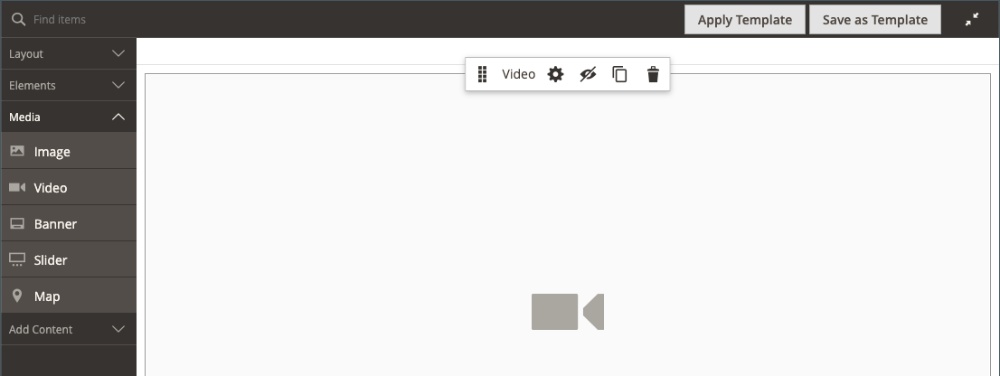

# Medios: vídeo

Utilice el tipo de contenido _Video_ para agregar un vídeo alojado en [YouTube](https://www.youtube.com/) o [Vimeo](https://vimeo.com/) al [[!DNL Page Builder] escenario](workspace.md#stage). Es fácil incrustar vídeo en una página o bloque, o en las descripciones de productos y categorías.

{width="700" zoomable="yes"}

{{$include /help/_includes/page-builder-save-timeout.md}}

## Cuadro de herramientas de vídeo

{width="600" zoomable="yes"}

| Herramienta | Icono | Descripción |
|--- |--- |--- |
| Mover | {width="25"} | Mueve el vídeo a otra posición del escenario. |
| (etiqueta) | [!UICONTROL Video] | Identifica el contenedor de contenido actual como un vídeo. Pase el ratón sobre el contenedor de imágenes para ver el cuadro de herramientas. |
| Configuración | {width="25"} | Abre la página _[!UICONTROL Edit Video]_, donde puede cambiar las propiedades del vídeo y del contenedor. |
| Hide | {width="25"} | Oculta el vídeo actual. |
| Mostrar | {width="25"} | Muestra el vídeo oculto. |
| Duplicar | {width="25"} | Realiza una copia del vídeo. |
| Eliminar | {width="25"} | Elimina el vídeo del escenario. |

{style="table-layout:auto"}

{{$include /help/_includes/page-builder-hidden-element-note.md}}

## Añadir un vídeo

1. Antes de empezar, ve al vídeo de [YouTube](https://www.youtube.com/) o [Vimeo](https://vimeo.com/) que quieras incrustar y copia el vínculo.

   Como alternativa, también puede copiar un vínculo directo a un archivo de vídeo válido. Consulte [Configuración de vídeo básica](#basic-video-settings) para ver los vínculos válidos.

1. En el administrador de [!DNL Commerce], vuelva al área de trabajo de [!DNL Page Builder] donde desea agregar el vídeo.

1. En el panel [!DNL Page Builder], expanda **[!UICONTROL Media]** y arrastre un marcador de posición **[!UICONTROL Video]** al escenario.

   {width="600" zoomable="yes"}

1. Pase el ratón sobre el contenedor de vídeo para ver la caja de herramientas y elija el icono _Configuración_ ( {width="20"} ).

1. Para **[!UICONTROL Video URL]**, pegue la dirección URL del vídeo que ha copiado.

   La dirección URL del vídeo [!DNL Page Builder] utilizado en este ejemplo es: `https://www.youtube.com/watch?v=Y0KNS7C5dZA`.

1. Para limitar el **[!UICONTROL Maximum Width]** del vídeo, escriba el ancho máximo en píxeles.

   Si está en blanco, el vídeo tiene el ancho permitido por el contenedor, lo que permite márgenes y relleno.

1. En la esquina superior derecha, haga clic en **[!UICONTROL Save]** para aplicar la configuración y volver al área de trabajo [!DNL Page Builder].

## Cambiar la configuración de vídeo

1. Pase el ratón sobre el contenedor de vídeo para ver la caja de herramientas y elija el icono _Configuración_ ( {width="20"} ).

1. Modifique la configuración según las siguientes secciones:

   - [Básico](#basic-video-settings)
   - [Avanzadas](#advanced)

1. En la esquina superior derecha, haga clic en **[!UICONTROL Save]** para aplicar la configuración y volver al área de trabajo [!DNL Page Builder].

### Configuración de vídeo básica

1. Para cambiar el vídeo actual, actualice **[!UICONTROL Video URL]**.

   Introduzca una URL de vídeo válida. Las direcciones URL de vídeo válidas pueden ser vínculos a:

   - Vídeos de YouTube: `https://youtu.be/CoDhMRUUjeI`
   - Vídeos de Vimeo: `https://vimeo.com/190156113`
   - Archivos de vídeo válidos (`.mp4` se recomienda): `https://myvideos.com/spiral.mp4`

1. Para cambiar la anchura permitida para el vídeo en la tienda, escriba el nuevo **[!UICONTROL Maximum Width]** en píxeles.

   Si está en blanco, el vídeo amplía la anchura completa del contenedor, menos margen para los márgenes y el relleno.

1. Para iniciar automáticamente el vídeo después de que se cargue la página, establezca **[!UICONTROL Autoplay]** en `Yes`.

   Si Reproducción automática se establece en `Yes`, el vídeo se silencia durante la reproducción según la directiva. Sin embargo, incluso con esta configuración, los dispositivos móviles no pueden reproducir automáticamente los vídeos. Para obtener más información sobre estas directivas, consulte los siguientes recursos para desarrolladores:

   - [Política de reproducción automática de Vimeo](https://vimeo.zendesk.com/hc/en-us/articles/115004485728-Autoplaying-and-looping-embedded-videos)
   - [Directiva de reproducción automática de Google (Chrome/YouTube)](https://developer.chrome.com/blog/autoplay/)
   - [Directiva de reproducción automática para vídeos locales](https://developer.mozilla.org/en-US/docs/Web/Media/Autoplay_guide)

   Si Reproducción automática se establece en `No`, el vídeo se reproduce únicamente bajo demanda del usuario.

### [!UICONTROL Advanced]

1. Para controlar la posición horizontal del vídeo dentro del contenedor, elija un **[!UICONTROL Alignment]**:

   | Opción | Descripción |
   | ------ | ----------- |
   | `Default` | Aplica la configuración predeterminada de alineación especificada en la hoja de estilos de la temática actual. |
   | `Left` | Alinea el contenido a lo largo del borde izquierdo del contenedor de vídeo, con margen para cualquier relleno que se especifique. |
   | `Center` | Alinea el contenido en el centro del contenedor de vídeo, con margen para cualquier relleno que se especifique. |
   | `Right` | Alinea el contenido a lo largo del borde derecho del contenedor de vídeo, con margen para cualquier relleno que se especifique. |

   {style="table-layout:auto"}

- Establezca el estilo **[!UICONTROL Border]** que se aplica a los cuatro lados del contenedor de vídeo:

  | Opción | Descripción |
  | ------ | ----------- |
  | `Default` | Aplica el estilo de borde predeterminado especificado por la hoja de estilos asociada. |
  | `None` | No proporciona ninguna indicación visible de los bordes del contenedor. |
  | `Dotted` | El borde del contenedor aparece como una línea de puntos. |
  | `Dashed` | El borde del contenedor aparece como una línea discontinua. |
  | `Solid` | El borde del contenedor aparece como una línea sólida. |
  | `Double` | El borde del contenedor aparece como una línea doble. |
  | `Groove` | El borde del contenedor aparece como una línea ranurada. |
  | `Ridge` | El borde del contenedor aparece como una línea discontinua. |
  | `Inset` | El borde del contenedor aparece como una línea de margen. |
  | `Outset` | El borde del contenedor aparece como una línea de inicio. |

  {style="table-layout:auto"}

- Si establece un estilo de borde distinto de `None`, complete las opciones de visualización de borde:

  {width="600" zoomable="yes"}

  | Opción | Descripción |
  | ------ |------------ |
  | [!UICONTROL Border Color] | Especifique el color seleccionando una muestra, haciendo clic en el selector de color o introduciendo un nombre de color válido o un valor hexadecimal equivalente. |
  | [!UICONTROL Border Width] | Introduzca el número de píxeles de la anchura de la línea del borde. |
  | [!UICONTROL Border Radius] | Introduzca el número de píxeles para definir el tamaño del radio que se utiliza para redondear cada esquina del borde. |

  {style="table-layout:auto"}

- (Opcional) Especifique los nombres de **[!UICONTROL CSS classes]** de la hoja de estilos actual para aplicarlos al contenedor de vídeo.

  Separe los distintos nombres de clase con un espacio.

- Escriba valores, en píxeles, para que **[!UICONTROL Margins and Padding]** especifique los márgenes exteriores y el margen interior del contenedor de vídeo.

  Introduzca cada valor correspondiente en el diagrama del contenedor de vídeo.

  | Área del contenedor | Descripción |
  | -------------- | ----------- |
  | [!UICONTROL Margins] | Cantidad de espacio en blanco que se aplica al borde exterior de todos los lados del contenedor. |
  | [!UICONTROL Padding] | Cantidad de espacio en blanco que se aplica al borde interior de todos los lados del contenedor. |

  {style="table-layout:auto"}

## Mover un vídeo

1. Pase el ratón sobre el contenedor de vídeo para ver la caja de herramientas y elija el icono _Mover_ ( {width="20"} ).

   {width="500" zoomable="yes"}

1. Seleccione y arrastre el vídeo a la nueva posición, justo debajo de la guía roja.

   {width="500" zoomable="yes"}

## Eliminar un vídeo del escenario

1. Pase el ratón sobre el contenedor de vídeo para ver la caja de herramientas y elija el icono _Quitar_ ().

1. Cuando se le pida que confirme, haga clic en **[!UICONTROL OK]**.

<!-- Last updated from includes: 2023-09-11 14:30:19 -->
