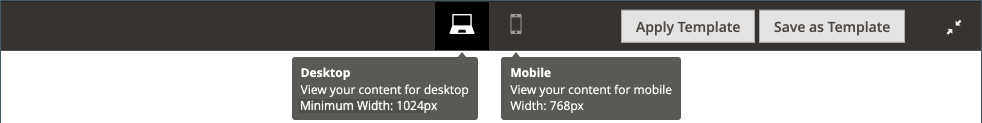

# [!DNL Page Builder] Workspace

Cuándo [[!DNL Page Builder] está habilitado](setup.md), el _[!UICONTROL Content]_El proceso de creación de secciones y contenido se modifica para aprovechar las ventajas de las [!DNL Page Builder] herramientas para CMS [páginas](../content-design/page-add.md), [producto](../catalog/product-content.md) y [categoría](../catalog/categories-content-settings.md) páginas, [bloques](../content-design/block-add.md), y [bloques dinámicos](../content-design/dynamic-blocks.md). Esta sección incluye una_ Encabezado de contenido _, una previsualización del contenido y un fácil acceso a la pantalla completa [!DNL Page Builder] workspace.

![Sección de contenido con [!DNL Page Builder] previsualización](./assets/pb-content-preview.png){width="700" zoomable="yes"}

## Encabezado de contenido

Dado que los motores de búsqueda buscan encabezados de nivel uno (H1), agregar un encabezado de nivel uno es una manera sencilla de garantizar que la página esté indexada correctamente.

>[!NOTE]
>
>El _[!UICONTROL Content Heading]_el campo que aparece en la parte superior de la página es un campo heredado que admite contenido creado con versiones anteriores de [!DNL Commerce] versiones. Sin embargo, no forma parte de [!DNL Page Builder]. El [!UICONTROL Content Heading] tiene el formato de un encabezado H1 según la hoja de estilos asociada al tema actual. Se coloca justo encima del área de contenido activo definida por el [!DNL Page Builder] escenario.

Para controlar mejor el posicionamiento y el formato de los encabezados de todos los niveles, se recomienda dejar el _[!UICONTROL Content Heading]_vacío y utilice el campo [!DNL Page Builder] [Encabezado](heading.md) tipo de contenido.

{width="700" zoomable="yes"}

## Vista previa

Cuando expanda el _[!UICONTROL Content]_y hay contenido existente creado con [!DNL Page Builder], muestra una previsualización del contenido tal como aparecería en una página. Clic **[!UICONTROL Edit with Page Builder]**o dentro del área de previsualización de contenido para abrir [!DNL Page Builder] espacio de trabajo, donde puede realizar las actualizaciones que sean necesarias.

{width="500" zoomable="yes"}

>[!NOTE]
>
>Para los formularios de producto y categoría, esta vista previa del contenido está habilitada de forma predeterminada, pero se puede deshabilitar. Si el rendimiento se ve afectado debido a la carga de la vista previa, puede deshabilitar la vista previa en el [Configuración de administración de contenido](../configuration-reference/general/content-management.md#advanced-content-tools) configuración.

## Fase

Al abrir el [!DNL Page Builder] espacio de trabajo desde la vista previa, el escenario es el área de trabajo principal en la que se puede crear y dar formato al contenido, e incluso realizar ediciones rápidas en el contenido en directo. El escenario está inicialmente vacío, lo que proporciona la superficie de diseño en la que puede arrastrar filas, columnas y pestañas desde el panel izquierdo.

>[!NOTE]
>
>A partir de la versión 2.4.1, la edición de contenido ahora es a pantalla completa solo para todas las áreas controladas por [!DNL Page Builder]: páginas de CMS, páginas de productos y categorías, bloques y bloques dinámicos. La edición a pantalla completa centra la atención en el contenido y proporciona una vista que se adapta mejor a la experiencia del usuario en la tienda.

{width="600" zoomable="yes"}

{{$include /help/_includes/page-builder-save-timeout.md}}

## Ventanillas

A _ventanilla_ es el área visible de una página web que ve un usuario. En el modo de diseño de pantalla completa, los botones de la ventanilla móvil se muestran encima de la [!DNL Page Builder] fase para mostrar el contenido tal como lo ve el usuario del sitio en la tienda.

{width="500" zoomable="yes"}

[!DNL Page Builder] también define puntos de interrupción para ventanillas móviles. Los puntos de interrupción definen las anchuras mínima y máxima dentro de las cuales se aplican determinados estilos. El [!DNL Page Builder] las ventanillas móviles proporcionan los siguientes puntos de interrupción de contenido:

- **Punto de interrupción de escritorio**—`min-width: 1024px`. Este punto de interrupción aplica estilos definidos para anchuras de ventanilla que miden 1024 píxeles y más anchos.
- **Puntos de interrupción móviles**—`max-width: 768px, min-width: 640px`. Estos puntos de interrupción aplican estilos definidos para anchos de ventanilla entre 768 píxeles y 640 píxeles.

[!DNL Page Builder] las ventanillas móviles tienen dos características: **_previsualizaciones de contenido_** y **_configuración de punto de interrupción_**.

### Previsualizaciones de contenido

De forma predeterminada, [!DNL Page Builder] proporciona dos vistas previas de ventanilla:

- **Escritorio** — muestra la vista previa del contenido sin un ancho predefinido. Los estilos definidos por el escritorio (que utilizan la anchura mínima del punto de interrupción de 1024 píxeles) siguen aplicándose a la página. Sin embargo, la anchura de la ventanilla móvil del escritorio está definida por la configuración de los tipos de contenido de contenedor, como Filas. Al seleccionar la ventanilla móvil del escritorio, se muestra el estilo del contenido en la tienda cuando el ancho de la página del explorador es de 1024 píxeles y más ancho.

  {width="500" zoomable="yes"}

- **Móvil** — muestra la vista previa del contenido con una anchura predefinida de 768 píxeles. A diferencia de la ventanilla móvil de escritorio, esta sí muestra el contenido de su página con una anchura de 768 píxeles, junto con los estilos definidos para las anchuras de los puntos de interrupción de 768 píxeles (máximo) y 640 píxeles (mínimo).

  {width="500" zoomable="yes"}

### Configuración de puntos de interrupción

Los botones de ventanilla también proporcionan la opción de aplicar diferentes estilos de punto de interrupción a los tipos de contenido en función de la ventanilla seleccionada. De forma predeterminada, [!DNL Page Builder] proporciona la configuración de punto de interrupción para _[!UICONTROL Minimum Height]_campos de Filas, Columnas, Pestañas, Elementos de Pestaña, Banners, Reguladores y Diapositivas. Al seleccionar la ventanilla móvil y, a continuación, abrir el editor de uno de esos tipos de contenido, puede introducir valores de campo específicos de los puntos de interrupción de la ventanilla móvil. Los campos de tipo de contenido que permiten una configuración de punto de interrupción específica muestran un icono a la derecha del campo, similar al siguiente ejemplo para una fila:

{width="400"}

## Panel

El [!DNL Page Builder] El panel se encuentra a la izquierda del escenario y contiene tipos de contenido que se pueden arrastrar al escenario. A continuación, aparece un contenedor específico del tipo de contenido con una caja de herramientas de opciones. Los tipos de contenido se organizan en el panel de la siguiente manera:

### Diseño

El _[!UICONTROL Layout]_de la sección [!DNL Page Builder] El panel se utiliza para añadir filas, columnas o pestañas al escenario. Al arrastrar un tipo de contenido del panel al escenario, aparece un contenedor con una caja de herramientas de opciones específicas del tipo de contenido.

De forma predeterminada, la variable [!DNL Page Builder] el escenario está vacío. A medida que arrastra tipos de contenido de diseño del panel al escenario, puede colocarlos encima, debajo o dentro de otros contenedores de diseño en la página. Las filas solo se pueden añadir directamente al escenario.

![[!DNL Page Builder] panel con tipos de contenido de diseño y escenario](./assets/pb-stage-toolbox.png){width="600" zoomable="yes"}

| Tipo de contenido de diseño | Descripción |
| ------------------- |------------ |
| [Fila](row.md) | Una nueva fila solo se puede arrastrar desde el panel al escenario y colocarse encima o debajo de otra fila, pestaña o grupo de columnas. También puede utilizar la opción Duplicar para realizar una copia de una fila existente. |
| [Columna](column.md) | Se puede arrastrar una columna desde el panel al escenario o a filas y pestañas. El número máximo de columnas que se pueden agregar viene determinado por el número de divisiones de cuadrícula especificadas en la variable [configuración](setup.md). |
| [Fichas](tabs.md) | Se puede arrastrar una sola pestaña desde el panel hasta el escenario o hasta filas y columnas. Se pueden añadir pestañas adicionales desde la caja de herramientas. |

{style="table-layout:auto"}

### Elementos

Utilice el _[!UICONTROL Elements]_de la sección [!DNL Page Builder] panel para agregar texto, encabezados, botones, divisores y código de HTML a cualquier contenedor de diseño de [[!DNL Page Builder] stage](workspace.md#stage). Cuando arrastra un tipo de contenido desde el panel a una fila o columna o a un conjunto de pestañas en el escenario, aparece un contenedor. Utilice la caja de herramientas de tipo de contenido para acceder a las opciones específicas del tipo.

![[!DNL Page Builder] panel con tipos de contenido de elemento](./assets/pb-elements.png){width="600" zoomable="yes"}

| Tipo de contenido de elemento | Descripción |
| -------------------- | ----------- |
| [Texto](text.md) | Agrega un contenedor de texto y un editor al escenario. |
| [Encabezado](heading.md) | Agrega un contenedor de encabezado al escenario. |
| [Botones](buttons.md) | Agrega un contenedor para un botón individual o un conjunto de botones al escenario. |
| [Divisor](divider.md) | Agrega un contenedor para un divisor al escenario. |
| [Código de HTML](html-code.md) | Agrega un contenedor para el código de HTML al escenario. |

{style="table-layout:auto"}

### Medios

Utilice el _[!UICONTROL Media]_de la sección [!DNL Page Builder] panel para agregar imágenes, vídeo, titulares, controles deslizantes y [!DNL Google Maps] a cualquier contenedor de diseño de la [[!DNL Page Builder] stage](workspace.md#stage). Cuando se arrastra un tipo de contenido multimedia del panel al escenario, aparece un contenedor con una caja de herramientas de opciones específicas del tipo de contenido.

![[!DNL Page Builder] panel con tipos de contenido de medios](./assets/pb-media-content-types.png){width="600" zoomable="yes"}

| Tipo de contenido de medios | Descripción |
| ------------------- | ------------------------------------------ |
| [Imagen](image.md) | Agrega un contenedor de imagen al escenario. |
| [Vídeo](video.md) | Agrega un contenedor de vídeo al escenario. |
| [Titular](banner.md) | Agrega un contenedor de banner al escenario. |
| [Regulador](slider.md) | Agrega un contenedor de deslizador al escenario. |
| [Mapa](map.md) | Agrega un [!DNL Google Maps] Contenedor de al escenario. |

{style="table-layout:auto"}

### Añadir contenido

Utilice el _[!UICONTROL Add Content]_de la sección [!DNL Page Builder] panel para añadir contenido existente al [[!DNL Page Builder] stage](workspace.md#stage). Cuando arrastra un tipo de contenido de medios desde el panel al escenario, aparece un contenedor. Utilice la caja de herramientas de tipo de contenido para acceder a_ Configuración _que son específicos del tipo.

![[!DNL Page Builder] panel con Añadir tipos de contenido](./assets/pb-add-content.png){width="600" zoomable="yes"}

| Tipo de contenido | Descripción |
| ---------------------------------------------------------------- | -------------------------------------------- |
| [Bloquear](block.md) | Añade un bloque existente al escenario. |
| [Bloque dinámico](dynamic-block.md) | Añade un bloque dinámico existente al escenario. |
| [Productos](products.md) | Añade una lista de productos a la fase. |
|  [Product Recommendations](recommendations.md) | Agrega una unidad de recomendación a la fase. |

{style="table-layout:auto"}

## Toolbox

Cada contenedor de contenido del escenario tiene una caja de herramientas de opciones. Las opciones varían según el tipo de contenido, pero generalmente incluyen Mover, Configuración, Ocultar/Mostrar, Duplicar y Quitar.

### Mostrar la caja de herramientas

Pase el ratón sobre el contenedor para mostrar el cuadro de herramientas y elegir una opción.

{width="600" zoomable="yes"}

### Opciones del cuadro de herramientas

| Opción | Icono | Descripción |
| --------- | ---------------------------------------- | ------------ |
| Mover | {width="25"} | Mueve el contenedor de contenido actual a otra posición del escenario. |
| Añadir | {width="25"} | Agrega elementos secundarios como un botón, una diapositiva o una pestaña. |
| (etiqueta) |           | Identifica el tipo de contenido del contenedor. |
| Configuración | {width="25"} | Abre las propiedades del contenedor de contenido en modo de edición. |
| Hide | {width="25"} | Oculta el contenedor de contenido actual. |
| Mostrar | {width="25"} | Muestra el contenedor de contenido actual. |
| Duplicar | {width="25"} | Realiza una copia del contenedor de contenido actual. |
| Eliminar | {width="25"} | Elimina el contenedor de contenido actual del escenario. |

{style="table-layout:auto"}

{{$include /help/_includes/page-builder-hidden-element-note.md}}
