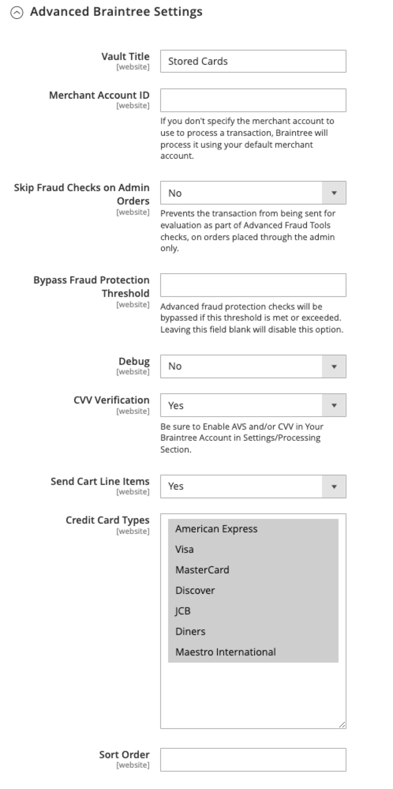
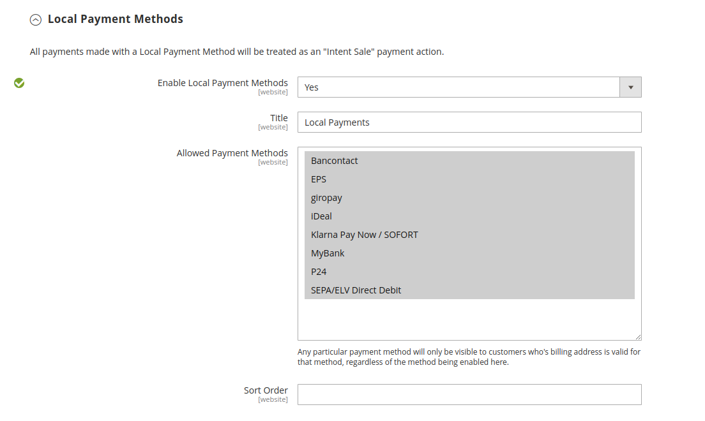

# Braintree

Braintree ofrece una experiencia de pago totalmente personalizable con detección de fraude e integración con PayPal. Admite [!DNL Apple Pay], [!DNL Google Pay], ACH, Venmo y métodos de pago locales. Braintree reduce la carga de conformidad con PCI para los comerciantes porque la transacción se realiza en el sistema Braintree. La integración de Braintree Payments está desarrollada por [GENE Commerce](https://www.gene.co.uk/gene-braintree-payments/).

>[!NOTE]
>
>Si actualiza a 2.4.x desde una versión anterior de Adobe Commerce o Magento Open Source con la extensión de Braintree de Commerce Marketplace instalada, consulte la [Notas de la actualización de 2.4](#24-upgrade-notes) al final de esta página.

## Paso 1: Conseguir las credenciales de Braintree

Ir a [Pagos de Braintree][1] y regístrese para obtener una cuenta.

## Paso 2: completar la configuración básica

1. En el _Administrador_ barra lateral, vaya a **[!UICONTROL Stores]** > _[!UICONTROL Settings]_>**[!UICONTROL Configuration]**.

1. En el panel izquierdo, expanda **[!UICONTROL Sales]** y elija **[!UICONTROL Payment Methods]**.

   - Si la instalación de Commerce tiene varios sitios web, tiendas o vistas, en la esquina superior izquierda, elija el **[!UICONTROL Store View]** donde se aplica la configuración.

   - En el _[!UICONTROL Merchant Location]_, compruebe que **[!UICONTROL Merchant Country]**se establece en la ubicación de su empresa.

1. En _[!UICONTROL Recommended Solutions]_, en el_[!UICONTROL Braintree Payments] (por [GENE Commerce](https://www.gene.co.uk/gene-braintree-payments/) Versión 4.6.1: [Notas de versión](https://support.gene.co.uk/support/solutions/articles/35000228529)_, haga clic en **[!UICONTROL Configure]**.

   {width="600" zoomable="yes"}

1. Para **[!UICONTROL Title]**, introduzca un título que identifique al Braintree como una opción de pago durante el cierre de compra.

1. Establecer el funcionamiento actual **[!UICONTROL Environment]** para transacciones de Braintree a `Sandbox` o `Production`

   Al probar la configuración en una zona protegida, utilice solo [números de tarjeta de crédito][2] que son recomendados por el Braintree. Cuando esté listo para ir a producción con Braintree, establezca **[!UICONTROL Environment]** hasta `Production`.

   {width="600" zoomable="yes"}

1. Establecer **[!UICONTROL Payment Action]** a uno de los siguientes:

   - `Authorize Only` - Aprueba la compra y suspende los fondos. El importe no se retira de la cuenta bancaria del cliente hasta que se realiza la venta _capturado_ por el comerciante.|
   - `Intent Sale`  - El importe de la compra se autoriza y se retira inmediatamente de la cuenta del cliente. **_Nota:_** Este valor era  _Autorizar y capturar_ en 2.3.x y versiones anteriores.|

1. Introduzca el **[!UICONTROL Sandbox Merchant ID / Merchant ID]** desde su cuenta de Braintree.

1. Introduzca las siguientes credenciales de su cuenta de Braintree:

   - **[!UICONTROL Sandbox Public Key / Public Key]**
   - **[!UICONTROL Sandbox Private Key / Private Key]**

   >[!NOTE]
   >
   >Hay campos independientes para ambos **(Zona protegida y producción)** y los demás campos se representan en función del entorno seleccionado.

1. Antes de guardar la configuración, haga clic en **[!UICONTROL Validate Credentials]** para validar las credenciales.

1. Establecer **[!UICONTROL Enable Card Payments]** hasta `Yes`.

   {width="600" zoomable="yes"}

   Si desea poder almacenar la información de los clientes de forma segura, de modo que los clientes no tengan que volver a introducirla cada vez que realicen una compra, configure **[!UICONTROL Enable Vault for Card Payments]** hasta `Yes`.

## Paso 3: Completar la configuración avanzada

1. Expandir  el **[!UICONTROL Advanced Braintree Settings]** sección.

   {width="550" zoomable="yes"}

1. Para **[!UICONTROL Vault Title]**, introduzca un título descriptivo para la referencia que identifique el almacén donde se almacena la información de la tarjeta del cliente.

1. Introduzca el **[!UICONTROL Merchant Account ID]** desde su cuenta de Braintree.

   Si no especifica la cuenta de comerciante que se va a utilizar, Braintree procesa la transacción con la cuenta de comerciante predeterminada.

1. Para ofrecer una experiencia de pago y envío más rápida con las opciones de Pago exprés al principio del proceso de pago, incluidas PayPal, PayAfter, Apple Pay y Google Pay, establezca **[!UICONTROL Enable Checkout Express Payments]** hasta `Yes`.

1. Si desea evitar que la transacción se envíe para su evaluación como parte de las comprobaciones de las herramientas de fraude avanzado, en los pedidos realizados a través del administrador, establezca **[!UICONTROL Skip Fraud Checks on Admin Orders]** hasta `Yes`.

1. Configure las variables **[!UICONTROL Bypass Fraud Protection Threshold]** para que el `Advanced Fraud Protection` las comprobaciones se omiten cuando se alcanza o supera el umbral.

   Si deja este campo en blanco, se deshabilita esta opción.

1. Si desea que el sistema guarde un archivo de registro de interacciones entre el almacén y el Braintree, establezca **[!UICONTROL Debug]** hasta `Yes`.

1. Para exigir a los clientes que proporcionen el código de seguridad de tres dígitos desde el reverso de una tarjeta de crédito, establezca **[!UICONTROL CVV Verification]** hasta `Yes`.

   Si utiliza la verificación CVV, asegúrese de habilitar AVS y/o CVV en el _Configuración/Procesamiento_ de su cuenta de Braintree.

1. Para enviar los artículos de línea de carro de compras para todas las formas de pago, establezca **[!UICONTROL Send Card Line Items]** hasta `Yes`.

1. Para **[!UICONTROL Credit Card Types]**, selecciona cada tarjeta de crédito que sea aceptada por tu tienda como pago a través del Braintree.

   Para seleccionar varios tipos de tarjetas, mantenga presionada la tecla Ctrl (PC) o la tecla Comando (Mac) y haga clic en cada opción.

1. Para **[!UICONTROL Sort Order]**, introduzca un número para determinar la secuencia en la que aparece el Braintree cuando aparece con otros métodos de pago durante el cierre de compra.

## Paso 4: Completar la configuración del webhook de Braintree

{width="600" zoomable="yes"}

1. Establecer **[!UICONTROL Enable Webhook]** hasta `Yes` para habilitar la funcionalidad de webhook para la protección contra fraudes, pagos ACH y métodos de pago locales.

1. Copie la dirección URL en la **[!UICONTROL Fraud Protection URL]** y agréguelo a su cuenta de Braintree como _[!UICONTROL Webhook Destination URL]_.

   >[!IMPORTANT]
   >
   >Esta URL debe ser segura y accesible públicamente.

1. Configure las variables **[!UICONTROL Fraud Protection Approve Order Status]** para determinar cuándo el Braintree aprueba la protección contra el fraude.

   El estado del pedido seleccionado se asigna al pedido comercial.

1. Configure las variables **[!UICONTROL Fraud Protection Reject Order Status]** para determinar cuándo el Braintree rechaza la protección contra el fraude.

   El estado del pedido seleccionado se asigna al pedido comercial.

## Paso 5: Completar la configuración específica de un país

1. Establecer **[!UICONTROL Payment from Applicable Countries]** a uno de los siguientes:

   - `All Allowed Countries` - Clientes de todos [países](../getting-started/store-details.md#country-options) especificado en la configuración de tu tienda puede utilizar este método de pago.
   - `Specific Countries` : Después de elegir esta opción, el _[!UICONTROL Payment from Specific Countries]_aparece una lista. Mantenga pulsada la tecla Ctrl (PC) o la tecla Comando (Mac) y seleccione cada país de la lista donde los clientes pueden realizar compras en su tienda.

   {width="600" zoomable="yes"}

1. Para configurar **[!UICONTROL Country Specific Credit Card Types]**:

   - Clic **[!UICONTROL Add]**.

   - Configure las variables **[!UICONTROL Country]** y elija cada **[!UICONTROL Allowed Credit Card Type]**.

   - Repita el proceso para identificar las tarjetas de crédito que se aceptan en cada país.

## Paso 6: Completar la ACH mediante la configuración del Braintree

{width="600" zoomable="yes"}

1. Para incluir ACH como opción de pago con el Braintree, establezca **[!UICONTROL Enable ACH Direct Debit]** hasta `Yes`.

1. Los clientes pueden depositar su método de pago mediante domiciliación bancaria ACH de un solo uso y almacenarlo para uso futuro. Una vez realizada la operación, los clientes pueden volver a utilizar la domiciliación bancaria de ACH sin necesidad de volver a introducir o autenticar su información de pago si está establecida **[!UICONTROL Enable Vault for ACH Direct Debit]** hasta `Yes`.

1. Para **[!UICONTROL Sort Order]**, introduzca un número para determinar la secuencia en la que aparece la opción de pago ACH de Braintree cuando se enumera con otras opciones de pago durante el cierre de compra.

## Paso 7: Completar el [!UICONTROL Apple Pay] mediante la configuración del Braintree

{width="600" zoomable="yes"}

1. Para incluir [!DNL Apple Pay] como opción de pago con el Braintree, establezca **[!UICONTROL Enable ApplePay through Braintree]** hasta `Yes`.

   Asegúrese de lo siguiente [compruebe su nombre de dominio](https://developer.paypal.com/braintree/docs/guides/apple-pay/configuration/javascript/v3) en su cuenta de Braintree primero.

1. Si desea poder almacenar la información de los clientes de forma segura, de modo que los clientes no tengan que volver a introducirla cada vez que realicen una compra con Apple Pay, establezca **[!UICONTROL Enable Vault for ApplePay]** hasta `Yes`.

1. Establecer **[!UICONTROL Payment Action]** a uno de los siguientes:

   - `Authorize Only` - Aprueba la compra y suspende los fondos. El importe no se retira de la cuenta bancaria del cliente hasta que se realiza la venta _capturado_ por el comerciante.
   - `Intent Sale` - El importe de la compra se autoriza y se retira inmediatamente de la cuenta del cliente.

1. Para **[!UICONTROL Merchant Name]**, introduzca un texto que especifique la etiqueta que se mostrará a los clientes en el cuadro de diálogo Apple Pay.

1. Para **[!UICONTROL Sort Order]**, introduzca un número para determinar la secuencia en la que [!DNL Apple Pay] la opción de pago aparece cuando se enumera con otras opciones de pago durante el cierre de compra.

## Paso 8: Completa la configuración de los métodos de pago locales

1. Para incluir métodos de pago locales como opción de pago con el Braintree, establezca **[!UICONTROL Enable Local Payment Methods]** hasta `Yes`.

1. Para **[!UICONTROL Title]**, introduzca el texto que desea utilizar para la etiqueta que aparece en la sección método de pago mediante pago y envío (valor predeterminado: `Local Payments`).

1. Para **[!UICONTROL Fallback Button Text]**, introduzca el texto que desea utilizar para el botón que aparece en la página del Braintree de reserva para devolver al cliente al sitio web (por ejemplo, `Complete Checkout`).

1. Para **[!UICONTROL Redirect on Fail]**, introduzca la dirección URL a la que se debe redirigir a los clientes cuando se cancelen las transacciones de métodos de pago locales, se produzcan errores o se produzcan errores. Debe ser la página de pago y envío (por ejemplo, `https://www.domain.com/checkout#payment`).

1. Para **[!UICONTROL Allowed Payment Methods]**, seleccione el método de pago local que desea activar.

   Opciones: `Bancontact` / `EPS` / `giropay` / `iDeal` / `Klarna Pay Now` / `SOFORT` / `MyBank` / `P24` / `SEPA/ELV Direct Debit` (aún no compatible)

   {width="600" zoomable="yes"}

   >[!NOTE]
   >
   >La extensión de Braintree empaquetada no admite todos los métodos de pago locales enumerados en la [Documentación para desarrolladores de Braintree](https://developer.paypal.com/braintree/docs/guides/local-payment-methods/overview). Se están desarrollando otros métodos de pago locales que se admitirán en futuras versiones.

1. Para **[!UICONTROL Sort Order]**, introduzca un número para determinar la secuencia en la que aparece el método de pago local cuando se enumera con otras opciones de pago durante el cierre de compra.

## Paso 9: Completar la [!DNL Google Pay] mediante la configuración del Braintree

{width="600" zoomable="yes"}

1. Para incluir [!DNL Google Pay] como opción de pago con el Braintree, establezca **[!UICONTROL Enable GooglePay Through Braintree]** hasta `Yes`.

1. Si desea poder almacenar la información de los clientes de forma segura, de modo que los clientes no tengan que volver a introducirla cada vez que realicen una compra con Google Pay, establezca **[!UICONTROL Enable Vault for GooglePay]** hasta `Yes`.

1. Establecer **[!UICONTROL Payment Action]** a uno de los siguientes:

   - `Authorize Only` - Aprueba la compra y suspende los fondos. El importe no se retira de la cuenta bancaria del cliente hasta que se realiza la venta _capturado_ por el comerciante.
   - `Intent Sale`  - El importe de la compra se autoriza y se retira inmediatamente de la cuenta del cliente.

1. Establecer **[!UICONTROL Button Color]** para determinar el color de la [!DNL Google Pay] botón: `White` o `Black`

1. Para **[!UICONTROL Merchant ID]**, introduzca su ID de comerciante (proporcionado por Google).

1. Para **[!UICONTROL Accepted Cards]**, seleccione el tipo de tarjetas que un cliente puede utilizar para realizar un pedido [!DNL Google Pay].

   Opciones: `Visa` / `MasterCard` / `AMEX` / `Discover` / `JCB`

1. Para **[!UICONTROL Sort Order]**, introduzca un número para determinar la secuencia en la que [!DNL Google Pay] aparece cuando aparece junto con otras opciones de pago durante el cierre de compra.

## Paso 10: Completar el Venmo mediante la configuración del Braintree

1. Para incluir Venmo como opción de pago con Braintree, establezca **[!UICONTROL Enable Venmo through Braintree]** hasta `Yes`.

1. Establecer **[!UICONTROL Enable Vault for Venmo]** hasta `Yes` para habilitar el uso de un almacén seguro para almacenar la cuenta de Venmo de los clientes de modo que los clientes no tengan que volver a iniciar sesión en su cuenta de Venmo para futuras transacciones.

   {width="600" zoomable="yes"}

1. Establecer **[!UICONTROL Payment Action]** a uno de los siguientes:

   - `Authorize Only` - Aprueba la compra y suspende los fondos. El importe no se retira de la cuenta bancaria del cliente hasta que se realiza la venta _capturado_ por el comerciante.
   - `Intent Sale`  - El importe de la compra se autoriza y se retira inmediatamente de la cuenta del cliente.

1. Para **[!UICONTROL Sort Order]**, introduzca un número para determinar la secuencia en la que aparece Venmo cuando se enumera con otras opciones de pago durante el cierre de compra.

## Paso 11: Completa la configuración de PayPal mediante el Braintree

{width="550" zoomable="yes"}

1. Para incluir PayPal como opción de pago con el Braintree, establece **[!UICONTROL Enable PayPal through Braintree]** hasta `Yes`.

1. Especifica tu forma de pago mediante PayPal para el Braintree:

   >[!NOTE]
   >
   >Cualquiera **[!DNL PayPal Credit]** o **[!DNL PayPal PayLater]** se puede activar. Ambos métodos no se pueden habilitar al mismo tiempo.

   - Para incluir [!DNL PayPal Credit] como opción de pago con el Braintree, establezca **[!UICONTROL Enable PayPal Credit through Braintree]** hasta `Yes`.

     Cuándo **Activar PayPal mediante Braintree** se establece en `Yes`, solo aparece este campo.

     >[!NOTE]
     >
     >El crédito de PayPal solo está disponible en los Estados Unidos y el Reino Unido. El crédito de PayPal está desactivado si el valor seleccionado para _[!UICONTROL Merchant Country]_el campo no es `US` o `UK`.

   - Para incluir [!DNL PayPal PayLater] como opción de pago con el Braintree, establezca **[!UICONTROL Enable PayPal PayLater through Braintree]** hasta `Yes`.

     Cuándo **[!UICONTROL Enable PayPal PayLater through Braintree]** se establece en `Yes`, solo aparece este campo.

     Puede mostrar la mensajería PayAfter en su sitio para ofertas como las siguientes _Pagar en 3_, que permite a los clientes pagar con tres pagos mensuales sin intereses. La integración de Braintree puede mostrar mensajes en el sitio para promocionar esta función. No puede promocionar ofertas de PayAfter con ningún otro contenido, marketing o materiales.

1. Para **[!UICONTROL Title]**, introduce un título que identifique la opción Pago por PayPal del Braintree durante el proceso de pago.

1. Establecer **[!UICONTROL Vault Enabled]** hasta `Yes` para habilitar el uso de una caja fuerte segura para almacenar la cuenta PayPal de los clientes. La cuenta PayPal abovedada se puede utilizar para transacciones futuras, lo que reduce el número de pasos para los clientes.

1. Establecer **[!UICONTROL Send Cart Line Items for PayPal]** hasta `Yes` para enviar los artículos de línea (artículos de pedido) a PayPal junto con tarjetas de regalo, envoltorio para artículos, envoltorio para pedidos, crédito de tienda, envío e impuestos como artículos de línea.

1. Para **[!UICONTROL Sort Order]**, introduce un número para determinar la secuencia en la que aparece la opción de pago de Braintree PayPal cuando aparece junto con otras opciones de pago durante el proceso de pago.

1. Para mostrar el nombre del comerciante de forma diferente a como se define en su [configuración de tienda](../getting-started/store-details.md#store-information), introduzca el nombre en la **[!UICONTROL Override Merchant Name]** como desea que aparezca.

1. Establecer **[!UICONTROL Payment Action]** a uno de los siguientes:

   - `Authorize Only` - Aprueba la compra y suspende los fondos. El importe no se retira de la cuenta bancaria del cliente hasta que se realiza la venta _capturado_ por el comerciante.
   - `Authorize and Capture` - El importe de la compra se autoriza y se retira inmediatamente de la cuenta del cliente.

1. Establecer **[!UICONTROL Payment from Applicable Countries]** a una de las siguientes transacciones de Braintree procesadas por PayPal:

   - `All Allowed Countries` - Clientes de todos [países](../getting-started/store-details.md#country-options) especificado en la configuración de tu tienda puede utilizar este método de pago.
   - `Specific Countries` : Después de elegir esta opción, el _[!UICONTROL Payment from Specific Countries]_aparece una lista. Mantenga pulsada la tecla Ctrl (PC) o la tecla Comando (Mac) y seleccione cada país de la lista donde los clientes pueden realizar compras en su tienda.

1. Para exigir a los clientes que proporcionen una dirección de facturación, establezca **[!UICONTROL Require Customer's Billing Address]** hasta `Yes`.

   >[!NOTE]
   >
   >Asistencia técnica de PayPal debe activar esta función en tu cuenta.

1. Para guardar un archivo de registro de las interacciones entre tu tienda y PayPal a través de Braintree, establece **[!UICONTROL Debug]** hasta `Yes`.

1. Para mostrar el botón PayPal en la página del minicarrito y del carro de compras, configure **[!UICONTROL Display on Shopping Cart]** hasta `Yes`.

## Paso 12: Establecer la configuración de estilo

1. Para **[!UICONTROL Location]**, elige dónde se muestran los botones y los mensajes de PayPal: `Mini-Cart and Cart Page`, `Checkout Page`, o `Product Page`

   {width="600" zoomable="yes"}

### [!UICONTROL Mini-Cart and Cart Page]

Las opciones y la configuración de esta sección varían según la configuración de la _[!UICONTROL Location]_field.

1. Establecer **[!UICONTROL PayPal Button Type]** a uno de los tres tipos de botones: `PayPal Button` / `PayPal Pay Later Button` / `PayPal Credit Button`

**[!UICONTROL PayPal Button]**

Las opciones y la configuración de esta sección varían según el tipo de botón seleccionado en la _[!UICONTROL PayPal Button Type]_field.

1. Para mostrar el botón PayPal en la tienda de la ubicación seleccionada, selecciona **[!UICONTROL Show PayPal Button]** hasta `Yes`.

1. Para **[!UICONTROL Button Label]**, selecciona la etiqueta del botón PayPal: `Paypal`, `Checkout`, `Buynow`, o `Pay`

1. Para **[!UICONTROL Color]**, selecciona el color del botón PayPal: `Blue`, `Black`, `Gold`, o `Silver`

1. Para **[!UICONTROL Shape]**, selecciona la forma del botón PayPal: `Pill` o `Rectangle`

1. Para **[!UICONTROL Size (Deprecated)]**, selecciona el tamaño del botón PayPal: `Medium`, `Large`, o `Responsive`

>[!NOTE]
>
>El **[!DNL Size(Deprecated)]** El campo de configuración está obsoleto y no se utiliza para aplicar estilo a los botones de PayPal.

**[!UICONTROL PayLater Messaging]**

1. Para mostrar [!DNL PayLater] mensajes en la tienda en la ubicación seleccionada, establecer **[!UICONTROL Show PayLater Messaging]** hasta `Yes`.

   Este mensaje incluye la visualización de [!DNL PayLater] mensajería para ofertas disponibles ([se aplican restricciones](https://developer.paypal.com/docs/checkout/pay-later/us/)).

1. Para **[!UICONTROL Message Layout]**, seleccione la [!DNL PayLater] diseño del mensaje: `Text` o `Flex`

1. Para **[!UICONTROL Logo]**, selecciona el tipo de logotipo de PayPal: `Inline`, `Primary`, `Alternative`, o `None`

1. Para **[!UICONTROL Logo Position]**, selecciona la posición del logotipo de PayPal: `Left`, `Right`, o `Top`

1. Para **[!UICONTROL Text Color]**, seleccione la [!DNL PayLater] color del texto del mensaje: `Black`, `White`, `Monochrome`, o `Grayscale`

Cuando estas opciones están definidas, puedes ver la vista previa de los botones de PayPal y los mensajes de PayAfter. Hay controles que puede utilizar para aplicar la configuración o restablecer los valores:

- Para almacenar la configuración de estilo seleccionada para los botones y la mensajería PayAfter y aplicarla a la ubicación y el tipo de botón actuales, haga clic en **[!UICONTROL Apply]**.

- para almacenar la configuración de estilo seleccionada para los valores de botones y mensajes de PayAfter y aplicarla a todos los tipos y ubicaciones de botones, haga clic en **[!UICONTROL Apply to All Buttons]**.

- Para devolver la configuración de estilo a los valores predeterminados recomendados para los botones y la mensajería PayAfter y aplicarlos a todos los tipos y ubicaciones de botones, haga clic en **[!UICONTROL Reset to Recommended Defaults]**.

## Paso 13: Completar los ajustes de verificación 3D

1. Si desea agregar un paso de verificación para los clientes que utilizan tarjetas de crédito inscritas en un programa de verificación (como _Verificado por VISA_), establecido **[!UICONTROL 3D Secure Verification]** hasta `Yes`.

   Durante el proceso, el importe de la transacción que se envía para su verificación se comprueba con el importe que se envía para su autorización.

2. Para desafiar siempre la petición 3D Secure para todas las transacciones, establezca **[!UICONTROL Always request 3DS]** hasta `Yes`.

3. Para **[!UICONTROL Threshold Amount]**, introduzca la cantidad mínima de pedido necesaria para almacenar en déclencheur la verificación 3D.

4. Establecer **[!UICONTROL Verify for Applicable Countries]** a uno de los siguientes:

   - `All Allowed Countries` - Clientes de todos [países](../getting-started/store-details.md#country-options) especificado en la configuración de tu tienda puede utilizar este método de pago.
   - `Specific Countries` : Después de elegir esta opción, el _[!UICONTROL Verify for Specific Countries]_aparece una lista. Mantenga pulsada la tecla Ctrl (PC) o la tecla Comando (Mac) y seleccione cada país de la lista donde los clientes pueden realizar compras en su tienda.

   {width="600" zoomable="yes"}

## Paso 14: Configurar los descriptores dinámicos del Braintree

Los siguientes descriptores se utilizan para identificar compras en extractos de tarjetas de crédito de clientes. Puede reducir el número de recargos identificando claramente la empresa asociada con cada compra. Si los descriptores dinámicos no están habilitados para su cuenta, póngase en contacto con el soporte técnico del Braintree.

{width="600" zoomable="yes"}

1. Introduzca el descriptor dinámico para la variable **[!UICONTROL Name]**, **[!UICONTROL Phone]**, y **[!UICONTROL URL]** según estas directrices:

   - **[!UICONTROL Name]** - El descriptor de nombre consta de dos partes, separadas por un asterisco (*). Por ejemplo:

     `company*myproduct`

     La primera parte del descriptor identifica la compañía o DBA y la segunda parte identifica el producto. La duración de la `company` y `product` las partes del descriptor se pueden asignar de las siguientes maneras, para una longitud combinada de hasta 22 caracteres.

     **_Caracteres en el descriptor de nombre_**

     _Opción 1:_ `Company` debe tener tres caracteres, `Product` puede tener hasta 18 caracteres

     _Opción 2:_ `Company` debe tener siete caracteres, `Product` puede tener hasta 14 caracteres

     _Opción 3_: `Company` debe tener 12 caracteres, `Product` puede tener hasta nueve caracteres

   - **[!UICONTROL Phone]** : el descriptor de teléfono debe tener entre 10 y 14 caracteres de longitud y solo puede incluir números, guiones, paréntesis y puntos. Por ejemplo:

     `9999999999`

     `(999) 999-9999`

     `999.999.9999`

   - **[!UICONTROL URL]** : el descriptor de URL representa su nombre de dominio y puede tener hasta 13 caracteres. Por ejemplo:

     `company.com`

1. Una vez completada la configuración del Braintree, haga clic en **[!UICONTROL Save Config]**.

## Notas de la actualización de 2.4

A partir de Adobe Commerce y Magento Open Source 2.4.0, la extensión de Braintree se incluye en la versión. Si migra a Commerce 2.4.x desde una versión anterior a la 2.4.0 que tenga instalada la extensión de Braintree de Marketplace, debe desinstalar esa extensión (`paypal/module-braintree` o `gene/module-braintree`) y actualice cualquier personalización de código para utilizar el `PayPal_Braintree` namespace en lugar de `Magento_Braintree`. Los ajustes de configuración de la extensión principal del paquete Commerce Braintree Payments y la extensión distribuida en el Commerce Marketplace persisten y los pagos realizados con esas versiones anteriores se pueden capturar, anular o reembolsar como de costumbre.

[1]: https://www.braintreepayments.com/
[2]: https://developers.braintreepayments.com/reference/general/testing/php
