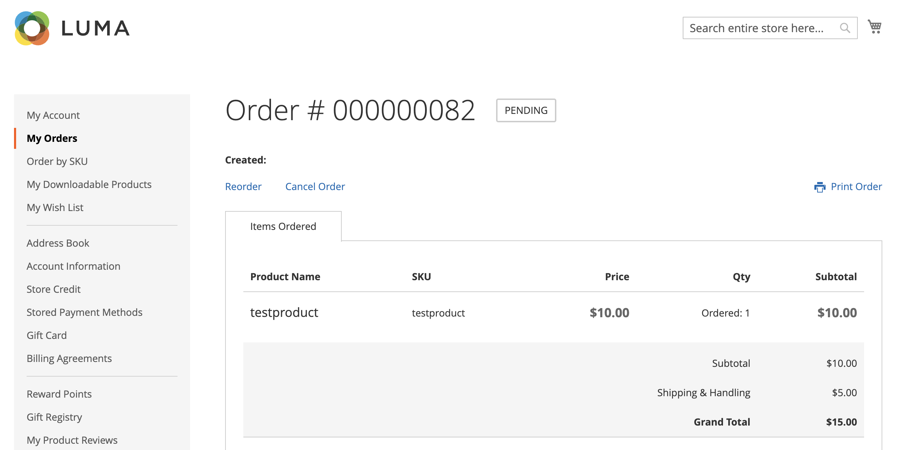

# Permitir orden de cancelación

Cuando está activada, puede cancelar un pedido directamente desde la cuenta del cliente. Cancelar está deshabilitado de forma predeterminada.

## Criterios para activar la cancelación de un pedido

- El _Permitir Cancelar pedido_ La opción de configuración debe estar activada.

- Si el orden está en `Hold`, `Canceled`, `Complete`, o `Closed` estado, la opción cancelar está desactivada en la tienda.

- Si alguno de los artículos del pedido se ha enviado, la opción de cancelación se desactiva en la tienda.

- Si hay algún artículo pagado, la opción de cancelación se activa y se crea el reembolso para ese artículo.

- Si el orden está en `Pending` o `Processing` estado, la opción cancelar está activada en la tienda.

## Configure para permitir la cancelación del cliente y personalizar los motivos de cancelación

1. En el _Administrador_ barra lateral, vaya a **[!UICONTROL Stores]** > _[!UICONTROL Settings]_>**[!UICONTROL Configuration]**.

1. En el panel izquierdo, expanda **[!UICONTROL Sales]** y seleccione **[!UICONTROL Sales]**.

1. Expandir  el **[!UICONTROL Order cancellation]** sección.

   {width="600" zoomable="yes"}

1. Establecer **[!UICONTROL Order cancellation through GraphQL]** hasta `Yes`.

   Esta configuración habilita la funcionalidad de cancelación desde la cuenta de cliente en la tienda.

1. En el **[!UICONTROL Order Order cancellation reasons]** puede agregar, eliminar o modificar cualquier motivo de cancelación.

   Con esta configuración, los motivos de cancelación se muestran en la tienda al cliente cuando cancela un pedido.
Asegúrese de haber especificado al menos un motivo.

1. Clic **[!UICONTROL Save Config]**.

## Cancelar desde la tienda

Un cliente puede iniciar la funcionalidad de cancelación para un pedido específico desde tres páginas:

- _Mis pedidos_ página

- _Vista de pedidos_ página

- _Mi cuenta_ página

### Mis pedidos

El _Cancelar pedido_ El botón se muestra en la página Mis pedidos si el pedido se puede cancelar.

{width="700" zoomable="yes"}

### Página de vista de pedidos

El _Cancelar pedido_ El botón se muestra en la página Ver Pedido si se puede cancelar el pedido.

{width="700" zoomable="yes"}

### Mi cuenta

El _Cancelar pedido_ El botón se muestra en la sección Pedidos recientes de la página Mi cuenta, si se puede cancelar la solicitud.

{width="700" zoomable="yes"}

