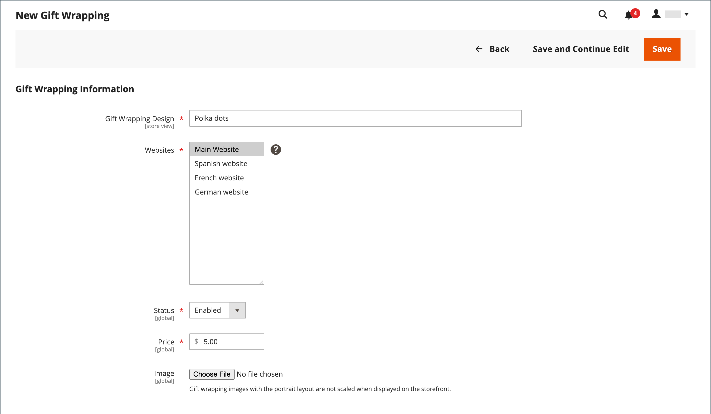

# Configuración del carro

La configuración del carro de compras determina cómo funciona este carro para los clientes de la tienda, incluso cuándo se redirige al cliente a la página del carro de compras y qué imágenes se utilizan para las miniaturas de los productos. También puede requerir un pedido para alcanzar una cantidad mínima antes de que comience el proceso de cierre de compra, especificar el número de días que los precios cotizados siguen siendo válidos y especificar el orden de los artículos en la sección _Totales de pedidos_.

[**Minicarrito**](#mini-cart): configure esta opción para determinar si el vínculo o icono del carro de compras muestra el número de productos (o SKU) diferentes en el carro de compras o la cantidad total de todos los artículos.

[**Vínculo de minicarrito**](#configure-the-cart-link): configure esta opción para determinar si el minicarrito aparece cuando un cliente hace clic en el número de elementos que hay en el icono de carrito en la parte superior de una página de la tienda.

[**Redirigir al carro**](#redirect-to-cart): configure esta opción para determinar si la página del carro de compras aparece cada vez que se agrega un artículo al carro de compras o solo cuando un cliente decide ir a la página.

[**Vigencia de la cotización**](#quote-lifetime) - Configure esta opción para especificar cuánto tiempo es válido un precio.

[**Cantidad mínima del pedido**](#minimum-order-amount): configure estas opciones para especificar una cantidad mínima, después de aplicar los descuentos, que los subtotales del pedido deben cumplir y que los mensajes se muestran en el carro de compras.

[**Cantidad mínima del pedido**](#minimum-order-quantity): configure estas opciones para especificar un número mínimo de artículos necesarios para realizar un pedido.

[**Miniaturas del carro de compras**](#cart-thumbnails): configure las opciones de miniaturas del carro de compras para determinar las miniaturas que se muestran en el carro de compras para los productos agrupados o configurables.

[**Opciones de regalo**](#gift-options): configure las opciones de regalo para determinar si los clientes pueden agregar un mensaje de regalo o una tarjeta de felicitación, y si las opciones de envoltorio de regalos están disponibles.

>[!NOTE]
>
>Para obtener información acerca de cómo configurar el proceso de desprotección, vea [Opciones de desprotección](checkout-process.md).

## Minicarrito

El _minicarrito_ muestra un resumen de los elementos del carrito. Está activada de forma predeterminada y aparece al hacer clic en el vínculo Carro de compras en la parte superior de la página.
El vínculo se puede configurar para mostrar el número de productos diferentes (o SKU) en el carro de compras o la cantidad total de todos los artículos.

{width="700" zoomable="yes"}

>[!NOTE]
>
>Para un cliente _registrado_, existen casos en los que el minicarrito puede no sincronizarse automáticamente en varios dispositivos y navegadores. Para sincronizar el minicarrito en estos casos, el cliente solo tiene que abrir la página [Carro de compras](cart.md) en ese dispositivo o navegador.

### Configurar el minicarrito

1. En la barra lateral _Admin_, vaya a **[!UICONTROL Stores]** > _[!UICONTROL Settings]_>**[!UICONTROL Configuration]**.

1. En el panel izquierdo, expanda **[!UICONTROL Sales]** y elija **[!UICONTROL Checkout]**.

1. Expanda  en la sección _[!UICONTROL Mini Cart]_.

   {width="600" zoomable="yes"}

1. Si la configuración es para una vista de tienda específica, [elija la vista de tienda](../configuration-reference/scope-change.md#set-the-scope) donde se aplica la configuración.

   Cuando se le solicite, haga clic en **[!UICONTROL OK]** para continuar.

1. Establezca **[!UICONTROL Display Mini Cart]** en una de las siguientes opciones:

   - `Yes` - Muestra el minicarrito en las páginas de la tienda. El aspecto de la barra lateral depende de la temática.
   - `No`: deshabilita la visualización del minicarrito en las páginas de la tienda.

1. Si la visualización está activada, actualice las otras opciones para configurar la visualización:

   - Para **[!UICONTROL Number of Items to Display Scrollbar]**, escriba el número de elementos que pueden aparecer en la barra lateral antes de activar la barra de desplazamiento.
   - Para **[!UICONTROL Maximum Display Recently Added Item(s)]**, escriba el número máximo de elementos agregados recientemente que desea que aparezcan en el minicarrito.

1. Haga clic en **[!UICONTROL Save Config]**.

### Configuración del vínculo del carro de compras

1. En la barra lateral _Admin_, vaya a **[!UICONTROL Stores]** > _[!UICONTROL Settings]_>**[!UICONTROL Configuration]**.

1. En el panel izquierdo, expanda **[!UICONTROL Sales]** y elija **[!UICONTROL Checkout]**.

1. Expanda  en la sección **[!UICONTROL My Cart Link]**.

1. Establezca **[!UICONTROL Display Cart Summary]** en una de las siguientes opciones de configuración:

   - `Display item quantities`: esta configuración muestra el número total de productos en el carro de compras y agrega las cantidades para cada producto.
   - `Display number of items in cart`: esta configuración muestra el número de artículos de producto en el carro de compras, independientemente de la cantidad.

   {width="600" zoomable="yes"}

1. Haga clic en **[!UICONTROL Save Config]**.

## Redirigir al carro

La página del carro de compras se puede configurar para que aparezca cada vez que se agregue un artículo al carro de compras o solo cuando los clientes decidan ir a la página. La información básica sobre los artículos que se encuentran actualmente en el carro está siempre disponible en el [mini carro](#mini-cart). La decisión es una cuestión de equilibrar las ventajas de permitir que los clientes sigan comprando, con las ventajas de animar a los clientes a proceder al cierre de compra. Podría ser una simple cuestión de preferencia personal. Sin embargo, si desea realizar una copia de seguridad con números, puede ejecutar una prueba A/B para ver qué método produce una tasa de conversión más alta.

**_Para configurar cuándo aparecerá el carro de compras:_**

1. En la barra lateral _Admin_, vaya a **[!UICONTROL Stores]** > _[!UICONTROL Settings]_>**[!UICONTROL Configuration]**.

1. En el panel izquierdo, expanda **[!UICONTROL Sales]** y elija **[!UICONTROL Checkout]**.

1. Expanda  en la sección **[!UICONTROL Shopping Cart]**.

   {width="600" zoomable="yes"}

1. Si la configuración es para una vista de tienda específica, [elija la vista de tienda](../configuration-reference/scope-change.md#set-the-scope) donde se aplica la configuración.

   Cuando se le solicite, haga clic en **[!UICONTROL OK]** para continuar.

1. Establezca **[!UICONTROL After Adding a Product Redirect to Shopping Cart]** en una de las siguientes opciones:

   - `Yes` - Muestra la página del carro de compras inmediatamente después de agregar un producto al carro de compras.
   - `No`: deshabilita la redirección al carro de compras después de agregar un producto al carro de compras.

1. Haga clic en **[!UICONTROL Save Config]**.

## Duración del presupuesto

Con la instalación y activación de Adobe Commerce B2B, puede agregar compatibilidad con la función _Quotes_. Esta capacidad permite a los compradores autorizados iniciar el proceso de negociación de precios enviando una solicitud desde el carro de compras. La cuadrícula _Ofertas_ muestra todas las ofertas recibidas y mantiene un historial de la comunicación entre el comprador y el vendedor. Para obtener más información acerca de las características de B2B, consulte [Comillas negociadas](../b2b/quotes.md) en la _Guía del usuario de Adobe Commerce B2B_.

Puede determinar cuánto tiempo es válido un precio estableciendo la duración de la oferta del carro de compras en la configuración. Por ejemplo, si un comprador deja un carro de compras desatendido después de varios días, el precio de las cotizaciones de algunos artículos podría ya no ser el mismo. De forma predeterminada, la duración de la oferta se establece en 30 días.

**_Para configurar la duración del presupuesto:_**

1. En la barra lateral _Admin_, vaya a **[!UICONTROL Stores]** > _[!UICONTROL Settings]_>**[!UICONTROL Configuration]**.

1. En el panel izquierdo, expanda **[!UICONTROL Sales]** y elija **[!UICONTROL Checkout]**.

1. Expanda  en la sección **[!UICONTROL Shopping Cart]**.

   {width="600" zoomable="yes"}

1. Si la configuración es para una vista de tienda específica, [elija la vista de tienda](../configuration-reference/scope-change.md#set-the-scope) donde se aplica la configuración.

   Cuando se le solicite, haga clic en **[!UICONTROL OK]** para continuar.

1. Para **[!UICONTROL Quote Lifetime (days)]**, introduzca el número de días durante los cuales un precio cotizado será válido.

1. Haga clic en **[!UICONTROL Save Config]**.

## Cantidad mínima del pedido

La configuración le permite especificar una cantidad mínima, después de aplicar los descuentos, que deben satisfacer los subtotales del pedido. Los pedidos enviados a varias direcciones pueden ser necesarios para alcanzar la cantidad mínima de pedido por dirección. El botón Finalizar compra solo está disponible una vez que se ha alcanzado la cantidad mínima del pedido.

{width="700" zoomable="yes"}

**_Para configurar una cantidad mínima de pedido:_**

1. En la barra lateral _Admin_, vaya a **[!UICONTROL Stores]** > _[!UICONTROL Settings]_>**[!UICONTROL Configuration]**.

1. En el panel izquierdo, expanda **[!UICONTROL Sales]** y elija **[!UICONTROL Sales]** debajo.

1. Expanda  en la sección **[!UICONTROL Minimum Order Amount]**.

   {width="600" zoomable="yes"}

1. Para requerir una cantidad mínima de pedido, establezca **[!UICONTROL Enable]** en `Yes`.

1. Si el pedido mínimo está activado, defina las siguientes opciones para configurar el requisito:

   - Escriba el **[!UICONTROL Minimum Amount]** que se requiere para el subtotal, después de aplicar los descuentos.

   - Establezca **[!UICONTROL Include Discount Amount]** en una de las siguientes opciones:

      - `Yes` - Requiere que el subtotal alcance la cantidad mínima con cualquier descuento incluido. Si utilizamos un ejemplo de un mínimo de 50 $, si el carro de compras contiene una parte superior de 60 $ con un descuento del 25 % aplicado, el subtotal resultante es de 45 $ y el carro de compras no alcanzaría el mínimo.
      - `No` - Requiere que el subtotal alcance la cantidad mínima sin descuentos.

   - Establezca **[!UICONTROL Include Tax to Amount]** en una de las siguientes opciones:

      - `Yes` - Requiere que el subtotal alcance la cantidad mínima con impuestos incluidos.
      - `No` - Requiere que el subtotal alcance la cantidad mínima sin impuestos.

1. Si lo desea, puede personalizar la configuración del mensaje de importe mínimo de pedido:

   - En **[!UICONTROL Description Message]**, escriba el texto que desee usar para personalizar el mensaje que aparece en la parte superior del carro de compras cuando el subtotal no alcanza la cantidad mínima.

   - Para **[!UICONTROL Error to Show in Shopping Cart]**, escriba el texto que desee usar para personalizar el mensaje de error del carro de compras.

   Deje los campos de descripción del mensaje vacíos para utilizar los mensajes predeterminados.

1. Si es necesario, configure la configuración del importe mínimo del pedido para pedidos de varias direcciones:

   - Para requerir que cada dirección de un pedido de varias direcciones cumpla con la cantidad mínima del pedido, establezca **[!UICONTROL Validate Each Address Separately in Multi-address Checkout]** en `Yes`.

   - Si lo desea, puede personalizar la configuración del mensaje de importe mínimo de pedido:

      - **[!UICONTROL Multi-address Description Message]**: escriba el texto que desea utilizar para personalizar el mensaje que aparece en la parte superior del carro de compras para pedidos de varias direcciones que no cumplen con el mínimo.

      - **[!UICONTROL Multi-address Error to Show in Shopping Cart]**: escriba el texto que desea utilizar para personalizar el mensaje de error del carro de compras para pedidos de varias direcciones que no cumplan con el mínimo, escriba el texto en el cuadro.

     Deje los campos de descripción del mensaje vacíos para utilizar los mensajes predeterminados.

1. Haga clic en **[!UICONTROL Save Config]**.

## Cantidad mínima de pedido

Puede establecer la cantidad mínima permitida para un pedido. La cantidad mínima también se puede configurar según cada grupo de clientes.

1. Vaya a **[!UICONTROL Stores]** > _[!UICONTROL Settings]_>**[!UICONTROL Configuration]**.

1. En el panel izquierdo, expanda **[!UICONTROL Catalog]** y elija **[!UICONTROL Inventory]**.

1. Expanda  en la sección **[!UICONTROL Product Stock Options]**.

   {width="600" zoomable="yes"}

1. Para **[!UICONTROL Minimum Qty Allowed in Shopping Cart]**, establezca la cantidad mínima del producto para un pedido.

   Si es necesario, desactive la casilla de verificación **[!UICONTROL Use system value]** para modificar esta configuración.

   - Cambie la configuración de **[!UICONTROL Customer Group]** a un grupo específico e introduzca **[!UICONTROL Minimum Qty]** para ese grupo. Para agregar otro grupo y otro límite de cantidad, haga clic en **[!UICONTROL Add Minimum Qty]**.

   - Para establecer el mismo límite de cantidad mínima para todos los clientes, mantenga la selección `ALL GROUPS` e introduzca **[!UICONTROL Minimum Qty]**.

1. Haga clic en **[!UICONTROL Save Config]**.

   {width="700" zoomable="yes"}

## Miniaturas del carro

 (solo Adobe Commerce)

Las imágenes en miniatura que se muestran en el carro de compras ofrecen a los clientes una visión general rápida de los artículos que están a punto de comprar. Sin embargo, en el caso de los productos con varias opciones, es posible que la imagen no coincida con la variación del producto que se encuentra en el carro de compras. Si el cliente compra un artículo en un color específico, lo ideal es que la miniatura del carro de compras coincida.

La imagen en miniatura de los productos agrupados y configurables se puede configurar para que muestre la imagen del producto &quot;principal&quot; o de la variación del producto.

{width="700" zoomable="yes"}

**_Para configurar miniaturas del carro de compras:_**

1. En la barra lateral _Admin_, vaya a **[!UICONTROL Stores]** > _[!UICONTROL Settings]_>**[!UICONTROL Configuration]**.

1. En el panel izquierdo, expanda **[!UICONTROL Sales]** y elija **[!UICONTROL Checkout]**.

1. Expanda  en la sección **[!UICONTROL Shopping Cart]**.

   {width="600" zoomable="yes"}

1. Establezca **[!UICONTROL Grouped Product Image]** para determinar la miniatura que se usa en el carro de [productos agrupados](../catalog/product-create-grouped.md):

   - `Product Thumbnail Itself` - Utiliza la miniatura asignada a la variación del producto que se agrega al carro de compras.
   - `Parent Product Thumbnail`: utiliza la miniatura asignada al producto principal.

1. Establezca **[!UICONTROL Configurable Product Image]** para determinar la miniatura que se usa en el carro de [productos configurables](../catalog/product-create-configurable.md):

   - `Product Thumbnail Itself` - Utiliza la miniatura asignada a la variación del producto que se agrega al carro de compras.
   - `Parent Product Thumbnail`: utiliza la miniatura asignada al producto principal.

1. Haga clic en **[!UICONTROL Save Config]**.

## Opciones de regalo

La selección de las opciones de regalo disponibles aparece en el carro de compras antes de que comience el proceso de cierre de compra. La configuración de opciones de regalo determina si los clientes pueden agregar un mensaje de regalo o una tarjeta de felicitación, y si hay opciones de envoltorio para regalos disponibles. Cada artículo del pedido puede tener un mensaje separado y un envoltorio para regalos. Cuando se aplica a todo el pedido, los clientes también pueden añadir un recibo de regalo y una tarjeta de felicitación.

{width="700" zoomable="yes"}

La configuración de Opciones de regalo se aplica a todo el sitio web, pero se puede sobrescribir en el nivel de producto.

### Activar opciones de regalo

1. En la barra lateral _Admin_, vaya a **[!UICONTROL Stores]** > _[!UICONTROL Settings]_>**[!UICONTROL Configuration]**.

1. En el panel izquierdo, expanda **[!UICONTROL Sales]** y elija **[!UICONTROL Sales]** debajo.

1. Expanda  **[!UICONTROL Gift Options]** en la página.

   {width="600" zoomable="yes"}

1. Configure las opciones del mensaje de regalo según sus preferencias:

   - Para **[!UICONTROL Allow Gift Messages on Order Level]**, seleccione `Yes` para habilitar un solo mensaje de regalo para todo el pedido.
   - Para **[!UICONTROL Allow Gift Messages for Order Items]**, seleccione `Yes` para habilitar la adición de mensajes de regalo independientes para artículos individuales en el carro de compras de clientes.

1.  (solo Adobe Commerce) Establece las opciones de envoltorio para regalos de acuerdo con tus preferencias:

   - Para **[!UICONTROL Allow Gift Wrapping on Order Level]**, seleccione `Yes` para habilitar un solo envoltorio para regalos para todo el pedido.
   - Para **[!UICONTROL Allow Gift Wrapping for Order Items]**, seleccione `Yes` para habilitar la adición de envoltorio para regalos individualmente a cada artículo en el carro de compras del cliente.

   También puede definir diferentes [diseños de envoltorio para regalos](#gift-wrap) para que los clientes puedan elegir el envoltorio.

1.  (solo Adobe Commerce) Para proporcionar a los clientes la opción de incluir un recibo de regalo, establezca **[!UICONTROL Allow Gift Receipt]** en `Yes`.

1.  (solo Adobe Commerce) Para proporcionar a los clientes la opción de incluir una tarjeta impresa, establezca **[!UICONTROL Allow Printed Card]** en `Yes`.

1.  (solo Adobe Commerce) Escriba **[!UICONTROL Default Price for Printed Card]**.

1. Haga clic en **[!UICONTROL Save Config]**.

### Envoltorio para regalos

 (solo Adobe Commerce)

El envoltorio para regalos está disponible para cualquier producto que se pueda enviar y se puede ofrecer para artículos individuales o para todo el pedido. Puede cobrar un precio diferente por cada diseño de envoltorio para regalos y cargar una imagen en miniatura por cada diseño que aparezca como opción para un producto en el carro de compras. Cuando un cliente hace clic en la miniatura del envoltorio de regalos, aparece una imagen a tamaño completo. Durante la revisión de cierre de compra, el cargo por envoltorio para regalos aparece con los otros [totales de cierre de compra](checkout-totals-sort-order.md) en la sección _Resumen del pedido_.

La imagen del envoltorio para regalos debe ser una muestra que muestre el patrón repetitivo y también puede incluir una muestra de la cinta que se va a utilizar. Puede escanear el papel o tomar una fotografía de un paquete envuelto. La imagen cargada puede ser un GIF, un JPG de datos o una imagen PNG, y debe ser cuadrada. En el ejemplo siguiente, la imagen del envoltorio para regalos cargada es de 230 x 230 píxeles.

{width="700" zoomable="yes"}

#### Agregar un diseño de envoltorio para regalos

1. En la barra lateral _Admin_, vaya a **[!UICONTROL Stores]** > _[!UICONTROL Other Settings]_>**[!UICONTROL Gift Wrapping]**.

   {width="700" zoomable="yes"}

1. En la esquina superior derecha, haga clic en **[!UICONTROL Add Gift Wrapping]**.

1. Escriba el nombre de **[!UICONTROL Gift Wrapping Design]** que aparecerá durante el cierre de compra.

   Si es necesario, puede cambiar **[!UICONTROL Scope]** y configurar un nombre diferente para cada vista de tienda.

1. Seleccione el **[!UICONTROL Websites]** en el que está disponible el diseño de envoltorio para regalos.

1. Establezca **[!UICONTROL Status]** en `Enabled`.

   Si tiene la opción de ajuste estacional, puede establecerla en `Disabled` cuando no desee que la opción esté disponible.

1. Escriba **[!UICONTROL Price]** del diseño del envoltorio para regalos.

   Esta configuración se puede sobrescribir con el precio del envoltorio para regalos establecido en el nivel de producto.

   {width="600" zoomable="yes"}

1. Para cargar una miniatura **[!UICONTROL Image]** del envoltorio para regalos, haga clic en **[!UICONTROL Choose File]** y seleccione el archivo que desea cargar desde el directorio.

   Aparece una miniatura de la imagen en _[!UICONTROL Gift Wrapping Information]_después de guardar el registro.

1. Haga clic en **[!UICONTROL Save]**.

#### Editar un diseño de envoltorio para regalos

1. En la barra lateral _Admin_, vaya a **[!UICONTROL Stores]** > _[!UICONTROL Other Settings]_>**[!UICONTROL Gift Wrapping]**.

1. Busque el registro del envoltorio para regalos en la lista.

1. En la columna _Acción_, haga clic en **[!UICONTROL Edit]**.

   {width="600" zoomable="yes"}

1. Realice los cambios necesarios.

1. Haga clic en **[!UICONTROL Save]**.

#### Eliminar diseños de envoltorio para regalos

Con la cuadrícula _Envoltorio para regalos_ abierta, use uno de estos métodos para eliminar diseños de ajuste.

**_Método 1: eliminar un solo diseño de envoltorio para regalos_**

1. Abra el diseño del envoltorio para regalos en modo de edición.

1. En la parte superior del área de trabajo, haga clic en **[!UICONTROL Delete]**.

1. Cuando se le solicite, haga clic en **[!UICONTROL OK]** para confirmar.

**_Método 2: eliminar varios diseños de envoltorio para regalos_**

1. En la cuadrícula _Envoltorio para regalos_, active la casilla de verificación de cada diseño de envoltorio para regalos que desee eliminar.

1. Establezca el control **[!UICONTROL Actions]** en `Delete`.

1. Haga clic en **[!UICONTROL Submit]**.

### Impuesto de opciones de regalo

 (solo Adobe Commerce)

El envoltorio para regalos y los precios de las tarjetas regalo impresas se pueden configurar para incluir o excluir impuestos, o para mostrar ambas opciones. También puede especificar una clase de impuestos para estos artículos, ya sea a nivel global o de sitio Web.

**_Para configurar impuestos de opciones de regalo:_**

1. En la barra lateral _Admin_, vaya a **[!UICONTROL Stores]** > _[!UICONTROL Settings]_>**[!UICONTROL Configuration]**.

1. En el panel izquierdo, expanda **[!UICONTROL Sales]** y elija **[!UICONTROL Tax]**.

1. Expanda  en la sección **[!UICONTROL Tax Classes]**.

   {width="600" zoomable="yes"}

1. Establezca **[!UICONTROL Tax Class for Gift Options]** en la clase de impuestos aplicable.

1. Expanda  en la sección **[!UICONTROL Orders, Invoices, Credit Memos Display Settings]**.

   {width="600" zoomable="yes"}

1. Establezca **[!UICONTROL Display Gift Wrapping Prices]** en una de las siguientes opciones:

   - `Excluding Tax`
   - `Including Tax`
   - `Including and Excluding Tax`

1. Establezca **[!UICONTROL Display Printed Card Prices]** en una de las siguientes opciones:

   - `Excluding Tax`
   - `Including Tax`
   - `Including and Excluding Tax`

1. Haga clic en **[!UICONTROL Save Config]**.
