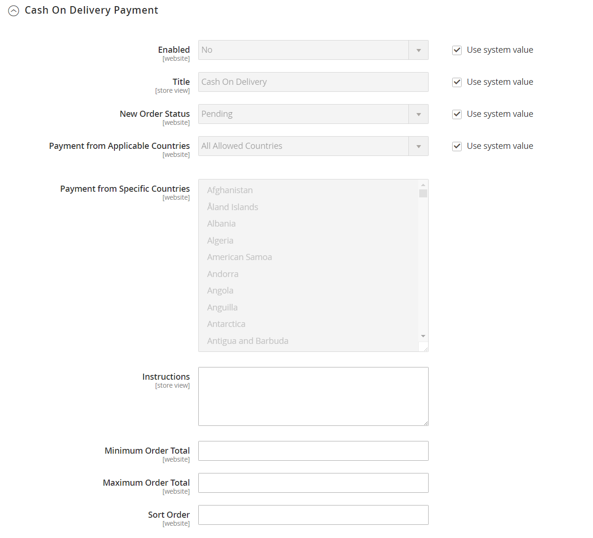

# Pago contra reembolso (COD)

Adobe Commerce y Magento Open Source le permiten aceptar _pagos en efectivo durante la entrega_ (COD) por compras. Solo puede aceptar pagos contra reembolso de países específicos, y puede ajustar la configuración con límites totales de pedidos mínimos y máximos.

El transportista recibe el pago del cliente en el momento de la entrega, que luego se transfiere a usted. Puedes hacer un ajuste por cualquier cargo cobrado por el servicio de transporte en tus gastos de envío y manipulación.

**_Para configurar los pagos de efectivo en la entrega:_**

1. En la barra lateral _Admin_, vaya a **[!UICONTROL Stores]** > _[!UICONTROL Settings]_>**[!UICONTROL Configuration]**.

1. En el panel izquierdo, expanda **[!UICONTROL Sales]** y elija **[!UICONTROL Payment Methods]**.

1. En _Otros métodos de pago_, expanda  en la sección **[!UICONTROL Cash On Delivery Payment]**.

   {width="600" zoomable="yes"}

   Para obtener una descripción detallada de cada una de estas opciones de configuración, consulte [Pago contra reembolso](../configuration-reference/sales/payment-methods.md#cash-on-delivery-payment) en la _Guía de referencia de configuración_.

   >[!NOTE]
   >
   >Si es necesario, primero borre la casilla de verificación **[!UICONTROL Use system value]** para cambiar esta configuración.

1. Para activar el pago contra reembolso, establezca **[!UICONTROL Enabled]** en `Yes`.

1. Para **[!UICONTROL Title]**, escriba un título que identifique el método de pago contra reembolso durante el cierre de compra.

1. Establezca **[!UICONTROL New Order Status]** en `Pending` hasta que se confirme el recibo del pago.

   Si lo prefiere, puede utilizar el estado `Processing` o `Suspected Fraud` para nuevos pedidos con esta forma de pago.

1. Establezca **[!UICONTROL Payment from Applicable Countries]** en una de las siguientes opciones:

   - `All Allowed Countries`: los clientes de todos los [países](../getting-started/store-details.md#country-options) especificados en la configuración de su tienda pueden usar este método de pago.
   - `Specific Countries` - Después de elegir esta opción, aparece la lista _[!UICONTROL Payment from Specific Countries]_. Para seleccionar varios países, mantenga pulsada la tecla Ctrl (PC) o la tecla Comando (Mac) y haga clic en cada opción.

1. Escriba **[!UICONTROL Instructions]** para aceptar la entrega de un pedido de pago contra reembolso.

1. Establezca **[!UICONTROL Minimum Order Total]** y **[!UICONTROL Maximum Order Total]** en los importes de pedido necesarios para calificar para el pago contra reembolso.

   >[!NOTE]
   >
   >Un pedido indica si el total está entre el total de pedido mínimo o máximo, o si coincide con él.

1. Para **[!UICONTROL Sort Order]**, escribe un número que determine la posición de este artículo en la lista de métodos de pago que se muestra durante el cierre de compra.

   Este número es relativo a las otras formas de pago. (`0` = primero, `1` = segundo, `2` = tercero, etc.)

1. Una vez finalizado, haga clic en **[!UICONTROL Save Config]**.
