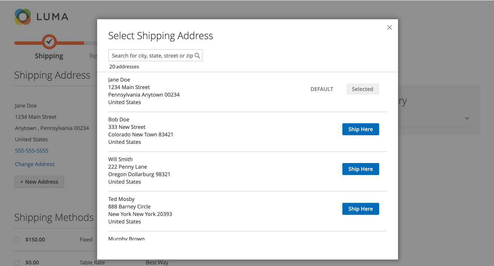

# Búsqueda de direcciones al finalizar la compra

{{ee-feature}}

Sus clientes pueden tener muchas direcciones guardadas e información en su libreta de direcciones, especialmente clientes normales, que regresan o empresas que introducen varios pedidos y ubicaciones de envío. La visualización de muchas direcciones puede ralentizar considerablemente la carga y los procesos de cierre de compra, y dar como resultado una experiencia de compra negativa. Para aumentar la capacidad de respuesta del cierre de compra, se recomienda activar y configurar la búsqueda de direcciones para el sitio.

>[!NOTE]
>
>La búsqueda de direcciones no está habilitada de forma predeterminada. Puede configurar esta función para incluir la funcionalidad en el sitio.

Cuando esta característica está habilitada y el número de direcciones guardadas del cliente cumple o supera el límite configurado, los pasos de _Envío_ y _Revisión y pagos_ muestran solo una dirección (la predeterminada). El cliente puede cambiar la dirección seleccionada haciendo clic en **Cambiar dirección** y luego buscando la dirección correcta por ciudad, estado, calle o código postal. Esta función también admite la selección de direcciones para el cierre de compra del registro de regalos.

{width="700" zoomable="yes"}

Si el cliente no tiene una dirección de envío predeterminada, la página _Envío_ muestra _Ninguna dirección seleccionada_. En este caso, el cliente debe hacer clic en **Cambiar dirección** para seleccionar una dirección guardada o hacer clic en **Nueva dirección** para agregar y seleccionar una dirección antes de continuar con el cierre de compra. Si el cliente no tiene una dirección de facturación predeterminada, la página _Revisión y pagos_ muestra la dirección seleccionada para el envío junto con la opción _Cambiar dirección_.

{width="600" zoomable="yes"}

## Búsqueda de ofertas de direcciones bloqueadas

 (disponible solo con Adobe Commerce B2B)

La activación de la búsqueda de direcciones también afecta al cierre de compra de pedidos creados a partir de ofertas en las que el número de direcciones guardadas del cliente cumple o supera el límite configurado. Cuando se completa la oferta y el cliente continúa con el cierre de compra, solo se muestra la dirección de envío seleccionada. La página también muestra un mensaje que indica que la dirección de envío está bloqueada y que solo se puede cambiar en la oferta.

{width="600" zoomable="yes"}

## Habilitar búsqueda de direcciones

1. En la barra lateral _Admin_, vaya a **[!UICONTROL Stores]** > _[!UICONTROL Settings]_>**[!UICONTROL Configuration]**.

1. En el panel izquierdo, expanda **[!UICONTROL Sales]** y elija **[!UICONTROL Checkout]**.

1. Expanda  en la sección **[!UICONTROL Checkout Options]**.

   {width="700" zoomable="yes"}

   Para obtener una descripción detallada de cada una de estas opciones de configuración, consulte [Opciones de desprotección](../configuration-reference/sales/checkout.md#checkout-options) en la _Guía de referencia de configuración_.

1. Establezca **[!UICONTROL Enable Address Search]** en `Yes`.

1. Para especificar el umbral para incluir la característica de búsqueda de direcciones, establezca la opción **[!UICONTROL Number of Customer Addresses Limit]**.

   Si es necesario, desactive la casilla de verificación **[!UICONTROL Use system value]** para realizar este cambio.

   Cuando el número de direcciones guardadas del cliente alcanza o supera este límite, la página muestra la dirección predeterminada (si el cliente tiene una) o _No se ha seleccionado ninguna dirección_ con la opción _Cambiar dirección_. El límite predeterminado es `10`.

1. Haga clic en **[!UICONTROL Save Config]**.
