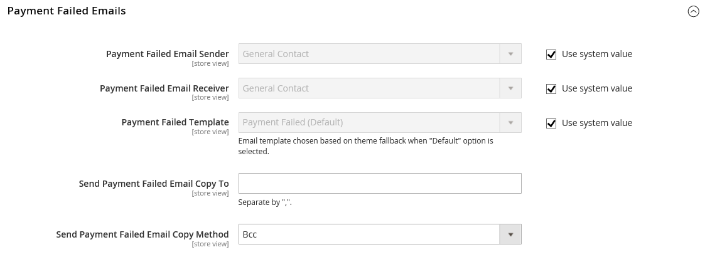

# Notificación de error de pago

Se envía una notificación al contacto de tienda o a un usuario administrador designado si el método de pago seleccionado durante el cierre de compra no consigue completar la transacción.

## Paso 1: Actualizar la plantilla de correo electrónico

Asegúrese de haber actualizado la plantilla de correo electrónico necesaria para reflejar su marca. Para obtener una lista completa de plantillas, consulte [Lista de plantillas de correo electrónico](../systems/email-templates.md#email-template-list).

## Paso 2: Configuración de los correos electrónicos con errores de pago

1. En la barra lateral _Admin_, vaya a **[!UICONTROL Stores]** > _[!UICONTROL Settings]_>**[!UICONTROL Configuration]**.

1. En el panel izquierdo, expanda **[!UICONTROL Sales]** y elija **[!UICONTROL Checkout]**.

1. Expanda  en la sección **[!UICONTROL Payment Failed Emails]**.

   {width="600" zoomable="yes"}

1. Defina las opciones para los correos electrónicos con errores de pago:

   - Establezca **[!UICONTROL Payment Failed Email Sender]** en el contacto de tienda que aparece como el remitente del mensaje.
   - Establezca **[!UICONTROL Payment Failed Email Receiver]** en el contacto de tienda que debe recibir notificaciones de transmisiones de correo electrónico con errores.
   - Establece **[!UICONTROL Payment Failed Template]** en la plantilla que se usa para el correo electrónico que se envía cuando falla el método de pago durante el cierre de compra.

1. Para **[!UICONTROL Send Payment Failed Email Copy To]**, escriba la dirección de correo electrónico de cualquier persona que vaya a recibir una copia de la notificación de error en el pago.

   Si envía una copia a varios destinatarios, separe cada dirección con una coma.

1. Establezca **[!UICONTROL Payment Failed Copy Method]** en una de las siguientes opciones:

   - `Bcc` - Envía una _copia de cortesía a ciegas_ incluyendo el destinatario en el encabezado del mismo correo electrónico que se envía al cliente. El destinatario CCO no es visible para el cliente.
   - `Separate Email` - Envía la copia como un correo electrónico independiente.

1. Haga clic en **[!UICONTROL Save Config]**.
