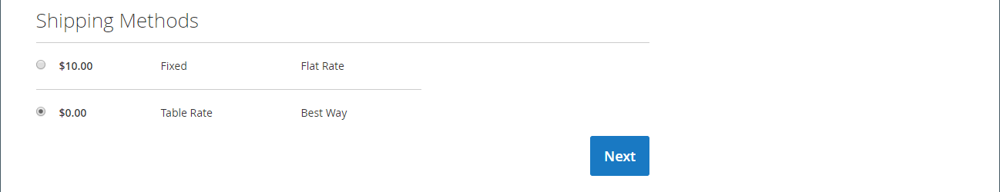
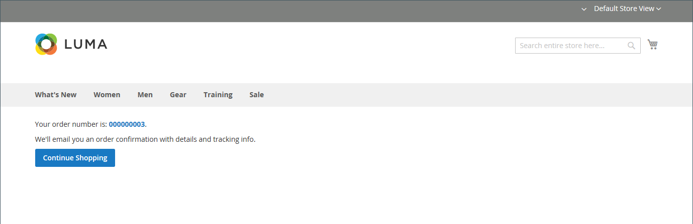

# Proceso de cierre de compra y opciones

Cuando comienza el proceso de cierre de compra, la transacción cambia a un canal cifrado y seguro. Aparece un símbolo de candado en la barra de direcciones del explorador y la dirección URL cambia de `http` a `https`.

## Proceso

El objetivo del proceso de cierre de compra es recopilar la información necesaria para completar la transacción. La página _Cierre de compra_ guía al cliente en cada paso del proceso. Los clientes que inician sesión en sus cuentas de pueden completar el cierre de compra rápidamente, porque gran parte de la información ya está en sus cuentas. Los clientes asociados a una cuenta de compañía que utiliza pedidos de compra tienen un flujo de trabajo ligeramente diferente.

### Envío

El primer paso del proceso de cierre de compra es que el cliente complete la información de la dirección de envío y elija el método de envío. Si el cliente tiene una cuenta, la dirección de envío se introduce automáticamente, pero se puede cambiar si es necesario.

 (solo Adobe Commerce) El formato de la dirección postal del destinatario y el remitente está determinado por las propiedades del [atributo de dirección del cliente](../customers/address-attributes.md). La configuración de validación de entrada determina los caracteres válidos que se pueden utilizar en una dirección de envío.

La barra de progreso de la parte superior de la página sigue cada paso del proceso de cierre de compra y el Resumen de pedidos muestra la información introducida hasta el momento.

{width="600" zoomable="yes"}

#### Enviar a una dirección diferente

1. Si hay entradas adicionales en la libreta de direcciones, el cliente encuentra la dirección a la que se va a enviar el pedido.

1. Para seleccionar la dirección, haga clic en **[!UICONTROL Ship Here]**.

#### Añadir una dirección

1. Al final de la sección _[!UICONTROL Shipping Address]_, el cliente hace clic en **[!UICONTROL + New Address]**.

1. Completa el formulario _[!UICONTROL Shipping Address]_.

   De forma predeterminada, el nombre y los apellidos del cliente aparecen inicialmente en el formulario.

   {width="600" zoomable="yes"}

1. Para guardar la nueva dirección en la libreta de direcciones, el cliente selecciona la casilla de verificación situada en la parte inferior del formulario.

1. Clics **[!UICONTROL Save Address]**.

   La nueva dirección se selecciona ahora como dirección de envío.

   {width="600" zoomable="yes"}

#### Elige el método de envío

1. En la lista de métodos [shipping](delivery.md), el cliente elige la opción que desea utilizar.

   {width="600" zoomable="yes"}

1. Hace clic en **[!UICONTROL Next]** para continuar.

### Revisión y pagos - Pedido regular

En el segundo paso del proceso de pago y envío, el cliente elige el [método de pago](payments.md) y aplica a la compra cualquier cupón con códigos promocionales. Toda la información se puede revisar y editar si es necesario. Si está activado, el cliente debe aceptar los términos y condiciones de la venta antes de realizar el pedido.

>[!NOTE]
>
>Aunque Commerce permite configurar varios códigos de cupones, un cliente solo puede aplicar un código de cupón al carro de compras. (Consulte los [Códigos de cupón](../merchandising-promotions/price-rules-cart-coupon.md) para obtener más información).

{width="700" zoomable="yes"}

### Revisión y pagos - Pedido de compra

 (disponible solo con Adobe Commerce B2B)

Cuando un cliente está asociado con una compañía que ha habilitado [pedidos de compra](../b2b/purchase-order-flow.md), todos los pedidos se procesan como pedidos de compra. Los métodos de pago disponibles están determinados por la configuración de la cuenta de la empresa.

1. El cliente selecciona un método de pago.

   Al usar el método _Pago en la cuenta_, se puede usar el campo [!UICONTROL Custom Reference Number] para hacer referencia a un número de factura.

1. El cliente hace clic en **[!UICONTROL Place Purchase Order]**.

   Se realiza el pedido de compra.

Si la compañía ha configurado [reglas de aprobación](../b2b/account-dashboard-approval-rules.md), el pedido de compra pasa por el proceso de aprobación. De lo contrario, se procesa inmediatamente.

{width="700" zoomable="yes"}

### Número de artículos mostrados en el resumen del pedido

Los usuarios administradores pueden cambiar el número máximo de artículos mostrados en el resumen del pedido al finalizar la compra para optimizar la visualización con menos productos. De forma predeterminada, este valor se establece en 10.

{width="700" zoomable="yes"}

1. En la barra lateral _Admin_, vaya a **[!UICONTROL Stores]** > _[!UICONTROL Settings]_>**[!UICONTROL Configuration]**.

1. En el panel izquierdo, expanda **[!UICONTROL Sales]** y elija **[!UICONTROL Checkout]**.

1. Expanda  en la sección **[!UICONTROL Checkout Options]**.

1. Para **[!UICONTROL Maximum Number of Items to Display in Order Summary]**, escriba el número máximo de elementos que se mostrarán.

1. Haga clic en **[!UICONTROL Save Config]**.

   Con esta actualización, el resumen del pedido que se muestra durante el cierre de compra se limita a la cantidad especificada de artículos.

### Confirmación del pedido

La confirmación del pedido aparece después de realizar el pedido. Para los clientes registrados, la página incluye el número de pedido con un vínculo a la cuenta del cliente y un vínculo para generar un recibo. A los clientes registrados se les indica que esperen confirmación de pedido e información de seguimiento por correo electrónico. Se recomienda a los clientes crear una cuenta para realizar un seguimiento del pedido. Los clientes registrados pueden generar un recibo haciendo clic en un vínculo.

La página de confirmación de pedido también se denomina página _Éxito_ y la utilizan los programas de análisis para realizar el seguimiento de las conversiones.

{width="700" zoomable="yes"}

## Opciones de cierre

Las opciones de cierre de compra controlan varios atributos de la página de cierre de compra, incluido el diseño. Hay opciones que puede configurar para establecer restricciones en el cierre de compra, lo que incluye permitir el cierre de compra de invitados y aplicar un acuerdo de términos y condiciones. También hay opciones para controlar la visualización de la información durante el proceso de cierre de compra.

{width="700" zoomable="yes"}

Para obtener una descripción detallada de cada una de estas opciones de configuración, consulte [Opciones de desprotección](../configuration-reference/sales/checkout.md#checkout-options) en la _Guía de referencia de configuración_.

### Cambiar las opciones de cierre de compra

1. En la barra lateral _Admin_, vaya a **[!UICONTROL Stores]** > _[!UICONTROL Settings]_>**[!UICONTROL Configuration]**.
1. En el panel izquierdo, expanda **[!UICONTROL Sales]** y elija **[!UICONTROL Checkout]**.
1. Configure cualquiera de las siguientes opciones que necesite.
1. Haga clic en **[!UICONTROL Save Config]**.

1. Expanda  en la sección **[!UICONTROL Checkout Options]**.

1. Si la configuración es para una vista de tienda específica, [elija la vista de tienda](../configuration-reference/scope-change.md#set-the-scope) donde se aplica la configuración.

   Cuando se le solicite, haga clic en **[!UICONTROL OK]** para continuar.

1. Configure las opciones de cierre de compra.

1. Haga clic en **[!UICONTROL Save Config]**.

### Opciones de cierre de compra disponibles

| Campo | [Ámbito](../getting-started/websites-stores-views.md#scope-settings) | Descripción |
|--- |--- |--- |
| [!UICONTROL Enable Onepage Checkout] | Vista de tienda | Determina si [desprotección de una página](checkout-one-page.md) es el formato de desprotección predeterminado. Opciones: Sí / No |
| [!UICONTROL Allow Guest Checkout] | Vista de tienda | Determina si los invitados pueden pasar por [pago y envío sin registrar](checkout-guest.md) una cuenta en tu tienda. Opciones: `Yes` / `No` |
| [!UICONTROL Enable Terms and Conditions] | Vista de tienda | Determina si los clientes deben aceptar los [Términos y condiciones](terms-and-conditions.md) de la venta antes de realizar una compra. Opciones: `Yes` / `No` |
| [!UICONTROL Display Billing Address On] | Vista de tienda | Determina la ubicación de la dirección de facturación durante el cierre de compra. Opciones: `Payment Method` / `Payment Page` |
| [!UICONTROL Maximum Number of Items to Display in Order Summary] | Vista de tienda | Determina el número máximo de artículos que pueden aparecer en el resumen de pedidos durante el cierre de compra. El valor predeterminado es `10`. |
| [!UICONTROL Enable Address Search] | Sitio web |  (solo Adobe Commerce) Determina si los clientes pueden usar la funcionalidad [búsqueda de direcciones](checkout-address-search.md) para _Envíos_ y los pasos de _Revisión y pagos_. Cuando esta función esté habilitada, use _[!UICONTROL Number of Customer Addresses Limit]_para establecer el número de direcciones guardadas necesarias para activar esta funcionalidad durante el cierre de compra. Opciones: `Yes` / `No` |
| [!UICONTROL Number of Customer Addresses Limit] | Sitio web |  (solo Adobe Commerce): cuando la búsqueda de direcciones es **[!UICONTROL Enabled]**, determina el número de direcciones guardadas necesarias para activar esta funcionalidad durante el cierre de compra. Cuando el número de direcciones guardadas del cliente cumple o supera este número, solo se representa la dirección predeterminada en los pasos _Envío_ y _Revisión y pagos_. El cliente puede utilizar una función de búsqueda para cambiar la dirección seleccionada. El valor predeterminado es 10. |

{style="table-layout:auto"}
