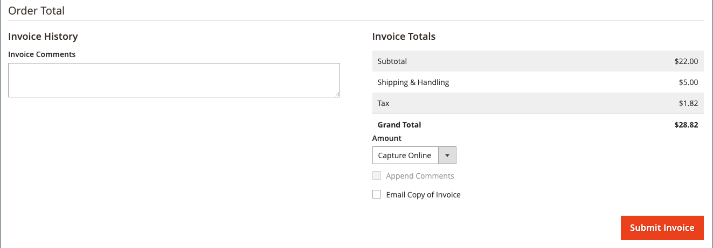

# Emitir una nota de crédito

Para poder imprimir una nota de abono, primero debe generarse para una [pedido facturado](invoices.md#create-an-invoice). Puede emitir reembolsos en línea y sin conexión (parciales o totales) a partir de una nota de crédito abierta, dependiendo del método de pago.

-  (Solo Adobe Commerce) Los reembolsos se pueden aplicar al crédito del almacén.
-  (Disponible con Adobe Commerce B2B) Los reembolsos se pueden aplicar al crédito de la empresa.
- Las compras realizadas con tarjeta de crédito pueden ser reembolsadas en línea o sin conexión.
- Las compras realizadas por cheque o giro postal deben ser reembolsadas sin conexión.

Cualquier nota de crédito con un [estado abierto](order-status.md) tiene un reembolso pendiente de pago.

Con las notas de abono puede:

- Devolver el importe total de una factura.
- Devolver un importe parcial de una factura.
- Devolver varios importes parciales de una factura.
- Devolver varias facturas por pedido sin superar el importe total del pedido.
- Devuelva una parte de la cantidad de un artículo de línea, como tres de las cinco camisas de un pedido.

Consulte [Crear una factura](invoices.md#create-an-invoice) para obtener más información.

## Configuración de acción de pago

El flujo de trabajo de devolución de los pedidos pagados con tarjeta de crédito está determinado por la variable [Configuración de acción de pago](../configuration-reference/sales/payment-methods.md#payment-actions) en la configuración de cada método de pago disponible. Los reembolsos no pueden emitirse hasta que se liquide la transacción.

{width="600" zoomable="yes"}

- Si la Acción de pago de la forma de pago configurada está establecida en `Authorize`, primero debe generar la factura desde el administrador antes de crear una nota de abono.
- Si Acción de pago para el método de pago configurado está establecido en `Authorize and Capture`, la factura ya ha sido generada por el procesador de pagos, pero los fondos no están disponibles hasta que se liquide la transacción. Muchos procesadores de pagos recomiendan este breve período de espera como medida de seguridad y, por lo general, se puede gestionar automáticamente. Las transacciones también se pueden liquidar manualmente desde su cuenta de comerciante con el procesador de pagos.
-  (Solo Adobe Commerce) Si crea un abono para un pedido que incluye opciones de regalo, el reembolso del envoltorio para regalos o de la tarjeta impresa aparecerá en la sección Totales de reembolso del abono. Para excluir estos costes del importe que se va a reembolsar, introduzca el importe como comisión de ajuste. Si se emiten varios abonos para el mismo pedido, el reembolso de las opciones de regalo solo aparece en el primer abono.

## Crear un abono

Determine el tipo de reembolso que desea emitir, para un [compra a crédito](#issue-a-refund-for-a-credit-purchase) o para [cheque o giro postal](#issue-an-offline-refund-for-check-or-money-order): y generar el abono y emitir un reembolso.

### Emitir un reembolso por una compra a crédito

1. En el _Administrador_ barra lateral, vaya a **[!UICONTROL Sales]** > **[!UICONTROL Orders]**.

   {width="700" zoomable="yes"}

1. Busque el orden en la cuadrícula y haga clic en **[!UICONTROL View]**.

1. Si la variable _[!UICONTROL Credit Memo]_Botón visible en la barra de botones, realice una de las siguientes acciones:

   - Para emitir un `offline` reembolso, vaya al paso #6.
   - Para emitir un `online` reembolso, continúe con el paso #4.

   Consulte [Notas de abono](credit-memos.md) para obtener más información sobre los reembolsos sin conexión y en línea.

1. Clic **[!UICONTROL Invoices]** en el panel izquierdo.

1. Busque la factura en la cuadrícula y haga clic en **[!UICONTROL View]**.

   {width="700" zoomable="yes"}

1. Desplácese hacia abajo hasta el **[!UICONTROL Invoice Totals]** de la factura, compruebe que la factura está configurada en `Capture Online`y haga clic en **[!UICONTROL Submit Invoice]**.

   {width="600" zoomable="yes"}

   Si esa opción no está disponible, la factura ya se ha creado. Continúe con el paso siguiente.

1. En la barra de botones de la parte superior de la factura, haga clic en **[!UICONTROL Credit Memo]**.

1. Compruebe la información de la **[!UICONTROL Items to Refund]** y haga lo siguiente, si corresponde:

   - Para devolver el producto al inventario, seleccione la **[!UICONTROL Return to Stock]** casilla de verificación

     El producto vuelve a estar en stock automáticamente si _Opciones de stock de productos_ se establece en `Automatically Return Credit Memo Item to Stock`. Con [Inventory management habilitado](../inventory-management/enable.md), el artículo vuelve al origen que envió el envío.

   - Actualice el **[!UICONTROL Qty to Refund]** y haga clic en **[!UICONTROL Update Qty's]**.

     {width="600" zoomable="yes"}

1. Actualice el **[!UICONTROL Refunds Totals]** como sigue:

   - Para **[!UICONTROL Refund Shipping]**, introduzca cualquier cantidad que deba reembolsarse de la tarifa de envío.

     Este campo muestra inicialmente el importe total de envío del pedido que está disponible para devolución. Es igual al importe total de envío del pedido, menos cualquier importe de envío que ya se haya reembolsado. Al igual que la cantidad, la cantidad se puede reducir, pero no aumentar.

   - Para **[!UICONTROL Adjustment Refund]**, introduzca un valor que se añadirá al importe total reembolsado como un reembolso adicional que no se aplique a ninguna parte concreta del pedido (envío, artículos o impuestos). También se puede utilizar para el reembolso parcial con dinero virtual, como una tarjeta regalo, cuando un administrador desea reembolsar primero un método de pago no virtual.

     El importe introducido no puede aumentar el reembolso total por encima del importe pagado.

   - Para **[!UICONTROL Adjustment Fee]**, introduzca un valor que se restará del importe total reembolsado.

     Este importe no se resta de una sección específica del pedido, como envíos, artículos o impuestos.

1. Para añadir un comentario, escriba el texto en la **[!UICONTROL Credit Memo Comments]** cuadro.

   - Para enviar una notificación por correo electrónico al cliente, seleccione la **[!UICONTROL Email Copy of Credit Memo]** casilla de verificación

1. Clic **[!UICONTROL Update Totals]**.

1. Haga lo siguiente, según corresponda:

   -  (Solo Adobe Commerce) Para devolver el importe al crédito de tienda del cliente, seleccione **[!UICONTROL Refund to Store Credit]** casilla de verificación

   -  (Disponible con Adobe Commerce B2B) Para devolver el importe al crédito de empresa del cliente, seleccione **[!UICONTROL Refund to Company Credit]** casilla de verificación

   - Para emitir un reembolso sin conexión, haz clic en **[!UICONTROL Refund Offline]**.

   - Para emitir un reembolso en línea, haga clic en **[!UICONTROL Refund]**.

   -  (Disponible con Adobe Commerce B2B) Si la compra se pagó con crédito de la empresa, haga clic en **[!UICONTROL Refund to Company Credit]**.

   Consulte [Notas de abono](credit-memos.md) para obtener más información sobre los reembolsos sin conexión y en línea.

   {width="600" zoomable="yes"}

### Emitir un reembolso fuera de línea para cheque o giro postal

1. En el _Administrador_ barra lateral, vaya a **[!UICONTROL Sales]** > **[!UICONTROL Orders]**.

1. Busque el pedido completado en la cuadrícula y ábralo haciendo clic en el **[!UICONTROL View]** vínculo.

1. En la barra de botones situada en la parte superior de la página, haga clic en **[!UICONTROL Invoice]**.

1. Desplácese hasta la parte inferior de la página y haga clic en **[!UICONTROL Submit Invoice]**.

1. En la barra de botones de la parte superior de la factura, haga clic en **[!UICONTROL Credit Memo]**.

   {width="600" zoomable="yes"}

1. Compruebe la información de la **[!UICONTROL Items to Refund]** y haga lo siguiente, si corresponde:

   {width="600" zoomable="yes"}

   - Seleccione el **[!UICONTROL Return to Stock]** casilla de verificación si desea devolver el producto devuelto al inventario.

     Con Inventory management activado, la cantidad de inventario vuelve al origen que envió el envío. El producto vuelve a estar en stock automáticamente si [Opciones de stock de productos](../inventory-management/enable.md) se establece en `Automatically Return Credit Memo Item to Stock`.

   - Actualice el **[!UICONTROL Qty to Refund]** y haga clic en **[!UICONTROL Update Qty's]**.

     El importe que se va a abonar no puede superar el importe máximo disponible para el reembolso.

1. Actualice el **[!UICONTROL Refunds Totals]** según corresponda:

   - Para **[!UICONTROL Refund Shipping]**, introduzca cualquier cantidad que deba reembolsarse de la tarifa de envío.

     Este campo muestra inicialmente el importe total de envío del pedido que está disponible para devolución. Es igual al importe total de envío del pedido, menos cualquier importe de envío que ya se haya reembolsado. Al igual que la cantidad, la cantidad se puede reducir, pero no aumentar.

   - Para **[!UICONTROL Adjustment Refund]**, introduzca un valor que se añadirá al importe total reembolsado como un reembolso adicional que no se aplique a ninguna parte concreta del pedido (envío, artículos o impuestos). También se puede utilizar para el reembolso parcial con dinero virtual, como una tarjeta regalo, cuando un administrador desea reembolsar primero un método de pago no virtual.

     El importe introducido no puede aumentar el reembolso total por encima del importe pagado.

   - Para **[!UICONTROL Adjustment Fee]**, introduzca un valor que se restará del importe total reembolsado.

     Este importe no se resta de una sección específica del pedido, como envíos, artículos o impuestos.

   - Si la compra se pagó con crédito de tienda, seleccione la **[!UICONTROL Refund to Store Credit]** para abonar el importe en el saldo de la cuenta del cliente.

1. Para añadir un comentario, escriba el texto en la **[!UICONTROL Credit Memo Comments]** y haga lo siguiente:

   - Para enviar una notificación por correo electrónico al cliente, seleccione la **[!UICONTROL Email Copy of Credit Memo]** casilla de verificación

   - Para incluir los comentarios introducidos en el correo electrónico, seleccione **[!UICONTROL Append Comments]** casilla de verificación

     El estado de una notificación de nota de abono aparece en la nota de abono terminada junto al número de nota de abono.

     {width="600" zoomable="yes"}

1. Para completar el proceso y emitir el reembolso, haga clic en **[!UICONTROL Refund Offline]**.

## Descripciones de campos

### [!UICONTROL Order & Account Information]

| Campo | Descripción |
|--- |--- |
| [!UICONTROL Order Number] | El número de pedido aparece en la _Información de pedido y cuenta_, seguido de una nota que indica si se envió el correo electrónico de confirmación. |
| [!UICONTROL Order Date] | La fecha y la hora en que se realizó el pedido. |
| [!UICONTROL Order Status] | Indica el estado del pedido como `Complete`. |
| [!UICONTROL Purchased From] | Indica el sitio web, la tienda y la vista de la tienda donde se realizó el pedido. |
| [!UICONTROL Placed from IP] | Indica la dirección IP del equipo desde el que se realizó el pedido. |

{style="table-layout:auto"}

### [!UICONTROL Account Information]

| Campo | Descripción |
|--- |--- |
| [!UICONTROL Customer Name] | El nombre del cliente o comprador que realizó el pedido. El nombre del cliente está vinculado al perfil del cliente. |
| [!UICONTROL Email] | La dirección de correo electrónico del cliente o comprador. La dirección de correo electrónico está vinculada para abrir un nuevo mensaje. |
| [!UICONTROL Customer Group] | El nombre del grupo de clientes o del catálogo compartido al que está asignado el cliente. |
| [!UICONTROL Company Name] |  (Disponible con Adobe Commerce B2B) El nombre de la empresa asociada con el comprador y en cuyo nombre se realiza el pedido. El nombre de la empresa está vinculado al perfil de la empresa. |

{style="table-layout:auto"}

### [!UICONTROL Address Information]

| Campo | Descripción |
|--- |--- |
| [!UICONTROL Billing Address] | El nombre del cliente o comprador que realizó el pedido, seguido de la dirección de facturación, el número de teléfono y el código de identificación del cliente. [IVA](vat.md), si procede. El número de teléfono está vinculado al marcado automático en un dispositivo móvil. |
| [!UICONTROL Shipping Address] | El nombre de la persona a cuya atención debe enviarse el pedido, seguido de la dirección de envío y el número de teléfono. El número de teléfono está vinculado al marcado automático en un dispositivo móvil. |

{style="table-layout:auto"}

### [!UICONTROL Payment & Shipping Method]

| Campo | Descripción |
|--- |--- |
| [!UICONTROL Payment Information] | El método de pago que se va a utilizar para el pedido y el número de pedido de compra, si corresponde, seguido de la divisa utilizada para realizar el pedido. Si el pedido se carga al crédito de la empresa mediante [Pago a cuenta](../b2b/enable-basic-features.md#configure-payment-on-account), se indica el importe cargado en la cuenta. |
| [!UICONTROL Shipping & Handling Information] | El método de envío que se va a utilizar y cualquier tarifa de manipulación que sea aplicable. |

{style="table-layout:auto"}

### [!UICONTROL Items to Refund]

| Campo | Descripción |
|--- |--- |
| [!UICONTROL Product] | El nombre del producto, SKU y opciones (si corresponde). |
| [!UICONTROL Price] | El precio de compra del artículo. Para Adobe Commerce B2B, este valor refleja cualquier descuento aplicado al artículo del catálogo compartido, si corresponde. |
| [!UICONTROL Qty] | La cantidad pedida. |
| [!UICONTROL Return to Stock] | Casilla de verificación que indica si el artículo devuelto se va a devolver a stock. |
| [!UICONTROL Qty to Refund] | Indica el número de unidades devueltas del producto. |
| [!UICONTROL Subtotal] | El subtotal es el precio de compra multiplicado por la cantidad de unidades de producto devueltas. |
| [!UICONTROL Tax Amount] | El importe del impuesto que se aplica al artículo devuelto como valor decimal. |
| [!UICONTROL Tax Percent] | Porcentaje de impuestos aplicados al artículo devuelto como porcentaje. |
| [!UICONTROL Discount Amount] | Cualquier descuento que se aplique al artículo devuelto. |
| [!UICONTROL Row Total] | El total del artículo de línea, incluidos los impuestos aplicables que vencen en el nivel de producto devuelto, menos los descuentos. |
| _total del pedido_ |  |

{style="table-layout:auto"}

### [!UICONTROL Credit Memo Comments]

| Campo | Descripción |
|--- |--- |
| [!UICONTROL Comment Text] | Cuadro de texto que se utiliza para escribir un comentario al cliente sobre la nota de crédito. |

{style="table-layout:auto"}

### [!UICONTROL Refund Totals]

| Campo | Descripción |
|--- |--- |
| [!UICONTROL Refund Shipping] | El importe de envío que se va a reembolsar. |
| [!UICONTROL Adjustment Refund] | Un importe que se añade al importe total devuelto como un reembolso adicional que no se aplica a ninguna parte concreta del pedido, como envíos, artículos o impuestos. El importe introducido no puede aumentar el reembolso total por encima del importe pagado. |
| [!UICONTROL Adjustment Fee] | Un importe que se resta del importe total reembolsado, como una tarifa de reposición de existencias o un importe relacionado con el envoltorio para regalos u opciones de regalos. |
| [!UICONTROL Grand Total] | El importe total a reembolsar |
| [!UICONTROL Append Comments] | Casilla de verificación que determina si se incluyen comentarios en la nota de abono. |
| [!UICONTROL Email Copy of Credit Memo] | Casilla de verificación que determina si se envía por correo electrónico una copia de la nota de crédito. |
| [!UICONTROL Refund to Store Credit] |  (Solo Adobe Commerce) Casilla de verificación que determina si el total se reembolsará a [crédito de tienda](../customers/store-credit-using.md). |
| [!UICONTROL Subtotal] |  (Disponible con Adobe Commerce B2B) El total de todos los elementos de línea que se van a reembolsar. |

{style="table-layout:auto"}

### Botones de reembolso

El método de pago utilizado para el pedido determina los botones de devolución disponibles para una nota de abono.

| Botón | Descripción |
|--- |--- |
| **[!UICONTROL Refund]** | Si la compra original se pagó con tarjeta de crédito a través de una pasarela de pago, el procesador de pagos administra el importe del reembolso. Para gestionar los reembolsos, consulte la documentación proporcionada por su proveedor de pagos. |
| **[!UICONTROL Refund Offline]** | Si la compra original se pagó mediante cheque o giro postal, el reembolso se paga directamente al cliente, mediante la emisión de un cheque, tarjeta de regalo o efectivo si tiene una tienda de ladrillo y mortero. La nota de crédito sirve como registro de la transacción sin conexión. |
| **[!UICONTROL Refund to Company Credit]** |  (Disponible con Adobe Commerce B2B) Si la compra se cargó a crédito de la empresa, el reembolso se devuelve a la [Cuenta de empresa](../b2b/credit-company.md). |

{style="table-layout:auto"}

## Imprimir un abono

Para imprimir o ver el abono completado, debe tener instalado un PDF Reader. Puede descargar [Adobe Reader][1] sin costo alguno.

1. En el _Administrador_ barra lateral, vaya a **[!UICONTROL Sales]** > _[!UICONTROL Operations]_>**[!UICONTROL Credit Memos]**.

1. Utilice uno de los siguientes métodos para imprimir la nota de abono:

### Método 1: Imprimir nota de abono actual

1. En la cuadrícula, abra el abono.

1. Clic **[!UICONTROL Print]**.

   {width="600" zoomable="yes"}

### Método 2: Imprimir varios abonos

1. En la lista, active la casilla de verificación de cada abono que desee imprimir.

1. Configure las variables **[!UICONTROL Actions]** control a `PDF Credit Memos` y haga clic en **[!UICONTROL Submit]**.

   {width="600" zoomable="yes"}

1. Cuando se le solicite, realice una de las siguientes acciones:

   - Para guardar el documento, haga clic en **[!UICONTROL Save]** y siga las indicaciones para guardar el archivo en el equipo. Cuando finalice la descarga, abra el PDF en Adobe Reader e imprima el documento.

   - Para ver el documento, haga clic en **[!UICONTROL Open]**. El abono de PDF listo para imprimir se abre en Adobe Reader. Desde aquí, puede imprimir el abono o guardarlo en el equipo.

[1]: https://www.adobe.com/acrobat/pdf-reader.html "Obtener Adobe Reader"
