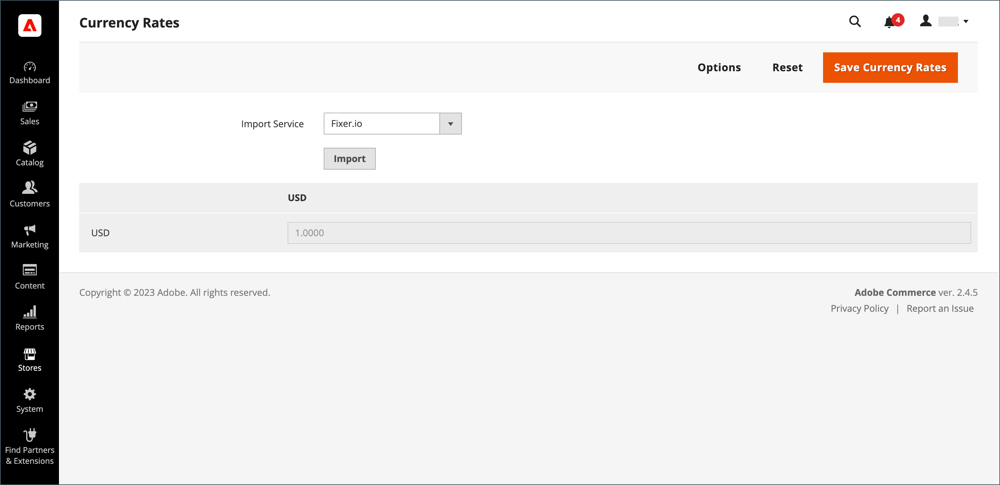

# Actualizar tasas de cambio

Las tasas de cambio se pueden configurar manualmente o importar en la tienda. Para asegurarse de que tu tienda tiene las tarifas más actuales, puedes configurar las tarifas de moneda para que se actualicen automáticamente según lo programado.

Antes de importar las tasas de cambio, complete la [configuración de tipo de cambio](currency-configuration.md) para especificar las divisas que acepta y para establecer la conexión y programación de importación.

{width="600" zoomable="yes"}

## Actualizar una tasa de cambio manualmente

1. En el _Administrador_ barra lateral, vaya a **[!UICONTROL Stores]** > _[!UICONTROL Currency]_>**[!UICONTROL Currency Rates]**.

1. Haga clic en la tasa que desee cambiar e introduzca el nuevo valor para cada moneda admitida.

1. Cuando termine, haga clic en **[!UICONTROL Save Currency Rates]**.

## Importar tipos de cambio

1. En el _Administrador_ barra lateral, vaya a **[!UICONTROL Stores]** > _[!UICONTROL Currency]_>**[!UICONTROL Currency Rates]**.

1. Establecer **[!UICONTROL Import Service]** al proveedor de tipos de cambio de divisa.

   El proveedor predeterminado es `fixer.io (legacy)`.

   >[!IMPORTANT]
   >
   >A partir de la versión 2.4.6 de, la [[!DNL Fixer.io]](https://fixer.io/) El servicio está obsoleto y se ha sustituido por [[!DNL Fixer API] (APILayer)](https://apilayer.com/marketplace/fixer-api) servicio. Se recomienda encarecidamente que utilice una cuenta APILayer en lugar de una obsoleta [!DNL Fixer.io] cuenta.

1. Haga clic **[!UICONTROL Import]**.

   Las tarifas actualizadas aparecen en la _[!UICONTROL Currency Rates]_lista. Si las tasas han cambiado desde la última actualización, la tasa antigua aparece a continuación como referencia.

1. Cuando termine, haga clic en **[!UICONTROL Save Currency Rates]**.

1. Cuando se le pida que actualice la caché, haga clic en **[!UICONTROL Cache Management]** vincular y actualizar la caché no válida.

   {width="600" zoomable="yes"}

## Importar tipos de cambio según lo programado

1. Asegúrese de que [Cron](../systems/cron.md) está habilitado para su tienda.

1. Para especificar las divisas que acepta y establecer la conexión y programación de importación, complete la [Configuración de tipo de cambio](currency-configuration.md).

1. Para comprobar que las tarifas se importan según lo programado, marque la _[!UICONTROL Currency Rates]_lista.

1. Espere el período de tiempo de la configuración de frecuencia establecida para la programación y compruebe las tarifas de nuevo.
