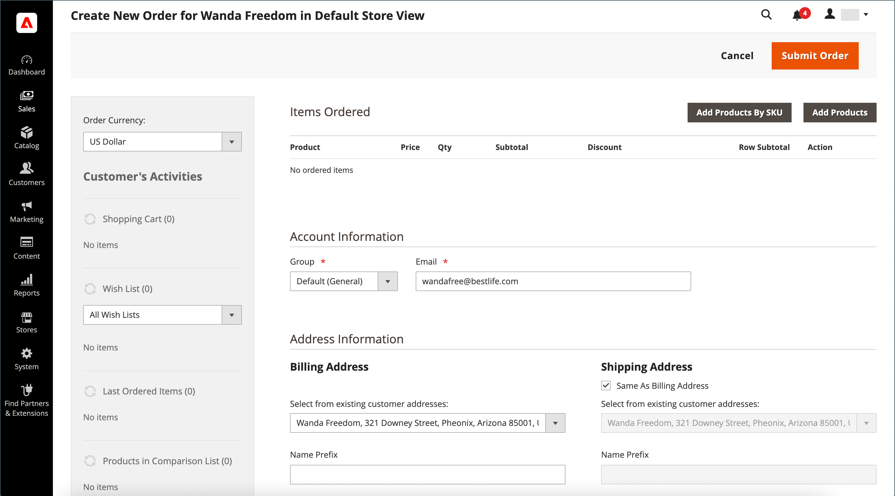

# Creación de un pedido

Para los clientes registrados que necesiten asistencia, puede crear un pedido completo directamente desde el administrador. El formulario _[!UICONTROL Create New Order]_incluye toda la información necesaria para el proceso de cierre de compra normal, con resúmenes de actividad en el panel de cuentas del cliente.

{width="700" zoomable="yes"}

## Paso 1: Crear un pedido

1. En la barra lateral _Admin_, haga clic en **[!UICONTROL Customers]**.

1. Busque al cliente en la cuadrícula.

1. En la columna _Acción_, haga clic en **[!UICONTROL Edit]**.

1. En el encabezado del área de trabajo, haga clic en **[!UICONTROL Create Order]**.

   {width="700" zoomable="yes"}

   También puede crear un pedido en el [espacio de trabajo de pedidos](orders.md#orders-workspace) haciendo clic en **[!UICONTROL Create New Order]**.

## Paso 2: Añadir productos

Si la tienda tiene varias vistas, elija la vista de la tienda en la que se va a realizar el pedido.

### Agregar productos de la barra lateral [!UICONTROL Customer's Activities]

Puede transferir artículos al carro de compras desde la lista de artículos deseados de un cliente o desde cualquier artículo que haya visto, comparado o pedido recientemente.

1. Expanda  una de las siguientes secciones:

   - **[!UICONTROL Wish List]**
   - **[!UICONTROL Last Ordered Items]**
   - **[!UICONTROL Products in Comparison List]**
   - **[!UICONTROL Recently Compared Products]**
   - **[!UICONTROL Recently Viewed Products]**

1. Seleccione la casilla de verificación de cada producto en el panel izquierdo.

1. Desplácese hacia abajo y haga clic en **[!UICONTROL Update Changes]**.

   El elemento aparece en el formulario de pedido.

   {width="600" zoomable="yes"}

### Añadir productos del catálogo

1. Haga clic en **[!UICONTROL Add Products]**.

   {width="600" zoomable="yes"}

1. En la cuadrícula, seleccione la casilla de verificación de cada producto que se agregará al carro de compras e introduzca el **[!UICONTROL Qty]** que se comprará.

   {width="600" zoomable="yes"}

   >[!NOTE]
   >
   >La cuadrícula de selección de productos siempre muestra los precios base regulares de los productos, sin descuentos ni reglas de precio de grupo o carro de compras aplicadas. El precio final del producto solo se calcula cuando el producto se añade a un pedido/carro de compras.

1. Configure las opciones de producto disponibles:

   - Haga clic en **[!UICONTROL Configure]**.

   - Complete las opciones según sea necesario.

   - Haga clic en **[!UICONTROL OK]**.

   - Haga clic en **[!UICONTROL Add Selected Product(s) to Order]** para actualizar el carro de compras.

1. Si hay un producto configurado para [opciones de regalo](../catalog/product-gift-options.md), establezca las opciones según sea necesario.

1. Anular el precio de un artículo si es necesario:

   - Seleccione la casilla de verificación **[!UICONTROL Custom Price]** e introduzca el nuevo precio en el siguiente cuadro.

   - Para actualizar los totales del carro de compras, haga clic en **[!UICONTROL Update Items and Quantities]**.

   {width="600" zoomable="yes"}

1. Complete las siguientes secciones según sea necesario para el pedido:

   - [!UICONTROL Order Currency]
   - [!UICONTROL Apply Coupon Codes / Gift Card Code]
   - [!UICONTROL Payment Method]
   - [!UICONTROL Shipping Method]
   - [!UICONTROL Order Comments]
   - [!UICONTROL [Atributos de pedido personalizados]](../stores-purchase/order-processing.md#custom-order-attributes)

>[!NOTE]
>
>Consulte la [Guía de servicios de pago](https://experienceleague.adobe.com/en/docs/commerce/payment-services/guide-overview) para obtener más información acerca de los métodos de pago que admiten esta funcionalidad cuando se instala y configura la extensión de servicios de pago.

## Paso 3: Enviar el pedido

Haga clic en **[!UICONTROL Submit Order]**.

Se envía una confirmación al cliente, que puede ver los detalles del pedido desde su cuenta.
