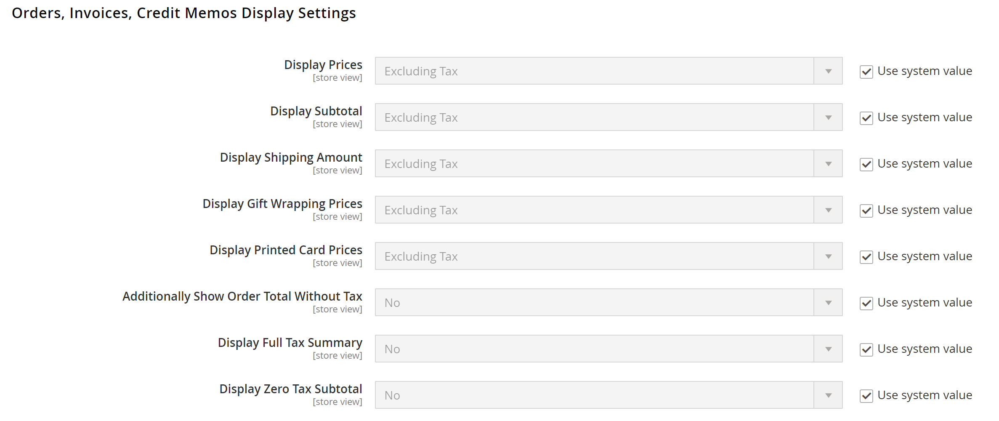

# Configuración de visualización de precios

La configuración de visualización de precios determina si los precios de producto y envío incluyen o excluyen impuestos, o muestran dos versiones del precio: una con y otra sin impuestos.

Si el precio del producto incluye impuestos, el impuesto sólo aparece si hay una regla fiscal que coincida con el origen del impuesto o si una dirección de cliente coincide con la regla fiscal. Los eventos que pueden almacenar en déclencheur una coincidencia incluyen cuándo un cliente crea una cuenta, inicia sesión o genera una estimación de impuestos y envíos a partir del carro de compras.

>[!IMPORTANT]
>
>Mostrar precios que incluyen y excluyen impuestos puede ser confuso para el cliente. Para evitar activar un mensaje de advertencia, consulte las [directrices](international-tax-guidelines.md) de su país y [configuración recomendada](taxes.md#warning-messages) para evitar mensajes de advertencia.

{width="600" zoomable="yes"}

Para obtener una descripción detallada de cada una de estas opciones de configuración, consulte [Opciones de visualización de precios](../configuration-reference/sales/tax.md#price-display-settings) en la _Guía de referencia de configuración_.

## Configuración de la visualización de precios

Cuando finaliza la configuración del cálculo de impuestos, tasas y clases, los impuestos se calculan según esa configuración. Sin embargo, la visualización de impuestos en el catálogo, el carro de compras, los pedidos, las facturas y los abonos también debe configurarse para admitir la experiencia del cliente en la tienda.

Se recomienda mostrar los precios con los impuestos asociados (ya sean impuestos incluidos o ambos) para que los clientes sepan cómo se aplican estos cálculos antes de realizar un pedido.

### Paso 1: Configurar los precios de catálogo y la configuración de visualización

1. En la barra lateral _Admin_, vaya a **[!UICONTROL Stores]** > _[!UICONTROL Settings]_>**[!UICONTROL Configuration]**.

1. En el panel izquierdo, expanda **[!UICONTROL Sales]** y elija **[!UICONTROL Tax]**.

1. Expanda  en la sección **[!UICONTROL Price Display Settings]**.

1. Para **[!UICONTROL Display Product Prices in Catalog]**, elija una de las siguientes opciones:

   - `Excluding Tax`
   - `Including Tax`
   - `Including and Excluding Tax`

   >[!NOTE]
   >
   >Si establece esta opción en `Including Tax`, el impuesto sólo aparece si hay una regla fiscal que coincida con el origen del impuesto o si hay una dirección de cliente que coincida con la regla fiscal. Los eventos que pueden almacenar en déclencheur una coincidencia incluyen la creación de cuentas de cliente, el inicio de sesión o el uso de la herramienta de estimación de impuestos y envíos en el carro de compras.

1. Para **[!UICONTROL Display Shipping Prices]**, elija una de las siguientes opciones:

   - `Excluding Tax`
   - `Including Tax`
   - `Including and Excluding Tax`

Si elige mostrar ambos precios (con y sin impuestos), la tienda tiene un aspecto similar al siguiente:

{width="700" zoomable="yes"}

### Paso 2: Configurar las opciones de visualización del carro de compras

1. Expanda  en la sección **[!UICONTROL Shopping Cart Display Settings]**.

   {width="600" zoomable="yes"}

1. Para **[!UICONTROL Display Prices]**, elija una de las siguientes opciones:

   - `Excluding Tax`
   - `Including Tax`
   - `Including and Excluding Tax`

1. Para **[!UICONTROL Display Subtotal]**, elija una de las siguientes opciones:

   - `Excluding Tax`
   - `Including Tax`
   - `Including and Excluding Tax`

1. Para **[!UICONTROL Display Shipping Amount]**, elija una de las siguientes opciones:

   - `Excluding Tax`
   - `Including Tax`
   - `Including and Excluding Tax`

1.  (solo Adobe Commerce) Para **[!UICONTROL Display Gift Wrapping Prices]**, elija una de las siguientes opciones:

   - `Excluding Tax`
   - `Including Tax`
   - `Including and Excluding Tax`

1.  (solo Adobe Commerce) Para **[!UICONTROL Display Printed Card Prices]**, elija una de las siguientes opciones:

   - `Excluding Tax`
   - `Including Tax`
   - `Including and Excluding Tax`

1. Para cada una de estas opciones restantes, cambie a `Yes` o `No` según sus preferencias:

   - **[!UICONTROL Include Tax in Order Total]**
   - **[!UICONTROL Display Full Tax Summary]**
   - **[!UICONTROL Display Zero Tax Subtotal]**

### Paso 3: Configuración del orden, la factura y la nota de abono

1. Expanda  en la sección **[!UICONTROL Orders, Invoices, Credit Memos Display Settings]**.

   {width="600" zoomable="yes"}

1. Para **[!UICONTROL Display Prices]**, elija una de las siguientes opciones:

   - `Excluding Tax`
   - `Including Tax`
   - `Including and Excluding Tax`

1. Para **[!UICONTROL Display Subtotal]**, elija una de las siguientes opciones:

   - `Excluding Tax`
   - `Including Tax`
   - `Including and Excluding Tax`

1. Para **[!UICONTROL Display Shipping Amount]**, elija una de las siguientes opciones:

   - `Excluding Tax`
   - `Including Tax`
   - `Including and Excluding Tax`

1.  (solo Adobe Commerce) Para **[!UICONTROL Display Gift Wrapping Prices]**, elija una de las siguientes opciones:

   - `Excluding Tax`
   - `Including Tax`
   - `Including and Excluding Tax`

1.  (solo Adobe Commerce) Para **[!UICONTROL Display Printed Card Prices]**, elija una de las siguientes opciones:

   - `Excluding Tax`
   - `Including Tax`
   - `Including and Excluding Tax`

1. Para cada una de estas opciones restantes, cambie a `Yes` o `No` según sus preferencias:

   - **[!UICONTROL Include Tax in Order Total]**
   - **[!UICONTROL Display Full Tax Summary]**
   - **[!UICONTROL Display Zero Tax Subtotal]**

1. Una vez finalizado, haga clic en **[!UICONTROL Save Config]**.
