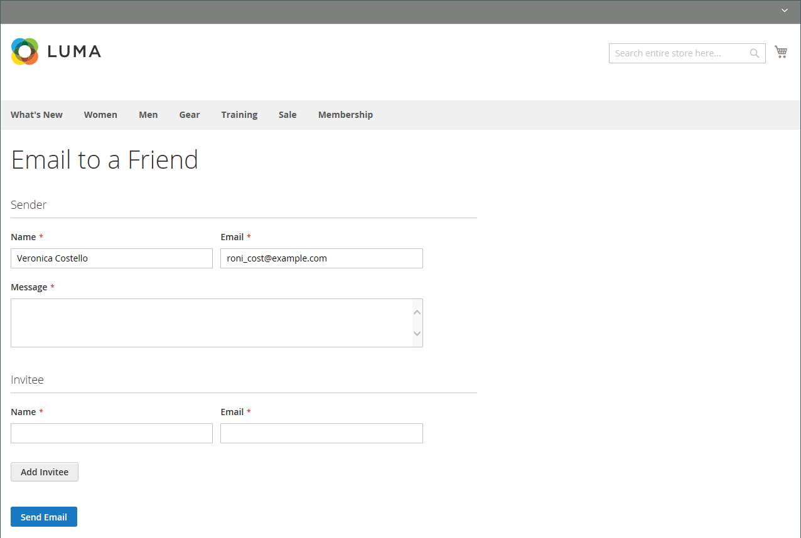

# Enviar un correo electrónico a un amigo

El vínculo Correo electrónico facilita a los clientes compartir vínculos a productos con sus amigos. En la tienda de Luma de demostración, el vínculo Correo electrónico aparece como un icono en forma de sobre. La plantilla de mensaje se puede personalizar para su voz y marca. Para evitar el spam, puede limitar la cantidad de destinatarios para cada correo electrónico y la cantidad de productos que se pueden compartir durante un periodo de una hora.

{width="700" zoomable="yes"}

## Configuración de email-a-friend

1. En la barra lateral _Admin_, vaya a **[!UICONTROL Stores]** > _[!UICONTROL Settings]_>**[!UICONTROL Configuration]**.

1. En el panel izquierdo, expanda **[!UICONTROL Catalog]** y elija **[!UICONTROL Email to a Friend]**.

1. Expanda  en la sección **[!UICONTROL Email Templates]** y establezca las opciones:

   {width="600" zoomable="yes"}

   Para obtener una descripción detallada de cada una de estas opciones de configuración, consulte [Plantillas de correo electrónico](../configuration-reference/catalog/email-to-a-friend.md) en la _Guía de referencia de configuración_.

   Para cambiar la configuración predeterminada de cualquier campo, desactive la casilla de verificación **[!UICONTROL Use system value]** para que el campo se pueda editar.

   - Establezca **[!UICONTROL Enabled]** en `Yes`.

   - Establezca **[!UICONTROL Select Email Template]** en la plantilla que desee usar como base de los mensajes.

   - Si desea requerir que solamente los clientes registrados puedan enviar correo electrónico a sus amigos, establezca **[!UICONTROL Allow for Guests]** en `No`.

   - Para **[!UICONTROL Max Recipients]**, escriba el número máximo de amigos que pueden estar en la lista de distribución de un solo mensaje.

   - Para **[!UICONTROL Max Products Sent in 1 Hour]**, escriba el número máximo de productos que un solo usuario con amigos puede compartir durante un período de una hora.

   - Establezca **[!UICONTROL Limit Sending By]** en uno de los siguientes métodos para identificar al remitente de los correos electrónicos:

     `IP Address` - (Recomendado) Identifica al remitente por la dirección IP del equipo que se utiliza para enviar los correos electrónicos.

     `Cookie (unsafe)` - Identifica al remitente por la cookie del explorador. Este método es menos eficaz porque el remitente puede eliminar la cookie para evitar el límite.

1. Una vez finalizado, haga clic en **[!UICONTROL Save Config]**.

## Enviar correo electrónico a un amigo en la tienda

Cuando se configura esta función, los clientes de tienda siguen estos pasos para compartir información del producto con amigos.

1. En una página del catálogo, el cliente hace clic en el vínculo **[!UICONTROL Email]**.

1. Si la función solo está configurada para usuarios registrados, realice una de las siguientes acciones:

   - Inicia sesión en su cuenta de cliente.
   - Registra una nueva cuenta.

1. Completa **[!UICONTROL Message]** e introduce el destinatario **[!UICONTROL Name]** y **[!UICONTROL Email Address]**.

   Si es necesario, el cliente puede agregar más destinatarios:

   - Clics **[!UICONTROL Add Invitee]**.

   - Escribe **[!UICONTROL Name]** y **[!UICONTROL Email Address]** de la persona adicional.

     Pueden enviar el mensaje a tantas personas adicionales como permita la configuración. Pueden quitar el invitado agregado al hacer clic en el vínculo **[!DNL Remove]**.

1. Cuando esté listo para enviar el mensaje, hace clic en **[!UICONTROL Send Email]**.

   {width="700" zoomable="yes"}
