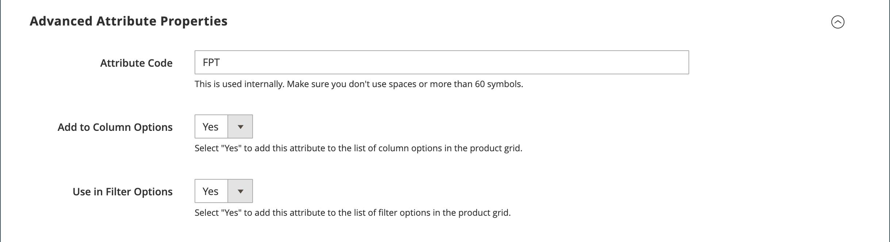
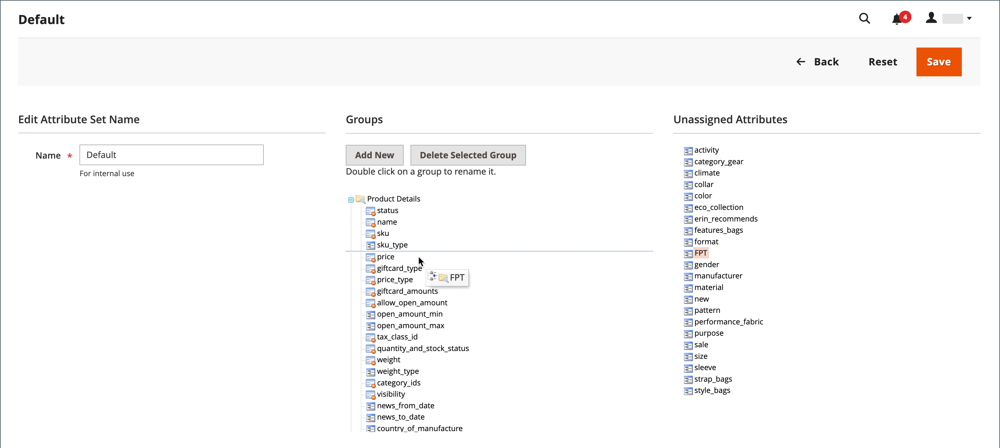
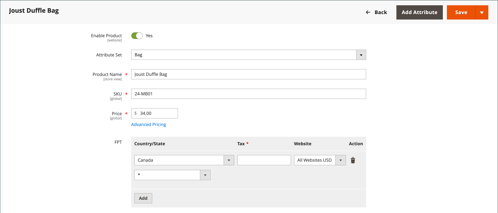

# Impuesto de producto fijo (FPT)

Algunas jurisdicciones fiscales tienen un impuesto fijo que debe añadirse a ciertos tipos de productos. Puede configurar un _impuesto sobre el producto fijo_ (FPT) según sea necesario para los cálculos de impuestos de su tienda. En algunos países, el FPT puede utilizarse para establecer un impuesto sobre residuos de aparatos eléctricos y electrónicos (RAEE). Este impuesto también se conoce como _impuesto ecológico_ o _impuesto ecológico_, y se recopila en ciertos tipos de productos electrónicos para compensar el coste del reciclaje. Es una cantidad fija, en lugar de un porcentaje del precio del producto.

Se aplican impuestos de productos fijos en el nivel de artículo según el producto. En algunas jurisdicciones, este impuesto está sujeto a un cálculo de porcentaje de impuesto adicional. Su jurisdicción fiscal también puede tener reglas sobre cómo el precio del producto se muestra a los clientes, ya sea con o sin impuestos. Asegúrese de comprender las reglas y establecer las opciones de visualización de FTP en consecuencia.

Tenga cuidado al cotizar los precios de FTP por correo electrónico, ya que la diferencia de precio puede afectar a la confianza de los clientes en sus pedidos. Por ejemplo, si muestra los precios de revisión de pedidos sin mostrar el valor de FTP, los clientes que compren artículos con el valor de FTP asociado verán un total que incluye el importe de impuestos del valor de FTP, pero sin un desglose por elementos. La diferencia en el precio puede llevar a algunos clientes a abandonar sus carros de compras porque el total difiere de la cantidad esperada.

## Precios de visualización FPT

| FPT | Configuración de visualización y cálculo | |
|--- |--- |---|
| Sin impuestos | **[!UICONTROL Excluding FPT]** | FTP aparece como una fila separada en el carro de compras, y el valor se utiliza en los cálculos de impuestos correspondientes. |
| | **[!UICONTROL Including FPT]** | El FTP se agrega al precio base de un artículo, pero no se incluye en los cálculos basados en reglas fiscales. |
| | **[!UICONTROL Excluding FPT, FPT Description, Final Price]** | Los precios aparecen sin cantidad o descripción de FPT. FPT no se incluye en los cálculos basados en reglas fiscales. |
| Gravado | **[!UICONTROL Excluding FPT]** | FTP aparece como una fila separada en el carro de compras, y el valor se utiliza en los cálculos de impuestos correspondientes. |
| | **[!UICONTROL Including FPT]** | FPT está incluido en el precio de un artículo y no se requiere ningún cambio en los cálculos de impuestos. |
| | **[!UICONTROL Excluding FPT, FPT Description, Final Price]** | Los precios aparecen sin la cantidad o descripción del FPT. Sin embargo, FPT se incluye en los cálculos basados en reglas fiscales. |

{style="table-layout:auto"}

## Configurar FTP

El impuesto fijo sobre productos (FPT) [tipo de entrada](../catalog/attributes-input-types.md) crea una sección de campos para administrar los impuestos de cada región.

Las siguientes instrucciones muestran cómo configurar un impuesto sobre productos fijo para su tienda, utilizando &quot;impuesto ecológico&quot; como ejemplo. Después de establecer el ámbito del impuesto y los países y estados donde se aplica, y según las opciones que elija, los campos de entrada pueden cambiar según los requisitos locales. Para obtener más información, consulte [Crear atributos del producto](../catalog/attribute-product-create.md).

### Paso 1: Habilitar impuesto de producto fijo

1. En el _Administrador_ barra lateral, vaya a **[!UICONTROL Stores]** > _[!UICONTROL Settings]_>**[!UICONTROL Configuration]**.

1. En el panel izquierdo, expanda **[!UICONTROL Sales]** y elija **[!UICONTROL Tax]**.

1. Expandir  el **[!UICONTROL Fixed Product Taxes]** sección.

1. Establecer **[!UICONTROL Enable FPT]** hasta `Yes`.

1. Para determinar cómo se utilizan los impuestos fijos de productos en los precios de tienda, elija la configuración de FTP para cada una de las siguientes ubicaciones de visualización de precios:

   - **[!UICONTROL Display Prices in Product Lists]**
   - **[!UICONTROL Display Prices on Product View Page]**
   - **[!UICONTROL Display Prices in Sales Modules]**
   - **[!UICONTROL Display Prices in Emails]**

   Opciones (igual para cada una):

   - `Including FPT Only`
   - `Including FPT and FPT description`
   - `Excluding FPT. Including FPT description and final price`
   - `Excluding FPT`

1. Establecer **[!UICONTROL Apply Tax to FPT]** según sea necesario.

1. Establecer **[!UICONTROL Include FPT in Subtotal]** según sea necesario.

   {width="600" zoomable="yes"}

   Para obtener una descripción detallada de cada una de estas opciones de configuración, consulte [Impuestos fijos de productos](../configuration-reference/sales/tax.md#fixed-product-taxes) en el _Guía de referencia de configuración_.

1. Cuando termine, haga clic en **[!UICONTROL Save Config]**.

### Paso 2: Crear un atributo FTP

1. En el _Administrador_ barra lateral, vaya a **[!UICONTROL Stores]** > _[!UICONTROL Attributes]_>**[!UICONTROL Product]**.

1. En la esquina superior derecha, haga clic en **[!UICONTROL Add New Attribute]** y haga lo siguiente:

   - Para **[!UICONTROL Default Label]**, introduzca una etiqueta que identifique el atributo.

   - Establecer **[!UICONTROL Catalog Input for Store Owner]** hasta `Fixed Product Tax`.

   {width="600" zoomable="yes"}

1. Expandir  el **[!UICONTROL Advanced Attribute Properties]** y establezca las opciones de propiedad:

   - **[!UICONTROL Attribute Code]** : introduzca un identificador único en minúsculas, sin espacios ni caracteres especiales. La longitud máxima es de 30 caracteres. Puede dejar el campo vacío al texto del campo Etiqueta predeterminada.

   - **[!UICONTROL Add to Column Options]** - Si desea que el campo FTP aparezca en el [Lista de productos](../catalog/products-list.md), se establece en `Yes`.

   - **[!UICONTROL Use in Filter Options]** - Si desea ser capaz de [filter](../getting-started/admin-workspace.md) productos en la cuadrícula en función del valor del campo FTP, establecer en `Yes`.

   {width="600" zoomable="yes"}

1. (Opcional) En el panel izquierdo, elija **[!UICONTROL Manage Labels]** e introduzca una etiqueta para utilizarla en lugar de la etiqueta predeterminada para cada vista de tienda.

   {width="600" zoomable="yes"}

1. Cuando termine, haga clic en **[!UICONTROL Save Attribute]**.

1. Cuando se le solicite, actualice el [escondrijo](../systems/cache-management.md).

### Paso 3: Agregar el atributo FTP a un conjunto de atributos

1. En el _Administrador_ barra lateral, vaya a **[!UICONTROL Stores]** > _[!UICONTROL Attributes]_>**[!UICONTROL Attribute Set]**.

1. En la lista, haga clic en el conjunto de atributos para abrir el registro en modo de edición.

   {width="600" zoomable="yes"}

1. Arrastre el atributo FTP desde la lista de **[!UICONTROL Unassigned Attributes]** a la derecha de la **[!UICONTROL Groups]** en la columna central.

   Cada carpeta de grupo corresponde a una sección de información del producto. Puede colocar el atributo donde desee que aparezca cuando el producto esté abierto en modo de edición.

   {width="600" zoomable="yes"}

1. Cuando termine, haga clic en **[!UICONTROL Save]**.

1. Repita este paso para cada juego de atributos que deba incluir impuestos de productos fijos.

### Paso 4: Aplicar FPT a productos específicos

1. En el _Administrador_ barra lateral, vaya a **[!UICONTROL Catalog]** > **[!UICONTROL Products]**.

1. Abra el producto que necesita un impuesto sobre un producto fijo en modo de edición.

1. Busque el **[!UICONTROL FPT]** de campos que ha añadido al conjunto de atributos y haga clic en **[!UICONTROL Add Tax]**.

1. Especifique el impuesto aplicable para el producto:

   {width="600" zoomable="yes"}

   - Si la instancia de Commerce tiene varios sitios web, elija el adecuado **[!UICONTROL Website]** y la moneda base. En este ejemplo, el campo se establece de forma predeterminada en `All Websites [USD]`.

   - Establecer **[!UICONTROL Country/State]** a la región donde se aplica el impuesto sobre el producto fijo.

   - Para **[!UICONTROL Tax]**, introduzca el impuesto de producto fijo como importe decimal.

1. Para agregar más impuestos de productos fijos, haga clic en **[!UICONTROL Add Tax]** y repita el proceso.

1. Cuando termine, haga clic en **[!UICONTROL Save]**.
