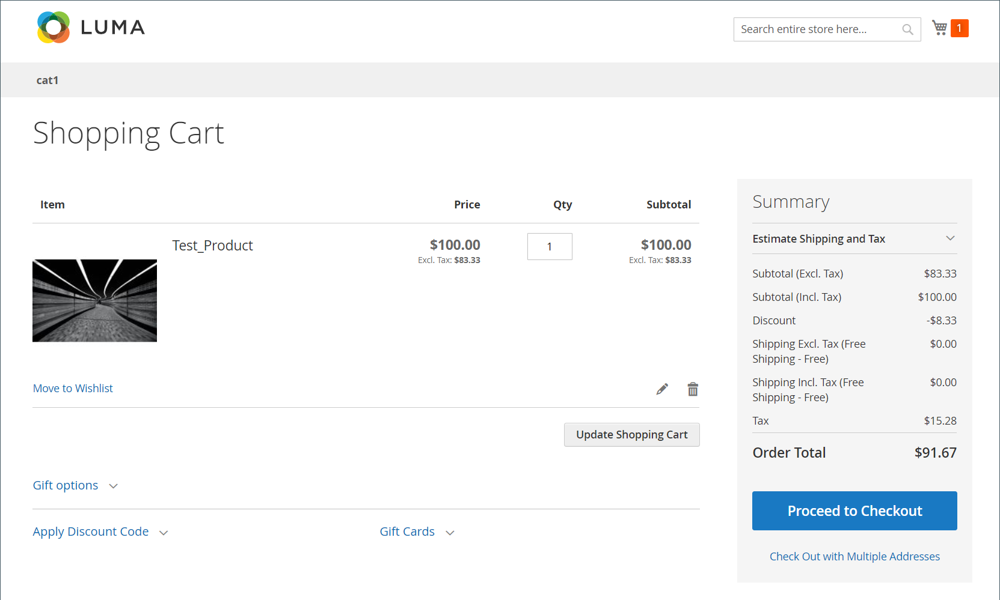

# Cálculo de impuestos ocultos

_Impuesto oculto_ es el importe de IVA que tiene un importe de descuento. Es distinto de cero cuando todas estas condiciones son verdaderas:

- Los precios de catálogo incluyen impuestos
- El tipo de IVA no es cero
- Hay un descuento presente

Cuando hay un descuento con impuestos incorporados, Commerce calcula un _impuesto oculto_ que se vuelve a agregar para calcular el precio con descuento.

`discountedItemPrice = fullPriceWithoutTax - discountAmountOnFullPriceWithoutTax + vatAmountOnDiscountedPrice + hiddenTax`

## Ejemplo

1. Precio total del artículo, con impuestos incluidos: $100
1. IVA al: 20%
1. Descuento del 10% aplicado a los impuestos sin incluir el precio del artículo:

### Resultado esperado no válido

- Precio del artículo después de impuestos sin descuento=100 USD
- Precio del artículo antes de impuestos sin descuento=100/1.2=83.33 USD
- Descuento=83,33 \ *0,1=8,33 USD
- Impuesto=(83.33-8.33) \ *0.2=**15 USD (no válido)**
- Total de pedido sin impuestos=83.33-8.33=**75 USD (no válido)**
- Total de pedido con impuestos incluidos=75+15=**90 USD (no válido)**

### Resultado real válido en el carro

{width="700" zoomable="yes"}

### Cálculos válidos

1. El precio total del artículo sin impuestos es: $100 / 1.2 = **$83.33**

1. El importe de IVA del precio total del artículo es de: 100 $ - 83,33 $ = 16,67 $

   _También se puede calcular como: $100 \ * (1 - 1/1.2)._

1. El descuento del 10% en $83.33 es: **$8.33** (cuando no se descuenta el impuesto)

1. El precio con descuento del artículo con impuestos es: $100 - $8.33 = $91.67

   >[!NOTE]
   >
   >Esta ecuación ilustra la percepción del cliente sobre cómo se aplican los descuentos.

1. El precio con descuento del artículo sin impuestos es: $91.67 / 1.2 = $76.39

1. El importe de IVA del precio con descuento es: $91.67 - $76.39 = **$15.28 (válido)**

   _También se puede calcular como: $91.67 \ * (1 - 1/1.2)._

1. Impuestos ocultos o _Compensación fiscal por descuento_ es la diferencia entre el importe de IVA del precio total y el precio con descuento: $16,67 - $15,28 = **$1,39**

   _Otra forma de verlo: el impuesto oculto es el importe de IVA incluido en el descuento de 8,33 $: 8,33 $ \* (1 - 1/1,2)._

1. Cómo el cliente suele entender el precio con descuento (Total del pedido):

   _Precio total del artículo que incluye impuestos **menos**el importe del descuento: $100 - $8.33 = $91.67_

1. **Cómo calcula Commerce el precio con descuento** (consulta la fórmula anteriormente):

   _$83.33 - $8.33 + 15.28 + 1.39 =**$91.67***_
