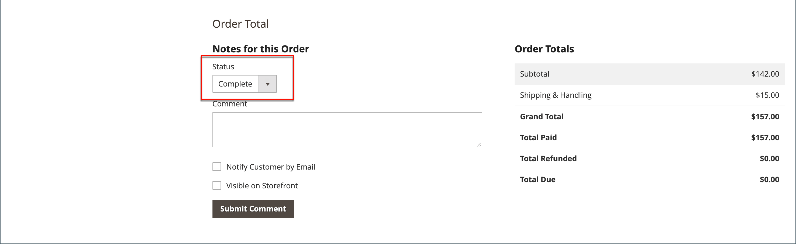

# Facturas

Una factura es un registro del registro de pago de un pedido. Se pueden [crear](#create-an-invoice) varias facturas para un único pedido, y cada una puede incluir tantos o tan pocos de los productos comprados que especifique. También puede crear [facturas de PDF listas para imprimir](#print-invoices) como documentos de ventas para sus clientes.

En la barra lateral de _Administración_, vaya a **[!UICONTROL Sales]** > _Operaciones_ > **Facturas** para abrir la cuadrícula de _Facturas_ y acceder a las facturas creadas.

{width="700" zoomable="yes"}

## Descripciones de columna

| Columna | Descripción |
|--- |--- |
| [!UICONTROL Select] | Seleccione las casillas de verificación para que las comillas estén sujetas a una acción o utilice el control de selección en el encabezado de la columna. Opciones: `Select All` / `Deselect All` |
| [!UICONTROL Invoice] | Identificador numérico único que se asigna cuando el administrador envía una factura. Al ver los detalles de la factura, este número aparece en la parte superior de la página, en lugar del nombre de la oferta. |
| [!UICONTROL Invoice Date] | La fecha y la hora en que el administrador envió la factura por primera vez. |
| [!UICONTROL Order#] | Identificador numérico único que se asigna cuando un comprador realiza un pedido. Al consultar los detalles de la factura, este número aparece como un vínculo en el bloque Información de pedidos y cuentas. |
| [!UICONTROL Order Date] | La fecha y la hora en que el cliente hizo un pedido correctamente. |
| [!UICONTROL Bill-to Name] | El nombre de la persona responsable de pagar el pedido. |
| [!UICONTROL Status] | Indica el estado actual de una factura. El estado solo se puede cambiar por acción del comprador o del vendedor. |
| [!UICONTROL Grand Total (Base)] | El precio total de los productos que se van a comprar. La cantidad total aparece en la moneda base del sitio web y en la moneda de la tienda. |
| [!UICONTROL Grand Total (purchase)] | El total general de productos comprados en el pedido. La cantidad total aparece en la moneda base del sitio web y en la moneda de la tienda. |
| [!UICONTROL Purchased From] | La vista del sitio web, tienda o tienda desde la que se creó la factura. |
| [!UICONTROL Billing Address] | La dirección de facturación del cliente que realizó el pedido. |
| [!UICONTROL Shipping Address] | La dirección a la que se enviará el pedido. |
| [!UICONTROL Customer Name] | El nombre y los apellidos del cliente que recibe la factura. |
| [!UICONTROL Email] | La dirección de correo electrónico del cliente que recibe la factura. |
| [!UICONTROL Customer Group] | Grupo de clientes asignado al cliente que recibe la factura. |
| [!UICONTROL Payment Method] | El método de pago que se utilizará para el pago. |
| [!UICONTROL Shipping Information] | El método que se utilizará para enviar el pedido. |
| [!UICONTROL Subtotal] | El subtotal del pedido, sin envío ni manipulación, y los impuestos. |
| [!UICONTROL Shipping and Handling] | El importe cobrado por el envío y la manipulación. |
| [!UICONTROL Action] | **[!UICONTROL View]** - abre la factura en modo de edición. |

{style="table-layout:auto"}

## Crear una factura

La creación de una factura para un pedido la mueve a un estado en el que no se puede cancelar ni cambiar. Una nueva página de factura tiene un aspecto similar al de un pedido completado, con algunos campos adicionales. Cada actividad relacionada con un pedido se indica en la sección Comentarios de la factura.

Normalmente, los pedidos se facturan y capturan cuando se inicia el proceso de envío. Si el método de pago es un pedido de compra o si la [acción de pago](../configuration-reference/sales/payment-methods.md#payment-actions) está establecida en `Authorize and Capture`, el pedido se factura y el pago se captura durante el cierre de compra. Puede generar una factura con un albarán e imprimir etiquetas de envío desde la cuenta del transportista. Un único pedido se puede dividir en envíos parciales, que se facturan por separado, si es necesario.

Cuando el estado de los nuevos pedidos se establece en `Processing`, la opción _Facturar automáticamente todos los artículos_ está disponible en la configuración. Algunos métodos de pago con tarjeta de crédito completan el paso de facturación como parte del proceso cuando la [acción de pago](../configuration-reference/sales/payment-methods.md#payment-actions) se establece en `Authorize and Capture`. En tal caso, el botón Factura no aparece y el pedido está listo para enviarse.

>[!NOTE]
>
>Las facturas no se crean automáticamente para los pedidos realizados mediante `Gift Card`, `Store Credit`, `Reward Points` u otros métodos de pago sin conexión.

Se debe generar una factura para el pedido antes de poder imprimirla. Para ver o imprimir el PDF, primero descargue e instale un PDF como [Adobe Acrobat Reader][1].

**_Para facturar un pedido:_**

1. En la barra lateral _Admin_, vaya a **[!UICONTROL Sales]** > _[!UICONTROL Operations]_>**[!UICONTROL Orders]**.

1. Busque el pedido de ventas con el estado de `Processing` en la cuadrícula. A continuación, haga lo siguiente:

1. En la columna _Acción_, haga clic en **[!UICONTROL View]**.

1. En el encabezado del pedido de ventas, elija la opción **[!UICONTROL Invoice]**.

   >[!NOTE]
   >
   >La opción _[!UICONTROL Invoice]_no aparece cuando la [acción de pago](../configuration-reference/sales/payment-methods.md#payment-actions) de su [método de pago](../configuration-reference/sales/payment-methods.md) específico está establecida en `Authorize and Capture`, lo que genera automáticamente una factura. Este también es el caso si se realiza el pedido y la acción de pago de su método de pago se establece en `Authorize` y se factura el pedido.

   {width="700" zoomable="yes"}

   La nueva página de factura tiene un aspecto similar al de una página de pedido completada, con campos adicionales que se pueden editar.

1. Si los artículos están listos para enviarse, genere un albarán para el envío al mismo tiempo que crea la factura:

   - En la sección _Información de envío_, haga clic en la casilla de verificación **[!UICONTROL Create Shipment]** para seleccionarla.

     El registro de envío se crea al mismo tiempo que la factura.

   - Incluya un número de seguimiento:

      - Haga clic en **[!UICONTROL Add Tracking Number]**.
      - Escriba la información de seguimiento: _[!UICONTROL Carrier]_,_[!UICONTROL Title]_ y _[!UICONTROL Number]_

     {width="600" zoomable="yes"}

   - Si lo desea, genere una factura parcial:

      - En la sección _Artículos a factura_, actualice la columna **[!UICONTROL Qty to Invoice]** para incluir solo artículos específicos en la factura.
      - A continuación, haga clic en **[!UICONTROL Update Qty's]**.

        {width="600" zoomable="yes"}

1. Si se utilizó un método de pago en línea para el pedido, establezca **[!UICONTROL Amount]** en la opción adecuada.

1. Para notificar a los clientes por correo electrónico cuándo se genera la factura, haga lo siguiente:

   - Seleccione la casilla de verificación **[!UICONTROL Email Copy of Invoice]**.

   - Escriba cualquier **[!UICONTROL Invoice Comments]**. Para incluir los comentarios en el correo electrónico de notificación, marque la casilla **[!UICONTROL Append Comments]**.

1. Una vez finalizado, haga clic en **[!UICONTROL Submit Invoice]** en la parte inferior de la página.

   **_Forma de pago en línea:_**

   {width="600" zoomable="yes"}

   **_Método de pago sin conexión:_**

   {width="600" zoomable="yes"}

   El estado del pedido cambia de `Pending` a `Complete`.

   {width="600" zoomable="yes"}

## Imprimir facturas

Las facturas se pueden imprimir por separado o en lote. Sin embargo, para poder imprimir una factura, primero debe generarse para el pedido. Puede cargar un logotipo de alta resolución para una factura de PDF lista para imprimir e incluir [Id. de pedido](../stores-purchase/sales-documents.md#add-reference-ids) en el encabezado. Para personalizar la plantilla de factura con su logotipo y dirección, consulte [Requisitos para el logotipo de PDF](../stores-purchase/sales-documents.md#image-formats).

>[!NOTE]
>
>Para ver o imprimir el PDF, debe tener un PDF. Puedes descargar [Adobe Reader][1] sin cargo.

### Imprimir una sola factura

1. En la barra lateral _Admin_, vaya a **[!UICONTROL Sales]** > _[!UICONTROL Operations]_>**[!UICONTROL Invoices]**.

1. En la cuadrícula _[!UICONTROL Invoices]_, busque la factura y haga clic en **[!UICONTROL View]**en la columna_ Acción _.

1. En la parte superior de la factura, haga clic en **[!UICONTROL Print]** para generar un PDF.

1. Guarde el PDF generado en un archivo o imprímalo.

### Imprimir varias facturas

1. En la barra lateral _Admin_, vaya a **[!UICONTROL Sales]** > _[!UICONTROL Operations]_>**[!UICONTROL Invoices]**.

1. En la cuadrícula _[!UICONTROL Invoices]_, active la casilla de verificación de cada factura que se va a imprimir.

1. Establezca el control **[!UICONTROL Actions]** en `PDF Invoices`.

   {width="600" zoomable="yes"}

Las facturas se guardan en un único archivo de PDF que se puede enviar a una impresora o guardar.

## Solución de problemas de recursos

Para obtener ayuda para solucionar problemas con las facturas, consulte los siguientes _artículos de la Base de conocimiento de asistencia de Commerce_:

- [No se pueden facturar productos agrupados virtuales y simples](https://experienceleague.adobe.com/docs/commerce-knowledge-base/kb/support-tools/patches/v1-0-9/mdva-30889-magento-patch-can-t-invoice-bundle-products-virtual-and-simple.html)
- [Factura sin información de crédito de tienda](https://experienceleague.adobe.com/docs/commerce-knowledge-base/kb/support-tools/patches/v1-0-8/mdva-31150-magento-patch-invoice-without-store-credit-info.html)
- [El impuesto aparece en la factura con un descuento del 100%](https://experienceleague.adobe.com/docs/commerce-knowledge-base/kb/support-tools/patches/v1-0-22/mdva-35773-tax-appears-on-invoice-with-100-discount.html)
- [Las facturas de pedidos no se envían automáticamente](https://experienceleague.adobe.com/docs/commerce-knowledge-base/kb/support-tools/patches/v1-0-13/mdva-32545-magento-patch-order-invoices-don-t-send-automatically.html)

[1]: https://www.adobe.com/acrobat/pdf-reader.html "Obtener Adobe Reader"
