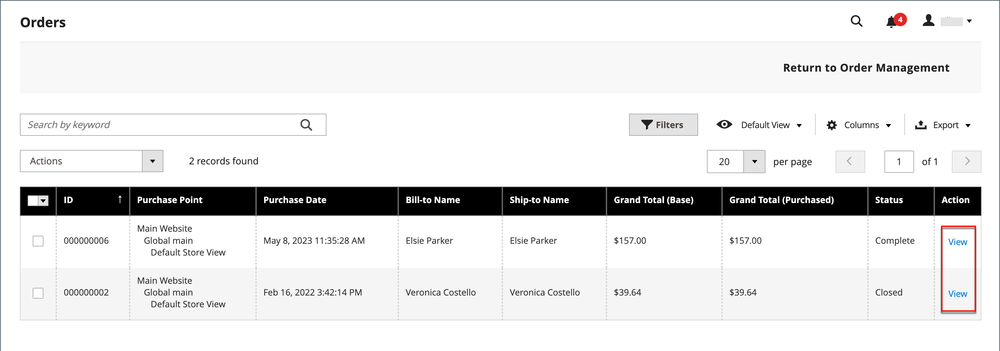

# Archivar pedidos

{{ee-feature}}

El archivado regular de los pedidos mejora el rendimiento y mantiene su espacio de trabajo libre de información innecesaria, para que pueda centrarse en los negocios actuales. Las facturas, los envíos y las notas de abono se pueden archivar automática o manualmente y consultar en cualquier momento.

>[!NOTE]
>
>La opción _[!UICONTROL Archive]_&#x200B;aparece en el menú [[!UICONTROL Sales]](sales-menu.md) solo cuando el archivado está [habilitado](../configuration-reference/sales/sales.md).

## Configuración del archivo de pedidos

El almacén se puede configurar para archivar pedidos, facturas, envíos y notas de abono después de un número determinado de días. Puede mover las solicitudes y sus documentos asociados al archivo o restaurarlos a su estado anterior. Los pedidos archivados no se eliminan y permanecen disponibles desde el administrador. Los datos archivados se pueden exportar a un archivo CSV y abrirse en una hoja de cálculo. Cuando está habilitada, la acción _Archivar_ aparece en la parte superior del área de trabajo.

1. En la barra lateral _Admin_, vaya a **[!UICONTROL Stores]** > _[!UICONTROL Settings]_>**[!UICONTROL Configuration]**.

1. En el panel izquierdo, expanda la sección **[!UICONTROL Sales]** y elija **[!UICONTROL Sales]** debajo.

1. Expanda  en la sección **[!UICONTROL Orders, Invoices, Shipments, Credit Memos Archiving]**.

   {width="600" zoomable="yes"}

1. Establezca **[!UICONTROL Enable Archiving]** en `Yes`.

   >[!NOTE]
   >
   >Si posteriormente decide desactivar el archivado, todos los pedidos archivados se restauran al estado anterior.

1. Establezca **[!UICONTROL Archive Orders Purchased]** en el número de días de espera antes de archivar los pedidos completados.

   De forma predeterminada, los pedidos se archivan 30 días después de la compra.

1. En la lista **[!UICONTROL Order Statuses to be Archived]**, seleccione cada estado de pedido que desee utilizar para identificar los pedidos que desea archivar.

   Para seleccionar varios elementos, mantenga presionada la tecla Ctrl (Windows) o Comando (Mac) mientras hace clic en cada elemento.

1. Haga clic en **[!UICONTROL Save Config]**.

1. Cuando se le solicite, actualice cualquier caché no válida.

## Ver documentos archivados

1. En el menú _[!UICONTROL Sales]_&#x200B;en&#x200B;_[!UICONTROL Archive]_, elija una de las siguientes opciones:

   - **[!UICONTROL Orders]**
   - **[!UICONTROL Invoices]**
   - **[!UICONTROL Shipments]**
   - **[!UICONTROL Credit Memos]**

1. Para ver los detalles, haga clic en cualquier documento archivado de la lista.

## Aplicar una acción a un documento archivado

Seleccione cada documento que será el destino de la acción y elija uno de los **[!UICONTROL Actions]** siguientes:

- `Cancel`
- `Hold`
- `Unhold`
- `Print`
- `Move to Orders Management`

## Archivar documentos manualmente

1. Seleccione el tipo de documento que desea archivar de la siguiente manera:

   - **[!UICONTROL Orders]**
   - **[!UICONTROL Invoices]**
   - **[!UICONTROL Shipments]**
   - **[!UICONTROL Credit Memos]**

1. Seleccione la casilla de verificación de cada elemento que desee archivar.

1. En la esquina superior derecha, establezca **[!UICONTROL Actions]** en `Move to Archive`.

1. Haga clic en **[!UICONTROL Submit]** para archivar los documentos seleccionados.

## Restaurar documentos archivados

1. Elija el tipo de documento que desea restaurar.

1. Seleccione documentos mediante una de las siguientes opciones:

   - Para seleccionar todos los documentos visibles, en la esquina superior izquierda, haga clic en **[!UICONTROL Select Visible]**.

   - Seleccione manualmente la casilla de verificación de cada documento que desee restaurar.

1. En la esquina superior derecha, establezca **[!UICONTROL Action]** en `Move to Orders Management`.

1. Haga clic en **[!UICONTROL Submit]** para restaurar los documentos.

## Exportar documentos archivados

1. Elija el tipo de documento que desea exportar.

1. En el menú superior derecho, establezca **[!UICONTROL Export to:]** en uno de los siguientes valores:

   - `CSV`
   - `Excel`

1. Haga clic en **[!UICONTROL Export]**.

El almacén se puede configurar para archivar pedidos, facturas, envíos y notas de abono después de un número determinado de días. Puede mover las solicitudes y sus documentos asociados al archivo o restaurarlos a su estado anterior. Los pedidos archivados no se eliminan y permanecen disponibles desde el administrador. Los datos archivados se pueden exportar a un archivo CSV y abrirse en una hoja de cálculo. Cuando está habilitado, el comando _[!UICONTROL Archive]_&#x200B;aparece en la parte superior del área de trabajo.

## Archivar pedidos manualmente

1. En la barra lateral _Admin_, vaya a **[!UICONTROL Sales]** > _[!UICONTROL Operations]_>**[!UICONTROL Orders]**.

1. Para seleccionar el orden en la cuadrícula, active la casilla de verificación de la primera columna.

1. Establezca el control **[!UICONTROL Actions]** en `Move to Archive` y busque el mensaje que indica que el pedido se ha archivado.

   {width="700" zoomable="yes"}

>[!TIP]
>
>Para especificar una lista de estados de pedidos que se pueden archivar, consulte [Configurar el archivo de pedidos](#configure-the-order-archive).

## Ver un pedido archivado

1. Abra la vista del archivo mediante uno de los siguientes métodos:

   - En la barra de botones situada encima de la cuadrícula _[!UICONTROL Orders]_, haga clic en **[!UICONTROL Go to Archive]**.

   - En la barra lateral _Admin_, vaya a **[!UICONTROL Sales]** > _[!UICONTROL Archive]_>**[!UICONTROL Orders]**.

   >[!NOTE]
   >
   >Al igual que la página Pedidos, el título de la página de pedidos archivados es _[!UICONTROL Orders]_. La única diferencia notable es la opción de la barra de botones de&#x200B;_[!UICONTROL Return to Orders Management]_. La dirección URL de la página también indica que se encuentra en el archivo de pedidos.

1. En la columna _Acción_, haga clic en **[!UICONTROL View]**.

   {width="600" zoomable="yes"}

## Restaurar un pedido archivado

>[!NOTE]
>
>Un pedido restaurado a partir de un pedido archivado se vuelve a archivar según el número de días configurados en la configuración [!UICONTROL Archive Orders Purchased] (consulte [Configurar el archivo de pedidos](#configure-the-order-archive)). El número de días se calcula en función de la fecha [!UICONTROL Updated At] del pedido, que se cambia cuando el pedido se mueve del archivo.

1. En la barra lateral _Admin_, vaya a **[!UICONTROL Sales]** > _[!UICONTROL Operations]_>**[!UICONTROL Orders]**.

1. En la barra de botones, haga clic en **[!UICONTROL Go to Archive]**.

1. Busque el registro que desea restaurar y haga clic en la casilla de verificación para seleccionarlo.

   {width="600" zoomable="yes"}

1. Establecer el valor del control **[!UICONTROL Actions]** en `Move to Order Management`.

Busque el mensaje de que el pedido archivado se ha eliminado del archivo.

## Exportar pedido archivado

1. En la barra lateral _Admin_, vaya a **[!UICONTROL Sales]** > _[!UICONTROL Operations]_>**[!UICONTROL Orders]**.

1. En el menú de acción, haga clic en **[!UICONTROL Export]** y seleccione el formato que desee.
