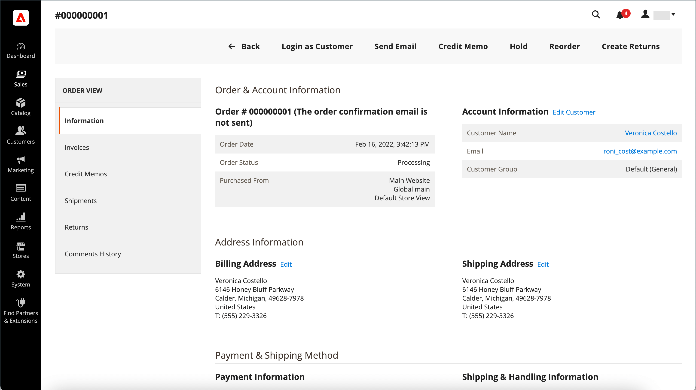

# Flujo de trabajo y procesamiento de pedidos

Cuando un cliente realiza un pedido, se crea un pedido de venta como un registro temporal de la transacción. En la cuadrícula Pedidos, los pedidos de venta tienen inicialmente el estado &quot;Pendiente&quot; y se pueden cancelar en cualquier momento hasta que se procese el pago. Una vez confirmado el pago, el pedido se puede facturar y enviar.

**Paso 1: Realizar pedido**: el proceso de cierre de compra comienza cuando el comprador hace clic en **[!UICONTROL Go to Checkout]** en la página del carro de compras o [vuelve a realizar pedidos](reorders-allow.md) directamente desde su cuenta de cliente.

**Paso 2: Pedido pendiente** - El estado inicial del pedido de ventas es `Pending`. En este estado, el pago no se ha procesado y el pedido se puede editar o cancelar. Este estado se produce cuando el método de pago está configurado para el modo de autorización.

**Paso 3: Recibir pago** - El estado del pedido cambia a `Processing` cuando se recibe o se autoriza el pago. Según la forma de pago, podría recibir una notificación cuando la transacción se autorice o procese. Este estado se produce automáticamente cuando el método de pago se configura para el modo de captura o venta por intención.

**Paso 4: Pedido de factura**: un pedido se suele facturar después de recibir el pago. El método de pago determina qué opciones de facturación son necesarias para el pedido. Una vez generada y enviada la factura, se envía una copia al cliente. Si el método de pago está configurado con la acción de pago `capture` o `intent sale`, se genera automáticamente una factura cuando se autoriza y captura el pago.

>[!NOTE]
>
>Las facturas no se crean automáticamente para los pedidos realizados mediante `Gift Card`, `Store Credit`, `Reward Points` u otros métodos de pago sin conexión.

**Paso 5: reservar un solo envío** - El estado del pedido cambia a `Complete` cuando se completa el detalle del envío, se reserva el envío y se establece el envío. El requisito de envío se cumple con un albarán impreso y una etiqueta de envío o se selecciona _Notificar listo para la recogida_ (método de envío en tienda). El cliente recibe una notificación y se envía el paquete. Si se utilizan números de seguimiento, se puede realizar el seguimiento del envío desde la cuenta del cliente.

>[!NOTE]
>
>Para obtener detalles sobre el estado del pedido y las opciones de configuración del método de pago, consulte [Estado del pedido](order-status.md) y [Pagos](payments.md).

## Ver un pedido

1. En la barra lateral _Admin_, vaya a **[!UICONTROL Sales]** > _[!UICONTROL Operations]_>**[!UICONTROL Orders]**.

1. Busque el orden en la cuadrícula.

1. En la columna _[!UICONTROL Action]_, haga clic en **[!UICONTROL View]**.

1. Comprobar estado del pedido:

   - Un pedido `Pending` se puede modificar, retener, cancelar o facturar y enviar.

   - Un pedido de `Processing` ya no se puede editar ni cancelar de manera sustancial, pero sí editar la dirección de facturación y envío.

   - Se puede reordenar un pedido de `Completed`.

El correo electrónico del cliente se puede editar en cualquier momento del flujo de trabajo del pedido editando el cliente. El correo electrónico no se puede editar si un invitado ha realizado el pedido.

El panel izquierdo de una solicitud abierta proporciona acceso a diferentes tipos de información relacionados con la solicitud.

{width="700" zoomable="yes"}

## Procesamiento de un pedido

Cuando un cliente realiza un pedido, se crea un pedido de venta como un registro temporal de la transacción. El pedido de ventas tiene un estado de `Pending` hasta que se reciba el pago. Mientras se encuentre en estado `Pending`, los pedidos se pueden editar o cancelar hasta el momento en que se reciba el pago y se genere una factura. Una manera fácil de pensarlo es que los pedidos se convierten en facturas y las facturas se convierten en envíos. La cuadrícula Pedidos enumera todas las solicitudes, independientemente de su ubicación en el flujo de trabajo. Para obtener información sobre cómo ayudar a los clientes con un pedido, consulte [Actualizar un pedido](order-update.md).

{width="700" zoomable="yes"}

Para abrir un pedido de `Pending`, haga clic en **[!UICONTROL Edit]** en la esquina superior derecha.

>[!NOTE]
>
>Los pedidos solo se pueden editar cuando se encuentran en estado `Pending`. El botón Editar no está visible para pedidos en un estado diferente o para pedidos basados en una [oferta negociada](../b2b/quotes.md).

{width="600" zoomable="yes"}

Revise las siguientes secciones del pedido de venta, utilizando las descripciones de los campos como referencia.

### Descripciones de vistas de pedidos

| Ficha | Descripción |
|--- |--- |
| [!UICONTROL Information] | Muestra información detallada sobre el pedido y la cuenta, incluidas las direcciones de facturación y envío, los métodos de pago y envío, los artículos, los pedidos, los totales y las notas. |
| [!UICONTROL Invoices] | Muestra todas las facturas asociadas con el pedido. |
| [!UICONTROL Credit Memos] | Muestra todas las notas de abono asociadas al pedido. |
| [!UICONTROL Shipments] | Muestra todos los registros de envío asociados al pedido. |
| [!UICONTROL Comments History] | Enumera todas las notas relacionadas con el pedido. |

{style="table-layout:auto"}

>[!NOTE]
>
>Un usuario administrador debe tener **[!UICONTROL Sales / Archive]** [permisos](../systems/permissions-user-roles.md) para el ámbito de su rol con el fin de ver las fichas de pedido _Facturas_, _Notas de crédito_ y _Envíos_.

### Barra de botones

| Botón | Descripción |
|--- |--- |
| **[!UICONTROL Back]** | Vuelve a la página Pedidos sin guardar los cambios. |
| **[!UICONTROL Cancel]** | Cancela el pedido de venta. |
| **[!UICONTROL Send Email]** | Envía un correo electrónico sobre el pedido al cliente. |
| **[!UICONTROL Hold]** / **[!UICONTROL Unhold]** | Cambia el estado del pedido de ventas a `On Hold`. Para liberar la retención en el pedido de ventas, elija **[!UICONTROL Unhold]**. |
| **[!UICONTROL Invoice]** | Crea una factura a partir del pedido de venta convirtiendo el pedido en una factura. |
| **[!UICONTROL Ship]** | Crea un registro de envío para el pedido. |
| **[!UICONTROL Notify Order is Ready for Pickup]** | Solo aparece cuando un pedido se realiza como envío en tienda. Notifica al cliente que el pedido está listo para recoger. |
| **[!UICONTROL Reorder]** | Crea un pedido de ventas basado en el pedido actual. |
| **[!UICONTROL Edit]** | Abre un pedido pendiente en modo de edición. El botón Editar no está visible para pedidos con un estado de `Processing` o pedidos basados en ofertas negociadas. |

{style="table-layout:auto"}

### Cancelar un pedido

Puede [cancelar](order-update.md) pedidos que aún no se han facturado. Se debe emitir un [abono](credit-memos.md) si un cliente desea cancelar un pedido después de facturarlo (se captura el pago).

Si un pedido es `Pending` o `Processing` y el pago no se ha capturado o no se ha capturado por completo, puede [anular el pedido](#void-an-order) en lugar de cancelarlo.

Para restaurar un pedido cancelado, haga clic en el botón **[!UICONTROL Reorder]** y se creará un nuevo pedido con el estado `Pending`.

>[!NOTE]
>
>La cancelación de un pedido también produce un vacío, pero la anulación de un pedido no déclencheur una cancelación.

### Anular un pedido

Solo los pedidos de ventas que no se facturan, tienen un estado de `Processing` y una configuración de [integración de pagos de `Authorize`](../configuration-reference/sales/payment-methods.md#payment-actions), pueden [anularse](order-update.md#void-a-processing-order). Una vez anulada una solicitud, puede cancelarla.

### [!UICONTROL Order and Account Information]

{width="600" zoomable="yes"}

#### Información del pedido

| Campo | Descripción |
|--- |--- |
| [!UICONTROL Order Number] | El número de pedido aparece en la parte superior del pedido de ventas, seguido de una nota que indica si se envió el correo electrónico de confirmación. |
| [!UICONTROL Order Date] | La fecha y la hora en que se realizó el pedido. |
| [!UICONTROL Purchased From] | Indica el sitio web, la tienda y la vista de la tienda donde se realizó el pedido. |
| [!UICONTROL Placed from IP] | Indica la dirección IP del equipo desde el que se realizó el pedido. |
| [!UICONTROL Order Placed from Quote] |  (disponible con Adobe Commerce B2B) indica el [presupuesto](../b2b/quotes.md) a partir del cual se generó el pedido, si corresponde. El nombre de la oferta está vinculado a la oferta. |

{style="table-layout:auto"}

#### Información de cuenta

| Campo | Descripción |
|--- |--- |
| [!UICONTROL Customer Name] | El nombre del cliente o comprador que realizó el pedido. El nombre del cliente está vinculado al perfil del cliente. |
| [!UICONTROL Email] | La dirección de correo electrónico del cliente o comprador. La dirección de correo electrónico está vinculada para abrir un nuevo mensaje. |
| [!UICONTROL Customer Group] | El nombre del grupo de clientes o del catálogo compartido al que está asignado el cliente. |
| [!UICONTROL Company Name] |  (disponible con Adobe Commerce B2B) El nombre de la compañía con la que está asociado el comprador y en cuyo nombre se realiza el pedido. El nombre de la compañía está enlazado al [perfil de compañía](../b2b/account-companies.md). |

{style="table-layout:auto"}

### [!UICONTROL Address Information]

{width="600" zoomable="yes"}

| Campo | Descripción |
|--- |--- |
| [!UICONTROL Billing Address] | El nombre del cliente o comprador que hizo el pedido, seguido de la dirección de facturación, el número de teléfono y [IVA](vat.md), si corresponde. El número de teléfono está vinculado al marcado automático en un dispositivo móvil. |
| [!UICONTROL Shipping Address] | El nombre de la persona a cuya atención debe enviarse el pedido, seguido de la dirección de envío y el número de teléfono. El número de teléfono está vinculado al marcado automático en un dispositivo móvil. |

{style="table-layout:auto"}

### [!UICONTROL Payment & Shipping Method]

{width="600" zoomable="yes"}

| Campo | Descripción |
|--- |--- |
| [!UICONTROL Payment Information] | El método de pago que se va a utilizar para el pedido y el número de pedido de compra, si corresponde, seguido de la divisa utilizada para realizar el pedido. Si el pedido se carga al crédito de la compañía mediante [Pago a cuenta](../b2b/enable-basic-features.md#configure-payment-on-account), se indica la cantidad cargada a la cuenta. |
| [!UICONTROL Shipping & Handling Information] | El método de envío que se va a utilizar y cualquier tarifa de manipulación que sea aplicable. |

{style="table-layout:auto"}

### Atributos de pedido personalizados

[!BADGE Solo SaaS]{type=Positive url="https://experienceleague.adobe.com/es/docs/commerce/user-guides/product-solutions" tooltip="Solo se aplica a proyectos de Adobe Commerce as a Cloud Service (infraestructura de SaaS administrada por Adobe)."}

Los atributos de pedido personalizados le permiten asociar información adicional específica para sus necesidades comerciales con el pedido.

{width="600" zoomable="yes"}

En la sección **[!UICONTROL Custom Order Attributes]**, se muestran todos los atributos de pedidos personalizados y sus valores actuales.

Para crear un nuevo atributo de pedido personalizado, escriba **[!UICONTROL Attribute Code]** y **[!UICONTROL Value]**

Para crear atributos de pedido personalizados adicionales, haga clic en **[!UICONTROL Add Attribute]**.

Para quitar un atributo de pedido personalizado, haga clic en el icono **[!UICONTROL X]**.

>[!NOTE]
>
>Los atributos de pedidos personalizados solo se pueden editar cuando el pedido está en estado `Pending`. Para pedidos en otros estados, puede ver los valores de atributo, pero no puede modificarlos.

### Revisar artículos pedidos

{width="600" zoomable="yes"}

En la sección **[!UICONTROL Order Total]**, haga lo siguiente:

1. Escriba un(a) **[!UICONTROL Comment]** para incluirlo en el pedido.

1. Si desea enviar el comentario por correo electrónico al cliente, active la casilla de verificación **[!UICONTROL Notify Customer by Email]**.

1. Si desea que el comentario esté visible en la cuenta de cliente, active la casilla de verificación **[!UICONTROL Visible on Storefront]**.

   {width="600" zoomable="yes"}

1. Si está listo para facturar el pedido, haga clic en **[!UICONTROL Invoice]** y siga las instrucciones para [crear una factura](invoices.md#create-an-invoice).

#### [!UICONTROL Items Ordered]

| Campo | Descripción |
|--- |--- |
| [!UICONTROL Product] | El nombre del producto, SKU y opciones, si corresponde. |
| [!UICONTROL Item Status] | Indica el estado del elemento. Valor: `Ordered` |
| [!UICONTROL Original Price] | El precio de catálogo original del artículo antes de los descuentos. |
| [!UICONTROL Price] | El precio de compra del artículo. Este valor refleja cualquier descuento aplicado al artículo desde el catálogo compartido, si corresponde. |
| [!UICONTROL Qty] | La cantidad pedida. |
| [!UICONTROL Subtotal] | El subtotal es el precio de compra multiplicado por la cantidad. |
| [!UICONTROL Tax Amount] | El importe del impuesto que se aplica al artículo como valor decimal. |
| [!UICONTROL Tax Percent] | Porcentaje de impuestos aplicados a este artículo como porcentaje. |
| [!UICONTROL Discount Amount] | El descuento que se aplica a este artículo. El valor de descuento es cero si el pedido se basa en una oferta. |
| [!UICONTROL Row Total] | El total del artículo de línea, incluidos los impuestos aplicables que vencen en el nivel de producto, menos los descuentos. |

{style="table-layout:auto"}

#### [!UICONTROL Notes for this Order]

| Campo | Descripción |
|--- |--- |
| [!UICONTROL Status] | Muestra el estado del pedido de venta. |
| [!UICONTROL Comment] | Cuadro de texto que se utiliza para escribir un comentario para el cliente que acompaña al pedido.  **[!UICONTROL Notify Customer by Email]**: seleccione la casilla de verificación si desea enviar el comentario al cliente como un correo electrónico independiente. **[!UICONTROL Visible on Storefront]**: seleccione la casilla de verificación si desea que el comentario sea visible desde la cuenta del cliente.  **[!UICONTROL Update]**- Agrega el comentario y envía un correo electrónico, si corresponde. |

{style="table-layout:auto"}

#### [!UICONTROL Order Totals]

| Campo | Descripción |
|--- |--- |
| [!UICONTROL Shipping & Handling] | El importe cobrado por los gastos de envío y manipulación. |
| [!UICONTROL Tax] | El importe del impuesto aplicado al pedido, si corresponde. |
| [!UICONTROL Grand Total] | El total del pedido. |
| [!UICONTROL Total Paid] | El importe total pagado para el pedido, si corresponde. |
| [!UICONTROL Total Refunded] | El importe total reembolsado del pedido, si corresponde. |
| [!UICONTROL Total Due] | El importe total que vence. |
| [!UICONTROL Store Credit] |  (solo Adobe Commerce) La cantidad de crédito de tienda disponible que se aplica al pedido, si corresponde. |
| [!UICONTROL Catalog Total Price] |  (disponible con Adobe Commerce B2B) El precio total de los artículos de la oferta sin impuestos, según los precios del catálogo compartido o estándar que se use como base de la oferta. Si la divisa de visualización de la tienda difiere de la moneda base, el valor aparecerá en ambas divisas y la tienda se mostrará entre corchetes. |
| [!UICONTROL Negotiated Discount] |  (disponible con Adobe Commerce B2B) El descuento resultante de un presupuesto negociado entre el comprador y el vendedor. Si la divisa de visualización de la tienda difiere de la moneda base, el valor aparecerá en ambas divisas y la tienda se mostrará entre corchetes. |
| [!UICONTROL Subtotal] |  (disponible con Adobe Commerce B2B) El precio total del catálogo menos el descuento negociado. |

{style="table-layout:auto"}

## Demostración del procesamiento de pedidos

Vea este vídeo y obtenga más información sobre el procesamiento y el estado de los pedidos:

>[!VIDEO](https://video.tv.adobe.com/v/3410796/?quality=12&learn=on&captions=spa)
