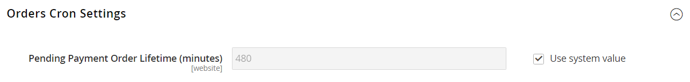

# Operaciones de pedido programado

Use [Cron](../systems/cron.md) trabajos para programar las siguientes tareas de procesamiento de pedidos:

{width="700" zoomable="yes"}

## Establecer duración de orden de pago pendiente

La duración de los pedidos con pagos pendientes está determinada por la configuración de _Configuración de pedidos Cron_. El valor predeterminado es 480 minutos, es decir, ocho horas.

1. En la barra lateral _Admin_, vaya a **[!UICONTROL Stores]** > _[!UICONTROL Settings]_>**[!UICONTROL Configuration]**.

1. En el panel izquierdo, expanda la sección **[!UICONTROL Sales]** y elija **[!UICONTROL Sales]** debajo.

1. Expanda  en la sección **[!UICONTROL Orders Cron Settings]**.

   {width="600" zoomable="yes"}

1. Para **[!UICONTROL Pending Payment Order Lifetime (minutes)]**, ingrese el número de minutos antes de que caduque un pago pendiente.

1. Haga clic en **[!UICONTROL Save Config]**.

## Habilitar las actualizaciones y reindexaciones programadas de la cuadrícula

La configuración de Configuración de cuadrícula programa las actualizaciones de las siguientes cuadrículas de administración de pedidos y vuelve a indexar los datos según lo programado por [Cron](../systems/cron.md):

- [Pedidos](orders.md#orders-workspace)
- [Facturas](invoices.md)
- [Envíos](shipments.md)
- [Notas de abono](credit-memos.md)

Al programar estas tareas, puede evitar los bloqueos que se producen cuando se guardan los datos y reducir el tiempo de procesamiento. Cuando está habilitado, las actualizaciones solo se realizan durante el trabajo cron programado. Para obtener los mejores resultados, Cron debe configurarse para ejecutarse una vez cada minuto.

**_Para habilitar las actualizaciones y la reindexación:_**

[!BADGE Solo PaaS]{type=Informative url="https://experienceleague.adobe.com/en/docs/commerce/user-guides/product-solutions" tooltip="Se aplica solo a proyectos de Adobe Commerce en la nube (infraestructura PaaS administrada por Adobe) y a proyectos locales."} Cuando [el modo de producción](https://experienceleague.adobe.com/docs/commerce-operations/configuration-guide/setup/application-modes.html#production-mode) (el modo predeterminado usado en Adobe Commerce en la infraestructura en la nube) esté habilitado, ejecute el siguiente comando:

`bin/magento config:set dev/grid/async_indexing 1`

Cuando el [modo predeterminado](https://experienceleague.adobe.com/docs/commerce-operations/configuration-guide/setup/application-modes.html#default-mode) esté habilitado, complete los siguientes pasos:

1. En la barra lateral _Admin_, vaya a **[!UICONTROL Stores]** > _[!UICONTROL Settings]_>**[!UICONTROL Configuration]**.

1. En el panel izquierdo, expanda la sección **[!UICONTROL Advanced]** y elija **[!UICONTROL Developer]**.

1. Expanda  en la sección **[!UICONTROL Grid Settings]**.

1. Establezca **[!UICONTROL Asynchronous Indexing]** en `Enable`.

   {width="600" zoomable="yes"}

1. Haga clic en **[!UICONTROL Save Config]**.
