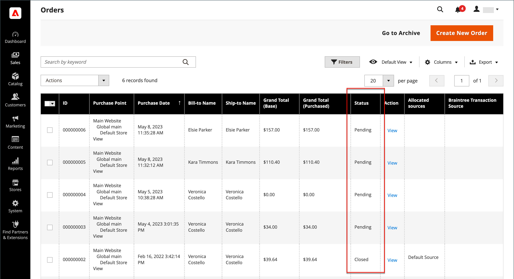
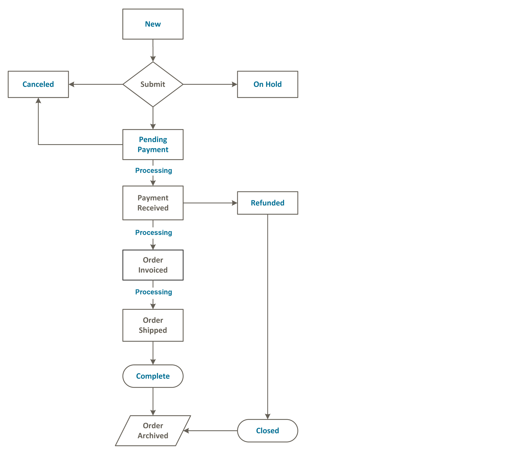

# Estado del pedido

Todos los pedidos tienen un estado de pedido asociado a una fase del procesamiento de pedidos [workflow](order-processing.md). El estado de cada pedido se muestra en la _Estado_ de la columna _Pedidos_ rejilla. Su tienda tiene un conjunto de estados de pedidos predefinidos y configuraciones de estado de pedidos. El estado del pedido describe la posición de un pedido en el flujo de trabajo.

{width="700" zoomable="yes"}

>[!TIP]
>
>Un pedido parcialmente reembolsado permanece en `Processing` estado hasta **_todo_** se envían los artículos pedidos (incluidos los artículos reembolsados). El estado del pedido no cambia a `Complete` cuando un solo artículo de pedido aún no se ha enviado.

## Flujo de trabajo Estado de pedidos

## Estado predefinido

| Estado del pedido | Código de estado |  |
|--- |--- |--- |
| Procesamiento | `processing` | Cuando el estado de los nuevos pedidos se establece en &quot;Procesando&quot;, la variable _Facturar automáticamente todos los artículos_ está disponible en la configuración de. Las facturas no se crean automáticamente para los pedidos realizados mediante tarjeta de regalo, crédito de tienda, puntos de recompensa u otros métodos de pago sin conexión. |
| Sospecha de fraude | `fraud` | A veces, los pedidos pagados a través de PayPal u otra puerta de pago se marcan como _Sospecha de fraude_. Este estado significa que el pedido no tiene factura emitida y que el correo electrónico de confirmación tampoco se envía. |
| Pendiente de pago | `pending_payment` | Este estado se utiliza si se crea el pedido y se utiliza PayPal o una forma de pago similar. Significa que el cliente fue dirigido al sitio web de la pasarela de pago, pero aún no se ha recibido información de devolución. Este estado cambia cuando el cliente paga. |
| Revisión de pago | `payment_review` | Este estado aparece cuando se activa la revisión de pagos de PayPal. |
| Pendiente | `pending` | Este estado indica que no se han enviado facturas ni envíos. |
| En espera | `holded` | Este estado solo se puede asignar manualmente. Puedes poner cualquier orden en espera. |
| Abrir | `STATE_OPEN` | Este estado significa que un pedido o una nota de abono siguen abiertos y pueden requerir más acciones. |
| Completar | `complete` | Este estado significa que el pedido se crea, se paga y se envía al cliente. |
| Cerrado | `closed` | Este estado indica que a un pedido se le asignó una nota de abono y que el cliente ha recibido un reembolso. |
| Cancelado | `canceled` | Este estado se asigna manualmente en el Administrador o, en el caso de algunas puertas de enlace de pago, cuando el cliente no paga en el plazo especificado. |
| Reversión cancelada de PayPal | `paypay_canceled_reversal` | Este estado significa que PayPal ha cancelado la reversión. |
| PayPal pendiente | `pending_paypal` | Este estado significa que el pedido se recibió en PayPal, pero el pago aún no se ha procesado. |
| PayPal revertido | `paypal_reversed` | Este estado significa que PayPal ha revertido la transacción. |

{style="table-layout:auto"}

## Estado de pedido personalizado

Además de la configuración preestablecida de estado de pedidos, puede crear su propia configuración de estado de pedidos personalizada, asignarla a estados de pedidos y establecer un estado de pedidos predeterminado para los estados de pedidos. El estado del pedido indica la posición del pedido dentro del flujo de trabajo de procesamiento del pedido y el estado del pedido define el estado del pedido. Por ejemplo, puede que necesite un estado de pedido personalizado como `packaging"`, `backordered`o un estado que sea específico para sus necesidades. Puede crear un nombre descriptivo para el estado personalizado y asignarlo al estado de pedido asociado en el flujo de trabajo.

>[!NOTE]
>
>En el flujo de trabajo de pedidos solo se utilizan los valores de estado de pedidos personalizados predeterminados. Los valores de estado personalizados que no están configurados como predeterminados solo se pueden utilizar en la sección de comentarios del pedido.

{width="700" zoomable="yes"}

### Creación de un estado de pedido personalizado

1. En el _Administrador_ barra lateral, vaya a **[!UICONTROL Stores]** > _[!UICONTROL Settings]_>**[!UICONTROL Order Status]**.

1. En la esquina superior derecha, haga clic en **[!UICONTROL Create New Status]**.

   {width="600" zoomable="yes"}

1. Actualice el _[!UICONTROL Order Status Information]_sección:

   - Introduzca una **[!UICONTROL Status Code]** para consulta interna. El primer carácter debe ser una letra (a-z) y el resto puede ser cualquier combinación de letras y números (0-9). Utilice el carácter de guion bajo en lugar de un espacio.

   - Para **[!UICONTROL Status Label]**, introduzca una etiqueta que identifique la configuración de estado tanto en la administración como en la tienda.

1. En el _[!UICONTROL Store View Specific Labels]_, introduzca las etiquetas necesarias para las distintas vistas de la tienda.

1. Haga clic **[!UICONTROL Save Status]**.

### Asignación de un estado de pedido a un estado

1. En el _Estado del pedido_ página, haga clic en **[!UICONTROL Assign Status to State]**.

   {width="600" zoomable="yes"}

1. Actualice el **[!UICONTROL Assignment Information]** , haga lo siguiente:

   - Elija la **[!UICONTROL Order Status]** que desee asignar. Se muestran por etiqueta de estado.

   - Establecer **[!UICONTROL Order State]** al lugar del flujo de trabajo al que pertenece el estado del pedido.

     >[!NOTE]
     >
     >**_[!UICONTROL Order State]_** La lista incluye los estados de pedidos asignados predeterminados. Por ejemplo, la variable `Pending` se muestra el estado de pedido predeterminado en lugar del `New` valor de estado del pedido.

   - Para que este estado sea el predeterminado para el estado del pedido, seleccione la opción **[!UICONTROL Use Order Status as Default]** casilla de verificación

     >[!NOTE]
     >
     >En el flujo de trabajo de pedidos solo se utilizan los estados de pedidos predeterminados. Los estados no predeterminados solo se pueden establecer en la variable **[!UICONTROL Order Comments]** de la sección Administración.

   - Para que este estado sea visible desde la tienda, seleccione la **[!UICONTROL Visible On Storefront]** casilla de verificación

   {width="600" zoomable="yes"}

1. Haga clic **[!UICONTROL Save Status Assignment]**.

### Editar un estado de pedido existente

1. En el _[!UICONTROL Order Status]_, abra el registro de estado en modo de edición.

1. Actualice la configuración de estado según sea necesario.

1. Haga clic **[!UICONTROL Save Status]**.

### Eliminación de un estado de pedido de un estado asignado

>[!NOTE]
>
>No se puede quitar la asignación de un estado a una configuración de estado si el estado está en uso.

1. En el _[!UICONTROL Order Status]_cuadrícula, busque el registro de estado del pedido que se va a desasignar.

1. En el _[!UICONTROL Action]_en el extremo derecho de la fila, haga clic en la columna **[!UICONTROL Unassign]**vínculo.

   Aparece un mensaje en la parte superior del espacio de trabajo que indica que se ha anulado la asignación del estado del pedido. Aunque la etiqueta de estado del pedido sigue apareciendo en la lista, ya no está asignada a ningún estado. No se puede eliminar la configuración de estado del pedido.

>[!NOTE]
>
>Si el estado de pedido predeterminado es sin asignar del estado de pedido, _**otro**_ el estado del pedido es _**establecer automáticamente**_ como valor predeterminado para este estado de pedido.

## Notificación

Los clientes pueden realizar un seguimiento del estado de sus pedidos mediante [Fuente RSS](../merchandising-promotions/social-rss.md) si la fuente RSS de pedidos está habilitada en la configuración. Cuando se habilita, aparece un vínculo a la fuente RSS en cada pedido.

### Activar notificación de estado del pedido

1. En el _Administrador_ barra lateral, vaya a **[!UICONTROL Stores]** > _[!UICONTROL Settings]_>**[!UICONTROL Configuration]**.

1. En el panel izquierdo, expanda **[!UICONTROL Catalog]** y elija **[!UICONTROL RSS Feeds]** debajo.

1. Expandir  el **[!UICONTROL Order]** sección.

1. Establecer **[!UICONTROL Customer Order Status Notification]** hasta `Enable`.

   {width="600" zoomable="yes"}

1. Cuando termine, haga clic en **[!UICONTROL Save Config]**.

### Configurar nuevas notificaciones de correo electrónico de pedidos

1. En el _Administrador_ barra lateral, vaya a **[!UICONTROL Stores]** > _[!UICONTROL Settings]_>**[!UICONTROL Configuration]**.

1. En el panel izquierdo, expanda **[!UICONTROL Sales]** y elija **[!UICONTROL Sales Emails]** debajo.

1. Expandir  el **[!UICONTROL Order]** sección.

   {width="600" zoomable="yes"}

1. Establecer **[!UICONTROL New Order Confirmation Email Sender]** a uno de los siguientes:

   - `General Contact`
   - `Sales Representative`
   - `Customer Support`
   - `Custom Email 1`
   - `Custom Email 2`

1. Elija las plantillas que desea utilizar para cada tipo de cliente:

   - **[!UICONTROL New Order Confirmation Template]** : elija una plantilla para utilizarla con los clientes que tengan una cuenta de tienda registrada.
   - **[!UICONTROL New Order Confirmation Template for Guest]** : elija una plantilla para utilizarla con los clientes invitados que no tengan una cuenta de tienda registrada.

1. Para notificar el nuevo pedido a otra persona (por ejemplo, un administrador de empresa), escriba la dirección de correo electrónico a **[!UICONTROL Send Order Email Copy To]**.

   Puede añadir varias direcciones de correo electrónico si se necesita más de un destinatario.

1. Configure las variables **[!UICONTROL Send Order Email Copy Method]** a uno de los siguientes:

   - `Bcc` : Solo se envía un correo electrónico sobre el nuevo pedido al cliente y al destinatario adicional, pero el cliente no ve que el correo electrónico que recibió también se envió al destinatario adicional.
   - `Separate Email` : se envían dos correos electrónicos independientes: uno al destinatario y otro al cliente.

1. Cuando termine, haga clic en **[!UICONTROL Save Config]**.
