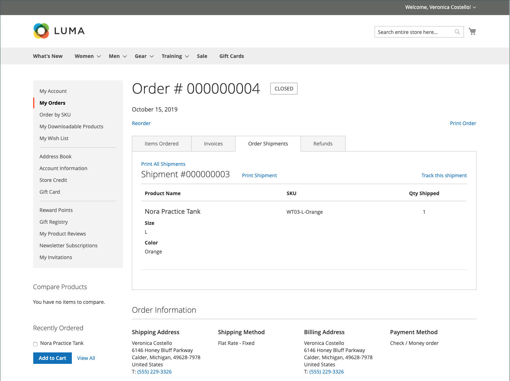

# Administración de pedidos de tienda

Los clientes tienen acceso a todos sus pedidos desde su cuenta. Los pedidos se pueden ver, filtrar, rastrear y volver a enviar como nuevos pedidos. Según el estado del pedido, los clientes pueden imprimir sus pedidos, facturas, envíos y registros de devolución.

## Filtrar pedidos

{{b2b-feature}}

Su inicial _[!UICONTROL My Orders]_los resultados también contienen pedidos coincidentes de usuarios subordinados de todos los sitios web de la instancia de commerce. Un cliente asociado a una cuenta de compañía puede filtrar la lista de pedidos para buscar rápidamente registros en los resultados. Para mostrar las opciones de filtro, el cliente hace clic en **[!UICONTROL Filter]**y clics **[!UICONTROL Close]**para ocultar los filtros.

{width="700" zoomable="yes"}

| Filtrar | Descripción |
| ------ | ----------- |
| [!UICONTROL SKU or Product Name] | Introduce un SKU o un nombre de producto. |
| [!UICONTROL Order Number] | Puede ser un número de pedido completo o parcial. |
| [!UICONTROL Order Status] | Elige un valor del menú desplegable para filtrar por estado. |
| [!UICONTROL Invoice Number] | Introduce un número de factura completo o parcial. |
| [!UICONTROL Order Date] | Establece uno o ambos campos de fecha para filtrar por fecha de pedido. |
| [!UICONTROL Created by] | Filtra los pedidos de la compañía por el creador del pedido. |
| [!UICONTROL Order Total] | Establece los valores mínimo, máximo o ambos para filtrar por total de pedido. |

## Ver un pedido

Un cliente encuentra el pedido en la lista y hace clic en **[!UICONTROL View Order]**. Desde el orden abierto, pueden realizar cualquiera de las siguientes acciones:

{width="700" zoomable="yes"}

### Ver productos pedidos recientemente

El **[!UICONTROL Recent Orders]** se muestra en la barra lateral y en la **[!UICONTROL My Account]** para clientes que iniciaron sesión después de realizar un pedido. Muestra cinco productos de la última compra.

El cliente puede leer los productos en el carro seleccionando los productos y haciendo clic en **[!UICONTROL Add to Cart]**. También pueden ver el último pedido haciendo clic en **[!UICONTROL View all]**, que redirige a _[!UICONTROL My Account]_y la **[!UICONTROL Recent Orders]**Bloque.

### Imprimir pedido

1. El cliente hace clic en **[!UICONTROL Print Order]**.

1. Sigue las instrucciones del cuadro de diálogo Imprimir para completar la impresión.

### Imprimir facturas

1. En el **[!UICONTROL Invoices]** , el cliente hace clic en una de las siguientes opciones:

   - **[!UICONTROL Print All Invoices]**

   - **[!UICONTROL Print Invoice]**

   {width="700" zoomable="yes"}

1. Utiliza el diálogo Imprimir para completar la impresión.

### Imprimir envíos

1. En el **[!UICONTROL Order Shipments]** , el cliente hace clic en una de las siguientes opciones:

   - **[!UICONTROL Print All Shipments]**

   - **[!UICONTROL Print Shipment]**

   {width="700" zoomable="yes"}

1. Utiliza el diálogo Imprimir para completar la impresión.

### Seguimiento de un envío

1. En el **[!UICONTROL Order Shipments]** pestaña, haga clic en **[!UICONTROL Track this Shipment]**.

   Cualquier información de seguimiento disponible aparece en una ventana emergente.

1. Cuando esté listo, el cliente hace clic en **[!UICONTROL Close Window]**.

### Imprimir reembolsos

1. En el **Reembolsos** , el cliente hace clic en una de las siguientes opciones:

   - **Imprimir todos los reembolsos**

   - **Reembolso por impresión**

   {width="700" zoomable="yes"}

1. Utiliza el diálogo Imprimir para completar la impresión.

Los repedidos están disponibles para los clientes cuando la variable [_Permitir reordenar_](reorders-allow.md) La opción de configuración está activada.

Un cliente puede iniciar la funcionalidad de reordenar para un pedido específico desde dos páginas:

- Página Mis pedidos
- Página Vista de pedidos

## Reordenamientos

El _[!UICONTROL Reorder]_El vínculo se muestra en la lista con pedidos cerca de_[!UICONTROL View]_ vínculo.

{width="700" zoomable="yes"}

**Caso 1.** Todos los productos del pedido están disponibles para reordenar

Se redirige al cliente al carro de compras y se agregan todos los productos al carro de compras.

**Caso 2.** Algunos/todos los productos del pedido no están disponibles para reordenar

>[!NOTE]
>
>Es posible realizar un nuevo pedido `Not Visible Individually` productos.

El _[!UICONTROL Reorder]_El vínculo no aparece en_[!UICONTROL My Orders]_ y _[!UICONTROL View Order]_páginas.

{width="700" zoomable="yes"}

>[!TIP]
>
>Si el carro no está vacío y el cliente hace clic en **[!UICONTROL Reorder]** (desde el [!UICONTROL My Orders] o [!UICONTROL Order View] ), los productos existentes permanecen en el carro de compras con los productos de repedido agregados.
