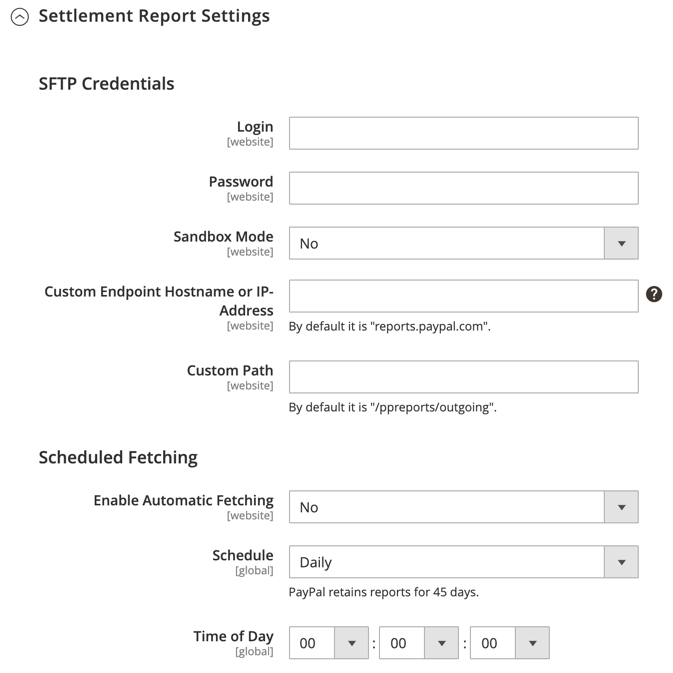

# Pago y envío con PayPal Express

PayPal Express Checkout ayuda a aumentar las ventas al ofrecer a tus clientes la posibilidad de pagar con tarjeta de crédito o desde la seguridad de sus cuentas personales de PayPal. Durante el proceso de pago y envío, se redirige al cliente al sitio seguro de PayPal para que complete la información de pago. A continuación, el cliente se devuelve a su tienda para completar el resto del proceso de pago. Al elegir Pago y envío exprés, se agrega el conocido botón PayPal a tu tienda, que se ha informado que aumenta las ventas.

>[!IMPORTANT]
>
>**Requisitos de PSD2:**  
>A partir del 14 de septiembre de 2019, los bancos europeos podrían rechazar los pagos que no cumplan los requisitos de [PSD2](../getting-started/compliance-payment-services-directive.md). No es necesario realizar ninguna acción para que PayPal Express Checkout cumpla con PSD2 porque PayPal gestiona todos los requisitos.

Los clientes con cuentas PayPal actuales pueden realizar una compra en un solo paso haciendo clic en el botón _[!UICONTROL Check out with PayPal]_. El Pago y envío exprés puede utilizarse como solución independiente o con una de las soluciones todo en uno de PayPal. Si ya aceptas tarjetas de crédito en línea, puedes ofrecer el Pago Exprés como una opción extra para atraer nuevos clientes que prefieran pagar con PayPal.

>[!NOTE]
>
>PayPal cuenta con soporte obsoleto para la venta de artículos digitales a través del proceso de pago y envío de PayPal Express y recomienda que uses [PayPal Payments Standard](paypal-payments-standard.md) u otra pasarela de pago de PayPal para procesar cualquier pedido que incluya [productos virtuales](../catalog/product-create-virtual.md).

## Requisitos

- Comerciante: [Cuenta PayPal de empresa][1]
- Cliente: [Cuenta personal de PayPal][2]

## Flujo de trabajo de cierre rápido

A diferencia de otras formas de pago, PayPal Express Checkout permite al cliente realizar el check out al principio del flujo de trabajo de checkout habitual desde la página del producto, el mini cart y el carrito de compra.

1. **El cliente hace un pedido** - El cliente hace clic o pulsa el botón _[!UICONTROL Check out with PayPal]_.
1. **Se redirige al cliente al sitio de PayPal** - Se redirige al cliente al sitio de PayPal para completar la transacción.
1. **El cliente inicia sesión en su cuenta PayPal**. El cliente debe iniciar sesión en su cuenta PayPal para completar la transacción. El sistema de pago utiliza la información de facturación y envío de su cuenta PayPal.
1. **El cliente vuelve a la página de cierre de compra**. Se redirige al cliente a la página de cierre de compra de su tienda para que revise el pedido.
1. **El cliente hace un pedido**: el cliente hace el pedido y la información del pedido se envía a PayPal.
1. **PayPal cancela la transacción** - PayPal recibe el pedido y cancela la transacción.

>[!NOTE]
>
>PayPal Express Checkout no admite pedidos con direcciones múltiples.

## Cierre de compra en contexto

El proceso de pago y envío en contexto _de PayPal_ facilita más que nunca el pago en línea. Los clientes nunca pierden de vista su tienda durante este pago simplificado sin problemas con un clic o dos. La desprotección en contexto funciona igual de bien en equipos Mac y PC, y ofrece una experiencia coherente en equipos de escritorio, tabletas y dispositivos móviles. Para obtener más información, consulte [Cierre de compra en contexto en el cierre de compra rápido][5].

{width="700" zoomable="yes"}

[_Demostración de pago y envío en contexto de PayPal_][6]

Al configurar su tienda para [!DNL PayPal Express Checkout], puede habilitar esta opción.

## Configurar tu cuenta PayPal

Antes de configurar el Pago y envío de PayPal Express en el Administrador de Commerce, debes configurar tu cuenta de comerciante en el sitio web de PayPal.

1. Inicia sesión en tu cuenta PayPal Advanced en [manager.paypal.com][3].

1. Vaya a **[!UICONTROL Service Settings]** > **[!UICONTROL Hosted Checkout Pages]** > **[!UICONTROL Set Up]** y realice la siguiente configuración:

   - **[!UICONTROL AVS]**: `No`
   - **[!UICONTROL CSC]**: `No`
   - **[!UICONTROL Enable Secure Token]**: `Yes`

1. Haga clic en **[!UICONTROL Save Changes]**.

1. Configurar otro usuario (recomendado por PayPal):

   - Vaya a [manager.paypal.com][3] e inicie sesión en su cuenta.

   - Para configurar otro usuario, siga las instrucciones.

   - Haga clic en **[!UICONTROL Update]**.

## Configuración del proceso de pago y envío de PayPal Express en Commerce

Puede tener dos soluciones de PayPal activas al mismo tiempo: Pago y envío exprés de PayPal, además de una solución todo en uno. Si activa una solución diferente, la utilizada anteriormente se desactiva automáticamente.

>[!NOTE]
>
>Haga clic en **[!UICONTROL Save Config]** en cualquier momento para guardar el progreso.

### Paso 1: Inicio de la configuración

1. En la barra lateral _Admin_, vaya a **[!UICONTROL Stores]** > _[!UICONTROL Settings]_>**[!UICONTROL Configuration]**.

1. En el panel izquierdo, expanda **[!UICONTROL Sales]** y elija **[!UICONTROL Payment Methods]**.

1. Si la instalación tiene varios sitios web, tiendas o vistas, establezca **[!UICONTROL Store View]** en la vista de la tienda en la que desee aplicar esta configuración.

1. En la sección _[!UICONTROL Merchant Location]_, seleccione **[!UICONTROL Merchant Country]**&#x200B;donde se encuentra su empresa.

   Esta configuración determina la selección de soluciones de PayPal que aparecen en la configuración.

   {width="600" zoomable="yes"}

1. En _[!UICONTROL Recommended Solutions]_, haga clic en **[!UICONTROL Configure]**&#x200B;para **[!UICONTROL PayPal Express Checkout]**.

   {width="600"}

### Paso 2: Activar y conectar tu cuenta PayPal

1. Si es necesario, expanda  en la sección **[!UICONTROL Required PayPal Settings]**.

   {width="600" zoomable="yes"}

1. Conecte su cuenta para pruebas o producción:

   - Para probar (desarrollo), haz clic en **[!UICONTROL Sandbox Credentials]** e introduce tus credenciales de [PayPal sandbox][7].
   - Para el modo de producción, haga clic en **[!UICONTROL Connect with PayPal]** e introduzca sus credenciales de cuenta de producción.

   Cuando valide la conexión, puede continuar.

1. Establezca **[!UICONTROL Enable this Solution]** en `Yes`.

1. Para habilitar [Pago y envío en contexto con PayPal](#in-context-checkout):

   - Establezca **[!UICONTROL Enable In-Context Checkout Experience]** en `Yes`.

   - Escribe tu PayPal **[!UICONTROL Merchant Account ID]**.

     El identificador de tu cuenta de comerciante se encuentra en el perfil de tu cuenta comercial de PayPal.

>[!NOTE]
>
>El [crédito de PayPal](paypal.md#paypal-credit-and-pay-later) está habilitado de forma predeterminada para esta opción de pago.

### Paso 3: Completa la configuración de PayPal necesaria

1. Si es necesario, expanda  en la sección **[!UICONTROL Express Checkout]**.

   {width="600" zoomable="yes"}

1. (Opcional) Escriba **[!UICONTROL Email Associated with PayPal Merchant Account]**.

   >[!IMPORTANT]
   >
   >Las direcciones de correo electrónico distinguen entre mayúsculas y minúsculas. Para recibir el pago, la dirección de correo electrónico que introduzcas debe coincidir con la especificada en tu cuenta comercial de PayPal.

   Si no tiene una cuenta PayPal, haga clic en **[!UICONTROL Start accepting payments via PayPal]**.

1. Establezca **[!UICONTROL API Authentication Methods]** en una de las siguientes opciones:

   - `API Signature`: este método de autenticación de PayPal es el más fácil de implementar y se basa en tu nombre de usuario, contraseña y una cadena única de caracteres y números que identifican tu cuenta. Las credenciales de la firma API no caducan.
   - `API Certificate`: este método de autenticación de PayPal es más seguro y se basa en el nombre de usuario, la contraseña y un certificado descargable. Las credenciales de la API caducan al cabo de tres años y deben renovarse.

   Si es necesario, complete lo siguiente:

   - **[!UICONTROL API Username]**
   - **[!UICONTROL API Password]**
   - **[!UICONTROL API Signature]**

1. Si está usando credenciales de su cuenta de zona protegida, establezca **[!UICONTROL Sandbox Mode]** en `Yes`.

   Al probar la configuración en una zona protegida, usa solo [números de tarjeta de crédito][4] recomendados por PayPal. Cuando esté listo para ir a producción, vuelva a la configuración y establezca el modo de espacio aislado en `No` y conéctese a su cuenta de producción de PayPal.

1. Si su sistema utiliza un servidor proxy para establecer la conexión entre Commerce y el sistema de pago de PayPal, establezca **[!UICONTROL API Uses Proxy]** en `Yes` y complete lo siguiente:

   - **[!UICONTROL Proxy Host]**
   - **[!UICONTROL Proxy Port]**

Al final de esta secuencia de pasos, se completa la configuración de PayPal necesaria. Puede continuar con la Configuración básica y avanzada o hacer clic en **[!UICONTROL Save Config]** y volver más tarde para ajustar la configuración

### Paso 4: Configurar el crédito de PayPal publicitario / Anunciar PayPal PayAfter (opcional)

A partir de la versión 2.4.3, PayPal PayAfter es compatible con las implementaciones que incluyen PayPal. Esta función permite a los compradores pagar un pedido en cuotas quincenales en lugar de pagar el importe completo en el momento de la compra. La experiencia de crédito de PayPal está en desuso.

Establezca **[!UICONTROL Enable PayPal PayLater Experience]** en una de las siguientes opciones:

- `Yes` - Para configurar Anunciar PayPal PayAfter
- `No` - Para configurar el crédito de PayPal publicitario

>[!NOTE]
>
>La configuración **[!UICONTROL Enable PayPal PayLater Experience]** no deshabilita la característica [!DNL PayPal PayLater] y no quita los botones **_[!UICONTROL PayPal PayLater]_** de la tienda. Para deshabilitar los botones **_[!UICONTROL PayPal PayLater]_** y **_[!UICONTROL PayPal Credit]_** de la tienda, debe seleccionar el valor `PayPal Credit` para la configuración **[!UICONTROL Disable Funding Options]** ([!UICONTROL Advanced Settings] en [!UICONTROL Frontend Experience Settings]).

#### Anunciar crédito de PayPal

1. Expanda  en la sección **[!UICONTROL Advertise PayPal Credit]**.

1. Para obtener la información de su cuenta, haga clic en **[!UICONTROL Get Publisher ID from PayPal]** y siga las instrucciones.

1. Escriba su **[!UICONTROL Publisher ID]**.

   {width="600" zoomable="yes"}

1. Expanda  en la sección **[!UICONTROL Home Page]**.

1. Para colocar un banner en la página, establezca **[!UICONTROL Display]** en `Yes`.

1. Establezca **[!UICONTROL Position]** en una de las siguientes opciones:

   - `Header (center)`
   - `Sidebar (right)`

1. Establezca **[!UICONTROL Size]** en una de las siguientes opciones:

   - `190 x 100`
   - `234 x 60`
   - `300 x 50`
   - `468 x 60`
   - `728 x 90`
   - `800 x 66`

   {width="600" zoomable="yes"}

1. Expanda  las secciones restantes y repita los pasos anteriores:

   - [!UICONTROL Catalog Category Page]
   - [!UICONTROL Catalog Product Page]
   - [!UICONTROL Checkout Cart Page]

#### Anunciar PayPal PayAfter

1. Expanda  en la sección **[!UICONTROL Advertise PayPal PayLater]**.

1. Establezca **[!UICONTROL Enable PayPal PayLater]** en `Yes`.

1. Expanda  en la sección **[!UICONTROL Home Page]**.

1. Para colocar un banner en la página, establezca **[!UICONTROL Display]** en `Yes`.

1. Establezca **[!UICONTROL Position]** en una de las siguientes opciones:

   - `Header (center)`
   - `Sidebar`

1. Establezca **[!UICONTROL Style Layout]** en una de las siguientes opciones:

   - `Text`
   - `Flex`

1. Solo para [!UICONTROL Style Layout] **[!UICONTROL Text]**, establezca **[!UICONTROL Logo Type]** en uno de los siguientes:

   - `Primary`
   - `Alternative`
   - `Inline`
   - `None`

1. Solo para [!UICONTROL Style Layout] **[!UICONTROL Text]**, establezca **[!UICONTROL Logo Position]** en uno de los siguientes:

   - `Left`
   - `Right`
   - `Top`

1. Solo para [!UICONTROL Style Layout] **[!UICONTROL Text]**, establezca **[!UICONTROL Text Color]** en uno de los siguientes:

   - `Black`
   - `White`
   - `Monochrome`
   - `Grayscale`

1. Solo para [!UICONTROL Style Layout] **[!UICONTROL Text]**, establezca **[!UICONTROL Text Size]** en uno de los siguientes:

   - `10px`
   - `11px`
   - `12px`
   - `13px`
   - `14px`
   - `15px`
   - `16px`

1. Solo para [!UICONTROL Style Layout] **[!UICONTROL Flex]**, establezca **[!UICONTROL Ratio]** en uno de los siguientes:

   - `1x1`
   - `1x4`
   - `8x1`
   - `20x1`

1. Solo para [!UICONTROL Style Layout] **[!UICONTROL Flex]**, establezca **[!UICONTROL Color]** en uno de los siguientes:

   - `Blue`
   - `Black`
   - `White`
   - `White No Border`
   - `Gray`
   - `Monochrome`
   - `Grayscale`

   {width="600" zoomable="yes"}

1. Expanda  las secciones restantes y repita los pasos anteriores:

   - [!UICONTROL Catalog Product Page]
   - [!UICONTROL Checkout Cart Page]
   - [!UICONTROL Checkout Payment Step]
   - [!UICONTROL Catalog Category Page]

### Paso 5: completar la configuración básica

1. Expanda  en la sección **[!UICONTROL Basic Settings - PayPal Express Checkout]**.

   {width="600" zoomable="yes"}

1. Para **[!UICONTROL Title]**, escribe un título que identifique este método de pago durante el cierre de compra.

   Se recomienda usar el título _PayPal_ para todas las vistas de la tienda.

1. Si ofrece varias formas de pago, ingrese un número para **[!UICONTROL Sort Order]** a fin de determinar la secuencia en que se mostrará el proceso de pago y envío de PayPal Express cuando aparezca junto con las otras formas de pago.

   Este número es relativo a las otras formas de pago. (`0` = primero, `1` = segundo, `2` = tercero, etc.)

1. Establezca **[!UICONTROL Payment Action]** en una de las siguientes opciones:

   - `Authorization` - Aprueba la compra y suspende los fondos. La cantidad no se retira hasta que el comerciante _la capture_.
   - `Sale`: el importe de la compra se autoriza y se retira inmediatamente de la cuenta del cliente.
   - `Order`: el importe del pedido no se registra ni se autoriza en el saldo del cliente, la cuenta bancaria o la tarjeta de crédito en PayPal. La acción de pago del pedido representa un acuerdo entre el sistema de pago de PayPal y el comerciante. Permite al comerciante capturar uno o más importes hasta el total pedido desde la cuenta de comprador del cliente, durante un periodo de hasta 29 días. Una vez ordenados los fondos, el comerciante puede capturarlos en cualquier momento durante el siguiente período de 29 días. La captura del importe del pedido solo se puede realizar desde el administrador de Commerce creando una o más facturas.

1. Para mostrar el botón _[!UICONTROL Check out with PayPal]_&#x200B;en la página de productos, establezca **[!UICONTROL Display on Product Details Page]**&#x200B;en `Yes`.

1. Si la acción de pago está establecida en `Order`, complete lo siguiente

   - **[!UICONTROL Authorization Honor Period (days)]**: determina durante cuánto tiempo la autorización principal sigue siendo válida. El valor debe ser igual al valor correspondiente de su cuenta comercial de PayPal. El valor predeterminado en su cuenta comercial de PayPal es `3`. Para aumentar este número, debes ponerte en contacto con PayPal. La autorización deja de ser válida a las 23:49 (hora del Pacífico, EE. UU.) del último día.

   - **[!UICONTROL Order Valid Period (days)]**: determina durante cuánto tiempo sigue siendo válido el pedido. Cuando el pedido deja de ser válido, ya no puede crear facturas para él. Especifique un valor igual al valor Período de validez del pedido en su cuenta comercial de PayPal. El valor predeterminado en su cuenta comercial de PayPal es `29`. Para cambiar este número, debes ponerte en contacto con PayPal.

   - **[!UICONTROL Number of Child Authorizations]**: especifica el número máximo de autorizaciones para un único pedido, lo que determina el número máximo de facturas parciales en línea que puede crear para un pedido. Este valor debe ser igual a la configuración correspondiente de tu cuenta de PayPal. El número predeterminado de autorizaciones para niños en tu cuenta PayPal es `1`. Para aumentar este número, debes ponerte en contacto con PayPal.

### Paso 6: Completar la configuración avanzada

1. Expanda  en la sección **[!UICONTROL Advanced Settings]**.

   {width="600" zoomable="yes"}

1. Establezca **[!UICONTROL Display on Shopping Cart]** en `Yes`.

1. Establezca **[!UICONTROL Payment Applicable From]** en una de las siguientes opciones:

   - `All Allowed Countries`: los clientes de todos los países especificados en la configuración de la tienda pueden utilizar este método de pago.
   - `Specific Countries` - Después de elegir esta opción, aparece la lista _[!UICONTROL Payment from Specific Countries]_. Para seleccionar varios países, mantenga presionada la tecla Ctrl (PC) o la tecla Comando (Mac) y haga clic en cada elemento.

1. Para escribir comunicaciones con el sistema de pago en el archivo de registro, establezca **[!UICONTROL Debug Mode]** en `Yes`.

   El archivo de registro de Pagos avanzados de PayPal es `_payflow_advanced.log`.

   >[!NOTE]
   >
   >De acuerdo con las normas de seguridad de datos PCI, la información de la tarjeta de crédito no se registra en el archivo de registro.

1. Para habilitar la comprobación de la autenticidad del host, establezca **[!UICONTROL Enable SSL Verification]** en `Yes`.

1. Para mostrar un resumen completo del pedido del cliente por artículo de línea del sitio de PayPal, establezca **[!UICONTROL Transfer Cart Line Items]** en `Yes`.

1. Para incluir hasta diez opciones de envío en el resumen, establezca **[!UICONTROL Transfer Shipping Options]** en `Yes`. (Esta opción sólo aparece si los elementos de línea están configurados para transferir.)

1. Para determinar el tipo de imagen utilizada para el botón de aceptación de PayPal, establezca **[!UICONTROL Shortcut Buttons Flavor]** en una de las siguientes opciones:

   - `Dynamic` - (Recomendado) Muestra una imagen que se puede cambiar dinámicamente desde el servidor PayPal.
   - `Static` - Muestra una imagen específica que no se puede cambiar dinámicamente.

1. Para permitir que los clientes sin cuentas de PayPal puedan realizar una compra con este método, establezca **[!UICONTROL Enable PayPal Guest Checkout]** en `Yes`.

1. Establezca **[!UICONTROL Require Customer's Billing Address]** en una de las siguientes opciones:

   - `Yes` - Requiere la dirección de facturación del cliente para todas las compras.
   - `No` - No requiere la dirección de facturación del cliente para ninguna compra.
   - `For Virtual Quotes Only`: requiere la dirección de facturación del cliente solo para presupuestos virtuales.

   >[!NOTE]
   >
   >Esta función debe habilitarse para la cuenta de comerciante mediante el servicio de asistencia técnica de PayPal.

1. (Opcional) Configure **[!UICONTROL Billing Agreement Signup]** para permitir que los clientes firmen un [acuerdo de facturación](paypal-billing-agreements.md) con su tienda en el sistema de pago de PayPal cuando no haya acuerdos de facturación activos disponibles en la cuenta de cliente:

   - `Auto`: el cliente puede firmar un acuerdo de facturación durante el flujo de cierre de compra exprés o usar otro método de pago.
   - `Ask Customer`: el cliente puede decidir si firma un acuerdo de facturación durante el flujo de cierre de compra rápido.
   - `Never`: el cliente no puede firmar un acuerdo de facturación durante el flujo de cierre de compra exprés.

   >[!NOTE]
   >
   >Los comerciantes deben pedir a [Soporte técnico de comerciantes de PayPal](https://developer.paypal.com/support/) que habilite los contratos de facturación en sus cuentas. El parámetro _Suscripción al contrato de facturación_ se habilita solamente después de que PayPal confirme que los contratos de facturación están habilitados para su cuenta de comerciante.

1. Para permitir que el cliente complete la transacción desde el sitio de PayPal sin volver a su tienda para la revisión de pedidos, establezca **[!UICONTROL Skip Order Review Step]** en `Yes`.

1. Complete las secciones adicionales que necesite para su tienda:

   - [Configuración del contrato de facturación PayPal](#paypal-billing-agreement-settings)
   - [Configuración del informe de liquidación](#settlement-report-settings)
   - [Configuración de experiencia de front-end](#frontend-experience-settings)
   - [Personalizar botones inteligentes](#customize-smart-buttons)
   - [Funciones](#features)

1. Una vez finalizado, haga clic en **[!UICONTROL Save Config]**.

#### Configuración del acuerdo de facturación de PayPal

Un [acuerdo de facturación](paypal-billing-agreements.md) es un acuerdo de venta entre el comerciante y el cliente que PayPal ha autorizado para usarlo con varios pedidos. Durante el proceso de cierre de compra, la opción de pago Acuerdo de facturación solo aparece para los clientes que ya han formalizado un acuerdo de facturación con su compañía. Una vez que PayPal autoriza el acuerdo, el sistema de pago emite un ID de referencia único para identificar cada pedido asociado con el acuerdo. Al igual que en un pedido de compra, no hay límite en el número de acuerdos de facturación que un cliente puede establecer con su compañía.

1. Expanda  en la sección **[!UICONTROL PayPal Billing Agreement Settings]**.

   {width="600" zoomable="yes"}

1. Establezca **[!UICONTROL Enabled]** en `Yes`.

1. Para **[!UICONTROL Title]**, escribe un título que identifique el método del Contrato de facturación de PayPal durante el cierre de compra.

1. Si ofrece varios métodos de pago, ingrese un número en el campo **[!UICONTROL Sort Order]** para determinar la secuencia en la que aparece el Contrato de facturación cuando se enumera con otros métodos de pago durante el cierre de compra.

1. Establezca **[!UICONTROL Payment Action]** en una de las siguientes opciones:

   - `Authorization` - Aprueba la compra y suspende los fondos. La cantidad no se retira hasta que sea &quot;capturada&quot; por el comerciante.
   - `Sale`: el importe de la compra se autoriza y se retira inmediatamente de la cuenta del cliente.

1. Establezca **[!UICONTROL Payment Applicable From]** en una de las siguientes opciones:

   - `All Allowed Countries`: los clientes de todos los países especificados en la configuración de la tienda pueden utilizar este método de pago.
   - `Specific Countries` - Después de elegir esta opción, aparece la lista _[!UICONTROL Payment from Specific Countries]_. Para seleccionar varios países, mantenga pulsada la tecla Ctrl (PC) o la tecla Comando (Mac) y haga clic en cada uno de ellos.

1. Para registrar las comunicaciones con el sistema de pago en el archivo de registro, establezca **[!UICONTROL Debug Mode]** en `Yes`.

   >[!NOTE]
   >
   >El archivo de registro se almacena en el servidor y solo pueden acceder a él los desarrolladores. De acuerdo con las normas de seguridad de datos PCI, la información de la tarjeta de crédito no se registra en el archivo de registro.

1. Para habilitar la verificación SSL, establezca **[!UICONTROL Enable SSL Verification]** en `Yes`.

1. Para mostrar un resumen de cada elemento de línea en el pedido del cliente en su página de pagos de PayPal, establezca **[!UICONTROL Transfer Cart Line Items]** en `Yes`.

1. Para permitir que los clientes inicien un acuerdo de facturación desde el panel de su cuenta de cliente, establezca **[!UICONTROL Allow in Billing Agreement Wizard]** en `Yes`.

#### Configuración del informe de liquidación

1. Expanda  en la sección **[!UICONTROL Settlement Report Settings]**.

   {width="600" zoomable="yes"}

1. Para **[!UICONTROL SFTP Credentials]**, haga lo siguiente:

   - Si se ha registrado en el servidor FTP seguro de PayPal, introduzca las siguientes credenciales de inicio de sesión en el SFTP:

      - Iniciar sesión
      - Contraseña

   - Para ejecutar informes de prueba antes de que _se ponga en marcha_ con el cierre de compra rápido en el sitio, establezca **[!UICONTROL Sandbox Mode]** en `Yes`.

   - Escriba **[!UICONTROL Custom Endpoint Hostname or IP Address]**.

     De manera predeterminada, el valor es: `reports.paypal.com`

   - Escriba **[!UICONTROL Custom Path]** donde se guardan los informes.

     De manera predeterminada, el valor es: `/ppreports/outgoing`

1. Para generar informes de acuerdo con una programación, complete la configuración de **[!UICONTROL Scheduled Fetching]**:

   - Establezca **[!UICONTROL Enable Automatic Fetching]** en `Yes`.

   - Establezca **[!UICONTROL Schedule]** en una de las siguientes opciones:

      - `Daily`
      - `Every 3 Days`
      - `Every 7 Days`
      - `Every 10 Days`
      - `Every 14 Days`
      - `Every 30 Days`
      - `Every 40 Days`

     PayPal conserva cada informe durante 45 días.

   - Establezca **[!UICONTROL Time of Day]** a las horas, minutos y segundos en que desea que se generen los informes.

#### Configuración de experiencia de front-end

Utilice la Configuración de experiencia de front-end para elegir qué logotipos de PayPal aparecen en el sitio y personalizar el aspecto de las páginas de comerciantes de PayPal.

1. Expanda  en la sección **[!UICONTROL Frontend Experience Settings]**.

   {width="600" zoomable="yes"}

1. Seleccione el(la) **[!UICONTROL PayPal Product Logo]** que desea que aparezca en el bloque de PayPal de su tienda.

   Los logotipos de PayPal están disponibles en cuatro estilos y dos tamaños:

   - `No Logo`
   - `We Prefer PayPal (150 x 60 or 150 x 40)`
   - `Now Accepting PayPal (150 x 60 or 150 x 40)`
   - `Payments by PayPal (150 x 60 or 150 x 40)`
   - `Shop Now Using PayPal (150 x 60 or 150 x 40)`

1. Para personalizar el aspecto de las páginas de comerciantes de PayPal, haga lo siguiente:

   - Escriba el nombre de **[!UICONTROL Page Style]** que desea aplicar a sus páginas de comerciante de PayPal:

      - `paypal`: utiliza el estilo de página de PayPal.
      - `primary`: utiliza el estilo de página que identificó como estilo _principal_ en el perfil de la cuenta.
      - `your_custom_value`: utiliza un estilo de página de pago personalizado, que se especifica en el perfil de la cuenta.

   - Para **[!UICONTROL Header Image URL]**, escriba la dirección URL de la imagen que desea que aparezca en la esquina superior izquierda de la página de pago. El tamaño máximo de archivo es de 750 píxeles de ancho por 90 píxeles de alto.

     >[!NOTE]
     >
     >PayPal recomienda que la imagen resida en un servidor seguro (https). De lo contrario, un explorador podría advertir que _la página contiene elementos seguros y no seguros_.

   - Para establecer el color de las páginas, escriba el código hexadecimal de seis caracteres, sin el símbolo `#`, para cada uno de los siguientes elementos:

      - **[!UICONTROL Header Background Color]** - Color de fondo del encabezado de la página de pago.
      - **[!UICONTROL Header Border Color]** - Color para borde de dos píxeles alrededor del encabezado.
      - **[!UICONTROL Page Background Color]**: color de fondo de la página de pago y alrededor del encabezado y del formulario de pago.

#### Personalizar botones inteligentes

La función _Botones de pago inteligente_ te permite personalizar el botón PayPal, que se puede mostrar en las páginas Pago y envío, Detalles del producto, Carro de compras y Minicarrito. El estudio interno de PayPal sugiere que las opciones predeterminadas son muy reconocibles y podrían dar lugar a un aumento de las tasas de compra, pero es posible que sus valores predeterminados no coincidan con el estilo de su tienda. Puede elegir:

- Tamaño, color y forma del botón de PayPal
- Texto que aparece en el botón PayPal
- El diseño, cuando se muestran varios botones (horizontal o vertical)

Para personalizar botones, expanda  cada una de las siguientes secciones y ajuste la configuración:

- **[!UICONTROL Checkout Page]**
- **[!UICONTROL Product Pages]**
- **[!UICONTROL Cart Page]**
- **[!UICONTROL Mini Cart]**

{width="600" zoomable="yes"}

**_Para configurar la visualización del botón para cada tipo de página:_**

1. Expanda  la sección.

1. Establezca **[!UICONTROL Customize Button]** en `Yes`.

1. Para establecer el texto que PayPal muestra en el botón Pago inteligente, establezca **[!UICONTROL Label]** en una de las siguientes opciones:

   - `Checkout` - Pago y envío mediante PayPal
   - `Pay` - Pago y envío mediante PayPal
   - `Buy Now` - Comprar ahora con PayPal
   - `PayPal` - PayPal
   - `Installment` - PayPal
   - `Credit` - Crédito de PayPal

1. Establezca **[!UICONTROL Layout]** en una de las siguientes opciones:

   - `Vertical` - (Predeterminado) Muestra los botones inteligentes de PayPal verticalmente. El comprador debe iniciar sesión en PayPal o crear una cuenta PayPal independientemente de si **[!UICONTROL Enable Guest Checkout]** está seleccionado.
   - `Horizontal`: muestra los botones inteligentes de PayPal horizontalmente. Cuando se selecciona **[!UICONTROL Enable Guest Checkout]**, aparece el botón **[!UICONTROL Pay with Debit Card or Credit Card]** en la ventana emergente de PayPal. En caso contrario, el comprador debe iniciar sesión en PayPal o crear una cuenta PayPal.

1. Establezca **[!UICONTROL Size]** en una de las siguientes opciones:

   - `Medium` - 250 píxeles por 35 píxeles.
   - `Large` - 350 píxeles por 40 píxeles.
   - `Responsive` - (Predeterminado) Se ajusta a la anchura del contenedor. La anchura mínima es de 100 píxeles y la anchura máxima es de 500 píxeles. La altura se ajusta dinámicamente en función de la anchura.

1. Establezca **[!UICONTROL Shape]** en una de las siguientes opciones:

   - `Pill` - (Predeterminado) El botón tiene forma de píldora (largo en el centro y curvo en los extremos).
   - `Rectangle` - Forma cuadrada, sin curvas, en un rectángulo.

1. Establezca **[!UICONTROL Color]** en una de las siguientes opciones:

   - `Gold` (predeterminado)
   - `Blue`
   - `Silver`
   - `Black`

#### Funciones

La configuración de funciones permite desactivar determinadas funciones relacionadas con esta solución de PayPal.

1. Expanda  en la sección **[!UICONTROL Features]**.

   {width="600" zoomable="yes"}

1. Establece **[!UICONTROL Disable Funding Options]** para determinar qué otras opciones de fondos de PayPal se mostrarán en la página _Pago y envío_.

   Las opciones seleccionadas no se muestran en la página _Finalizar compra_. Las opciones no seleccionadas se muestran únicamente si PayPal admite la divisa de la tienda y la ubicación del comprador. Las opciones incluyen:

   - Crédito de PayPal
   - Venmo
   - Iconos de tarjeta de crédito de pago y envío de PayPal
   - Elektronisches Lastschriftverfahren - alemán ELV

[1]: https://www.paypal.com/webapps/mpp/how-to-sell-online
[2]: https://www.paypal.com/webapps/mpp/buying-online
[3]: https://manager.paypal.com/
[4]: https://www.paypalobjects.com/en_AU/vhelp/paypalmanager_help/credit_card_numbers.htm
[5]: https://www.paypal.com/rs/webapps/mpp/express-checkout
[6]: https://demo.paypal.com/us/demo/navigation?merchant=bigbox&page=incontextProductCheckout
[7]: https://developer.paypal.com/docs/api-basics/sandbox/
