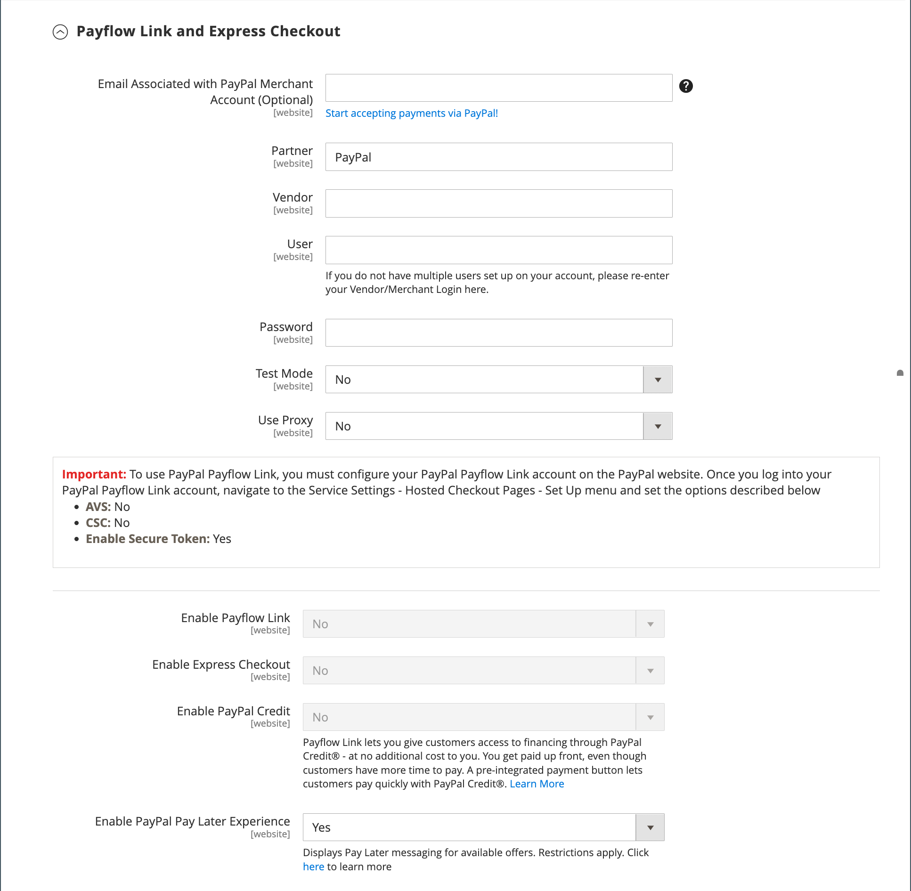

# Vínculo de flujo de pago PayPal

PayPal Payflow Link solo está disponible para comerciantes de Estados Unidos y Canadá. Los clientes no tienen que tener una cuenta personal de PayPal e introducir la información de su tarjeta de crédito en un formulario alojado por PayPal. La información nunca se almacena en el servidor de Adobe Commerce o Magento Open Source. El vínculo de flujo de pago no se puede utilizar para pedidos creados desde el administrador.

Las notas de abono son compatibles con los reembolsos en línea y sin conexión. Sin embargo, no se admiten varios reembolsos en línea.

>[!IMPORTANT]
>
>**Requisitos de PSD2:**  
>A partir del 14 de septiembre de 2019, los bancos europeos podrían rechazar los pagos que no cumplan los requisitos de [PSD2](../getting-started/compliance-payment-services-directive.md). Para cumplir con PSD2, PayPal Payflow Link debe estar integrado con Cardinal Commerce. Para obtener más información, consulta [3-D Secure for Payflow](https://developer.paypal.com/api/nvp-soap/payflow/3d-secure-overview/).

## Requisitos

- [Cuenta comercial de PayPal](https://www.paypal.com/webapps/mpp/how-to-sell-online) La puerta de enlace PayPal Payflow Pro vincula la cuenta de comerciante en PayPal con el sitio web del comerciante, actuando como puerta de enlace y como cuenta de comerciante.

- Si administra varios sitios web de Commerce, debe tener una cuenta de comerciante de PayPal independiente para cada sitio web.

## Flujo de trabajo del cliente

1. **El cliente va al pago** - Durante el pago, el cliente elige pagar con el enlace PayPal Payflow e introduce la información de la tarjeta de crédito. El cliente no tiene que tener una cuenta personal de PayPal.
1. **El cliente elige Pagar ahora** - El cliente pulsa el botón Pagar ahora para enviar el pedido.
1. **El cliente introduce la información de la tarjeta de crédito** - El cliente introduce la información de la tarjeta de crédito en un formulario alojado por PayPal. Si el cliente hace clic en el vínculo _Cancelar pago_, el cliente vuelve a la fase de cierre de compra Información de pago y el estado del pedido cambia a _Cancelado_.
1. **El cliente envía el pedido**: la información de la tarjeta de crédito se envía directamente a PayPal y no se conserva en ningún lugar del sitio de Commerce.

## Flujo de trabajo de pedidos

1. **PayPal recibe una solicitud** - PayPal recibe la solicitud del cliente para pagar ahora.
1. **PayPal verifica la información de pago** - PayPal verifica la información de la tarjeta de crédito y asigna el estado apropiado:
   - **Pago verificado:** Si está verificado, el estado _Pago pendiente_ se asigna inicialmente al pedido hasta que se liquide la transacción.
   - **Procesando** - La transacción se realizó correctamente.
   - **Pago pendiente** - El sistema no recibió una respuesta de PayPal.
   - **Cancelada** - La transacción no se realizó correctamente por alguna razón.
   - **Sospecha de fraude** - La transacción no pasó algunos de los [filtros de fraude de PayPal](paypal.md#paypal-fraud-management-filters). El sistema recibe la respuesta de PayPal de que el servicio de fraude está revisando la transacción.
   - **Cancelar pago:** Si el cliente hace clic en el vínculo _Cancelar pago_, el cliente vuelve a la fase de información de pago del cierre de compra y el estado del pedido cambia a _Cancelado_.
1. **Se redirige al cliente a la página de confirmación**. Si la transacción se completa correctamente, se redirigirá al cliente a la página de confirmación de pedido de su tienda. Si la transacción falla por cualquier motivo, aparece un mensaje de error en la página de pago y se indica al cliente que repita el proceso de pago. PayPal gestiona estas situaciones.
1. **El comerciante cumple la orden** - El comerciante factura y envía la orden como de costumbre.

## Configurar tu cuenta PayPal

1. Inicia sesión en tu [cuenta comercial de PayPal](https://manager.paypal.com/).

1. Configura las [páginas de cierre de compra hospedadas](https://developer.paypal.com/docs/payflow/integration-guide/configure-hosted-checkout/#configuring-hosted-pages-using-paypal-manager) mediante el Administrador de PayPal con la siguiente configuración:

   - En **[!UICONTROL Security Options]**, complete la siguiente configuración:

     **[!UICONTROL AVS]**: `No`

     **[!UICONTROL CSC]**: `No`

     **[!UICONTROL Enable Secure Token]**: `Yes`

   - Elija **[!UICONTROL Customize]** y, a continuación, elija **[!UICONTROL Layout C]**.

     El diseño C solo muestra los campos de tarjeta de crédito y débito, y puede enmarcarse en su sitio o utilizarse como ventana emergente independiente. El tamaño se fija en 490 x 565 píxeles, con espacio adicional para mensajes de error. En algunos sistemas, esta configuración corrige un problema con la redirección transparente.

1. Una vez completada la configuración, haga clic en **[!UICONTROL Save and Publish]**.

1. Configurar un usuario adicional (recomendado por PayPal):

   - En la segunda fila del menú principal, haga clic en **[!UICONTROL Manage Users]**.

   - Para agregar otro usuario a la cuenta, haga clic en **[!UICONTROL Add User]**.

   - Complete los campos obligatorios en las siguientes secciones del formulario _Agregar usuario_:

      - [!UICONTROL Admin Confirmation]
      - [!UICONTROL User Information]
      - [!UICONTROL User Login Information]
      - [!UICONTROL Assign Privilege to User]

   - Haga clic en **[!UICONTROL Update]**.

## Configuración del vínculo de flujo de pago de PayPal

>[!TIP]
>
>Haga clic en **[!UICONTROL Save Config]** en cualquier momento para guardar el progreso.

### Paso 1: Inicio de la configuración

Este método de configuración supone que ya tienes una cuenta PayPal.

1. En la barra lateral _Admin_, vaya a **[!UICONTROL Stores]** > _[!UICONTROL Settings]_>**[!UICONTROL Configuration]**.

1. En el panel izquierdo, expanda **[!UICONTROL Sales]** y elija **[!UICONTROL Payment Methods]**.

1. Si la instalación de Commerce tiene varios sitios web, tiendas o vistas, establezca **[!UICONTROL Store View]** en la vista de tienda en la que desee aplicar esta configuración.

1. En la sección _[!UICONTROL Merchant Location]_, seleccione **[!UICONTROL Merchant Country]**&#x200B;donde se encuentra su empresa.

   Esta configuración determina la selección de soluciones de PayPal que aparecen en la configuración.

   {width="600" zoomable="yes"}

1. Expanda **[!UICONTROL PayPal Payment Gateways]** (si es necesario) y haga clic en **[!UICONTROL Configure]** para **[!UICONTROL Payflow Link]**.

   {width="600" zoomable="yes"}

### Paso 2: Completa la configuración de PayPal necesaria

{width="600" zoomable="yes"}

1. (Opcional) Escriba **[!UICONTROL Email Associated with your PayPal Merchant Account]**.

   >[!IMPORTANT]
   >
   >Las direcciones de correo electrónico distinguen entre mayúsculas y minúsculas. Para recibir el pago, la dirección de correo electrónico debe coincidir con la especificada en tu cuenta comercial de PayPal.

1. Introduzca una de las siguientes credenciales que utiliza para iniciar sesión en su cuenta de comerciante de PayPal:

   - **[!UICONTROL Partner]**: tu ID de socio de PayPal.
   - **[!UICONTROL User]**: el ID de otro usuario que está configurado en tu cuenta PayPal.
   - **[!UICONTROL Vendor]**: tu nombre de inicio de sesión de usuario de PayPal.

1. Escribe el **[!UICONTROL Password]** que está asociado con tu cuenta PayPal.

1. Para ejecutar transacciones de prueba, establezca **[!UICONTROL Test Mode]** en `Yes`.

   Al probar la configuración en una zona protegida, usa solo [números de tarjeta de crédito](https://www.paypalobjects.com/en_AU/vhelp/paypalmanager_help/credit_card_numbers.htm) recomendados por PayPal. Cuando esté listo para ir a producción, vuelva a la configuración y establezca el modo de prueba en `No`.

1. Si su sistema utiliza un servidor proxy para establecer la conexión con el sistema PayPal, establezca **[!UICONTROL Test Mode]** en `Yes` y haga lo siguiente:

   - Escriba la dirección IP de **[!UICONTROL Proxy Host]**.

   - Escriba el número de puerto de **[!UICONTROL Proxy Port]**.

     Se utiliza un proxy cuando el cortafuegos del servidor impide el acceso directo al servidor de PayPal. En tal caso, se utiliza un servidor de terceros para transmitir el tráfico.

1. Establezca **[!UICONTROL Enable Payflow Link]** en `Yes`.

1. Si desea habilitar las opciones de [Pago y envío con PayPal Express](paypal-express-checkout.md) para los clientes, establezca **[!UICONTROL Enable Express Checkout]** en `Yes`.

1. Si quieres ofrecer [crédito de PayPal](paypal.md#paypal-credit-and-pay-later) a tus clientes, establece **[!UICONTROL Enable PayPal Credit]** en `Yes`.

### Paso 3: Configurar el crédito de PayPal / Anunciar PayPal PayAfter (opcional)

A partir de la versión 2.4.3, PayPal PayAfter es compatible con las implementaciones que incluyen PayPal. Esta función permite a los compradores pagar un pedido en cuotas quincenales en lugar de pagar el importe completo en el momento de la compra. La experiencia de crédito de PayPal está en desuso.

Establezca **[!UICONTROL Enable PayPal PayLater Experience]** en una de las siguientes opciones:

- `Yes` - Para configurar Anunciar PayPal PayAfter
- `No` - Para configurar el crédito de PayPal publicitario

#### Anunciar crédito de PayPal

1. Expanda  en la sección **[!UICONTROL Advertise PayPal Credit]**.

   {width="600" zoomable="yes"}

1. Para obtener la información de su cuenta, haga clic en **[!UICONTROL Get Publisher ID from PayPal]** y siga las instrucciones.

1. Escriba su **[!UICONTROL Publisher ID]**.

1. Expanda  en la sección **[!UICONTROL Home Page]**.

   {width="600" zoomable="yes"}

1. Para colocar un banner en la página, establezca **[!UICONTROL Display]** en `Yes`.

1. Establezca **[!UICONTROL Position]** en una de las siguientes opciones:

   - `Header (center)`
   - `Sidebar (right)`

1. Establezca **[!UICONTROL Size]** en una de las siguientes opciones:

   - `190 x 100`
   - `234 x 60`
   - `300 x 50`
   - `468 x 60`
   - `728 x 90`
   - `800 x 66`

1. Expanda  las secciones restantes y repita los pasos anteriores para la configuración de la página principal:

   - **[!UICONTROL Catalog Category Page]**
   - **[!UICONTROL Catalog Product Page]**
   - **[!UICONTROL Checkout Cart Page]**

#### Anunciar PayPal PayAfter

1. Expanda  en la sección **[!UICONTROL Advertise PayPal PayLater]**.

1. Establezca **[!UICONTROL Enable PayPal PayLater]** en `Yes`.

1. Expanda  en la sección **[!UICONTROL Home Page]**.

   {width="600" zoomable="yes"}

1. Para colocar un banner en la página, establezca **[!UICONTROL Display]** en `Yes`.

1. Establezca **[!UICONTROL Position]** en una de las siguientes opciones:

   - `Header (center)`
   - `Sidebar`

1. Establezca **[!UICONTROL Style Layout]** en una de las siguientes opciones:

   - `Text`
   - `Flex`

1. Solo para [!UICONTROL Style Layout] **[!UICONTROL Text]**, establezca **[!UICONTROL Logo Type]** en uno de los siguientes:

   - `Primary`
   - `Alternative`
   - `Inline`
   - `None`

1. Solo para [!UICONTROL Style Layout] **[!UICONTROL Text]**, establezca **[!UICONTROL Logo Position]** en uno de los siguientes:

   - `Left`
   - `Right`
   - `Top`

1. Solo para [!UICONTROL Style Layout] **[!UICONTROL Text]**, establezca **[!UICONTROL Text Color]** en uno de los siguientes:

   - `Black`
   - `White`
   - `Monochrome`
   - `Grayscale`

1. Solo para [!UICONTROL Style Layout] **[!UICONTROL Text]**, establezca **[!UICONTROL Text Size]** en uno de los siguientes:

   - `10px`
   - `11px`
   - `12px`
   - `13px`
   - `14px`
   - `15px`
   - `16px`

1. Solo para [!UICONTROL Style Layout] **[!UICONTROL Flex]**, establezca **[!UICONTROL Ratio]** en uno de los siguientes:

   - `1x1`
   - `1x4`
   - `8x1`
   - `20x1`

1. Solo para [!UICONTROL Style Layout] **[!UICONTROL Flex]**, establezca **[!UICONTROL Color]** en uno de los siguientes:

   - `Blue`
   - `Black`
   - `White`
   - `White No Border`
   - `Gray`
   - `Monochrome`
   - `Grayscale`

1. Expanda  las secciones restantes y repita los pasos anteriores:

   - **[!UICONTROL Catalog Product Page]**
   - **[!UICONTROL Checkout Cart Page]**
   - **[!UICONTROL Checkout Payment Step]**
   - **[!UICONTROL Catalog Category Page]**

### Paso 4: completar la configuración básica

1. Expanda  en la sección **[!UICONTROL Basic Settings - PayPal Payflow Link]**.

   {width="600" zoomable="yes"}

1. Para **[!UICONTROL Title]**, introduce un título que identifique el vínculo de flujo de pago de PayPal durante el pago y envío.

   Se recomienda usar el título _Tarjeta de débito o crédito_.

1. Si ofrece varios métodos de pago, ingrese un número para **[!UICONTROL Sort Order]** a fin de determinar la secuencia en que aparece el enlace de flujo de pago cuando se enumera con los otros métodos de pago.

   Este número es relativo a las otras formas de pago. (`0` = primero, `1` = segundo, `2` = tercero, etc.)

1. Establezca **[!UICONTROL Payment Action]** en una de las siguientes opciones:

   - `Authorization` - Aprueba la compra y suspende los fondos. La cantidad no se retira hasta que sea capturada por el comerciante.
   - `Sale`: el importe de la compra se autoriza y se retira inmediatamente de la cuenta del cliente.

### Paso 5: Completar la configuración avanzada

1. Expanda  en la sección **[!UICONTROL Advanced Settings]**.

   {width="600" zoomable="yes"}

1. Establezca **[!UICONTROL Payment Applicable From]** en una de las siguientes opciones:

   - `All Allowed Countries`: los clientes de todos los [países](../getting-started/store-details.md#country-options) especificados en la configuración de su tienda pueden usar este método de pago.
   - `Specific Countries` - Después de elegir esta opción, aparece la lista _[!UICONTROL Payment from Specific Countries]_. Mantenga pulsada la tecla Ctrl y seleccione cada país de la lista donde los clientes puedan realizar compras en su tienda.

1. Para escribir comunicaciones con el sistema de pago en el archivo de registro, establezca **[!UICONTROL Debug Mode]** en `Yes`.

   >[!NOTE]
   >
   >De acuerdo con las normas de seguridad de datos PCI, la información de la tarjeta de crédito no se registra en el archivo de registro.

1. Para habilitar la comprobación de la autenticidad del host, establezca **[!UICONTROL Enable SSL Verification]** en `Yes`.

1. Si desea que el cliente pueda corregir la entrada del código de seguridad CVV de tres dígitos desde el reverso de una tarjeta de crédito, establezca **[!UICONTROL CVV Entry is Editable]** en `Yes`.

1. Para requerir que los clientes escriban un código CVV, establezca **[!UICONTROL Require CVV Entry]** en `Yes`.

1. Para enviar una confirmación del pago al cliente, establezca **[!UICONTROL Send Email Confirmation]** en `Yes`.

1. Para determinar el método que se utiliza para intercambiar información con el servidor PayPal durante una transacción, establezca **[!UICONTROL URL method for Cancel URL and Return URL]** en uno de los siguientes:

   - `GET`: recupera información que es el resultado de un proceso (método predeterminado).
   - `POST`: proporciona un bloque de datos, como datos introducidos en un formulario, a un proceso de administración de datos.

   La _URL de cancelación_ y la _URL de devolución_ hacen referencia a la página a la que el cliente vuelve después de completar o cancelar la parte de pago del proceso de pago y envío en el servidor PayPal

1. Complete las siguientes secciones, según sea necesario para su tienda:

   - [Configuración del informe de liquidación](#settlement-report-settings)
   - [Configuración de experiencia de front-end](#frontend-experience-settings)

#### Configuración del informe de liquidación

1. Expanda  en la sección **[!UICONTROL Settlement Report Settings]**.

   {width="600" zoomable="yes"}

1. Para **[!UICONTROL SFTP Credentials]**, haga lo siguiente:

   - Si se ha registrado en el servidor FTP seguro de PayPal, introduzca las siguientes credenciales de inicio de sesión en el SFTP:

      - Iniciar sesión
      - Contraseña

   - Para ejecutar informes de prueba antes de publicar el cierre de compra rápido en el sitio, establezca **[!UICONTROL Sandbox Mode]** en `Yes`.

   - Escriba **[!UICONTROL Custom Endpoint Hostname or IP Address]**.

     De manera predeterminada, el valor es `reports.paypal.com`.

   - Escriba **[!UICONTROL Custom Path]** donde se guardan los informes.

     De manera predeterminada, el valor es `/ppreports/outgoing`.

1. Para generar informes de acuerdo con una programación, complete la configuración de **[!UICONTROL Scheduled Fetching]**:

   - Establezca **[!UICONTROL Enable Automatic Fetching]** en `Yes`.

   - Establezca **[!UICONTROL Schedule]** en una de las siguientes opciones:

      - `Daily`
      - `Every 3 Days`
      - `Every 7 Days`
      - `Every 10 Days`
      - `Every 14 Days`
      - `Every 30 Days`
      - `Every 40 Days`

     PayPal conserva cada informe durante 45 días.

   - Establezca **[!UICONTROL Time of Day]** a las horas, minutos y segundos en que desea que se generen los informes.

#### Configuración de experiencia de front-end

Use _[!UICONTROL Frontend Experience Settings]_&#x200B;para elegir los logotipos de PayPal que aparecerán en el sitio y personalizar el aspecto de las páginas de comerciantes de PayPal.

1. Expanda  en la sección **[!UICONTROL Frontend Experience Settings]**.

   {width="600" zoomable="yes"}

1. Seleccione el(la) **[!UICONTROL PayPal Product Logo]** que desea que aparezca en el bloque de PayPal de su tienda.

   Los logotipos de PayPal están disponibles en cuatro estilos y dos tamaños:

   - `No Logo`
   - `We Prefer PayPal (150 x 60 or 150 x 40)`
   - `Now Accepting PayPal (150 x 60 or 150 x 40)`
   - `Payments by PayPal (150 x 60 or 150 x 40)`
   - `Shop Now Using PayPal (150 x 60 or 150 x 40)`

1. Para personalizar el aspecto de las páginas de comerciantes de PayPal:

   - Escriba el nombre de **[!UICONTROL Page Style]** que desea aplicar a sus páginas de comerciante de PayPal:

      - `paypal`: utiliza el estilo de página de PayPal.
      - `primary`: utiliza el estilo de página que identificó como estilo _principal_ en el perfil de la cuenta.
      - `your_custom_value`: utiliza un estilo de página de pago personalizado, que se especifica en el perfil de la cuenta.

   - Para **[!UICONTROL Header Image URL]**, escriba la dirección URL de la imagen que desea que aparezca en la esquina superior izquierda de la página de pago. El tamaño máximo de archivo es de 750 píxeles de ancho por 90 píxeles de alto.

     >[!NOTE]
     >
     >PayPal recomienda que la imagen resida en un servidor seguro (https). De lo contrario, un explorador podría advertir que _la página contiene elementos seguros y no seguros_.

   - Para establecer el color de las páginas, escriba el código hexadecimal de seis caracteres, sin el símbolo `#`, para cada uno de los siguientes elementos:

      - **[!UICONTROL Header Background Color]** - Color de fondo del encabezado de la página de pago.
      - **[!UICONTROL Header Border Color]** - Color para borde de dos píxeles alrededor del encabezado.
      - **[!UICONTROL Page Background Color]**: color de fondo de la página de pago y alrededor del encabezado y del formulario de pago.

### Paso 6: Completa la configuración básica de Pago y envío de PayPal Express

1. Expanda  en la sección **[!UICONTROL Basic Settings - PayPal Express Checkout]**.

   {width="600" zoomable="yes"}

1. Para **[!UICONTROL Title]**, escribe un título que identifique este método de pago durante el cierre de compra.

   Se recomienda configurar el título en _PayPal_ para cada vista de tienda.

1. Si ofrece varias formas de pago, ingrese un número para **[!UICONTROL Sort Order]** a fin de determinar la secuencia en que se mostrará el proceso de pago y envío de PayPal Express cuando aparezca junto con las otras formas de pago.

   Este número es relativo a las otras formas de pago. (`0` = primero, `1` = segundo, `2` = tercero, etc.)

1. Establezca **[!UICONTROL Payment Action]** en una de las siguientes opciones:

   - `Authorization` - Aprueba la compra y suspende los fondos. La cantidad no se retira hasta que el comerciante _la capture_.
   - `Sale`: el importe de la compra se autoriza y se retira inmediatamente de la cuenta del cliente.

1. Para mostrar el botón _[!UICONTROL Check out with PayPal]_&#x200B;en la página de productos, establezca **[!UICONTROL Display on Product Details Page]**&#x200B;en `Yes`.

### Paso 7: Completa la configuración avanzada de Pago y envío de PayPal Express

1. Expanda  en la sección **[!UICONTROL Advanced Settings]**.

   {width="600" zoomable="yes"}

1. Establezca **[!UICONTROL Display on Shopping Cart]** en `Yes`.

1. Establezca **[!UICONTROL Payment Applicable From]** en una de las siguientes opciones:

   - `All Allowed Countries`: los clientes de todos los países especificados en la configuración de la tienda pueden utilizar este método de pago.
   - `Specific Countries` - Después de elegir esta opción, aparece la lista _[!UICONTROL Payment from Specific Countries]_. Para seleccionar varios países, mantenga presionada la tecla Ctrl (PC) o la tecla Comando (Mac) y haga clic en cada elemento.

1. Para escribir comunicaciones con el sistema de pago en el archivo de registro, establezca **[!UICONTROL Debug Mode]** en `Yes`.

   >[!NOTE]
   >
   >De acuerdo con las normas de seguridad de datos PCI, la información de la tarjeta de crédito no se registra en el archivo de registro.

1. Para habilitar la comprobación de la autenticidad del host, establezca **[!UICONTROL Enable SSL Verification]** en `Yes`.

1. Para mostrar un resumen completo del pedido del cliente por artículo de línea del sitio de PayPal, establezca **[!UICONTROL Transfer Cart Line Items]** en `Yes`.

1. Para permitir que el cliente complete la transacción desde el sitio de PayPal sin volver a su tienda para la revisión de pedidos, establezca **[!UICONTROL Skip Order Review Step]** en `Yes`.

1. Una vez finalizado, haga clic en **[!UICONTROL Save Config]**.
