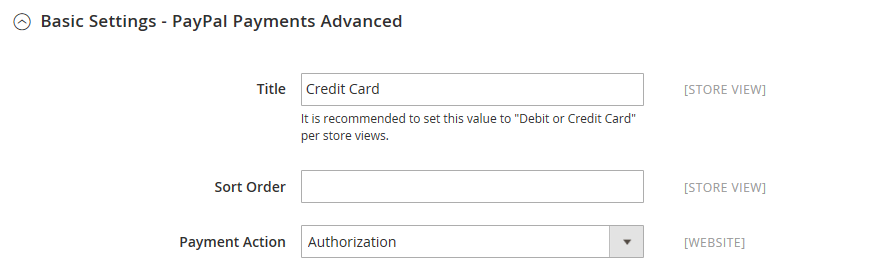

# Pagos mediante PayPal avanzados

[PayPal Payments Advanced][4] es una solución [compatible con PCI](../getting-started/compliance-pci.md) que permite a tus clientes pagar con tarjeta de débito o crédito sin abandonar tu sitio. Incluye una página de cierre de compra integrada que se puede personalizar para crear una experiencia de cierre de compra perfecta y segura.

Incluso los clientes sin una cuenta PayPal pueden realizar compras a través de la pasarela de pago segura de PayPal. Las tarjetas aceptadas incluyen las tarjetas de crédito Visa, MasterCard, Switch/Maestro y Solo en los Estados Unidos y el Reino Unido. Para mayor comodidad, PayPal Express Checkout está incluido con PayPal Payments Advanced.

>[!IMPORTANT]
>
>**Requisitos de PSD2:**  
>A partir del 14 de septiembre de 2019, los bancos europeos podrían rechazar los pagos que no cumplan los requisitos de [PSD2](../getting-started/compliance-payment-services-directive.md). Para cumplir con PSD2, PayPal Payments Advanced debe estar integrado con un complemento de terceros. Para obtener más información, consulta [3-D Secure for Payflow](https://developer.paypal.com/api/nvp-soap/payflow/3d-secure-mpi/).

>[!NOTE]
>
>PayPal Payments Advanced no se puede utilizar para pedidos creados desde el administrador de tu tienda.

## Requisitos

- [Cuenta comercial de PayPal][1]
- Si administra varios sitios web de Adobe Commerce y Magento Open Source, debe tener una cuenta de comerciante de PayPal independiente para cada sitio web.

## Flujo de trabajo de retirada

1. **El cliente elige la forma de pago** - Durante el proceso de pago, el cliente elige pagar con PayPal Payments Advanced. Aparecerá el botón Pagar ahora en lugar del botón Realizar pedido.

1. **Pagar ahora**: el cliente pulsa o hace clic en _Pagar ahora_ y aparece un formulario alojado en PayPal. El cliente introduce la información de la tarjeta y esta se verifica. Si se ejecuta correctamente, aparecerá la página de confirmación del pedido.

   **Pagar con PayPal**: el formulario también incluye el botón _Pagar con PayPal_, que redirige al cliente al sitio de PayPal, donde se puede realizar el pago con Pago y envío con PayPal Express.

1. **Solución de problemas**: si la transacción falla por algún motivo, aparece un mensaje de error en la página de cierre de compra y se indica al cliente que vuelva a intentarlo. PayPal gestiona todos los problemas.

## Flujo de trabajo de procesamiento de pedidos

Procesar pedidos con PayPal Payments Advanced es lo mismo que para cualquier pedido normal de PayPal. Los pedidos se facturan y envían, y las notas de abono se generan para los reembolsos en línea y sin conexión. Sin embargo, varios reembolsos en línea no están disponibles para pedidos pagados con PayPal Payments Advanced.

1. **El cliente realiza el pedido**: en la fase final del cierre de compra, el cliente pulsa el botón Realizar pedido.

1. **PayPal responde** - PayPal evalúa la solicitud. Si se descubre que es válido, PayPal procesa la transacción.

1. **Commerce establece el estado del pedido**: Commerce recibe la respuesta de PayPal y establece el estado del pedido en uno de los siguientes:

   - **Procesando** - La transacción se realizó correctamente.
   - **Pago pendiente** - El sistema no recibió respuesta de PayPal.
   - **Cancelada** - La transacción no se realizó correctamente por alguna razón
   - **Sospecha de fraude** - La transacción no pasó algunos de los [filtros de fraude de PayPal](paypal.md#paypal-fraud-management-filters). El sistema recibe la respuesta de PayPal de que el servicio de fraude está revisando la transacción.

1. **El comerciante cumple el pedido** - El comerciante factura y envía el pedido.

## Configurar tu cuenta PayPal

Antes de configurar PayPal Payments Advanced en Commerce, debes configurar tu cuenta en el sitio web de PayPal.

1. Inicia sesión en tu [cuenta comercial de PayPal][2].

1. Vaya a **[!UICONTROL Service Settings]** > **[!UICONTROL Hosted Checkout Pages]** > **[!UICONTROL Set Up Menu]** y complete la siguiente configuración:

   - **[!UICONTROL AVS]**: `No`
   - **[!UICONTROL CSC]**: `No`
   - **[!UICONTROL Enable Secure Token]**: `Yes`

1. **[!UICONTROL Save]** la configuración.

   >[!NOTE]
   >
   >Si tiene varios sitios web de Commerce, debe crear una cuenta PayPal Payments Advanced independiente para cada uno.

1. Cuando se le pida que cree un diseño, haga lo siguiente:

   - En la parte superior de la página, haga clic en **[!UICONTROL Customize]**.

   - Elija **[!UICONTROL Layout C]**.

   - Haga clic en **[!UICONTROL Save and Publish]**.

1. Configurar otro usuario (recomendado por PayPal):

   - Inicia sesión en tu [cuenta comercial de PayPal][2].

   - Para configurar otro usuario, siga las instrucciones.

   - **[!UICONTROL Save]** los cambios.

## Configuración de pagos avanzados de PayPal en Commerce

>[!NOTE]
>
>Puede tener dos soluciones de PayPal activas al mismo tiempo: Pago y envío exprés, además de cualquier solución Todo en uno o Puerta de pago. Si cambia las soluciones de pago, se desactiva la que se utilizaba anteriormente.

>[!TIP]
>
>Haga clic en **[!UICONTROL Save Config]** en cualquier momento para guardar el progreso.

### Paso 1: Inicio de la configuración

1. En la barra lateral _Admin_, vaya a **[!UICONTROL Stores]** > _[!UICONTROL Settings]_>**[!UICONTROL Configuration]**.

1. En el panel izquierdo, expanda **[!UICONTROL Sales]** y elija **[!UICONTROL Payment Methods]**.

1. Si la instalación de Commerce tiene varios sitios web, tiendas o vistas, establezca **[!UICONTROL Store View]** en la vista de tienda en la que desee aplicar esta configuración.

1. En la sección _[!UICONTROL Merchant Location]_, seleccione **[!UICONTROL Merchant Country]**&#x200B;donde se encuentra su empresa.

   Esta configuración determina la selección de soluciones de PayPal que aparecen en la configuración.

   {width="600" zoomable="yes"}

1. Expanda **[!UICONTROL PayPal All-in-One Payment Solution]** y haga clic en **[!UICONTROL Configure]** para **[!UICONTROL Payments Advanced]**.

   {width="600" zoomable="yes"}

### Paso 2: complete la configuración necesaria

1. Expanda  en la sección **[!UICONTROL Required PayPal Settings]**, si es necesario.

   {width="600" zoomable="yes"}

1. (Opcional) Escriba **[!UICONTROL Email Associated with your PayPal Merchant Account]**.

   >[!IMPORTANT]
   >
   >Las direcciones de correo electrónico distinguen entre mayúsculas y minúsculas. Para recibir el pago, la dirección de correo electrónico debe coincidir con la especificada en tu cuenta comercial de PayPal.

   Si no tiene una cuenta PayPal, haga clic en **[!UICONTROL Start accepting payments via PayPal]**.

1. Introduzca una de las siguientes credenciales que utiliza para iniciar sesión en su cuenta de comerciante de PayPal:

   - **[!UICONTROL Partner]**: tu ID de socio de PayPal.
   - **[!UICONTROL Vendor]**: tu nombre de inicio de sesión de usuario de PayPal.
   - **[!UICONTROL User]**: el ID de otro usuario que está configurado en tu cuenta PayPal.

1. Escribe el **[!UICONTROL Password]** que está asociado con tu cuenta PayPal.

1. Para ejecutar transacciones de prueba, establezca **[!UICONTROL Test Mode]** en `Yes`.

   Al probar la configuración en una zona protegida, usa solo [números de tarjeta de crédito][3] recomendados por PayPal. Cuando esté listo para ir a producción, vuelva a la configuración y establezca el modo de prueba en `No`.

1. Si su sistema utiliza un servidor proxy para establecer la conexión con el sistema PayPal, establezca **[!UICONTROL Use Proxy]** en `Yes` y haga lo siguiente:

   - Escriba la dirección IP de **[!UICONTROL Proxy Host]**.

   - Escriba el número de puerto de **[!UICONTROL Proxy Port]**.

     Se utiliza un proxy cuando el cortafuegos del servidor impide el acceso directo al servidor de PayPal. En este caso, se utiliza un servidor de terceros para transmitir el tráfico.

1. Establezca **[!UICONTROL Enable this Solution]** en `Yes`.

1. Si quieres ofrecer [crédito de PayPal](paypal.md#paypal-credit-and-pay-later) a tus clientes, establece **[!UICONTROL Enable PayPal Credit]** en `Yes`.

### Paso 3: Configurar el crédito de PayPal / Anunciar PayPal PayAfter (opcional)

A partir de la versión 2.4.3, PayPal PayAfter es compatible con las implementaciones que incluyen PayPal. Esta función permite a los compradores pagar un pedido en cuotas quincenales en lugar de pagar el importe completo en el momento de la compra. La experiencia de crédito de PayPal está en desuso.

Establezca **[!UICONTROL Enable PayPal PayLater Experience]** en una de las siguientes opciones:

- `Yes` - Para configurar Anunciar PayPal PayAfter
- `No` - Para configurar el crédito de PayPal publicitario

#### Anunciar crédito de PayPal

1. Expanda  en la sección **[!UICONTROL Advertise PayPal Credit]**.

   {width="600" zoomable="yes"}

1. Para obtener la información de su cuenta, haga clic en **[!UICONTROL Get Publisher ID from PayPal]** y siga las instrucciones.

1. Escriba su **[!UICONTROL Publisher ID]**.

1. Expanda  en la sección **[!UICONTROL Home Page]**.

1. Para colocar un banner en la página, establezca **[!UICONTROL Display]** en `Yes`.

1. Establezca **[!UICONTROL Position]** en una de las siguientes opciones:

   - `Header (center)`
   - `Sidebar (right)`

1. Establezca **[!UICONTROL Size]** en una de las siguientes opciones:

   - `190 x 100`
   - `234 x 60`
   - `300 x 50`
   - `468 x 60`
   - `728 x 90`
   - `800 x 66`

   {width="600" zoomable="yes"}

1. Expanda  las secciones restantes y repita los pasos anteriores:

   - **[!UICONTROL Catalog Category Page]**
   - **[!UICONTROL Catalog Product Page]**
   - **[!UICONTROL Checkout Cart Page]**

#### Anunciar PayPal PayAfter

1. Expanda  en la sección **[!UICONTROL Advertise PayPal PayLater]**.

1. Establezca **[!UICONTROL Enable PayPal PayLater]** en `Yes`.

1. Expanda  en la sección **[!UICONTROL Home Page]**.

1. Para colocar un banner en la página, establezca **[!UICONTROL Display]** en `Yes`.

1. Establezca **[!UICONTROL Position]** en una de las siguientes opciones:

   - `Header (center)`
   - `Sidebar`

1. Establezca **[!UICONTROL Style Layout]** en una de las siguientes opciones:

   - `Text`
   - `Flex`

1. Solo para [!UICONTROL Style Layout] **[!UICONTROL Text]**, establezca **[!UICONTROL Logo Type]** en uno de los siguientes:

   - `Primary`
   - `Alternative`
   - `Inline`
   - `None`

1. Solo para [!UICONTROL Style Layout] **[!UICONTROL Text]**, establezca **[!UICONTROL Logo Position]** en uno de los siguientes:

   - `Left`
   - `Right`
   - `Top`

1. Solo para [!UICONTROL Style Layout] **[!UICONTROL Text]**, establezca **[!UICONTROL Text Color]** en uno de los siguientes:

   - `Black`
   - `White`
   - `Monochrome`
   - `Grayscale`

1. Solo para [!UICONTROL Style Layout] **[!UICONTROL Text]**, establezca **[!UICONTROL Text Size]** en uno de los siguientes:

   - `10px`
   - `11px`
   - `12px`
   - `13px`
   - `14px`
   - `15px`
   - `16px`

1. Solo para [!UICONTROL Style Layout] **[!UICONTROL Flex]**, establezca **[!UICONTROL Ratio]** en uno de los siguientes:

   - `1x1`
   - `1x4`
   - `8x1`
   - `20x1`

1. Solo para [!UICONTROL Style Layout] **[!UICONTROL Flex]**, establezca **[!UICONTROL Color]** en uno de los siguientes:

   - `Blue`
   - `Black`
   - `White`
   - `White No Border`
   - `Gray`
   - `Monochrome`
   - `Grayscale`

   {width="600" zoomable="yes"}

1. Expanda  las secciones restantes y repita los pasos anteriores:

   - **[!UICONTROL Catalog Product Page]**
   - **[!UICONTROL Checkout Cart Page]**
   - **[!UICONTROL Checkout Payment Step]**
   - **[!UICONTROL Catalog Category Page]**

### Paso 4: completar la configuración básica

1. Expanda  en la sección **[!UICONTROL Basic Settings - PayPal Payments Advanced]**, si es necesario.

   {width="600" zoomable="yes"}

1. Para identificar los pagos avanzados de PayPal durante el cierre de compra, escribe un **[!UICONTROL Title]**.

   Se recomienda usar el título _Tarjeta de débito o crédito_.

1. Si ofrece varias formas de pago, ingrese un número para **[!UICONTROL Sort Order]** a fin de determinar la secuencia en la que se mostrará la opción Pagos avanzados de PayPal cuando aparezca junto con otras formas de pago durante el proceso de pago.

   Este número es relativo a las otras formas de pago. (`0` = primero, `1` = segundo, `2` = tercero, etc.)

1. Establezca **[!UICONTROL Payment Action]** en una de las siguientes opciones:

   - `Authorization` - Aprueba la compra, pero suspende los fondos. La cantidad no se retira hasta que el comerciante _la capture_.
   - `Sale`: el importe de la compra se autoriza y se retira inmediatamente de la cuenta del cliente.

### Paso 5: Completar la configuración avanzada

1. Expanda  en la sección **[!UICONTROL Advanced Settings]**.

   {width="600" zoomable="yes"}

1. Establezca **[!UICONTROL Payment Applicable From]** en una de las siguientes opciones:

   - `All Allowed Countries`: los clientes de todos los [países](../getting-started/store-details.md#country-options) especificados en la configuración de su tienda pueden usar este método de pago.
   - `Specific Countries` - Después de elegir esta opción, aparece la lista _[!UICONTROL Payment from Specific Countries]_. Mantenga pulsada la tecla Ctrl (PC) o la tecla Comando (Mac) y seleccione cada país de la lista donde los clientes pueden realizar compras en su tienda.

1. Para escribir comunicaciones con el sistema de pago en el archivo de registro, establezca **[!UICONTROL Debug Mode]** en `Yes`.

   El archivo de registro de Pagos avanzados de PayPal es `payments_payflow_advanced.log`.

   >[!NOTE]
   >
   >De acuerdo con las normas de seguridad de datos PCI, la información de la tarjeta de crédito no se registra en el archivo de registro.

1. Para habilitar la comprobación de la autenticidad del host, establezca **[!UICONTROL Enable SSL Verification]** en `Yes`.

1. Para permitir que el cliente corrija la entrada del código de seguridad CVV de tres dígitos desde el reverso de una tarjeta de crédito, establezca **[!UICONTROL CVV Entry is Editable]** en `Yes`.

1. Para requerir que los clientes escriban un código CVV, establezca **[!UICONTROL Require CVV Entry]** en `Yes`.

1. Para enviar una confirmación del pago al cliente, establezca **[!UICONTROL Send Email Confirmation]** en `Yes`.

1. Para determinar el método que se utiliza para intercambiar información con el servidor PayPal durante una transacción, establezca **[!UICONTROL URL method for Cancel URL and Return URL]** en uno de los siguientes:

   - `GET` - (Predeterminado) Recupera información que es el resultado de un proceso.
   - `POST`: proporciona un bloque de datos, como datos introducidos en un formulario, a un proceso de administración de datos.

   La _URL de cancelación_ y la _URL de devolución_ hacen referencia a la página a la que el cliente vuelve después de completar o cancelar la parte de pago del proceso de pago y envío en el servidor PayPal.

1. Complete las siguientes secciones, según sea necesario para su tienda:

   - [Configuración del informe de liquidación](#settlement-report-settings)
   - [Configuración de experiencia de front-end](#frontend-experience-settings)

#### Configuración del informe de liquidación

1. Expanda  en la sección **[!UICONTROL Settlement Report Settings]**.

   {width="600" zoomable="yes"}

1. Para **[!UICONTROL SFTP Credentials]**, haga lo siguiente:

   - Si te has registrado en el servidor FTP seguro de PayPal, introduce las siguientes credenciales de inicio de sesión en el SFTP:

      - Iniciar sesión
      - Contraseña

   - Para ejecutar informes de prueba antes de publicar, establezca **[!UICONTROL Sandbox Mode]** en `Yes`.

   - Escriba **[!UICONTROL Custom Endpoint Hostname or IP Address]**.

     De manera predeterminada, el valor es `reports.paypal.com`.

   - Escriba **[!UICONTROL Custom Path]** donde se guardan los informes.

     De manera predeterminada, el valor es `/ppreports/outgoing`.

1. Para generar informes de acuerdo con una programación, complete la configuración de **[!UICONTROL Scheduled Fetching]**:

   - Establezca **[!UICONTROL Enable Automatic Fetching]** en `Yes`.

   - Establezca **[!UICONTROL Schedule]** en una de las siguientes opciones:

      - `Daily`
      - `Every 3 Days`
      - `Every 7 Days`
      - `Every 10 Days`
      - `Every 14 Days`
      - `Every 30 Days`
      - `Every 40 Days`

     PayPal conserva cada informe durante 45 días.

   - Establezca **[!UICONTROL Time of Day]** a las horas, minutos y segundos en que desea que se generen los informes.

#### Configuración de experiencia de front-end

Use _[!UICONTROL Frontend Experience Settings]_&#x200B;para elegir los logotipos de PayPal que aparecerán en el sitio y personalizar el aspecto de las páginas de comerciantes de PayPal.

1. Expanda  en la sección **[!UICONTROL Frontend Experience Settings]**.

   {width="600" zoomable="yes"}

1. Seleccione el(la) **[!UICONTROL PayPal Product Logo]** que desea que aparezca en el bloque de PayPal de su tienda.

   Los logotipos de PayPal están disponibles en cuatro estilos y dos tamaños:

   - `No Logo`
   - `We Prefer PayPal (150 x 60 or 150 x 40)`
   - `Now Accepting PayPal (150 x 60 or 150 x 40)`
   - `Payments by PayPal (150 x 60 or 150 x 40)`
   - `Shop Now Using PayPal (150 x 60 or 150 x 40)`

1. Para personalizar el aspecto de las páginas de comerciantes de PayPal:

   - Escriba el nombre de **[!UICONTROL Page Style]** que desea aplicar a sus páginas de comerciante de PayPal:

      - `paypal`: utiliza el estilo de página de PayPal.
      - `primary`: utiliza el estilo de página que identificó como estilo _principal_ en el perfil de la cuenta.
      - `your_custom_value`: utiliza un estilo de página de pago personalizado, que se especifica en el perfil de la cuenta.

   - Para **[!UICONTROL Header Image URL]**, escriba la dirección URL de la imagen que desea que aparezca en la esquina superior izquierda de la página de pago. El tamaño máximo de archivo es de 750 píxeles de ancho por 90 píxeles de alto.

   >[!NOTE]
   >
   >PayPal recomienda que la imagen resida en un servidor seguro (https). De lo contrario, un explorador podría advertir que _la página contiene elementos seguros y no seguros_.

   - Para establecer el color de las páginas, escriba el código hexadecimal de seis caracteres, sin el símbolo `#`, para cada uno de los siguientes elementos:

      - **[!UICONTROL Header Background Color]** - Color de fondo del encabezado de la página de pago.
      - **[!UICONTROL Header Border Color]** - Color para borde de dos píxeles alrededor del encabezado.
      - **[!UICONTROL Page Background Color]**: color de fondo de la página de pago y alrededor del encabezado y del formulario de pago.

### Paso 6: Completa la configuración básica de Pago y envío de PayPal Express

1. Expanda  en la sección **[!UICONTROL Basic Settings - PayPal Express Checkout]**.

   {width="600" zoomable="yes"}

1. Para **[!UICONTROL Title]**, escribe un título que identifique este método de pago durante el cierre de compra.

   Se recomienda configurar el título en _PayPal_ para cada vista de tienda.

1. Si ofrece varias formas de pago, ingrese un número para **[!UICONTROL Sort Order]** a fin de determinar la secuencia en que se mostrará el proceso de pago y envío de PayPal Express cuando aparezca junto con las otras formas de pago.

   Este número es relativo a las otras formas de pago. (`0` = primero, `1` = segundo, `2` = tercero, etc.)

1. Establezca **[!UICONTROL Payment Action]** en una de las siguientes opciones:

   - `Authorization` - Aprueba la compra y suspende los fondos. La cantidad no se retira hasta que el comerciante _la capture_.
   - `Sale`: el importe de la compra se autoriza y se retira inmediatamente de la cuenta del cliente.

1. Para mostrar el botón _[!UICONTROL Check out with PayPal]_&#x200B;en la página de productos, establezca **[!UICONTROL Display on Product Details Page]**&#x200B;en `Yes`.

### Paso 7: Completar la configuración avanzada: Pago y envío de PayPal Express

1. Expanda  en la sección **[!UICONTROL Advanced Settings]**.

   {width="600" zoomable="yes"}

1. Para que Pago y envío mediante PayPal Express esté disponible tanto en el carro de compras como en el mini carro, establezca **[!UICONTROL Display on Shopping Cart]** en `Yes`.

1. Establezca **[!UICONTROL Payment Applicable From]** en una de las siguientes opciones:

   - `All Allowed Countries`: los clientes de todos los [países](../getting-started/store-details.md#country-options) especificados en la configuración de su tienda pueden usar este método de pago.
   - `Specific Countries` |Después de elegir esta opción, aparece la lista _Pago de países específicos_. Mantenga pulsada la tecla Ctrl (PC) o la tecla Comando (Mac) y haga clic en cada país de la lista donde los clientes pueden realizar compras en su tienda.

1. Para escribir comunicaciones con el sistema de pago en el archivo de registro, establezca **[!UICONTROL Debug Mode]** en `Yes`.

   >[!NOTE]
   >
   >De acuerdo con las [Normas de seguridad de datos PCI](../getting-started/compliance-pci.md), la información de la tarjeta de crédito no se registra en el archivo de registro.

1. Para habilitar la comprobación de la autenticidad del host, establezca **[!UICONTROL Enable SSL Verification]** en `Yes`.

1. Para mostrar un resumen completo del pedido del cliente por artículo de línea del sitio de PayPal, establezca **[!UICONTROL Transfer Cart Line Items]** en `Yes`.

1. Para permitir que el cliente complete la transacción desde el sitio de PayPal sin volver a su tienda para la revisión de pedidos, establezca **[!UICONTROL Skip Order Review Step]** en `Yes`.

1. Una vez finalizado, haga clic en **[!UICONTROL Save Config]**.

[1]: https://www.paypal.com/webapps/mpp/how-to-sell-online
[2]: https://manager.paypal.com/
[3]: https://www.paypalobjects.com/en_AU/vhelp/paypalmanager_help/credit_card_numbers.htm
[4]: https://developer.paypal.com/docs/payflow/gs-ppa-hosted-pages/
