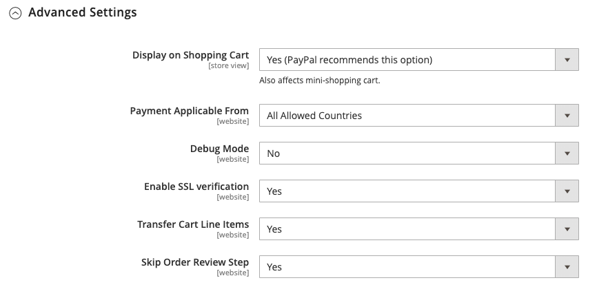

# Pagos mediante PayPal avanzados

[Pagos mediante PayPal avanzados][4] es un [Compatible con PCI](../getting-started/compliance-pci.md) solución que permite a los clientes pagar con tarjeta de débito o crédito sin abandonar el sitio. Incluye una página de cierre de compra integrada que se puede personalizar para crear una experiencia de cierre de compra perfecta y segura.

Incluso los clientes sin una cuenta PayPal pueden realizar compras a través de la pasarela de pago segura de PayPal. Las tarjetas aceptadas incluyen las tarjetas de crédito Visa, MasterCard, Switch/Maestro y Solo en los Estados Unidos y el Reino Unido. Para mayor comodidad, PayPal Express Checkout está incluido con PayPal Payments Advanced.

>[!IMPORTANT]
>
>**Requisitos de PSD2:**  
>A partir del 14 de septiembre de 2019, los bancos europeos podrían rechazar los pagos que no cumplan [PSD 2](../getting-started/compliance-payment-services-directive.md) requisitos. Para cumplir con PSD2, PayPal Payments Advanced debe estar integrado con un plugin de terceros. Para obtener más información, consulte [3-D Secure for Payflow](https://developer.paypal.com/api/nvp-soap/payflow/3d-secure-mpi/).

>[!NOTE]
>
>PayPal Payments Advanced no se puede utilizar para pedidos creados desde el administrador de tu tienda.

## Requisitos

- [Cuenta comercial de PayPal][1]
- Si administra varios sitios web de Magento Open Source y Adobe Commerce, debe tener una cuenta de comerciante de PayPal independiente para cada sitio web.

## Flujo de trabajo de retirada

1. **El cliente elige la forma de pago** - Durante el proceso de pago, el cliente elige pagar con PayPal Payments Advanced. Aparecerá el botón Pagar ahora en lugar del botón Realizar pedido.

1. **Pagar ahora** - El cliente hace clic o pulsa _Pagar ahora_ y aparecerá un formulario alojado en PayPal. El cliente introduce la información de la tarjeta y esta se verifica. Si se ejecuta correctamente, aparecerá la página de confirmación del pedido.

   **Pagar con PayPal** - El formulario también incluye el _Pagar con PayPal_ botón, que redirige al cliente al sitio de PayPal, donde se puede realizar el pago con el Pago y envío de PayPal Express.

1. **Solución de problemas** : Si la transacción falla por cualquier motivo, aparece un mensaje de error en la página de cierre de compra y se indica al cliente que vuelva a intentarlo. PayPal gestiona todos los problemas.

## Flujo de trabajo de procesamiento de pedidos

Procesar pedidos con PayPal Payments Advanced es lo mismo que para cualquier pedido normal de PayPal. Los pedidos se facturan y envían, y las notas de abono se generan para los reembolsos en línea y sin conexión. Sin embargo, varios reembolsos en línea no están disponibles para pedidos pagados con PayPal Payments Advanced.

1. **El cliente realiza un pedido** - En la fase final del cierre de compra, el cliente pulsa el botón Realizar pedido.

1. **PayPal responde** - PayPal evalúa la solicitud. Si se descubre que es válido, PayPal procesa la transacción.

1. **Commerce establece el estado del pedido** - Commerce recibe una respuesta de PayPal y establece el estado del pedido en uno de los siguientes:

   - **Procesando** - La transacción se realizó correctamente.
   - **Pendiente de pago** - El sistema no ha recibido ninguna respuesta de PayPal.
   - **Cancelado** - La transacción no tuvo éxito por alguna razón
   - **Sospecha de fraude** - La transacción no pasó algunos de los [Filtros de fraude de PayPal](paypal.md#paypal-fraud-management-filters). El sistema recibe la respuesta de PayPal de que el servicio de fraude está revisando la transacción.

1. **El comerciante cumple la orden** - El comerciante factura y envía el pedido.

## Configurar tu cuenta PayPal

Antes de configurar PayPal Payments Advanced en Commerce, debes configurar tu cuenta en el sitio web de PayPal.

1. Inicie sesión en su [Cuenta comercial de PayPal][2].

1. Ir a **[!UICONTROL Service Settings]** > **[!UICONTROL Hosted Checkout Pages]** > **[!UICONTROL Set Up Menu]** y complete la siguiente configuración:

   - **[!UICONTROL AVS]**: `No`
   - **[!UICONTROL CSC]**: `No`
   - **[!UICONTROL Enable Secure Token]**: `Yes`

1. **[!UICONTROL Save]** la configuración.

   >[!NOTE]
   >
   >Si tiene varios sitios web de Commerce, debe crear una cuenta PayPal Payments Advanced independiente para cada uno.

1. Cuando se le pida que cree un diseño, haga lo siguiente:

   - En la parte superior de la página, haga clic en **[!UICONTROL Customize]**.

   - Elegir **[!UICONTROL Layout C]**.

   - Haga clic **[!UICONTROL Save and Publish]**.

1. Configurar otro usuario (recomendado por PayPal):

   - Inicie sesión en su [Cuenta comercial de PayPal][2].

   - Para configurar otro usuario, siga las instrucciones.

   - **[!UICONTROL Save]** los cambios.

## Configuración de pagos avanzados de PayPal en Commerce

>[!NOTE]
>
>Puede tener dos soluciones de PayPal activas al mismo tiempo: Pago y envío exprés, además de cualquier solución Todo en uno o Puerta de pago. Si cambia las soluciones de pago, se desactiva la que se utilizaba anteriormente.

>[!TIP]
>
>Clic **[!UICONTROL Save Config]** en cualquier momento para guardar su progreso.

### Paso 1: Inicio de la configuración

1. En el _Administrador_ barra lateral, vaya a **[!UICONTROL Stores]** > _[!UICONTROL Settings]_>**[!UICONTROL Configuration]**.

1. En el panel izquierdo, expanda **[!UICONTROL Sales]** y elija **[!UICONTROL Payment Methods]**.

1. Si la instalación de Commerce tiene varios sitios web, tiendas o vistas, configure **[!UICONTROL Store View]** vaya a la vista de tienda en la que desee aplicar esta configuración.

1. En el _[!UICONTROL Merchant Location]_, seleccione la **[!UICONTROL Merchant Country]**dónde se encuentra su empresa.

   Esta configuración determina la selección de soluciones de PayPal que aparecen en la configuración.

   {width="600" zoomable="yes"}

1. Expandir **[!UICONTROL PayPal All-in-One Payment Solution]** y haga clic en **[!UICONTROL Configure]** para **[!UICONTROL Payments Advanced]**.

   {width="600" zoomable="yes"}

### Paso 2: complete la configuración necesaria

1. Expandir  el **[!UICONTROL Required PayPal Settings]** , si es necesario.

   {width="600" zoomable="yes"}

1. (Opcional) Introduzca el **[!UICONTROL Email Associated with your PayPal Merchant Account]**.

   >[!IMPORTANT]
   >
   >Las direcciones de correo electrónico distinguen entre mayúsculas y minúsculas. Para recibir el pago, la dirección de correo electrónico debe coincidir con la especificada en tu cuenta comercial de PayPal.

   Si no tienes una cuenta PayPal, pulsa **[!UICONTROL Start accepting payments via PayPal]**.

1. Introduzca una de las siguientes credenciales que utiliza para iniciar sesión en su cuenta de comerciante de PayPal:

   - **[!UICONTROL Partner]** - Tu ID de socio de PayPal.
   - **[!UICONTROL Vendor]** - Tu nombre de usuario de PayPal.
   - **[!UICONTROL User]** - El ID de otro usuario que esté configurado en tu cuenta PayPal.

1. Introduzca el **[!UICONTROL Password]** que está asociado con tu cuenta PayPal.

1. Para ejecutar transacciones de prueba, establezca **[!UICONTROL Test Mode]** hasta `Yes`.

   Al probar la configuración en una zona protegida, utilice solo [números de tarjeta de crédito][3] que recomienda PayPal. Cuando esté listo para ir a producción, vuelva a la configuración y establezca el Modo de prueba en `No`.

1. Si su sistema utiliza un servidor proxy para establecer la conexión con el sistema PayPal, establezca **[!UICONTROL Use Proxy]** hasta `Yes` y haga lo siguiente:

   - Introduzca la dirección IP del **[!UICONTROL Proxy Host]**.

   - Introduzca el número de puerto del **[!UICONTROL Proxy Port]**.

     Se utiliza un proxy cuando el cortafuegos del servidor impide el acceso directo al servidor de PayPal. En este caso, se utiliza un servidor de terceros para transmitir el tráfico.

1. Establecer **[!UICONTROL Enable this Solution]** hasta `Yes`.

1. Si desea ofrecer [Crédito de PayPal](paypal.md#paypal-credit-and-pay-later) a sus clientes, configure **[!UICONTROL Enable PayPal Credit]** hasta `Yes`.

### Paso 3: Configurar el crédito de PayPal / Anunciar PayPal PayAfter (opcional)

A partir de la versión 2.4.3, PayPal PayAfter es compatible con las implementaciones que incluyen PayPal. Esta función permite a los compradores pagar un pedido en cuotas quincenales en lugar de pagar el importe completo en el momento de la compra. La experiencia de crédito de PayPal está en desuso.

Establecer **[!UICONTROL Enable PayPal PayLater Experience]** a uno de los siguientes:

- `Yes` - Para configurar Anunciar PayPal PayAfter
- `No` - Para configurar el crédito de PayPal publicitario

#### Anunciar crédito de PayPal

1. Expandir  el **[!UICONTROL Advertise PayPal Credit]** sección.

   {width="600" zoomable="yes"}

1. Para obtener la información de la cuenta, haga clic en **[!UICONTROL Get Publisher ID from PayPal]** y siga las instrucciones.

1. Introduzca su **[!UICONTROL Publisher ID]**.

1. Expandir  el **[!UICONTROL Home Page]** sección.

1. Para colocar un banner en la página, establezca **[!UICONTROL Display]** hasta `Yes`.

1. Establecer **[!UICONTROL Position]** a uno de los siguientes:

   - `Header (center)`
   - `Sidebar (right)`

1. Establecer **[!UICONTROL Size]** a uno de los siguientes:

   - `190 x 100`
   - `234 x 60`
   - `300 x 50`
   - `468 x 60`
   - `728 x 90`
   - `800 x 66`

   {width="600" zoomable="yes"}

1. Expandir  Utilice las secciones restantes y repita los pasos anteriores:

   - **[!UICONTROL Catalog Category Page]**
   - **[!UICONTROL Catalog Product Page]**
   - **[!UICONTROL Checkout Cart Page]**

#### Anunciar PayPal PayAfter

1. Expandir  el **[!UICONTROL Advertise PayPal PayLater]** sección.

1. Establecer **[!UICONTROL Enable PayPal PayLater]** hasta `Yes`.

1. Expandir  el **[!UICONTROL Home Page]** sección.

1. Para colocar un banner en la página, establezca **[!UICONTROL Display]** hasta `Yes`.

1. Establecer **[!UICONTROL Position]** a uno de los siguientes:

   - `Header (center)`
   - `Sidebar`

1. Establecer **[!UICONTROL Style Layout]** a uno de los siguientes:

   - `Text`
   - `Flex`

1. Para [!UICONTROL Style Layout] **[!UICONTROL Text]** sólo, establecer **[!UICONTROL Logo Type]** a uno de los siguientes:

   - `Primary`
   - `Alternative`
   - `Inline`
   - `None`

1. Para [!UICONTROL Style Layout] **[!UICONTROL Text]** sólo, establecer **[!UICONTROL Logo Position]** a uno de los siguientes:

   - `Left`
   - `Right`
   - `Top`

1. Para [!UICONTROL Style Layout] **[!UICONTROL Text]** sólo, establecer **[!UICONTROL Text Color]** a uno de los siguientes:

   - `Black`
   - `White`
   - `Monochrome`
   - `Grayscale`

1. Para [!UICONTROL Style Layout] **[!UICONTROL Text]** sólo, establecer **[!UICONTROL Text Size]** a uno de los siguientes:

   - `10px`
   - `11px`
   - `12px`
   - `13px`
   - `14px`
   - `15px`
   - `16px`

1. Para [!UICONTROL Style Layout] **[!UICONTROL Flex]** sólo, establecer **[!UICONTROL Ratio]** a uno de los siguientes:

   - `1x1`
   - `1x4`
   - `8x1`
   - `20x1`

1. Para [!UICONTROL Style Layout] **[!UICONTROL Flex]** sólo, establecer **[!UICONTROL Color]** a uno de los siguientes:

   - `Blue`
   - `Black`
   - `White`
   - `White No Border`
   - `Gray`
   - `Monochrome`
   - `Grayscale`

   {width="600" zoomable="yes"}

1. Expandir  Utilice las secciones restantes y repita los pasos anteriores:

   - **[!UICONTROL Catalog Product Page]**
   - **[!UICONTROL Checkout Cart Page]**
   - **[!UICONTROL Checkout Payment Step]**
   - **[!UICONTROL Catalog Category Page]**

### Paso 4: completar la configuración básica

1. Expandir  el **[!UICONTROL Basic Settings - PayPal Payments Advanced]** , si es necesario.

   {width="600" zoomable="yes"}

1. Para identificar los pagos avanzados de PayPal durante el proceso de pago, introduce una **[!UICONTROL Title]**.

   Se recomienda utilizar el título _Tarjeta de débito o crédito_.

1. Si ofreces varias formas de pago, introduce un número para **[!UICONTROL Sort Order]** para determinar la secuencia en la que aparece Pago por adelantado de PayPal cuando se pone en venta con otros métodos de pago durante el proceso de pago.

   Este número es relativo a las otras formas de pago. (`0` = primero, `1` = segundo, `2` = tercero, etc.)

1. Establecer **[!UICONTROL Payment Action]** a uno de los siguientes:

   - `Authorization` - Aprueba la compra, pero suspende los fondos. El importe no se retira hasta que se _capturado_ por el comerciante.
   - `Sale` - El importe de la compra se autoriza y se retira inmediatamente de la cuenta del cliente.

### Paso 5: Completar la configuración avanzada

1. Expandir  el **[!UICONTROL Advanced Settings]** sección.

   {width="600" zoomable="yes"}

1. Establecer **[!UICONTROL Payment Applicable From]** a uno de los siguientes:

   - `All Allowed Countries` - Clientes de todos [países](../getting-started/store-details.md#country-options) especificado en la configuración de tu tienda puede utilizar este método de pago.
   - `Specific Countries` : Después de elegir esta opción, el _[!UICONTROL Payment from Specific Countries]_aparece una lista. Mantenga pulsada la tecla Ctrl (PC) o la tecla Comando (Mac) y seleccione cada país de la lista donde los clientes pueden realizar compras en su tienda.

1. Para escribir comunicaciones con el sistema de pago en el fichero de registro, defina **[!UICONTROL Debug Mode]** hasta `Yes`.

   El archivo de registro de Pagos avanzados de PayPal es `payments_payflow_advanced.log`.

   >[!NOTE]
   >
   >De acuerdo con las normas de seguridad de datos PCI, la información de la tarjeta de crédito no se registra en el archivo de registro.

1. Para habilitar la verificación de autenticidad del host, establezca **[!UICONTROL Enable SSL Verification]** hasta `Yes`.

1. Para permitir que el cliente corrija su entrada del código de seguridad CVV de tres dígitos desde el reverso de una tarjeta de crédito, establezca **[!UICONTROL CVV Entry is Editable]** hasta `Yes`.

1. Para exigir a los clientes que introduzcan un código CVV, establezca **[!UICONTROL Require CVV Entry]** hasta `Yes`.

1. Para enviar una confirmación del pago al cliente, configure **[!UICONTROL Send Email Confirmation]** hasta `Yes`.

1. Para determinar el método que se utiliza para intercambiar información con el servidor de PayPal durante una transacción, establezca el **[!UICONTROL URL method for Cancel URL and Return URL]** a uno de los siguientes:

   - `GET` - (Predeterminado) Recupera información que es el resultado de un proceso.
   - `POST` : proporciona un bloque de datos, como los datos introducidos en un formulario, a un proceso de administración de datos.

   El _URL de cancelación_ y _URL de retorno_ consulte la página en la que el cliente vuelve después de completar o cancelar la parte de pago del proceso de pago en el servidor de PayPal.

1. Complete las siguientes secciones, según sea necesario para su tienda:

   - [Configuración del informe de liquidación](#settlement-report-settings)
   - [Configuración de experiencia de front-end](#frontend-experience-settings)

#### Configuración del informe de liquidación

1. Expandir  el **[!UICONTROL Settlement Report Settings]** sección.

   {width="600" zoomable="yes"}

1. Para **[!UICONTROL SFTP Credentials]**, haga lo siguiente:

   - Si te has registrado en el servidor FTP seguro de PayPal, introduce las siguientes credenciales de inicio de sesión en el SFTP:

      - Iniciar sesión
      - Contraseña

   - Para ejecutar informes de prueba antes de publicar, establezca **[!UICONTROL Sandbox Mode]** hasta `Yes`.

   - Introduzca el **[!UICONTROL Custom Endpoint Hostname or IP Address]**.

     El valor predeterminado es `reports.paypal.com`.

   - Introduzca el **[!UICONTROL Custom Path]** donde se guardan los informes.

     El valor predeterminado es `/ppreports/outgoing`.

1. Para generar informes de acuerdo con una programación, complete la **[!UICONTROL Scheduled Fetching]** configuración:

   - Establecer **[!UICONTROL Enable Automatic Fetching]** hasta `Yes`.

   - Establecer **[!UICONTROL Schedule]** a uno de los siguientes:

      - `Daily`
      - `Every 3 Days`
      - `Every 7 Days`
      - `Every 10 Days`
      - `Every 14 Days`
      - `Every 30 Days`
      - `Every 40 Days`

     PayPal conserva cada informe durante 45 días.

   - Establecer **[!UICONTROL Time of Day]** a la hora, los minutos y el segundo en que desea que se generen los informes.

#### Configuración de experiencia de front-end

Utilice el _[!UICONTROL Frontend Experience Settings]_para elegir qué logotipos de PayPal aparecen en el sitio y personalizar el aspecto de las páginas de comerciantes de PayPal.

1. Expandir  el **[!UICONTROL Frontend Experience Settings]** sección.

   {width="600" zoomable="yes"}

1. Seleccione el **[!UICONTROL PayPal Product Logo]** que deseas que aparezca en el bloque de PayPal de tu tienda.

   Los logotipos de PayPal están disponibles en cuatro estilos y dos tamaños:

   - `No Logo`
   - `We Prefer PayPal (150 x 60 or 150 x 40)`
   - `Now Accepting PayPal (150 x 60 or 150 x 40)`
   - `Payments by PayPal (150 x 60 or 150 x 40)`
   - `Shop Now Using PayPal (150 x 60 or 150 x 40)`

1. Para personalizar el aspecto de las páginas de comerciantes de PayPal:

   - Introduzca el nombre del **[!UICONTROL Page Style]** que desee aplicar a sus páginas de comerciante de PayPal:

      - `paypal` - Utiliza el estilo de página PayPal.
      - `primary` : Utiliza el estilo de página identificado como. _principal_ Estilo de en el perfil de la cuenta.
      - `your_custom_value` : Utiliza un estilo de página de pago personalizado, que se especifica en el perfil de la cuenta.

   - Para **[!UICONTROL Header Image URL]**, introduzca la dirección URL de la imagen que desea que aparezca en la esquina superior izquierda de la página de pago. El tamaño máximo de archivo es de 750 píxeles de ancho por 90 píxeles de alto.

   >[!NOTE]
   >
   >PayPal recomienda que la imagen resida en un servidor seguro (https). De lo contrario, un explorador puede advertir que _la página contiene elementos seguros y no seguros_.

   - Para establecer el color de las páginas, escriba el código hexadecimal de seis caracteres, sin el `#` símbolo, para cada una de las siguientes opciones:

      - **[!UICONTROL Header Background Color]** - Color de fondo del encabezado de la página de pago.
      - **[!UICONTROL Header Border Color]** - Color del borde de dos píxeles alrededor del encabezado.
      - **[!UICONTROL Page Background Color]** - Color de fondo para la página de pago y alrededor de la cabecera y el formulario de pago.

### Paso 6: Completa la configuración básica de Pago y envío de PayPal Express

1. Expandir  el **[!UICONTROL Basic Settings - PayPal Express Checkout]** sección.

   {width="600" zoomable="yes"}

1. Para **[!UICONTROL Title]**, introduce un título que identifique esta forma de pago durante el proceso de pago.

   Configuración del título en _PayPal_ se recomienda para cada vista de tienda.

1. Si ofreces varias formas de pago, introduce un número para **[!UICONTROL Sort Order]** para determinar la secuencia en la que aparece Pago y envío de PayPal Express cuando se pone en venta con las otras formas de pago.

   Este número es relativo a las otras formas de pago. (`0` = primero, `1` = segundo, `2` = tercero, etc.)

1. Establecer **[!UICONTROL Payment Action]** a uno de los siguientes:

   - `Authorization` - Aprueba la compra y suspende los fondos. El importe no se retira hasta que se _capturado_ por el comerciante.
   - `Sale` - El importe de la compra se autoriza y se retira inmediatamente de la cuenta del cliente.

1. Para mostrar el _[!UICONTROL Check out with PayPal]_botón en la página de producto, establecer **[!UICONTROL Display on Product Details Page]**hasta `Yes`.

### Paso 7: Completar la configuración avanzada: Pago y envío de PayPal Express

1. Expandir  el **[!UICONTROL Advanced Settings]** sección.

   {width="600" zoomable="yes"}

1. Para que el Pago y envío por PayPal Express esté disponible tanto en el carro de compras como en el minicarrito, configure **[!UICONTROL Display on Shopping Cart]** hasta `Yes`.

1. Establecer **[!UICONTROL Payment Applicable From]** a uno de los siguientes:

   - `All Allowed Countries` - Clientes de todos [países](../getting-started/store-details.md#country-options) especificado en la configuración de tu tienda puede utilizar este método de pago.
   - `Specific Countries` |Después de elegir esta opción, la variable _Pago desde la lista de países específicos_ aparece. Mantenga pulsada la tecla Ctrl (PC) o la tecla Comando (Mac) y haga clic en cada país de la lista donde los clientes pueden realizar compras en su tienda.

1. Para escribir comunicaciones con el sistema de pago en el fichero de registro, defina **[!UICONTROL Debug Mode]** hasta `Yes`.

   >[!NOTE]
   >
   >De acuerdo con [Estándares de seguridad de datos PCI](../getting-started/compliance-pci.md), la información de la tarjeta de crédito no se registra en el archivo de registro.

1. Para habilitar la verificación de autenticidad del host, establezca **[!UICONTROL Enable SSL Verification]** hasta `Yes`.

1. Para mostrar un resumen completo del pedido del cliente por artículo de línea desde el sitio de PayPal, establezca **[!UICONTROL Transfer Cart Line Items]** hasta `Yes`.

1. Para permitir que el cliente complete la transacción desde el sitio de PayPal sin volver a su tienda para la revisión del pedido, establezca **[!UICONTROL Skip Order Review Step]** hasta `Yes`.

1. Cuando termine, haga clic en **[!UICONTROL Save Config]**.

[1]: https://www.paypal.com/webapps/mpp/how-to-sell-online
[2]: https://manager.paypal.com/
[3]: https://www.paypalobjects.com/en_AU/vhelp/paypalmanager_help/credit_card_numbers.htm
[4]: https://developer.paypal.com/docs/payflow/gs-ppa-hosted-pages/
