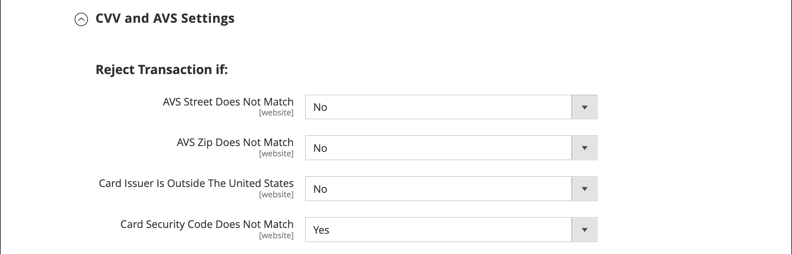

# PayPal Payments Pro

[PayPal Payments Pro][3] le ofrece todas las ventajas de una cuenta de comerciante y una pasarela de pago en uno, además de la capacidad de crear su propia experiencia de pago totalmente personalizada. PayPal Express Checkout se activa automáticamente con PayPal Payments Pro, por lo que puedes acceder a más de 110 millones de usuarios activos de PayPal.

{width="700" zoomable="yes"}

>[!IMPORTANT]
>
>**Requisitos de PSD2:**  
>A partir del 14 de septiembre de 2019, los bancos europeos podrían rechazar los pagos que no cumplan [PSD 2](../getting-started/compliance-payment-services-directive.md) requisitos. Para cumplir con PSD2, PayPal Payments Pro debe estar integrado con un plugin de terceros.

>[!NOTE]
>
>Actualmente, PayPal Payments Pro está disponible en EE. UU., Reino Unido y Canadá.

## Requisitos

- [Cuenta comercial de PayPal][1] (con pagos directos activado)

## Flujo de trabajo de retirada

1. **El cliente va al cierre de compra** - El cliente agrega productos al carro y pulsa o hace clic en ellos _Continuar con el cierre_.|
1. **El cliente elige la forma de pago** - Durante el cierre de compra, el cliente elige la _Pago directo mediante PayPal_ e introduce la información de la tarjeta de crédito.
   - Si paga con PayPal Payments Pro, el cliente permanece en su sitio durante el proceso de pago.
   - Si pagas con PayPal Express Checkout, se redirige al cliente al sitio de PayPal para completar la transacción.

A petición del cliente, el administrador de la tienda también puede crear un pedido desde el administrador y procesar la transacción con PayPal Payments Pro.

## Flujo de trabajo de procesamiento de pedidos

1. **Pedido realizado** - El pedido puede ser procesado por el administrador de tu tienda o desde tu cuenta de PayPal.

1. **[!UICONTROL Payment Action]** - La acción de pago especificada en la configuración se aplica al pedido. Las opciones incluyen:

   - **Autorizar** : Commerce crea un pedido de ventas con _Procesando_ estado. En este caso, la cantidad de dinero que se va a autorizar está pendiente de aprobación.
   - **Venta** : Commerce crea un pedido de venta y una factura.
   - **Capture** - PayPal transfiere el importe del pedido desde el saldo del cliente, la cuenta bancaria o la tarjeta de crédito a la cuenta de comerciante.

1. **Factura** - Se crea una factura en Commerce después de que PayPal envíe un mensaje de notificación de pago instantáneo a Commerce.

   Asegúrate de que las notificaciones de pago instantáneo estén activadas en tu cuenta de PayPal.

   >[!NOTE]
   >
   >Si es necesario, se puede facturar parcialmente un pedido para una cantidad de productos especificada. Para cada factura parcial enviada, se crea una transacción de captura independiente con un ID único y se genera una factura independiente.

   Las transacciones de pago solo de autorización se cierran solo después de capturar el importe completo del pedido.

   Un pedido puede anularse en línea en cualquier momento hasta que el importe del pedido se haya facturado por completo.

1. **Devuelve** - Si el cliente devuelve los productos comprados y solicita un reembolso, como en el caso de la captura del importe del pedido y la creación de la factura, puede crear un reembolso en línea desde el administrador o desde su cuenta comercial de PayPal.

## Configurar tu cuenta PayPal

Antes de configurar PayPal Payments Pro en Commerce, debes configurar tu cuenta de comerciante en el sitio web de PayPal.

1. Inicie sesión en su [Cuenta comercial de PayPal](https://manager.paypal.com/).

1. En el menú Administrador de PayPal, seleccione **[!UICONTROL Service Settings]**.

1. En **[!UICONTROL Hosted Checkout Pages]**, haga clic en **[!UICONTROL Set Up]**.

1. En **[!UICONTROL Choose your settings]**, configurado **[!UICONTROL Transaction Process Mode]** hasta `Live`.

1. En **[!UICONTROL Display options on payment page]**, configurado **[!UICONTROL Cancel URL Method]** hasta `POST`.

1. En **[!UICONTROL Billing Information]**, seleccione el código de seguridad de la tarjeta **[!UICONTROL CSC]** casillas de verificación para los campos obligatorios y editables.

1. En **[!UICONTROL Payment Confirmation]**, configurado **[!UICONTROL Return URL Method]** hasta `POST`.

1. En **[!UICONTROL Security Options]**, configure lo siguiente:

   - **[!UICONTROL AVS]**: `No`
   - **[!UICONTROL CSC]**: `No`
   - **[!UICONTROL Enable Secure Token]**: `Yes`

1. Haga clic **[!UICONTROL Save Changes]**.

1. En el _Administrador de PayPal_ menú, elija **[!UICONTROL Service Settings]** y en _Páginas de cierre de compra alojadas_, elija **[!UICONTROL Customize]**.

1. Elegir **[!UICONTROL Layout C]**.

   El diseño C solo muestra los campos de tarjeta de crédito y débito, y puede enmarcarse en su sitio o utilizarse como ventana emergente independiente. El tamaño se fija en 490 x 565 píxeles, con espacio adicional para mensajes de error. En algunos sistemas, esta configuración corrige un problema con la redirección transparente.

1. Haga clic **[!UICONTROL Save and Publish]**.

1. En el menú Administrador de PayPal, seleccione **[!UICONTROL Account Administration]**. En **[!UICONTROL Manage Security]**, haga clic en **[!UICONTROL Transaction Settings]**.

1. Establecer **[!UICONTROL Allow reference transactions]** hasta `Yes`.

1. Haga clic **[!UICONTROL Confirm]**.

   >[!NOTE]
   >
   >Si tiene varios sitios web de Commerce, debe crear una cuenta PayPal Payments Pro independiente para cada uno.

1. Configurar otro usuario (recomendado por PayPal):

   - En la segunda fila del menú principal, haga clic en **[!UICONTROL Manage Users]**.

   - Para agregar otro usuario a la cuenta, haga clic en **[!UICONTROL Add User]**. El vínculo se encuentra justo encima del título Administrar usuarios.

   - Rellene los campos obligatorios en las siguientes secciones de la _[!UICONTROL Add User]_formulario:

      - [!UICONTROL Admin Confirmation]
      - [!UICONTROL User Information]
      - [!UICONTROL User Login Information]
      - [!UICONTROL Assign Privilege to User]

   - Haga clic **[!UICONTROL Update]**.

1. Asegúrate de cerrar la sesión de tu cuenta PayPal.

## Configuración de PayPal Payments Pro en Commerce

>[!NOTE]
>
>Puedes tener dos soluciones de PayPal activas al mismo tiempo: [Pago y envío con PayPal Express](paypal-express-checkout.md), además de cualquiera de los [soluciones todo en uno](paypal.md#paypal-all-in-one-payment-solutions). Si cambia las soluciones de pago, la que se usaba anteriormente se desactiva automáticamente.

>[!TIP]
>
>Clic **[!UICONTROL Save Config]** en cualquier momento para guardar su progreso.

### Paso 1: Inicio de la configuración

1. En el _Administrador_ barra lateral, vaya a **[!UICONTROL Stores]** > _[!UICONTROL Settings]_>**[!UICONTROL Configuration]**.

1. En el panel izquierdo, expanda **[!UICONTROL Sales]** y elija **[!UICONTROL Payment Methods]**.

1. Si la instalación de Commerce tiene varios sitios web, tiendas o vistas, configure **[!UICONTROL Store View]** vaya a la vista de tienda en la que desee aplicar esta configuración.

1. En el _[!UICONTROL Merchant Location]_, seleccione la **[!UICONTROL Merchant Country]**dónde se encuentra su empresa.

   Esta configuración determina la selección de soluciones de PayPal que aparecen en la configuración.

   {width="600" zoomable="yes"}

1. Expandir **[!UICONTROL PayPal All-in-One Payment Solution]** y haga clic en **[!UICONTROL Configure]** para **[!UICONTROL Payments Pro]**.

   {width="600" zoomable="yes"}

### Paso 2: Completa la configuración de PayPal necesaria

1. Expandir  el **[!UICONTROL Payments Pro and Express Checkout]** sección.

   {width="600" zoomable="yes"}

1. (Opcional) Introduzca el **[!UICONTROL Email Associated with your PayPal Merchant Account]**.

   >[!IMPORTANT]
   >
   >Las direcciones de correo electrónico distinguen entre mayúsculas y minúsculas. Para recibir el pago, la dirección de correo electrónico debe coincidir con la especificada en tu cuenta comercial de PayPal.

   Si no tienes una cuenta PayPal, pulsa **[!UICONTROL Start accepting payments via PayPal]**.

1. Introduzca una de las siguientes credenciales que utiliza para iniciar sesión en su cuenta de comerciante de PayPal:

   - **[!UICONTROL Partner]** - Tu ID de socio de PayPal.
   - **[!UICONTROL Vendor]** - Tu nombre de usuario de PayPal.
   - **[!UICONTROL User]** - El ID de otro usuario que esté configurado en tu cuenta PayPal.

1. Introduzca el **[!UICONTROL Password]** que está asociado con tu cuenta PayPal.

1. Para ejecutar transacciones de prueba, establezca **[!UICONTROL Test Mode]** hasta `Yes`.

   Al probar la configuración en una zona protegida, utilice solo [números de tarjeta de crédito][2] que recomienda PayPal. Cuando esté listo para ir a producción, vuelva a la configuración y establezca el Modo de prueba en `No`.

1. Si su sistema utiliza un servidor proxy para establecer la conexión con el sistema PayPal, establezca **[!UICONTROL Use Proxy]** hasta `Yes` y haga lo siguiente:

   - Introduzca la dirección IP del **[!UICONTROL Proxy Host]**.

   - Introduzca el número de puerto del **[!UICONTROL Proxy Port]**.

   Se utiliza un proxy cuando el cortafuegos del servidor impide el acceso directo al servidor de PayPal. En tal caso, se utiliza un servidor de terceros para transmitir el tráfico.

1. Establecer **[!UICONTROL Enable this Solution]** hasta `Yes`.

1. Si desea ofrecer [Crédito de PayPal](paypal.md#paypal-credit-and-pay-later) a sus clientes, configure **[!UICONTROL Enable PayPal Credit]** hasta `Yes`.

1. Si desea almacenar de forma segura los datos de pago/tarjeta de crédito del cliente, de modo que los clientes no tengan que volver a introducir la información de pago cada vez, establezca **[!UICONTROL Vault Enabled]** hasta `Yes`.

### Paso 3: Configurar el crédito de PayPal / Anunciar PayPal PayAfter (opcional)

A partir de la versión 2.4.3, PayPal PayAfter es compatible con las implementaciones que incluyen PayPal. Esta función permite a los compradores pagar un pedido en cuotas quincenales en lugar de pagar el importe completo en el momento de la compra. La experiencia de crédito de PayPal está en desuso.

Establecer **[!UICONTROL Enable PayPal PayLater Experience]** a uno de los siguientes:

- `Yes` - Para configurar Anunciar PayPal PayAfter
- `No` - Para configurar el crédito de PayPal publicitario

#### Anunciar crédito de PayPal

1. Expandir  el **[!UICONTROL Advertise PayPal Credit]** sección.

   {width="600" zoomable="yes"}

1. Para obtener la información de la cuenta, haga clic en **[!UICONTROL Get Publisher ID from PayPal]** y siga las instrucciones.

1. Introduzca su **[!UICONTROL Publisher ID]**.

1. Expandir  el **[!UICONTROL Home Page]** sección.

   {width="600" zoomable="yes"}

1. Para colocar un banner en la página, establezca **[!UICONTROL Display]** hasta `Yes`.

1. Establecer **[!UICONTROL Position]** a uno de los siguientes:

   - `Header (center)`
   - `Sidebar (right)`

1. Establecer **[!UICONTROL Size]** a uno de los siguientes:

   - `190 x 100`
   - `234 x 60`
   - `300 x 50`
   - `468 x 60`
   - `728 x 90`
   - `800 x 66`

1. Expandir  Utilice las secciones restantes y repita los pasos anteriores:

   - **[!UICONTROL Catalog Category Page]**
   - **[!UICONTROL Catalog Product Page]**
   - **[!UICONTROL Checkout Cart Page]**

#### Anunciar PayPal PayAfter

1. Expandir  el **[!UICONTROL Advertise PayPal PayLater]** sección.

1. Establecer **[!UICONTROL Enable PayPal PayLater]** hasta `Yes`.

1. Expandir  el **[!UICONTROL Home Page]** sección.

   {width="600" zoomable="yes"}

1. Para colocar un banner en la página, establezca **[!UICONTROL Display]** hasta `Yes`.

1. Establecer **[!UICONTROL Position]** a uno de los siguientes:

   - `Header (center)`
   - `Sidebar`

1. Establecer **[!UICONTROL Style Layout]** a uno de los siguientes:

   - `Text`
   - `Flex`

1. Para [!UICONTROL Style Layout] **[!UICONTROL Text]** sólo, establecer **[!UICONTROL Logo Type]** a uno de los siguientes:

   - `Primary`
   - `Alternative`
   - `Inline`
   - `None`

1. Para [!UICONTROL Style Layout] **[!UICONTROL Text]** sólo, establecer **[!UICONTROL Logo Position]** a uno de los siguientes:

   - `Left`
   - `Right`
   - `Top`

1. Para [!UICONTROL Style Layout] **[!UICONTROL Text]** sólo, establecer **[!UICONTROL Text Color]** a uno de los siguientes:

   - `Black`
   - `White`
   - `Monochrome`
   - `Grayscale`

1. Para [!UICONTROL Style Layout] **[!UICONTROL Text]** sólo, establecer **[!UICONTROL Text Size]** a uno de los siguientes:

   - `10px`
   - `11px`
   - `12px`
   - `13px`
   - `14px`
   - `15px`
   - `16px`

1. Para [!UICONTROL Style Layout] **[!UICONTROL Flex]** sólo, establecer **[!UICONTROL Ratio]** a uno de los siguientes:

   - `1x1`
   - `1x4`
   - `8x1`
   - `20x1`

1. Para [!UICONTROL Style Layout] **[!UICONTROL Flex]** sólo, establecer **[!UICONTROL Color]** a uno de los siguientes:

   - `Blue`
   - `Black`
   - `White`
   - `White No Border`
   - `Gray`
   - `Monochrome`
   - `Grayscale`

1. Expandir  Utilice las secciones restantes y repita los pasos anteriores:

   - **[!UICONTROL Catalog Product Page]**
   - **[!UICONTROL Checkout Cart Page]**
   - **[!UICONTROL Checkout Payment Step]**
   - **[!UICONTROL Catalog Category Page]**

### Paso 4: completar la configuración básica

1. Expandir  el **[!UICONTROL Basic Settings - PayPal Payments Pro]** sección.

   {width="600" zoomable="yes"}

1. Para **[!UICONTROL Title]**, introduce un título que identifique PayPal Payments Pro durante el proceso de pago.

   Se recomienda utilizar el título _Tarjeta de débito o crédito_.

1. Si ofreces varias formas de pago, introduce un número para **[!UICONTROL Sort Order]** para determinar la secuencia en la que PayPal Payments Pro aparece cuando se enumera con otros métodos de pago durante el proceso de pago.

   Este número es relativo a las otras formas de pago. (`0` = primero, `1` = segundo, `2` = tercero, etc.)

1. Establecer **[!UICONTROL Payment Action]** a uno de los siguientes:

   - `Authorization` - Aprueba la compra, pero suspende los fondos. El importe no se retira hasta que se _capturado_ por el comerciante.
   - `Sale` - El importe de la compra se autoriza y se retira inmediatamente de la cuenta del cliente.

1. Para **[!UICONTROL Credit Card Settings]**, selecciona las tarjetas de crédito que aceptas para el pago en tu tienda.

   Para seleccionar varias tarjetas, mantenga presionada la tecla Ctrl (PC) o la tecla Comando (Mac) y haga clic en cada una de ellas.

   >[!NOTE]
   >
   >American Express requiere un acuerdo adicional.

### Paso 5: Completar la configuración avanzada

1. Expandir  el **[!UICONTROL Advanced Settings]** sección.

   {width="600" zoomable="yes"}

1. Establecer **[!UICONTROL Payment Applicable From]** a uno de los siguientes:

   - `All Allowed Countries` - Clientes de todos [países](../getting-started/store-details.md#country-options) especificado en la configuración de tu tienda puede utilizar este método de pago.
   - `Specific Countries` : Después de elegir esta opción, el _[!UICONTROL Payment from Specific Countries]_aparece una lista. Mantenga pulsada la tecla Ctrl (PC) o la tecla Comando (Mac) y seleccione cada país de la lista donde los clientes pueden realizar compras en su tienda.

1. Para escribir comunicaciones con el sistema de pago en el fichero de registro, defina **[!UICONTROL Debug Mode]** hasta `Yes`.

   >[!NOTE]
   >
   >De acuerdo con las normas de seguridad de datos PCI, la información de la tarjeta de crédito no se registra en el archivo de registro.

1. Para habilitar la verificación de autenticidad del host, establezca **[!UICONTROL Enable SSL Verification]** hasta `Yes`.

1. Para exigir a los clientes que introduzcan un código CVV, establezca **[!UICONTROL Require CVV Entry]** hasta `Yes`.

1. Expandir  el **[!UICONTROL CVV and AVS Settings]** sección.

1. Para determinar cuándo se debe rechazar una transacción cuando el sistema de verificación de direcciones identifica una discrepancia, especifique cómo manejar cada uno de los siguientes escenarios:

   - Para rechazar una transacción basada en una discordancia de calle no coincidente, establezca **[!UICONTROL AVS Street Does Not Match]** hasta `Yes`.

   - Para rechazar una transacción basada en un código postal no coincidente, establezca **[!UICONTROL AVS Zip Does Not Match]** hasta `Yes`.

   - Para rechazar una transacción basándose en un identificador de país que no coincide, establezca **[!UICONTROL International AVS Indicator Does Not Match]** hasta `Yes`.

   - Para rechazar una transacción basada en un código CVV no coincidente, establezca **[!UICONTROL International Card Security Code Does Not Match]** hasta `Yes`.

   {width="600" zoomable="yes"}

1. Complete las siguientes secciones, según sea necesario para su tienda:

   - [Configuración del informe de liquidación](#settlement-report-settings)
   - [Configuración de experiencia de front-end](#frontend-experience-settings)

#### Configuración del informe de liquidación

1. Expandir  el **[!UICONTROL Settlement Report Settings]** sección.

   {width="600" zoomable="yes"}

1. Para **[!UICONTROL SFTP Credentials]**, haga lo siguiente:

   - Si te has registrado en el servidor FTP seguro de PayPal, introduce las siguientes credenciales de inicio de sesión en el SFTP:

      - Iniciar sesión
      - Contraseña

   - Para ejecutar informes de prueba antes de empezar a utilizar Payments Pro en su sitio, establezca **[!UICONTROL Sandbox Mode]** hasta `Yes`.

   - Introduzca el **[!UICONTROL Custom Endpoint Hostname or IP Address]**.

     El valor predeterminado es `reports.paypal.com`.

   - Introduzca el **[!UICONTROL Custom Path]** donde se guardan los informes.

     El valor predeterminado es `/ppreports/outgoing`.

1. Para generar informes de acuerdo con una programación, complete la **[!UICONTROL Scheduled Fetching]** configuración:

   - Establecer **[!UICONTROL Enable Automatic Fetching]** hasta `Yes`.

   - Establecer **[!UICONTROL Schedule]** a uno de los siguientes:

      - `Daily`
      - `Every 3 Days`
      - `Every 7 Days`
      - `Every 10 Days`
      - `Every 14 Days`
      - `Every 30 Days`
      - `Every 40 Days`

     PayPal conserva cada informe durante 45 días.

   - Establecer **[!UICONTROL Time of Day]** a la hora, los minutos y el segundo en que desea que se generen los informes.

#### Configuración de experiencia de front-end

Utilice el _[!UICONTROL Frontend Experience Settings]_para elegir qué logotipos de PayPal aparecen en el sitio y personalizar el aspecto de las páginas de comerciantes de PayPal.

1. Expandir  el **[!UICONTROL Frontend Experience Settings]** sección.

   {width="600" zoomable="yes"}

1. Seleccione el **[!UICONTROL PayPal Product Logo]** que deseas que aparezca en el bloque de PayPal de tu tienda.

   Los logotipos de PayPal están disponibles en cuatro estilos y dos tamaños:

   - `No Logo`
   - `We Prefer PayPal (150 x 60 or 150 x 40)`
   - `Now Accepting PayPal (150 x 60 or 150 x 40)`
   - `Payments by PayPal (150 x 60 or 150 x 40)`
   - `Shop Now Using PayPal (150 x 60 or 150 x 40)`

1. Para personalizar el aspecto de las páginas de comerciantes de PayPal, haga lo siguiente:

   - Introduzca el nombre del **[!UICONTROL Page Style]** que desee aplicar a sus páginas de comerciante de PayPal:

      - `paypal` - Utiliza el estilo de página PayPal.
      - `primary` : Utiliza el estilo de página identificado como. _principal_ Estilo de en el perfil de la cuenta.
      - `your_custom_value` : Utiliza un estilo de página de pago personalizado, que se especifica en el perfil de la cuenta.

   - Para **[!UICONTROL Header Image URL]**, introduzca la dirección URL de la imagen que desea que aparezca en la esquina superior izquierda de la página de pago. El tamaño máximo de archivo es de 750 píxeles de ancho por 90 píxeles de alto.

     >[!NOTE]
     >
     >PayPal recomienda que la imagen resida en un servidor seguro (https). De lo contrario, un explorador puede advertir que _la página contiene elementos seguros y no seguros_.

   - Para establecer el color de las páginas, escriba el código hexadecimal de seis caracteres, sin el `#` símbolo, para cada una de las siguientes opciones:

      - **[!UICONTROL Header Background Color]** - Color de fondo del encabezado de la página de pago.
      - **[!UICONTROL Header Border Color]** - Color del borde de dos píxeles alrededor del encabezado.
      - **[!UICONTROL Page Background Color]** - Color de fondo para la página de pago y alrededor de la cabecera y el formulario de pago.

### Paso 6: Completa la configuración básica de Pago y envío de PayPal Express

1. Expandir  el **[!UICONTROL Basic Settings - PayPal Express Checkout]** sección.

   {width="600" zoomable="yes"}

1. Para **[!UICONTROL Title]**, introduce un título que identifique esta forma de pago durante el proceso de pago.

   Configuración del título en _PayPal_ se recomienda para cada vista de tienda.

1. Si ofreces varias formas de pago, introduce un número para **[!UICONTROL Sort Order]** para determinar la secuencia en la que aparece Pago y envío de PayPal Express cuando se pone en venta con las otras formas de pago.

   Este número es relativo a las otras formas de pago. (`0` = primero, `1` = segundo, `2` = tercero, etc.)

1. Establecer **[!UICONTROL Payment Action]** a uno de los siguientes:

   - `Authorization` - Aprueba la compra y suspende los fondos. El importe no se retira hasta que se _capturado_ por el comerciante.
   - `Sale` - El importe de la compra se autoriza y se retira inmediatamente de la cuenta del cliente.

1. Para mostrar el _[!UICONTROL Check out with PayPal]_botón en la página de producto, establecer **[!UICONTROL Display on Product Details Page]**hasta `Yes`.

### Paso 7: Completa la configuración avanzada de Pago y envío de PayPal Express

1. Expandir  el **[!UICONTROL Advanced Settings]** sección.

   {width="600" zoomable="yes"}

1. Establecer **[!UICONTROL Display on Shopping Cart]** hasta `Yes`.

1. Establecer **[!UICONTROL Payment Applicable From]** a uno de los siguientes:

   - `All Allowed Countries` - Clientes de todos [países](../getting-started/store-details.md#country-options) especificado en la configuración de tu tienda puede utilizar este método de pago.
   - `Specific Countries` : Después de elegir esta opción, el _[!UICONTROL Payment from Specific Countries]_aparece una lista. Para seleccionar varios países, mantenga presionada la tecla Ctrl (PC) o la tecla Comando (Mac) y haga clic en cada elemento.

1. Para escribir comunicaciones con el sistema de pago en el fichero de registro, defina **[!UICONTROL Debug Mode]** hasta `Yes`.

   >[!NOTE]
   >
   >De acuerdo con las normas de seguridad de datos PCI, la información de la tarjeta de crédito no se registra en el archivo de registro.

1. Para habilitar la verificación de autenticidad del host, establezca **[!UICONTROL Enable SSL Verification]** hasta `Yes`.

1. Para mostrar un resumen completo del pedido del cliente por artículo de línea desde el sitio de PayPal, establezca **[!UICONTROL Transfer Cart Line Items]** hasta `Yes`.

1. Para permitir que el cliente complete la transacción desde el sitio de PayPal sin volver a su tienda para la revisión del pedido, establezca **[!UICONTROL Skip Order Review Step]** hasta `Yes`.

1. Cuando termine, haga clic en **[!UICONTROL Save Config]**.

[1]: https://www.paypal.com/webapps/mpp/how-to-sell-online
[2]: https://www.paypalobjects.com/en_AU/vhelp/paypalmanager_help/credit_card_numbers.htm
[3]: https://developer.paypal.com/docs/paypal-payments-pro/
