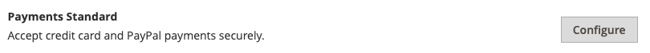

# PayPal Payments Standard

[PayPal Payments Standard][4] es la forma más sencilla de aceptar pagos en línea. Puedes ofrecer a tus clientes la comodidad del pago con tarjeta de crédito y PayPal simplemente añadiendo un botón de pago y envío a tu tienda.

>[!NOTE]
>
>Para los comerciantes fuera de los Estados Unidos, se denomina _Estándar de pagos del sitio web de PayPal_.

Con PayPal Payments Standard, puedes deslizar tarjetas de crédito en dispositivos móviles. No hay cuota mensual y puedes recibir el pago a través de eBay. Las tarjetas de crédito compatibles incluyen Visa, MasterCard, Discover y American Express. Además, los clientes pueden pagar directamente desde sus cuentas personales de PayPal. PayPal Payments Standard está disponible en todos los países de la lista de referencia mundial de PayPal.

>[!IMPORTANT]
>
>**Requisitos de PSD2:**  
>A partir del 14 de septiembre de 2019, los bancos europeos podrían rechazar los pagos que no cumplan los requisitos de [PSD2](../getting-started/compliance-payment-services-directive.md). PayPal Payments Standard no debe llevar a cabo ninguna acción para cumplir con PSD2, ya que PayPal gestiona todos los requisitos.

## Requisitos del comerciante

- [Cuenta comercial de PayPal][1]

## Flujo de trabajo de retirada

Para los clientes, PayPal Payments Standard es un proceso de un solo paso si la información de la tarjeta de crédito de sus cuentas personales de PayPal está actualizada.

1. **El cliente hace un pedido** - El cliente hace clic o pulsa el botón _Pagar ahora_ para completar la compra.

1. **PayPal procesa la transacción**: se redirige al cliente al sitio de PayPal para completar la transacción.

## Configurar PayPal Payments Standard

>[!NOTE]
>
>PayPal Payments Standard no se puede utilizar simultáneamente con ningún otro método de PayPal, incluido el Pago y envío exprés. Si cambia las soluciones de pago, la utilizada anteriormente queda desactivada.

>[!TIP]
>
>Haga clic en **[!UICONTROL Save Config]** en cualquier momento para guardar el progreso.

### Paso 1: Inicio de la configuración

Este método de configuración supone que ya tienes una cuenta PayPal.

1. En la barra lateral _Admin_, vaya a **[!UICONTROL Stores]** > _[!UICONTROL Settings]_>**[!UICONTROL Configuration]**.

1. En el panel izquierdo, expanda **[!UICONTROL Sales]** y elija **[!UICONTROL Payment Methods]**.

1. Si la instalación de Commerce tiene varios sitios web, tiendas o vistas, establezca **[!UICONTROL Store View]** en la vista de tienda en la que desee aplicar esta configuración.

1. En la sección _[!UICONTROL Merchant Location]_, seleccione **[!UICONTROL Merchant Country]**donde se encuentra su empresa.

   Esta configuración determina la selección de soluciones de PayPal que aparecen en la configuración.

   {width="600" zoomable="yes"}

1. Expanda **[!UICONTROL PayPal All-in-One Payment Solutions]** y haga clic en **[!UICONTROL Configure]** para **[!UICONTROL Payments Standard]**.

   {width="700" zoomable="yes"}

### Paso 2: Activar y conectar tu cuenta PayPal

{width="600" zoomable="yes"}

1. Conecte su cuenta para pruebas o producción:

   - Para probar (desarrollo), haz clic en **[!UICONTROL Sandbox Credentials]** e introduce tus credenciales de [PayPal sandbox][3].
   - Para el modo de producción, haga clic en **[!UICONTROL Connect with PayPal]** e introduzca sus credenciales de cuenta de producción.

   Cuando valide la conexión, puede continuar.

1. Establezca **[!UICONTROL Enable this Solution]** en `Yes`.

1. Si quieres ofrecer [crédito de PayPal](paypal.md#paypal-credit-and-pay-later) a tus clientes, establece **[!UICONTROL Enable PayPal Credit]** en `Yes`.

### Paso 3: Completar la configuración de normas de pago

1. Expanda  en la sección **[!UICONTROL Payments Standard]**.

   {width="600" zoomable="yes"}

1. Escriba **[!UICONTROL Email Associated with your PayPal Merchant Account]**.

   >[!IMPORTANT]
   >
   >Las direcciones de correo electrónico distinguen entre mayúsculas y minúsculas. Para recibir el pago, la dirección de correo electrónico que introduzcas debe coincidir con la especificada en tu cuenta comercial de PayPal.

   Si no tiene una cuenta PayPal, haga clic en **[!UICONTROL Start accepting payments via PayPal]**.

1. Establezca **[!UICONTROL API Authentication Methods]** en una de las siguientes opciones:

   - `API Signature`: este método de autenticación de PayPal es el más fácil de implementar y se basa en tu nombre de usuario, contraseña y una cadena única de caracteres y números que identifican tu cuenta. Las credenciales de la firma API no caducan.
   - `API Certificate`: este método de autenticación de PayPal es más seguro y se basa en el nombre de usuario, la contraseña y un certificado descargable. Las credenciales de la API caducan al cabo de tres años y deben renovarse.

   Si es necesario, complete lo siguiente:

   - **[!UICONTROL API Username]**
   - **[!UICONTROL API Password]**
   - **[!UICONTROL API Signature]**

1. Si está usando credenciales de su cuenta de zona protegida, establezca **[!UICONTROL Sandbox Mode]** en `Yes`.

   Al probar la configuración en una zona protegida, usa solo [números de tarjeta de crédito][2] recomendados por PayPal. Cuando esté listo para ir a producción, vuelva a la configuración y establezca el modo de espacio aislado en `No` y conéctese a su cuenta de producción de PayPal.

1. Si su sistema utiliza un servidor proxy para establecer la conexión entre Adobe Commerce o Magento Open Source y el sistema de pago de PayPal, establezca **[!UICONTROL API Uses Proxy]** en `Yes` y complete lo siguiente:

   - **[!UICONTROL Proxy Host]**
   - **[!UICONTROL Proxy Port]**

### Paso 4: Configurar el crédito de PayPal publicitario / Anunciar PayPal PayAfter (opcional)

A partir de la versión 2.4.3, PayPal PayAfter es compatible con las implementaciones que incluyen PayPal. Esta función permite a los compradores pagar un pedido en cuotas quincenales en lugar de pagar el importe completo en el momento de la compra. La experiencia de crédito de PayPal está en desuso.

Establezca **[!UICONTROL Enable PayPal PayLater Experience]** en una de las siguientes opciones:

- `Yes` - Para configurar Anunciar PayPal PayAfter
- `No` - Para configurar el crédito de PayPal publicitario

#### Anunciar crédito de PayPal

1. Expanda  en la sección **[!UICONTROL Advertise PayPal Credit]**.

   {width="600" zoomable="yes"}

1. Para obtener la información de su cuenta, haga clic en **[!UICONTROL Get Publisher ID from PayPal]** y siga las instrucciones.

1. Escriba su **[!UICONTROL Publisher ID]**.

   {width="600" zoomable="yes"}

1. Expanda  en la sección **[!UICONTROL Home Page]**.

1. Para colocar un banner en la página, establezca **[!UICONTROL Display]** en `Yes`.

1. Establezca **[!UICONTROL Position]** en una de las siguientes opciones:

   - `Header (center)`
   - `Sidebar (right)`

1. Establezca **[!UICONTROL Size]** en una de las siguientes opciones:

   - `190 x 100`
   - `234 x 60`
   - `300 x 50`
   - `468 x 60`
   - `728 x 90`
   - `800 x 66`

1. Expanda  las secciones restantes y repita los pasos anteriores:

   - **[!UICONTROL Catalog Category Page]**
   - **[!UICONTROL Catalog Product Page]**
   - **[!UICONTROL Checkout Cart Page]**

#### Anunciar PayPal PayAfter

1. Expanda  en la sección **[!UICONTROL Advertise PayPal PayLater]**.

1. Establezca **[!UICONTROL Enable PayPal PayLater]** en `Yes`.

1. Expanda  en la sección **[!UICONTROL Home Page]**.

   {width="600" zoomable="yes"}

1. Para colocar un banner en la página, establezca **[!UICONTROL Display]** en `Yes`.

1. Establezca **[!UICONTROL Position]** en una de las siguientes opciones:

   - `Header (center)`
   - `Sidebar`

1. Establezca **[!UICONTROL Style Layout]** en una de las siguientes opciones:

   - `Text`
   - `Flex`

1. Solo para [!UICONTROL Style Layout] **[!UICONTROL Text]**, establezca **[!UICONTROL Logo Type]** en uno de los siguientes:

   - `Primary`
   - `Alternative`
   - `Inline`
   - `None`

1. Solo para [!UICONTROL Style Layout] **[!UICONTROL Text]**, establezca **[!UICONTROL Logo Position]** en uno de los siguientes:

   - `Left`
   - `Right`
   - `Top`

1. Solo para [!UICONTROL Style Layout] **[!UICONTROL Text]**, establezca **[!UICONTROL Text Color]** en uno de los siguientes:

   - `Black`
   - `White`
   - `Monochrome`
   - `Grayscale`

1. Solo para [!UICONTROL Style Layout] **[!UICONTROL Text]**, establezca **[!UICONTROL Text Size]** en uno de los siguientes:

   - `10px`
   - `11px`
   - `12px`
   - `13px`
   - `14px`
   - `15px`
   - `16px`

1. Solo para [!UICONTROL Style Layout] **[!UICONTROL Flex]**, establezca **[!UICONTROL Ratio]** en uno de los siguientes:

   - `1x1`
   - `1x4`
   - `8x1`
   - `20x1`

1. Solo para [!UICONTROL Style Layout] **[!UICONTROL Flex]**, establezca **[!UICONTROL Color]** en uno de los siguientes:

   - `Blue`
   - `Black`
   - `White`
   - `White No Border`
   - `Gray`
   - `Monochrome`
   - `Grayscale`

1. Expanda  las secciones restantes y repita los pasos anteriores:

   - **[!UICONTROL Catalog Product Page]**
   - **[!UICONTROL Checkout Cart Page]**
   - **Paso de pago y envío**
   - **[!UICONTROL Catalog Category Page]**

### Paso 5: completar la configuración básica

1. Expanda  en la sección **[!UICONTROL Basic Settings - PayPal Website Payments Standard]**.

   {width="600" zoomable="yes"}

1. Para **[!UICONTROL Title]**, escribe un título que identifique este método de pago durante el cierre de compra.

   Se recomienda usar el título _PayPal_ para todas las vistas de la tienda.

1. Si ofrece varias formas de pago, introduzca un número para **[!UICONTROL Sort Order]** a fin de determinar la secuencia en la que PayPal Payments Standard aparece cuando se incluye con las otras formas de pago.

   Este número es relativo a las otras formas de pago. (`0` = primero, `1` = segundo, `2` = tercero, etc.)

1. Establezca **[!UICONTROL Payment Action]** en una de las siguientes opciones:

   - `Authorization` - Aprueba la compra y suspende los fondos. La cantidad no se retira hasta que sea capturada por el comerciante.
   - `Sale`: el importe de la compra se autoriza y se retira inmediatamente de la cuenta del cliente.

1. Para mostrar el botón _[!UICONTROL Check out with PayPal]_en la página de productos, establezca **[!UICONTROL Display on Product Details Page]**en `Yes`.

### Paso 6: Completar la configuración avanzada

1. Expanda  en la sección **[!UICONTROL Advanced Settings]**.

   {width="600" zoomable="yes"}

1. Para que PayPal Payments Standard esté disponible tanto en el carro de compras como en el minicarrito, establezca **[!UICONTROL Display on Shopping Cart]** en `Yes`.

1. Establezca **[!UICONTROL Payment from Applicable Countries]** en una de las siguientes opciones:

   - `All Allowed Countries`: los clientes de todos los [países](../getting-started/store-details.md#country-options) especificados en la configuración de su tienda pueden usar este método de pago.
   - `Specific Countries` - Después de elegir esta opción, aparece la lista _[!UICONTROL Payment from Specific Countries]_. Para seleccionar varios países, mantenga pulsada la tecla Ctrl (PC) o la tecla Comando (Mac) y haga clic en cada opción.

1. Para registrar las comunicaciones con el sistema de pago en el archivo de registro, establezca **[!UICONTROL Debug Mode]** en `Yes`.

   >[!NOTE]
   >
   >El archivo de registro se almacena en el servidor y solo pueden acceder a él los desarrolladores. De acuerdo con las normas de seguridad de datos PCI, la información de la tarjeta de crédito no se registra en el archivo de registro.

1. Para habilitar la verificación SSL, establezca **[!UICONTROL Enable SSL Verification]** en `Yes`.

1. Para mostrar un resumen de cada elemento de línea en el pedido de la página de pagos de PayPal, establezca **[!UICONTROL Transfer Cart Line Items]** en `Yes`.

   Para incluir hasta diez opciones de envío en el resumen, establezca **[!UICONTROL Transfer Shipping Options]** en `Yes`. (Esta opción sólo aparece si los elementos de línea están configurados para transferir.)

1. Para determinar el tipo de imagen que se usa para el botón de aceptación de PayPal, establezca **[!UICONTROL Shortcut Buttons Flavor]** en una de las siguientes opciones:

   - `Dynamic` - (Recomendado) Muestra una imagen que se puede cambiar dinámicamente desde el servidor PayPal.
   - `Static` - Muestra una imagen específica que no se puede cambiar dinámicamente.

1. Para permitir que los clientes que no tengan una cuenta PayPal puedan realizar una compra con este método, establezca **[!UICONTROL Enable PayPal Guest Checkout]** en `Yes`.

1. Establezca **[!UICONTROL Require Customer's Billing Address]** en una de las siguientes opciones:

   - `Yes` - Requiere la dirección de facturación del cliente para todas las compras.
   - `No` - No requiere la dirección de facturación del cliente para ninguna compra.
   - `For Virtual Quotes Only` - Requiere la dirección de facturación del cliente solamente para las ofertas virtuales.

1. Para permitir que un cliente firme un [acuerdo de facturación de PayPal](paypal-billing-agreements.md) con su tienda cuando no haya acuerdos de facturación activos disponibles en la cuenta de cliente, establezca **[!UICONTROL Billing Agreement Signup]** en una de las siguientes opciones:

   - `Auto`: el cliente puede firmar un acuerdo de facturación durante el flujo de cierre de compra exprés o usar otro método de pago.
   - `Ask Customer`: el cliente puede decidir si desea celebrar un acuerdo de facturación durante el flujo de trabajo de cierre de compra exprés.
   - `Never`: el cliente no puede firmar un acuerdo de facturación durante el flujo de trabajo de cierre de compra rápido.

   >[!NOTE]
   >
   >Los comerciantes deben solicitar la Asistencia técnica del comerciante de PayPal para habilitar los acuerdos de facturación en sus cuentas. El parámetro _Suscripción al contrato de facturación_ solo se puede habilitar después de que PayPal confirme que los contratos de facturación están habilitados para tu cuenta de comerciante.

1. Para permitir que el cliente complete la transacción desde el sitio de PayPal sin volver a su tienda para la revisión de pedidos, establezca **[!UICONTROL Skip Order Review Step]** en `Yes`.

### Paso 7: Complete y guarde los ajustes de configuración

1. Complete las siguientes secciones, según sea necesario para su tienda:

   - [Configuración del acuerdo de facturación de PayPal](#paypal-billing-agreement-settings)
   - [Configuración del informe de liquidación](#settlement-report-settings)
   - [Configuración de experiencia de front-end](#frontend-experience-settings)

1. Una vez finalizado, haga clic en **[!UICONTROL Save Config]**.

#### Configuración del acuerdo de facturación de PayPal

Un [acuerdo de facturación](paypal-billing-agreements.md) es un acuerdo de venta entre el comerciante y el cliente que PayPal ha autorizado para usarlo con varios pedidos. Durante el proceso de cierre de compra, la opción de pago Acuerdo de facturación solo aparece para los clientes que ya han formalizado un acuerdo de facturación con su compañía. Una vez que PayPal autoriza el acuerdo, el sistema de pago emite un ID de referencia único para identificar cada pedido asociado con el acuerdo. Al igual que en un pedido de compra, no hay límite en el número de acuerdos de facturación que un cliente puede establecer con su compañía.

1. Expanda  en la sección **[!UICONTROL PayPal Billing Agreement Settings]**.

   {width="600" zoomable="yes"}

1. Establezca **[!UICONTROL Enabled]** en `Yes`.

1. Para **[!UICONTROL Title]**, escribe un título que identifique el método del Contrato de facturación de PayPal durante el cierre de compra.

1. Si ofrece varios métodos de pago, ingrese un número en el campo **[!UICONTROL Sort Order]** para determinar la secuencia en la que aparece el Contrato de facturación cuando se enumera con otros métodos de pago durante el cierre de compra.

1. Establezca **[!UICONTROL Payment Action]** en una de las siguientes opciones:

   - `Authorization` - Aprueba la compra y suspende los fondos. La cantidad no se retira hasta que sea &quot;capturada&quot; por el comerciante.
   - `Sale`: el importe de la compra se autoriza y se retira inmediatamente de la cuenta del cliente.

1. Establezca **[!UICONTROL Payment Applicable From]** en una de las siguientes opciones:

   - `All Allowed Countries`: los clientes de todos los países especificados en la configuración de la tienda pueden utilizar este método de pago.
   - `Specific Countries` - Después de elegir esta opción, aparece la lista _[!UICONTROL Payment from Specific Countries]_. Para seleccionar varios países, mantenga pulsada la tecla Ctrl (PC) o la tecla Comando (Mac) y haga clic en cada uno de ellos.

1. Para registrar las comunicaciones con el sistema de pago en el archivo de registro, establezca **[!UICONTROL Debug Mode]** en `Yes`.

   >[!NOTE]
   >
   >El archivo de registro se almacena en el servidor y solo pueden acceder a él los desarrolladores. De acuerdo con las normas de seguridad de datos PCI, la información de la tarjeta de crédito no se registra en el archivo de registro.

1. Para habilitar la verificación SSL, establezca **[!UICONTROL Enable SSL Verification]** en `Yes`.

1. Para mostrar un resumen de cada elemento de línea en el pedido del cliente en su página de pagos de PayPal, establezca **[!UICONTROL Transfer Cart Line Items]** en `Yes`.

1. Para permitir que los clientes inicien un acuerdo de facturación desde el panel de su cuenta de cliente, establezca **[!UICONTROL Allow in Billing Agreement Wizard]** en `Yes`.

#### Configuración del informe de liquidación

1. Expanda  en la sección **[!UICONTROL Settlement Report Settings]**.

   {width="600" zoomable="yes"}

1. Para **[!UICONTROL SFTP Credentials]**, haga lo siguiente:

   - Si se ha registrado en el servidor FTP seguro de PayPal, introduzca las siguientes credenciales de inicio de sesión en el SFTP:

      - Iniciar sesión
      - Contraseña

   - Para ejecutar informes de prueba antes de publicar el cierre de compra rápido en el sitio, establezca **[!UICONTROL Sandbox Mode]** en `Yes`.

   - Escriba **[!UICONTROL Custom Endpoint Hostname or IP Address]**.

     De manera predeterminada, el valor es `reports.paypal.com`.

   - Escriba **[!UICONTROL Custom Path]** donde se guardan los informes.

     De manera predeterminada, el valor es `/ppreports/outgoing`.

1. Para generar informes de acuerdo con una programación, complete la configuración de **[!UICONTROL Scheduled Fetching]**:

   - Establezca **[!UICONTROL Enable Automatic Fetching]** en `Yes`.

   - Establezca **[!UICONTROL Schedule]** en una de las siguientes opciones:

      - `Daily`
      - `Every 3 Days`
      - `Every 7 Days`
      - `Every 10 Days`
      - `Every 14 Days`
      - `Every 30 Days`
      - `Every 40 Days`

     PayPal conserva cada informe durante 45 días.

   - Establezca **[!UICONTROL Time of Day]** a las horas, minutos y segundos en que desea que se generen los informes.

#### Configuración de experiencia de front-end

Use _[!UICONTROL Frontend Experience Settings]_para elegir los logotipos de PayPal que aparecerán en el sitio y personalizar el aspecto de las páginas de comerciantes de PayPal.

1. Expanda  en la sección **[!UICONTROL Frontend Experience Settings]**.

   {width="600" zoomable="yes"}

1. Seleccione el(la) **[!UICONTROL PayPal Product Logo]** que desea que aparezca en el bloque de PayPal de su tienda.

   Los logotipos de PayPal están disponibles en cuatro estilos y dos tamaños:

   - `No Logo`
   - `We Prefer PayPal (150 x 60 or 150 x 40)`
   - `Now Accepting PayPal (150 x 60 or 150 x 40)`
   - `Payments by PayPal (150 x 60 or 150 x 40)`
   - `Shop Now Using PayPal (150 x 60 or 150 x 40)`

1. Para personalizar el aspecto de las páginas de comerciantes de PayPal:

   - Escriba el nombre de **[!UICONTROL Page Style]** que desea aplicar a sus páginas de comerciante de PayPal:

      - `paypal`: utiliza el estilo de página de PayPal.
      - `primary`: utiliza el estilo de página que identificó como estilo _principal_ en el perfil de la cuenta.
      - `your_custom_value`: utiliza un estilo de página de pago personalizado, que se especifica en el perfil de la cuenta.

   - Para **[!UICONTROL Header Image URL]**, escriba la dirección URL de la imagen que desea que aparezca en la esquina superior izquierda de la página de pago. El tamaño máximo de archivo es de 750 píxeles de ancho por 90 píxeles de alto.

     >[!NOTE]
     >
     >PayPal recomienda que la imagen resida en un servidor seguro (https). De lo contrario, un explorador podría advertir que _la página contiene elementos seguros y no seguros_.

   - Para establecer el color de las páginas, escriba el código hexadecimal de seis caracteres, sin el símbolo `#`, para cada uno de los siguientes elementos:

      - **[!UICONTROL Header Background Color]** - Color de fondo del encabezado de la página de pago.
      - **[!UICONTROL Header Border Color]** - Color para borde de dos píxeles alrededor del encabezado.
      - **[!UICONTROL Page Background Color]**: color de fondo de la página de pago y alrededor del encabezado y del formulario de pago.

[1]: https://www.paypal.com/webapps/mpp/how-to-sell-online
[2]: https://www.paypalobjects.com/en_AU/vhelp/paypalmanager_help/credit_card_numbers.htm
[3]: https://developer.paypal.com/docs/api-basics/sandbox/
[4]: https://developer.paypal.com/docs/paypal-payments-standard/mobile-paypal-payments-standard/
