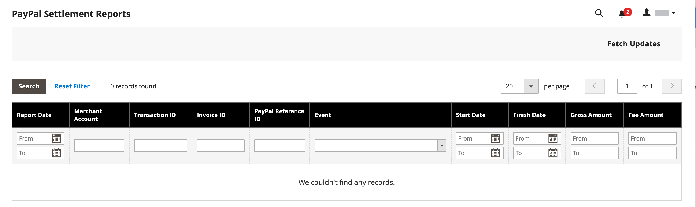

# Informe Liquidación de PayPal

El informe Liquidación de PayPal proporciona a los comerciantes información sobre cada transacción que afecta a la liquidación de fondos.

>[!NOTE]
>
>Antes de generar los informes de liquidación, el administrador de la tienda debe solicitar a Servicios técnicos de comerciante de PayPal que cree una cuenta de usuario SFTP, que habilite la generación de informes de liquidación y que habilite SFTP en su cuenta comercial de PayPal.

Después de configurar y habilitar los informes de liquidación en la cuenta de comerciante de PayPal, Adobe Commerce y Magento Open Source empezarán a generar informes durante las 24 horas siguientes. La lista de los informes de liquidación disponibles se puede ver desde el Administrador.

**_Para ver los informes de liquidación:_**

1. En la barra lateral _Admin_, vaya a **[!UICONTROL Reports]** > _[!UICONTROL Sales]_>**[!UICONTROL PayPal Settlement]**.

   {width="600" zoomable="yes"}

1. Para las actualizaciones más recientes, haga clic en **[!UICONTROL Fetch Updates]** en la esquina superior derecha.

   El sistema se conecta al servidor SFTP de PayPal para recuperar los informes. Cuando se completa el proceso, aparece un mensaje con el número de informes recuperados. El informe incluye la siguiente información para cada transacción:

   | Columna del informe | Descripción |
   | ------------ | ----------- |
   | [!UICONTROL PayPal Reference ID Type] | Uno de los siguientes códigos de referencia: - ID de pedido - ID de transacción - ID de suscripción |
   | [!UICONTROL Preapproved Payment ID] | **[!UICONTROL Custom]**: el texto escrito por el comerciante en la transacción en PayPal. **[!UICONTROL Transaction Debit or Credit]**- La dirección del movimiento de dinero de importe bruto. **[!UICONTROL Fee Debit or Credit]** - La dirección del movimiento de dinero por honorarios. |

   {style="table-layout:auto"}
