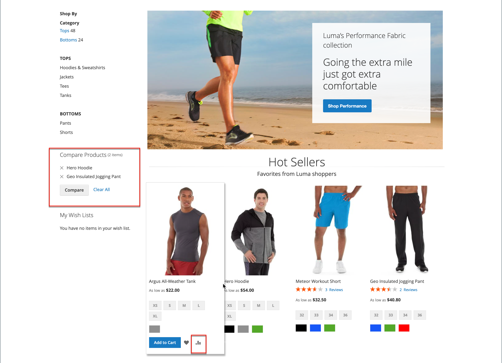

# Comparar productos

Comparar productos genera una comparación detallada y paralela de dos o más productos. Según la temática, el vínculo Agregar para comparar puede representarse mediante un icono o texto. El bloque _Comparar productos_ suele aparecer en la barra lateral izquierda o derecha de una página de catálogo.

{width="700" zoomable="yes"}

A diferencia del bloque [Productos vistos/comparados recientemente](products-viewed-compared.md), el administrador no incluye ajustes de configuración adicionales para Comparar productos.

## Comparar productos en la tienda

Hay algunas maneras de usar la lista de comparación en la tienda.

### Desde páginas del catálogo

1. El cliente encuentra los productos que desea comparar y hace clic en el vínculo **[!UICONTROL Add to Compare]** de cada uno.

1. Se desplaza a una página de categoría asociada.

   Según el tema y el diseño de página, podría haber un bloque _Comparar productos_ en la barra lateral. Si es así, se enumeran los elementos de la categoría que se han marcado para la comparación.

   El cliente puede hacer clic en _Eliminar_ (  ) para que cualquier producto lo elimine del informe de comparación, o bien hacer clic en **[!UICONTROL Clear All]** para eliminar todos los elementos y volver a empezar con las selecciones de comparación.

1. Clics **[!UICONTROL Compare]**.

1. Para imprimir la información de comparación, haga clic en **[!UICONTROL Print This Page]**.

1. Para quitar un solo producto de la página de comparación, haga clic en _Eliminar_ (  ).

### Desde un mensaje de notificación

1. Una vez que un cliente añade un producto a una lista de comparación, la página muestra un mensaje de notificación.

1. En la notificación que aparece en el mensaje superior, haga clic en el vínculo _lista de comparación_.

   {width="700" zoomable="yes"}

Esta acción redirige al cliente a la lista de comparación, donde puede acceder a acciones adicionales.

### Desde el bloque _Comparar productos_

1. El cliente encuentra los productos que desea comparar y hace clic en el vínculo **[!UICONTROL Add to Compare]** de cada uno.

1. En el encabezado cerca del campo de búsqueda, hace clic en el vínculo _Comparar productos_.

   {width="700" zoomable="yes"}

### Desde el panel Mi cuenta

1. El cliente añade los productos necesarios a la lista de comparación.

1. Va a **[!UICONTROL My Account]**.

1. En el bloque _Comparar productos_, hace clic en **[!UICONTROL Compare]**.

   {width="700" zoomable="yes"}

## Acciones adicionales de la lista de comparación

| [!UICONTROL Action] | Descripción |
|------|-----------|
|  | Elimina un solo elemento de la lista de comparación. |
| **[!UICONTROL Add to Cart]** | Añade un producto al carro de compras. Si el producto tiene configuraciones, la página redirige al cliente a la página del producto, donde selecciona las opciones configurables y hace clic en **[!UICONTROL Add to Cart]**. |
| _Icono de lista de deseos_ | Añade un producto a la lista de deseos (requiere la funcionalidad de lista de deseos habilitada en la configuración de la tienda). |
| _Imprimir esta página_ | Imprime una página de lista de comparación. |

{style="table-layout:auto"}
