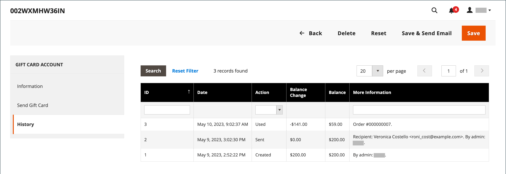

# Cuentas de tarjeta regalo

Se crea automáticamente una cuenta de tarjeta de regalo para cada tarjeta de regalo que se compre. El valor de la tarjeta regalo se puede aplicar a la compra de un producto en su tienda. También puede crear cuentas de tarjetas regalo del administrador como una promoción o servicio para los clientes. El número de cuenta de la tarjeta regalo corresponde al código de la tarjeta regalo.

{width="700" zoomable="yes"}

## Configurar cuentas de tarjetas regalo

La configuración de tarjetas regalo establece la configuración predeterminada de todas las tarjetas regalo para la vista de tienda y administra el grupo de códigos. El grupo de códigos es un conjunto de códigos de tarjeta regalo únicos en un formato específico. Los códigos del grupo se utilizan cada vez que se crea una cuenta de tarjeta de regalo. Es responsabilidad del administrador de la tienda asegurarse de que haya suficientes códigos disponibles para las ventas de tarjetas de regalo. Asegúrese de generar un grupo de códigos antes de ofrecer tarjetas de regalo para la venta. De forma predeterminada, Adobe Commerce genera 1000 códigos. No se genera un nuevo grupo de códigos hasta que no haya más códigos disponibles en el grupo actual.

### Paso 1: Configurar las notificaciones por correo electrónico

1. En la barra lateral _Admin_, vaya a **[!UICONTROL Stores]** > _[!UICONTROL Settings]_>**[!UICONTROL Configuration]**.

1. En el panel izquierdo, expanda **[!UICONTROL Sales]** y elija **[!UICONTROL Gift Cards]**.

1. Expanda  en la sección _[!UICONTROL Gift Card Email Settings]_y haga lo siguiente:

   - Establezca **[!UICONTROL Gift Card Notification Email Sender]** en la identidad de la tienda que aparece como remitente de las notificaciones de tarjetas de regalo.

   - Establezca **[!UICONTROL Gift Card Notification Email Template]** en la plantilla que se usa para la notificación.

   {width="600" zoomable="yes"}

1. Expanda  en la sección _[!UICONTROL Email Sent from Gift Card Account Management]_y haga lo siguiente:

   - Establezca **[!UICONTROL Gift Card Email Sender]** en la identidad de la tienda para que aparezca como el remitente de las tarjetas de regalo.

   - Establezca **[!UICONTROL Gift Card Template]** en la plantilla que desee usar para la tarjeta regalo.

Consulte [Almacenar direcciones de correo electrónico](../configuration-reference/general/store-email-addresses.md) para ver opciones y campos de configuración específicos.

### Paso 2: Completar la configuración general

1. Expanda  en la sección _[!UICONTROL Gift Card General Settings]_.

1. Para permitir que el cliente canjee el valor de la tarjeta por efectivo, establezca **[!UICONTROL Redeemable]** en `Yes`.

1. Para **[!UICONTROL Lifetime (days)]**, ingrese el número de días antes de que caduque la tarjeta.

   Si no hay fecha de caducidad, deje el campo en blanco.

   >[!NOTE]
   >
   >Dependiendo de su ubicación, puede ser ilegal que las tarjetas de regalo caduquen. Compruebe las leyes locales antes de establecer una duración para sus tarjetas de regalo.

1. Para dar a los clientes la opción de escribir un mensaje que acompañe a la tarjeta regalo, establezca **[!UICONTROL Allow Gift Message]** en `Yes` e introduzca el número de caracteres disponibles para el mensaje de **[!UICONTROL Gift Message Maximum Length]**.

1. Establezca **[!UICONTROL Generate Gift Card Account when Orders Item is]** en una de las siguientes opciones:

   - `Ordered` - La cuenta de tarjeta regalo se crea cuando se realiza el pedido.
   - `Invoiced`: la cuenta de tarjeta regalo se crea después de capturar el pago y de facturar el pedido.

   {width="600" zoomable="yes"}

### Paso 3: Establecer el grupo de códigos de tarjeta de regalo

1. Expanda  en la sección _[!UICONTROL Gift Card Account General Settings]_y haga lo siguiente:

   {width="600" zoomable="yes"}

   - Para personalizar el código, complete lo siguiente según sus preferencias:

      - Longitud de código
      - Formato de código
      - Prefijo de código
      - Sufijo de código
      - Guión cada X caracteres

   - Para determinar el número de códigos que se van a generar, escriba **[!UICONTROL New Pool Size]**.

   - Para especificar cuándo recibirá una notificación para volver a almacenar el grupo de códigos, escriba **[!UICONTROL Low Code Pool Threshold]**.

1. Antes de generar el grupo de código, haga clic en **[!UICONTROL Save Config]**.

1. Haga clic en **[!UICONTROL Generate]**.

1. Una vez finalizado, haga clic en **[!UICONTROL Save Config]**.

## Revisar una cuenta de tarjeta regalo existente

1. Para encontrar el número de la cuenta de la tarjeta regalo de un pedido actual, haga lo siguiente:

   - En la barra lateral _Admin_, vaya a **[!UICONTROL Sales]** > _[!UICONTROL Operations]_>**[!UICONTROL Orders]**.

   - Busque el orden en la lista y haga clic en **[!UICONTROL View]** en la columna _[!UICONTROL Action]_.

   - Vaya a la sección _[!UICONTROL Items Ordered]_.

   El número se encuentra en la columna _[!UICONTROL Product]_, en **[!UICONTROL Gift Card Accounts]**.

1. En la barra lateral _Admin_, vaya a **[!UICONTROL Marketing]** > _[!UICONTROL Promotions]_>**[!UICONTROL Gift Card Accounts]**.

1. Busque la cuenta de la tarjeta regalo en la cuadrícula y ábrala en modo de edición.

   El código de la tarjeta regalo aparece en la parte superior de la sección _Información_.

   {width="600" zoomable="yes"}

## Crear una cuenta de tarjeta regalo

1. En la barra lateral _Admin_, vaya a **[!UICONTROL Marketing]** > _[!UICONTROL Promotions]_>**[!UICONTROL Gift Card Accounts]**.

1. En la esquina superior derecha, haga clic en **[!UICONTROL Add Gift Card Account]**.

1. En la sección _[!UICONTROL Information]_, establezca **[!UICONTROL Active]**en `Yes` y haga lo siguiente:

   - Para que el saldo de la tarjeta se pueda canjear en el cierre de compra o se transfiera al crédito de la tienda del cliente, establezca **[!UICONTROL Redeemable]** en `Yes`.

   - Elija el **[!UICONTROL Website]** en el que se puede usar la cuenta de tarjeta regalo.

   - Escriba el **[!UICONTROL Balance]** inicial en la tarjeta de regalo.

   - _(Opcional)_ Para establecer un **[!UICONTROL Expiration Date]** para la tarjeta regalo, seleccione la fecha en el .

     Si se deja en blanco, la cuenta de la tarjeta regalo no caduca.

     {width="600" zoomable="yes"}

1. En el panel izquierdo, elija **[!UICONTROL Send Gift Card]** y haga lo siguiente:

   - Escriba la dirección **[!UICONTROL Recipient Email]**.

   - Escriba **[!UICONTROL Recipient Name]**.

   - Establezca **[!UICONTROL Send Email from the Following Store View]** en la vista de la tienda que aparece como remitente de la notificación de la tarjeta regalo.

   {width="600" zoomable="yes"}

1. Realice una de las siguientes acciones para guardar la nueva cuenta:

   - Si no está listo para enviar la tarjeta regalo, haga clic en **[!UICONTROL Save]**.

   - Para guardar los cambios y enviar la tarjeta regalo por correo electrónico al destinatario, haz clic en **Guardar y enviar correo electrónico**.

## Ver historial de cuenta de tarjeta regalo

1. Vaya a **[!UICONTROL Marketing]** > _[!UICONTROL Promotions]_>**[!UICONTROL Gift Card Accounts]**.

1. Abra la tarjeta regalo en modo de edición.

1. Se muestra el **[!UICONTROL History]** de la tarjeta regalo.

   {width="600" zoomable="yes"}

| Columna | Descripción |
|--- |--- |
| [!UICONTROL ID] | Un número único de acción con tarjeta regalo. |
| [!UICONTROL Date] | Fecha de la acción. |
| [!UICONTROL Action] | Determina todas las acciones posibles con una tarjeta regalo. Opciones: `Created` / `Updated` / `Sent` / `Used` / `Redeemed` / `Expired` |
| [!UICONTROL Balance Change] | Muestra la cantidad en que ha cambiado el saldo de la tarjeta regalo. |
| [!UICONTROL Balance] | Indica el saldo disponible. |
| [!UICONTROL More Information] | Muestra información sobre quién modificó el saldo de la tarjeta regalo. |

{style="table-layout:auto"}

## Eliminar una cuenta de tarjeta regalo

1. En la barra lateral _Admin_, vaya a **[!UICONTROL Marketing]** > _[!UICONTROL Promotions]_>**[!UICONTROL Gift Card Accounts]**.

1. Seleccione la cuenta de la tarjeta regalo que desea eliminar y ábrala en modo de edición.

1. En la barra de menús, haga clic en **[!UICONTROL Delete]**.

1. Para confirmar la acción, haga clic en **[!UICONTROL OK]**.

## Descripciones de columna

| Columna | Descripción |
|--- |--- |
| [!UICONTROL ID] | Identificador numérico único asignado a la cuenta de tarjeta de regalo. |
| [!UICONTROL Code] | El código que debe introducirse para aplicar una tarjeta regalo. |
| [!UICONTROL Website] | Indica los sitios web en los que la cuenta de tarjeta de regalo está disponible. |
| [!UICONTROL Created] | Fecha de creación. |
| [!UICONTROL End] | Fecha de caducidad de la tarjeta regalo, si está programada. |
| [!UICONTROL Active] | Determina si la tarjeta regalo está activa. |
| [!UICONTROL Status] | Determina si la tarjeta regalo se canjea en la cuenta del cliente o está disponible. Opciones: `Used` / `Redeemed` / `Expired` |
| [!UICONTROL Balance] | Indica el saldo disponible. |

{style="table-layout:auto"}
