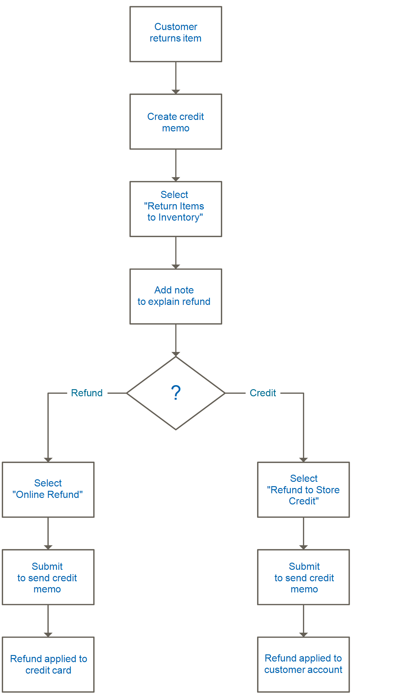

# Devuelve

Se puede otorgar una _autorización de devolución de mercancía_ (RMA) a los clientes que soliciten la devolución de un artículo para su reemplazo o reembolso. Normalmente, el cliente se pone en contacto con el comerciante para solicitar un reembolso. Si se aprueba, se asigna un número de autorización de devolución de material único para identificar el producto devuelto. En la configuración, puede activar la autorización de devolución de material para todos los productos o permitir la autorización de devolución de material solo para determinados productos. La cuadrícula _[!UICONTROL Returns]_enumera las solicitudes de mercancía devueltas (RMA) actuales y se usa para introducir nuevas solicitudes de devolución.

{width="600" zoomable="yes"}

Las RMA se pueden emitir para tipos de producto simples, agrupados, configurables y agrupados. Sin embargo, las RMA no están disponibles para productos virtuales, productos descargables y tarjetas regalo.

## Descripciones de columna

| Columna | Descripción |
|--- |--- |
| [!UICONTROL Select] | Seleccione las casillas de verificación para que los retornos estén sujetos a una acción o utilice el control de selección en el encabezado de la columna. Opciones: `Select All` / `Deselect All` / `Select Visible` / `Unselect Visible` |
| [!UICONTROL RMA] | Identificador numérico único asignado a cada valor devuelto |
| [!UICONTROL Requested] | Fecha y hora en que se realizó la devolución |
| [!UICONTROL Order] | Un número único del pedido original |
| [!UICONTROL Ordered] | La fecha y la hora en que se realizó el pedido |
| [!UICONTROL Customer] | El nombre del cliente o comprador que realizó el pedido |
| [!UICONTROL Status] | Estado de devolución. Opciones: `Pending` / `Authorized` / `Partially Authorized` / `Approved` / `Rejected` / `Processed and Closed` / `Closed` |
| [!UICONTROL Action] | **[!UICONTROL View]** abre el retorno en modo de edición. |

{style="table-layout:auto"}

## RMA y flujo de trabajo de devolución

1. **Recibir solicitud** - Si [habilitaste](rma-configure.md#enable-rmas-for-your-store) para la tienda, tanto los clientes registrados como los invitados pueden solicitar una RMA. También puede [enviar una solicitud de RMA en el administrador](#create-a-return-request-in-the-admin).

2. **RMA emitido** - Después de considerar la solicitud, puede autorizarla parcial, total o cancelar la solicitud. Si autoriza la devolución y acepta pagar el envío de devolución, puede crear una orden de envío desde el administrador con un transportista admitido.

3. **Mercancía recibida y devolución de producto procesada** - El siguiente diagrama de flujo describe el orden operativo para completar el proceso de devolución:

   {width="500"}

## Estado de RMA

Durante su ciclo de vida, una autorización de devolución de mercancía (RMA) puede tener muchos estados asignados (como Pendiente o Autorizado). El estado de RMA indica el progreso de una solicitud de RMA planteada por el usuario o el comerciante.

| Estado | Descripción |
|--- |--- |
| [!UICONTROL Pending] | El estado inicial asignado a una solicitud de autorización de devolución de material cuando la genera un usuario en la tienda o el comerciante en el administrador. |
| [!UICONTROL Authorized] | Este estado se asigna a la RMA cuando el comerciante autoriza todas las devoluciones solicitadas en el Admin. |
| [!UICONTROL Partially Authorized] | Este estado se asigna a la RMA si se ha denegado alguno de los artículos solicitados y se han autorizado otros productos. |
| [!UICONTROL Denied] | Este estado se asigna a la RMA si el comerciante rechaza todos los artículos solicitados en la Admin para las devoluciones. |
| [!UICONTROL Return Received] | El comerciante asigna este estado a la RMA cuando el usuario recibe los artículos solicitados. |
| [!UICONTROL Return Partially Received] | Este estado es asignado por el comerciante a la RMA cuando los artículos solicitados son devueltos parcialmente y algunos de los artículos se niegan a procesar. |
| [!UICONTROL Approved] | El comerciante asigna este estado a la RMA cuando los artículos solicitados se aprueban para su posterior procesamiento. |
| [!UICONTROL Rejected] | El comerciante asigna este estado a la RMA cuando se rechazan los artículos solicitados para su posterior procesamiento. |
| [!UICONTROL Processed and Closed] | El comerciante asigna este estado a la RMA cuando todos los artículos solicitados se aprueban para su posterior procesamiento. |
| [!UICONTROL Closed] | El comerciante asigna este estado a la RMA cuando se deniegan los artículos solicitados al proceso de devolución. |

{style="table-layout:auto"}

## Cree una solicitud de retorno en el administrador

Un comerciante puede crear una solicitud de devolución en nombre del cliente desde el administrador. Los clientes pueden [crear una solicitud de devolución](rma-customer-experience.md) en la tienda de una tienda Adobe Commerce.

1. En la barra lateral _Admin_, vaya a **[!UICONTROL Sales]** > **[!UICONTROL Returns]**.

1. Haga clic en **[!UICONTROL New Return Request]**.

1. Para crear una solicitud de devolución, haga clic en un pedido con un estado `Complete`.

1. En la sección _[!UICONTROL Return Information]_, seleccione la ficha **[!UICONTROL Return Items]**.

1. Para agregar elementos que se van a devolver, haga clic en **[!UICONTROL Add Items]**.

1. Seleccione la casilla del producto requerido y haga clic en **[!UICONTROL Add Selected Product to returns]**.

1. Para **[!UICONTROL Requested]**, escriba el número de elementos que desea devolver.

1. Establezca **[!UICONTROL Return Reason]** en una de las siguientes opciones:

   - `Wrong Color`
   - `Wrong Size`
   - `Out of Service`
   - `Other`

   Si el motivo de la devolución es diferente de las opciones enumeradas, puede escribir las suyas propias si selecciona la opción `Other`.

1. Establezca **[!UICONTROL Item Condition]** en una de las siguientes opciones:

   - `Unopened`
   - `Opened`
   - `Damaged`

1. Establezca **[!UICONTROL Resolution]** en una de las siguientes opciones:

   - `Exchange`
   - `Refund`
   - `Store Credit`

1. Para crear una devolución, haga clic en **[!UICONTROL Submit Returns]**.

   {width="600" zoomable="yes"}

   La solicitud de autorización de devolución de material recién enviada aparece en la página **[!UICONTROL Returns]** con el estado `Pending`.
