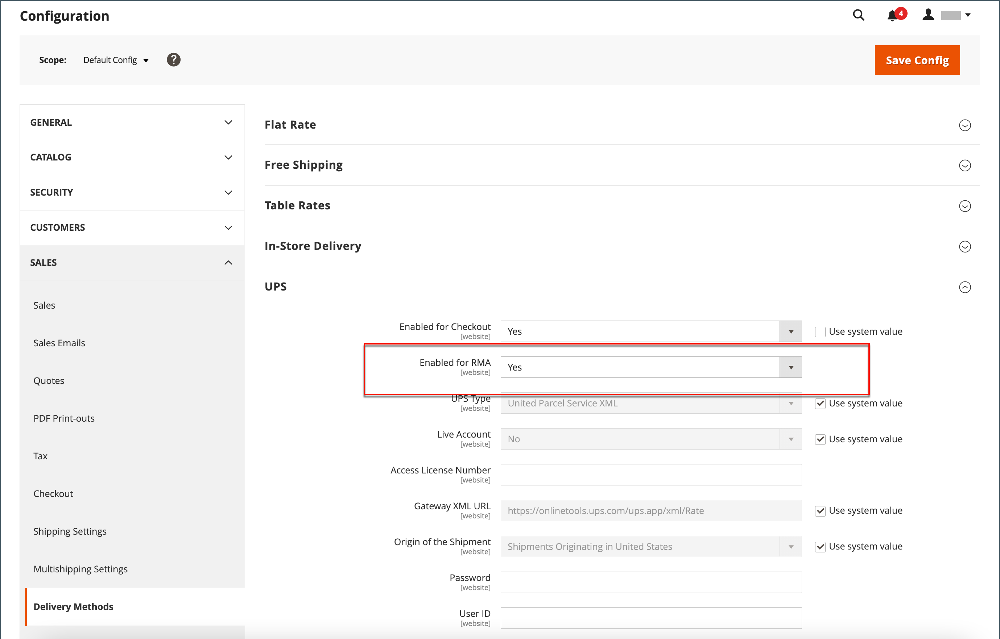
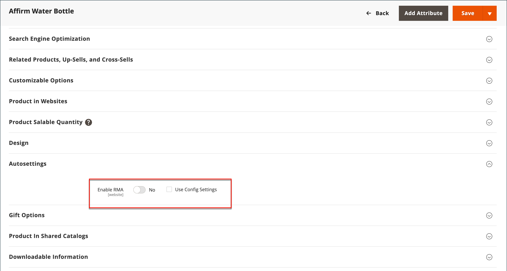

# Configuración de devoluciones

{{ee-feature}}

Cuando está activada, los clientes pueden enviar las solicitudes de RMA desde la tienda. Sólo se puede generar una autorización de devolución de material si hay un artículo en el pedido disponible para su devolución. Las solicitudes para devolver elementos individuales las administra el _Habilitar RMA_ en cada registro de producto. De forma predeterminada, los ajustes de configuración se aplican al producto (_[!UICONTROL Use Config Settings]_está seleccionada). If_[!UICONTROL Enable RMA]_ se establece en `No`Sin embargo, el producto no aparece en la lista de elementos disponibles para su devolución. Si cambia el _Habilitar RMA_ , se aplica tanto a los pedidos nuevos como a los existentes.

## Habilitar RMA para su tienda

1. En el _Administrador_ barra lateral, vaya a **[!UICONTROL Stores]** > _[!UICONTROL Settings]_>**[!UICONTROL Configuration]**.

1. En el panel izquierdo, expanda **[!UICONTROL Sales]** y elija **[!UICONTROL Sales]** debajo.

1. Expandir  el **[!UICONTROL RMA Settings]** sección.

   {width="600" zoomable="yes"}

1. Establecer **[!UICONTROL Enable RMA on Storefront]** hasta `Yes`.

   Esta configuración determina si los clientes pueden crear y ver solicitudes de RMA desde la tienda. Las autorizaciones de devolución de material se pueden aplicar tanto a pedidos nuevos como existentes.

1. Establecer **[!UICONTROL Enable RMA on Product Level]** hasta `Yes`.

   Esta configuración determina el comportamiento del _Habilitar RMA_ para productos individuales de la tienda:

   - Cuándo [!UICONTROL Enable RMA on Product Level] se establece en `Yes`, los clientes de la tienda pueden devolver todos los productos individuales. Incluye ambas _[!UICONTROL Enable RMA]_= `Yes` y_[!UICONTROL Enable RMA]_ = `No` valores de atributo del producto.
   - Cuándo [!UICONTROL Enable RMA on Product Level] se establece en `No`, los clientes de la tienda solo pueden devolver los productos con una _[!UICONTROL Enable RMA]_= `Yes` valor de atributo del producto.

1. Establecer **[!UICONTROL Use Store Address]** a uno de los siguientes valores:

   - `Yes` - Enviar los productos devueltos a la dirección de la tienda.
   - `No` - Introduzca una dirección alternativa para las devoluciones de productos.

   {width="600" zoomable="yes"}

1. Haga clic **[!UICONTROL Save Config]**.

## Configuración de métodos de envío para devoluciones

1. En el _Administrador_ barra lateral, vaya a **[!UICONTROL Stores]** > _[!UICONTROL Settings]_>**[!UICONTROL Configuration]**.

1. En el panel izquierdo, expanda **[!UICONTROL Sales]** y elija **[!UICONTROL Delivery Methods]**.

1. Expanda la sección del transportista que desee utilizar para el servicio de devolución, como **[!UICONTROL UPS]**.

   {width="600" zoomable="yes"}

1. Establecer **[!UICONTROL Enabled for RMA]** hasta `Yes`.

1. Haga clic **[!UICONTROL Save Config]**.

## Cambiar las RMA permitidas en el nivel de producto

Si activa las RMA para su tienda y el catálogo contiene algunos productos que no deberían poder devolverse, puede modificar la configuración en el nivel de producto.

1. Abra el producto en modo de edición.

1. Desplazarse hacia abajo y expandir  el **[!UICONTROL Autosettings]** sección.

1. Borre la **[!UICONTROL Use Config Setting]** casilla de verificación, si es necesario.

1. Alternar el **[!UICONTROL Enable RMA]** configurando en `No`.

   {width="600" zoomable="yes"}

1. Haga clic **[!UICONTROL Save]**.
