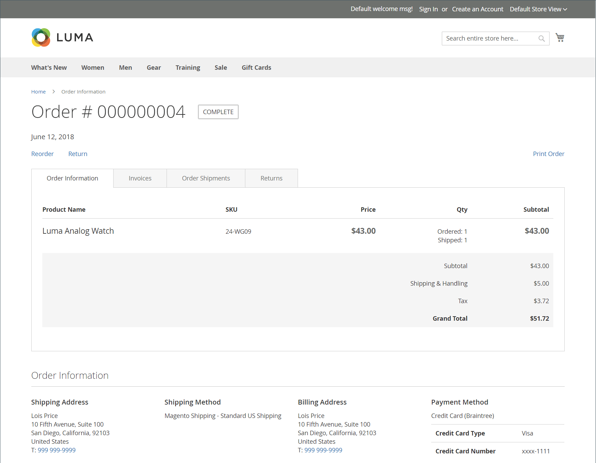

# Devuelve la experiencia de tienda

{{ee-feature}}

Los clientes pueden utilizar cualquiera de las siguientes opciones para solicitar una autorización de devolución de material a la tienda:

- [Widget de pedidos y devoluciones](../content-design/widget-orders-returns.md) en la barra lateral
- _Pedidos y devoluciones_ vínculo en pie de página

Como práctica recomendada, asegúrese de incluir una descripción de los requisitos y el proceso de la RMA en la política de servicio al cliente.

>[!NOTE]
>
>Si desea recopilar información adicional relacionada con las devoluciones, puede añadir su propia [devuelve atributos](attributes-returns.md).

Toda la información de la RMA del cliente se muestra en la **[!UICONTROL My Returns]** en el panel de la cuenta del cliente.

{width="700" zoomable="yes"}

## Solicitar una autorización de devolución

El cliente completa los siguientes pasos en la tienda para enviar una autorización de devolución de material:

1. En el pie de página, haga clic en **[!UICONTROL Orders and Returns]**.

1. Introduce la información del pedido:

   - ID de pedido
   - Apellido de facturación
   - Correo electrónico

1. Clics **[!UICONTROL Continue]**.

   {width="700" zoomable="yes"}

1. Debajo de la fecha de pedido, hace clic en **[!UICONTROL Return]**.

   {width="700" zoomable="yes"}

1. Elige el elemento que se va a devolver e introduce el **[!UICONTROL Quantity to Return]**.

1. Conjuntos **[!UICONTROL Resolution]** a uno de los siguientes:

   - Exchange
   - [Reembolso](../customers/refunds-customer-account.md)
   - [Crédito de tienda](../customers/store-credit-using.md)

1. Conjuntos **[!UICONTROL Item Condition]** a uno de los siguientes:

   - `Unopened`
   - `Opened`
   - `Damaged`

1. Conjuntos **[!UICONTROL Reason to Return]** a uno de los siguientes:

   - `Wrong Color`
   - `Wrong Size`
   - `Out of Service`
   - `Other`

   {width="700" zoomable="yes"}

1. Si es necesario, establece **[!UICONTROL Contact Email Address]** y **[!UICONTROL Comments]**.

   >[!NOTE]
   >
   >Si el pedido contiene varios artículos y el cliente desea devolver otro, puede hacer clic en **[!UICONTROL Add Item To Return]**, seleccione el elemento y, a continuación, defina todas las opciones mencionadas.

1. Clics **[!UICONTROL Submit]**.
