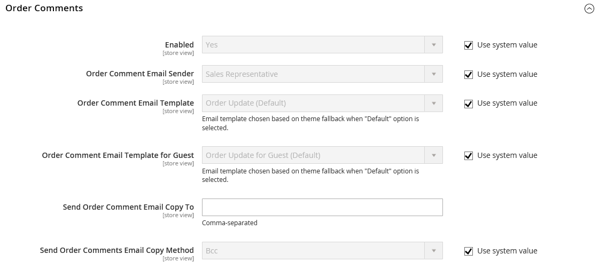

# Correos electrónicos de ventas

Varios mensajes de correo electrónico se activan mediante los eventos relacionados con un pedido y la configuración es similar. Asegúrese de identificar el contacto de la tienda que aparece como el remitente del mensaje, la plantilla de correo electrónico que se va a utilizar y cualquier otra persona que vaya a recibir una copia del mensaje. Los correos electrónicos de ventas se pueden enviar cuando se activan mediante un evento o por intervalo predeterminado.

{width="600" zoomable="yes"}

## Paso 1. Actualizar las plantillas de correo electrónico

Asegúrese de actualizar la plantilla [encabezado de correo electrónico](../systems/email-template-custom.md#header-template) para que refleje su marca y las demás plantillas de correo electrónico según sea necesario. Para obtener una lista completa de las plantillas, consulte [Plantillas de correo electrónico](../systems/email-templates.md).

## Paso 2. Elija el tipo de transmisión

1. En la barra lateral _Admin_, vaya a **[!UICONTROL Stores]** > _[!UICONTROL Settings]_>**[!UICONTROL Configuration]**.

1. En el panel izquierdo, expanda **[!UICONTROL Sales]** y elija **[!UICONTROL Sales Emails]**.

1. Si es necesario, expanda  en la sección **[!UICONTROL General Settings]**.

   {width="600" zoomable="yes"}

   De manera predeterminada, Envío asincrónico se establece en `Disable`. Para cambiar la configuración del sistema, desactive la casilla de verificación **[!UICONTROL Use system value]** y establezca **[!UICONTROL Asynchronous sending]** en una de las siguientes opciones:

   - `Disable`: envía un correo electrónico de ventas cuando se activa un evento.
   - `Enable`: envía un correo electrónico de ventas a intervalos predeterminados y regulares.

   El Soporte de Adobe Commerce recomienda habilitar el envío asincrónico para mejorar el rendimiento de la colocación de pedidos. Consulte las [prácticas recomendadas de configuración para el procesamiento de pedidos](https://experienceleague.adobe.com/docs/commerce-operations/implementation-playbook/best-practices/maintenance/order-processing-configuration.html?lang=es) en la Base de conocimiento de asistencia de Adobe Commerce.

## Paso 3. Completar los detalles de cada mensaje de correo electrónico de ventas

1. Si es necesario, expanda  en la sección **[!UICONTROL Order]**.

   {width="600" zoomable="yes"}

1. Compruebe que **[!UICONTROL Enabled]** está establecido en `Yes` (predeterminado).

1. Establezca **[!UICONTROL New Order Confirmation Email]** en el contacto de tienda que aparece como el remitente del mensaje.

1. Establezca **[!UICONTROL New Order Confirmation Template]** en la plantilla que se usa para el correo electrónico que se envía a los clientes registrados.

1. Establece **[!UICONTROL New Order Confirmation Template for Guest]** en la plantilla que se usa para el correo electrónico que se envía a los invitados que no tienen una cuenta en la tienda.

1. Para **[!UICONTROL Send Order Email Copy To]**, escriba la dirección de correo electrónico de cualquier persona que vaya a recibir una copia del nuevo correo electrónico de pedido.

   Si envía una copia a varios destinatarios, separe cada dirección con una coma.

1. Establezca **[!UICONTROL Send Order Email Copy Method]** en una de las siguientes opciones:

   - `Bcc` - Envía una _copia de cortesía a ciegas_ incluyendo el destinatario en el encabezado del mismo correo electrónico que se envía al cliente. El destinatario CCO no es visible para el cliente.
   - `Separate Email` - Envía la copia como un correo electrónico independiente.

1. Expanda  en la sección **[!UICONTROL Order Comments]** y repita estos pasos.

   {width="600" zoomable="yes"}

1. Complete la configuración de los tipos de correo electrónico de ventas restantes:

   - **[!UICONTROL Invoice]** / **[!UICONTROL Invoice Comments]**
   - **[!UICONTROL Shipment]** / **[!UICONTROL Shipment Comments]**
   - **[!UICONTROL Credit Memo]** / **[!UICONTROL Credit Memo Comments]**

1. Una vez finalizado, haga clic en **[!UICONTROL Save Config]**.

   Cuando se le solicite, haga clic en el vínculo [Administración de caché](../systems/cache-management.md) en el mensaje en la parte superior del área de trabajo y borre todas las cachés no válidas.
