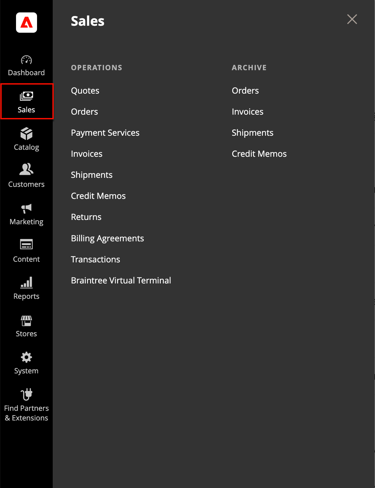
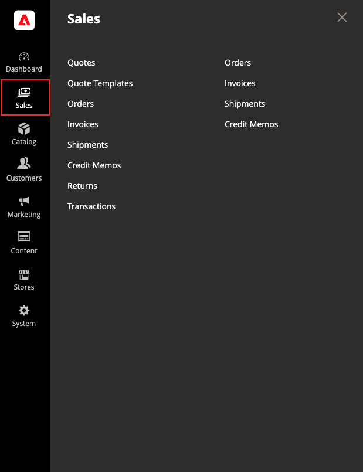

# Menú [!UICONTROL Sales]

El menú Ventas enumera las transacciones según su ubicación en el flujo de trabajo del pedido. Puede considerar cada una de las opciones como una etapa diferente durante la vida útil de un pedido.

>[!BEGINTABS]

>[!TAB Adobe Commerce]

[!BADGE Solo PaaS]{type=Informative url="https://experienceleague.adobe.com/es/docs/commerce/user-guides/product-solutions" tooltip="Se aplica solo a proyectos de Adobe Commerce en la nube (infraestructura PaaS administrada por Adobe) y a proyectos locales."}

{width="450" zoomable="yes"}

>[!TAB Adobe Commerce as a Cloud Service]

[!BADGE Solo SaaS]{type=Positive url="https://experienceleague.adobe.com/es/docs/commerce/user-guides/product-solutions" tooltip="Solo se aplica a los proyectos de Adobe Commerce as a Cloud Service y Adobe Commerce Optimizer (infraestructura de SaaS administrada por Adobe)."}

{width="450" zoomable="yes"}

>[!ENDTABS]

## Mostrar el menú [!UICONTROL Sales]

En la barra lateral _Admin_, haga clic en **[!UICONTROL Sales]**.

## Opciones de menú

### [!UICONTROL Quotes]

 (disponible con Adobe Commerce B2B)

Los compradores autorizados pueden [negociar el precio](../b2b/quotes.md) con el vendedor enviando una [solicitud](../b2b/quote-request.md) desde el carro de compras.

### [!UICONTROL Quote Templates]

 (disponible con Adobe Commerce B2B)

Permite a compradores y vendedores optimizar el proceso de oferta creando [plantillas de oferta](../b2b/quote-templates-overview.md) reutilizables y personalizables.

### [!UICONTROL Orders]

Cuando se realiza un [pedido](orders.md), se crea un pedido de ventas como un registro temporal de la transacción. El pago no se ha procesado y el pedido se puede cancelar.

### [!UICONTROL Invoices]

Una [factura](invoices.md) es un registro del recibo de pago de un pedido. Se pueden crear varias facturas para un único pedido, cada una con tantos o tan pocos de los productos comprados que especifique. Según la acción de pago, el pago se puede capturar automáticamente cuando se genera la factura.

### [!UICONTROL Shipments]

Un [envío](shipments.md) es un registro de los productos de un pedido que se han enviado. Al igual que con las facturas, se pueden asociar varios envíos a un único pedido, hasta que se envíen todos los productos del pedido.

### [!UICONTROL Credit Memos]

Un [abono](credit-memos.md) es un documento que muestra el importe que se debe al cliente por un reembolso total o parcial. El importe puede aplicarse a una compra o reembolsarse al cliente.

### [!UICONTROL Returns]

 (solo Adobe Commerce)

Se puede otorgar una [autorización de devolución de mercancía](returns.md) (RMA) a los clientes que soliciten la devolución de un artículo para su reemplazo o reembolso. Las RMA se pueden emitir para tipos de producto simples, agrupados, configurables y agrupados. Sin embargo, las RMA no están disponibles para productos virtuales y descargables ni para tarjetas regalo.

### [!UICONTROL Billing Agreements]

[!BADGE Solo PaaS]{type=Informative url="https://experienceleague.adobe.com/es/docs/commerce/user-guides/product-solutions" tooltip="Se aplica solo a proyectos de Adobe Commerce en la nube (infraestructura PaaS administrada por Adobe) y a proyectos locales."}

Un [acuerdo de facturación](paypal-billing-agreements.md) es similar a un pedido de compra, excepto que no se limita a una sola compra. Durante el cierre de compra, el cliente elige el Contrato de facturación como método de pago. Un acuerdo de facturación optimiza el proceso de cierre de compra porque el cliente no tiene que introducir la información de pago de cada compra.

### [!UICONTROL Transactions]

La página [Transacciones](transactions.md) enumera toda la actividad de pago que se ha realizado entre su tienda y todos los sistemas de pago, y proporciona acceso a información más detallada.

### [!UICONTROL Braintree Virtual Terminal]

[!BADGE Solo PaaS]{type=Informative url="https://experienceleague.adobe.com/es/docs/commerce/user-guides/product-solutions" tooltip="Se aplica solo a proyectos de Adobe Commerce en la nube (infraestructura PaaS administrada por Adobe) y a proyectos locales."}

En la página Terminal virtual de Braintree, un usuario administrador puede aceptar el pago del importe seleccionado. Para que la característica de terminal esté disponible, el comerciante debe establecer la [configuración básica de Braintree](braintree.md). Braintree ofrece una experiencia de pago y envío totalmente personalizable con detección de fraude e integración con PayPal.

### [!UICONTROL Archive]

 (solo Adobe Commerce)

(La opción de archivar debe estar habilitada) [El archivado de pedidos](order-archive.md) y otros documentos de ventas mejora regularmente el rendimiento y mantiene el espacio de trabajo libre de información innecesaria.
