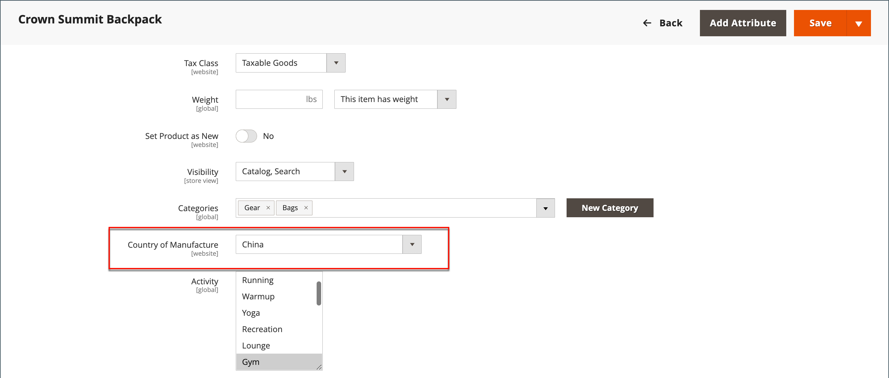

# Configurar etiquetas de envío

Las siguientes configuraciones deben realizarse en el nivel de producto y en la configuración de cada operador que se utiliza para imprimir etiquetas. Para imprimir etiquetas, todos los operadores requieren que abra una cuenta. A continuación, complete la configuración de la tienda para cada operador que vaya a utilizar.

## Requisitos del operador

| [!UICONTROL Carrier] | Requisitos |
|-------|--------|
| [USPS](usps.md) | Requiere una cuenta USPS para el franqueo de la etiqueta de envío. |
| [UPS](ups.md) | Requiere una cuenta de UPS. Las etiquetas de envío solo están disponibles para los envíos que se originan en los EE. UU. Se requieren credenciales específicas para las tiendas fuera de los EE. UU. |
| [FedEx](fedex.md) | Requiere una cuenta de FedEx. En tiendas fuera de los EE. UU., las etiquetas de envío solo son compatibles con envíos internacionales. FedEx no permite envíos nacionales que se originen fuera de los Estados Unidos |
| [DHL](dhl.md) | Requiere una cuenta de DHL. Las etiquetas de envío solo son compatibles con los envíos procedentes de EE. UU. |

{style="table-layout:auto"}

## Paso 1: Verificar el país de fabricación

El país de fabricación es obligatorio para todos los productos que son enviados internacionalmente por USPS y FedEx. Si tiene muchos productos que se deben actualizar, puede [importar](../systems/data-import.md) las actualizaciones o usar la cuadrícula de inventario para actualizar varios registros.

1. En la barra lateral _Admin_, vaya a **[!UICONTROL Catalog]** > **[!UICONTROL Products]**.

1. Actualice el registro de etiquetas de envío mediante uno de los métodos siguientes.

### Método 1: Actualización de un solo registro

1. En la cuadrícula, busque el producto que desea actualizar y ábralo en modo de edición.

1. Actualice **País de fabricación** según sea necesario.

   {width="700" zoomable="yes"}

1. Haga clic en **[!UICONTROL Save]**.

### Método 2: Actualización de varios registros

1. En la cuadrícula, seleccione la casilla de verificación de cada producto que desea actualizar.

   Por ejemplo, todos los productos fabricados en China.

1. Establezca el control **[!UICONTROL Actions]** en `Update Attributes` y haga clic en **[!UICONTROL Submit]**.

1. En el formulario _Actualizar atributos_, busque el campo **País de fabricación** y seleccione la casilla de verificación **Cambiar**.

1. Elige el país.

1. Haga clic en **[!UICONTROL Save]**.

## Paso 2 Verificar la información del almacén

1. En la barra lateral _Admin_, vaya a **[!UICONTROL Stores]** > _[!UICONTROL Settings]_>**[!UICONTROL Configuration]**.

1. En el panel izquierdo, expanda **[!UICONTROL Sales]** y elija **[!UICONTROL Shipping Settings]**.

1. Expanda  en la sección **[!UICONTROL Origin]** y compruebe que los campos siguientes están completos:

   - **[!UICONTROL Street Address]**: dirección de la calle del lugar desde donde se envían los envíos. Por ejemplo, la ubicación de su compañía o almacén. Este campo es obligatorio para las etiquetas de envío.
   - **[!UICONTROL Street Address Line 2]**: cualquier información de dirección adicional, como el piso o la entrada. Se recomienda utilizar este campo.

   {width="600" zoomable="yes"}

1. En la sección _Ventas_ del panel izquierdo, elija **[!UICONTROL Delivery Methods]**.

1. Expanda  en la sección **[!UICONTROL USPS]** y compruebe que los campos siguientes están completos:

   - **[!UICONTROL Secure Gateway URL]**: el sistema introduce automáticamente la dirección URL de puerta de enlace.
   - **[!UICONTROL Password]** - La contraseña es proporcionada por USPS y le da acceso a su sistema a través de los servicios web.
   - **Longitud, Anchura, Altura, Giro** - Dimensiones predeterminadas del paquete. Para que aparezcan estos campos, establezca **[!UICONTROL Size]** en `Large`.

1. Expanda  en la sección **FedEx** y verifique que los campos siguientes estén completos:

   - Número de medidor
   - Clave
   - Contraseña

   Esta información es proporcionada por el operador y es necesaria para obtener acceso a su sistema a través de los servicios web.

1. En el panel izquierdo, expanda **[!UICONTROL General]** y elija **[!UICONTROL General]** debajo.

1. Expanda  en la sección **[!UICONTROL Store Information]** y compruebe que los campos siguientes están completos:

   - **[!UICONTROL Store Name]**: nombre de la tienda o vista de la tienda.
   - **[!UICONTROL Store Contact Telephone]**: número de teléfono del contacto principal de la tienda o vista de la tienda.
   - **[!UICONTROL Country]**: país donde se encuentra su tienda.
   - **[!UICONTROL VAT Number]**: si corresponde, el número de IVA de su tienda. (No es necesario en tiendas ubicadas en EE. UU.)
   - **[!UICONTROL Store Contact Address]**: la dirección de la calle del contacto principal de la tienda o vista de la tienda.

1. Si tiene varias tiendas y la información de contacto difiere de la predeterminada, establezca **[!UICONTROL Store View]** para cada una y compruebe que la información está completa.

   Si falta información, aparece un error al intentar imprimir las etiquetas.

   {width="600" zoomable="yes"}

1. Haga clic en **[!UICONTROL Save Config]**.
