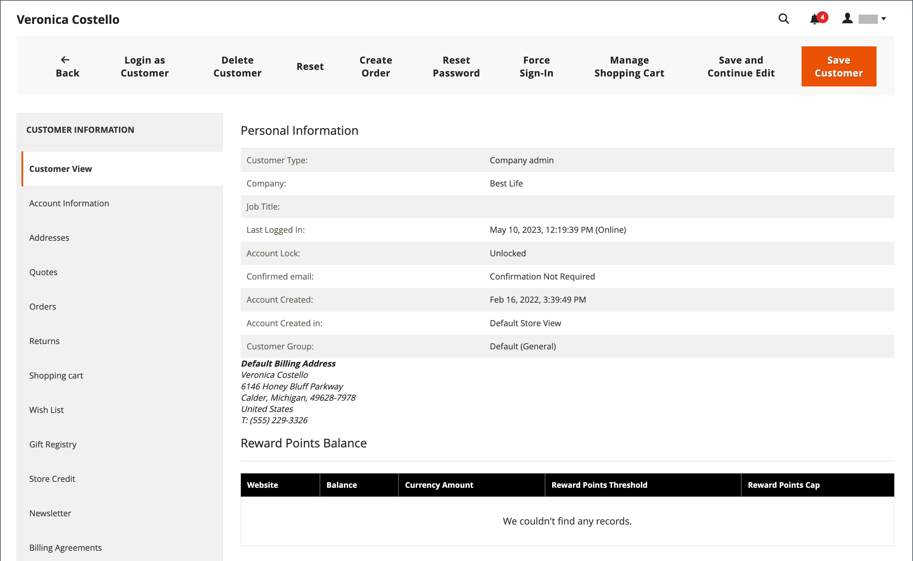
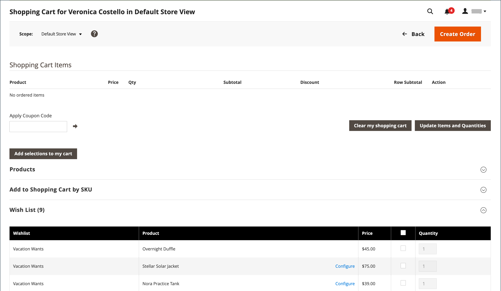
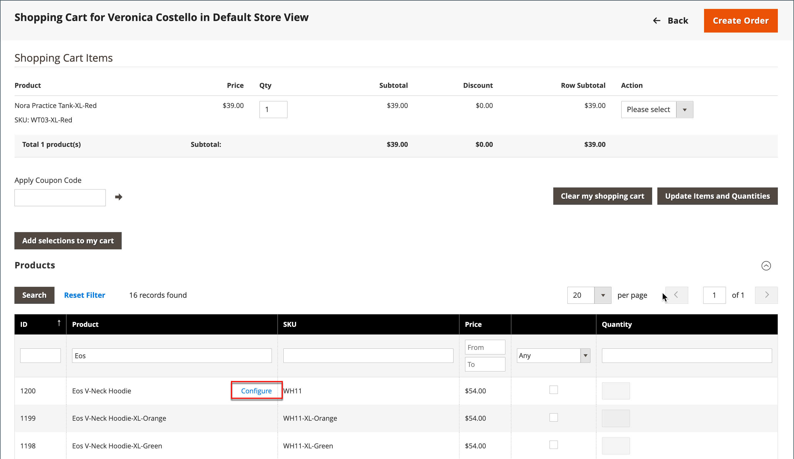

# Administración de un carro de compras

{{ee-feature}}

Para comenzar una sesión de compra asistida, el cliente debe iniciar sesión en su cuenta desde la tienda para que la información esté disponible. Si el cliente no tiene una cuenta, puede [crear una](../customers/account-create.md).

{width="600" zoomable="yes"}

## Control de acciones

| Opción | Descripción |
|--- |--- |
| [!UICONTROL Remove] | Quita artículos del carro de compras actual |
| [!UICONTROL Move to Wish List] | Mueve elementos a la lista de deseos del cliente seleccionada |

{style="table-layout:auto"}

## Botones de control

| Botón | Descripción |
|--- |--- |
| [!UICONTROL Clear my shopping cart] | Borra el carro de compras actual de todos los productos. |
| [!UICONTROL Update Items and Quantities|]Introduzca la cantidad necesaria en el campo **[!UICONTROL Qty]** y actualice el número de artículos en el carro de compras. |
| [!UICONTROL Add selections to my cart] | Agrega productos de todas las secciones al carro de compras. |

{style="table-layout:auto"}

## Compruebe que el cliente ha iniciado sesión

1. En la barra lateral _Admin_, vaya a **[!UICONTROL Customers]** > **[!UICONTROL Now Online]**.

   Todos los visitantes de la tienda y los clientes que iniciaron sesión aparecen en la lista.

   {width="700" zoomable="yes"}

## Oferta de compra asistida

1. En la barra lateral _Admin_, vaya a **[!UICONTROL Customers]** > **[!UICONTROL All Customers]**.

1. En la lista, abra el registro de cliente en modo de edición.

   >[!TIP]
   >
   >Para encontrar rápidamente el registro de cliente, use el control [Filters](../getting-started/admin-grid-controls.md).

   En el perfil del cliente bajo _[!UICONTROL Personal Information]_, la fecha y la hora_[!UICONTROL Last Logged In]_ muestran que el cliente está en línea.

   {width="600" zoomable="yes"}

1. Para entrar al modo de compra asistida, haga clic en **[!UICONTROL Manage Shopping Cart]** en la barra de botones superior.

   {width="600" zoomable="yes"}

## Añadir productos al carro de compras por atributo

1. Expanda  en la sección **[!UICONTROL Products]**.

1. Busque un producto con cualquiera de los filtros de la parte superior de cada columna.

1. Haga clic en **[!UICONTROL Search]**.

1. Utilice una de las siguientes series de pasos según el tipo de producto:

### Añadir un producto simple

1. Haga clic en el producto que desea solicitar.

   Esta acción selecciona el registro y establece **[!UICONTROL Quantity]** en el valor predeterminado de `1`.

1. Si es necesario, actualice la cantidad solicitada.

1. A la izquierda sobre la cuadrícula, haga clic en **[!UICONTROL Add selections to my cart]**.

   {width="600" zoomable="yes"}

   El elemento de línea se agrega al carro de compras en la parte superior de la página.

   {width="600" zoomable="yes"}

### Añadir un producto con configuración

Existen tres tipos de productos que deben configurarse antes de agregarlos al carro de compras: `Bundle Product`, `Configurable Product` y `Grouped Product`.

1. En la cuadrícula, haga clic en **[!UICONTROL Configure]** junto al nombre del producto.

   {width="600" zoomable="yes"}

1. En el cuadro de diálogo _Productos asociados_, elija cada opción de producto para describir el elemento que desea ordenar, escriba **[!UICONTROL Quantity]** y haga clic en **[!UICONTROL OK]**.

   El producto se selecciona con una marca de verificación y la cantidad solicitada aparece en la cuadrícula.

1. Para agregar el producto al carro, haga clic en **[!UICONTROL Add selections to my cart]**.

   {width="600" zoomable="yes"}

1. Actualizar opciones de producto en el carro de compras si es necesario:

   - Haga clic en **[!UICONTROL Configure]**.

   - Actualice las opciones y haga clic en **[!UICONTROL OK]**.

## Añadir producto por SKU

1. Expanda  en la sección **[!UICONTROL Add to Shopping Cart by SKU]**.

1. Agregue productos individualmente por **[!UICONTROL SKU]** o agregue productos cargando un archivo CSV.

### Añadir artículos individualmente por SKU

1. Escriba **[!UICONTROL SKU]** y **[!UICONTROL Qty]** del elemento que desea ordenar.

1. Para solicitar otro producto, haga clic en **[!UICONTROL Add another]**.

   {width="600" zoomable="yes"}

1. Haga clic en **[!UICONTROL Add selections to my cart]**.

1. Si el elemento es un producto configurable, elija las opciones de producto cuando se le solicite y, a continuación, haga clic en **[!UICONTROL Add to Shopping Cart]**.

### Añadir productos cargando un archivo CSV

1. Prepare un [archivo csv](../systems/data-csv.md) con los elementos que se agregarán al carro de compras.

   El archivo debe contener solo dos columnas, con `sku` y `qty` en el encabezado.

1. Cargue el archivo preparado:

   - Haga clic en **[!UICONTROL Choose File]**.

   - Seleccione el archivo que desea cargar desde el directorio.

## Transferir un elemento

Puede transferir artículos al carro de compras desde la lista de artículos deseados de un cliente, así como artículos vistos, comparados o pedidos recientemente. El número de elementos de cada sección aparece entre paréntesis después del encabezado de la sección.

1. Expanda  una de las siguientes secciones:

   - [!UICONTROL Wish List]
   - [!UICONTROL Products in the Comparison List]
   - [!UICONTROL Recently Compared Products]
   - [!UICONTROL Recently Viewed Products]
   - [!UICONTROL Last Ordered Items]

1. En la cuadrícula, seleccione cada producto que desee ordenar e introduzca el **[!UICONTROL Quantity]**.

1. Para especificar las opciones de un producto configurable, haga clic en **[!UICONTROL Configure]** y establezca las opciones del producto según sea necesario.

1. Haga clic en **[!UICONTROL Add selections to my cart]**.

1. Aplique uno o más códigos de cupón si están disponibles:

   - Para **[!UICONTROL Apply Coupon Code]**, ingrese un código de cupón válido.

   - Haga clic en la flecha _Aplicar_ (  ).

1. Ajuste la cantidad solicitada según sea necesario:

   - En la columna **[!UICONTROL Qty]** del producto que se va a ajustar, escriba la cantidad correcta.

   - Haga clic en **[!UICONTROL Update Items and Quantities]**.

## Creación del pedido

1. Haga clic en **[!UICONTROL Create Order]**.

   La página _[!UICONTROL Create New Order]_muestra los artículos del carro de compras, seguidos de la información de envío y pago.

1. Completa la información de envío y pago.

1. Haga clic en **[!UICONTROL Submit Order]**.

Para obtener más información, consulte [Crear un pedido](customer-account-create-order.md).
