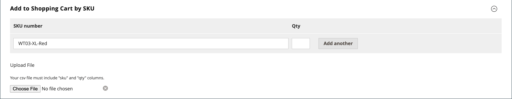

# Administración de un carro de compras

{{ee-feature}}

Para comenzar una sesión de compra asistida, el cliente debe iniciar sesión en su cuenta desde la tienda para que la información esté disponible. Si el cliente no tiene una cuenta, puede [crear uno](../customers/account-create.md).

{width="600" zoomable="yes"}

## Control de acciones

| Opción | Descripción |
|--- |--- |
| [!UICONTROL Remove] | Quita artículos del carro de compras actual |
| [!UICONTROL Move to Wish List] | Mueve elementos a la lista de deseos del cliente seleccionada |

{style="table-layout:auto"}

## Botones de control

| Botón | Descripción |
|--- |--- |
| [!UICONTROL Clear my shopping cart] | Borra el carro de compras actual de todos los productos. |
| [!UICONTROL Update Items and Quantities|]Introduzca la cantidad necesaria en la **[!UICONTROL Qty]** y actualice el número de elementos del carro de compras. |
| [!UICONTROL Add selections to my cart] | Agrega productos de todas las secciones al carro de compras. |

{style="table-layout:auto"}

## Compruebe que el cliente ha iniciado sesión

1. En el _Administrador_ barra lateral, vaya a **[!UICONTROL Customers]** > **[!UICONTROL Now Online]**.

   Todos los visitantes de la tienda y los clientes que iniciaron sesión aparecen en la lista.

   {width="700" zoomable="yes"}

## Oferta de compra asistida

1. En el _Administrador_ barra lateral, vaya a **[!UICONTROL Customers]** > **[!UICONTROL All Customers]**.

1. En la lista, abra el registro de cliente en modo de edición.

   >[!TIP]
   >
   >Para encontrar el registro de cliente con prisa, utilice el [Filtros](../getting-started/admin-grid-controls.md) control.

   En el perfil del cliente, en _[!UICONTROL Personal Information]_, el_[!UICONTROL Last Logged In]_ La fecha y la hora indican que el cliente está en línea.

   {width="600" zoomable="yes"}

1. Para entrar al modo de compra asistida, haga clic en **[!UICONTROL Manage Shopping Cart]** en la barra de botones superior.

   {width="600" zoomable="yes"}

## Añadir productos al carro de compras por atributo

1. Expandir  el **[!UICONTROL Products]** sección.

1. Busque un producto con cualquiera de los filtros de la parte superior de cada columna.

1. Haga clic **[!UICONTROL Search]**.

1. Utilice una de las siguientes series de pasos según el tipo de producto:

### Añadir un producto simple

1. Haga clic en el producto que desea solicitar.

   Esta acción selecciona el registro y establece **[!UICONTROL Quantity]** al valor predeterminado de `1`.

1. Si es necesario, actualice la cantidad solicitada.

1. En la parte izquierda encima de la cuadrícula, haga clic en **[!UICONTROL Add selections to my cart]**.

   {width="600" zoomable="yes"}

   El elemento de línea se agrega al carro de compras en la parte superior de la página.

   {width="600" zoomable="yes"}

### Añadir un producto con configuración

Existen tres tipos de productos que deben configurarse antes de agregarlos al carro de compras: `Bundle Product`, `Configurable Product`, y `Grouped Product`.

1. En la cuadrícula, haga clic en **[!UICONTROL Configure]** junto al nombre del producto.

   {width="600" zoomable="yes"}

1. En el _Productos asociados_ , elija cada opción de producto para describir el elemento que desea ordenar, introduzca el **[!UICONTROL Quantity]** y haga clic en **[!UICONTROL OK]**.

   El producto se selecciona con una marca de verificación y la cantidad solicitada aparece en la cuadrícula.

1. Para añadir el producto al carro de compras, haga clic en **[!UICONTROL Add selections to my cart]**.

   {width="600" zoomable="yes"}

1. Actualizar opciones de producto en el carro de compras si es necesario:

   - Haga clic **[!UICONTROL Configure]**.

   - Actualice las opciones y haga clic en **[!UICONTROL OK]**.

## Añadir producto por SKU

1. Expandir  el **[!UICONTROL Add to Shopping Cart by SKU]** sección.

1. Añadir productos individualmente por **[!UICONTROL SKU]** o agregue productos cargando un archivo CSV.

### Añadir artículos individualmente por SKU

1. Introduzca el **[!UICONTROL SKU]** y **[!UICONTROL Qty]** del artículo que se va a ordenar.

1. Para solicitar otro producto, haga clic en **[!UICONTROL Add another]**.

   {width="600" zoomable="yes"}

1. Haga clic **[!UICONTROL Add selections to my cart]**.

1. Si el elemento es un producto configurable, elija las opciones del producto cuando se le solicite y haga clic en **[!UICONTROL Add to Shopping Cart]**.

### Añadir productos cargando un archivo CSV

1. Preparar un [archivo csv](../systems/data-csv.md) con los elementos que se agregarán al carro de compras.

   El archivo debe contener solo dos columnas, con `sku` y `qty` en el encabezado.

1. Cargue el archivo preparado:

   - Haga clic **[!UICONTROL Choose File]**.

   - Seleccione el archivo que desea cargar desde el directorio.

## Transferir un elemento

Puede transferir artículos al carro de compras desde la lista de artículos deseados de un cliente, así como artículos vistos, comparados o pedidos recientemente. El número de elementos de cada sección aparece entre paréntesis después del encabezado de la sección.

1. Expandir  una de las siguientes secciones:

   - [!UICONTROL Wish List]
   - [!UICONTROL Products in the Comparison List]
   - [!UICONTROL Recently Compared Products]
   - [!UICONTROL Recently Viewed Products]
   - [!UICONTROL Last Ordered Items]

1. En la cuadrícula, seleccione cada producto que desea pedir e introduzca la **[!UICONTROL Quantity]**.

1. Para introducir las opciones de un producto configurable, haga clic en **[!UICONTROL Configure]** y configure las opciones del producto según sea necesario.

1. Haga clic **[!UICONTROL Add selections to my cart]**.

1. Aplique un código de cupón si está disponible:

   - Para **[!UICONTROL Apply Coupon Code]**, introduzca un código de cupón válido.

   - Haga clic en _Aplicar_ (  ) flecha.

1. Ajuste la cantidad solicitada según sea necesario:

   - En el **[!UICONTROL Qty]** del producto que se va a ajustar, introduzca la cantidad correcta.

   - Haga clic **[!UICONTROL Update Items and Quantities]**.

## Creación del pedido

1. Haga clic **[!UICONTROL Create Order]**.

   El _[!UICONTROL Create New Order]_Esta página muestra los artículos del carro de compras, seguidos de la información de envío y pago.

1. Completa la información de envío y pago.

1. Haga clic **[!UICONTROL Submit Order]**.

Para obtener más información, consulte [Creación de un pedido](customer-account-create-order.md).
