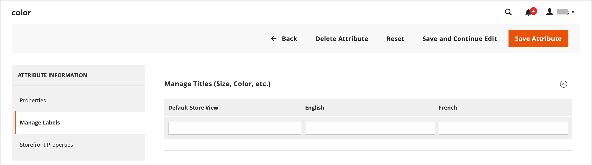

# Localización de tiendas

La mayor parte del texto que parece estar codificado en las páginas de la tienda se puede cambiar instantáneamente a un idioma diferente cambiando la configuración regional de la vista. Cambiar la configuración regional no traduce realmente el texto palabra por palabra, sino que simplemente hace referencia a una tabla de traducción diferente que proporciona el texto de la interfaz que se utiliza en todo el almacén. El texto que se puede cambiar incluye títulos de navegación, etiquetas, botones y vínculos como _Mi carro_ y _Mi cuenta_. También puede usar la herramienta [Traducción en línea](../configuration-reference/advanced/developer.md) para retocar texto en la interfaz.

Los paquetes de idiomas se encuentran en [Traducciones y localización](https://marketplace.magento.com/extensions/content-customizations/translations-localization.html){:target="_blank"} en Commerce Marketplace. Las nuevas extensiones se añaden continuamente al Marketplace, por lo que vuelva a consultarlas con frecuencia.

## Paso 1: Instalar un paquete de idioma

Siga las instrucciones estándar para instalar la extensión del paquete de idioma. Para obtener información detallada sobre cómo instalar una extensión, consulte [Instalación general de CLI](https://experienceleague.adobe.com/docs/commerce-operations/installation-guide/tutorials/extensions.html) en la _Guía de extensiones_.

## Paso 2: Crear una vista de tienda para el idioma

1. En la barra lateral _Admin_, vaya a **[!UICONTROL Stores]** > _[!UICONTROL Settings]_>**[!UICONTROL All Stores]**.

1. Haga clic en **[!UICONTROL Create Store View]**.

1. Defina las opciones para la nueva vista de tienda:

   - **[!UICONTROL Store]**: elija el almacén que es el principal de la vista.

   - **[!UICONTROL Name]**: escriba un nombre para la vista de tienda. Por ejemplo: portugués.

     En el encabezado del almacén, el nombre aparece en el _selector de idioma_.

   - **[!UICONTROL Code]**: escriba un código en minúsculas para identificar la vista. Por ejemplo: `portuguese`.

   - **[!UICONTROL Status]** — Para activar la vista, establezca en `Enabled`.

   - **[!UICONTROL Sort Order]** — (Opcional) Escriba un número para determinar la secuencia en la que esta vista se muestra con otras vistas.

1. Una vez finalizado, haga clic en **[!UICONTROL Save Store View]**.

## Paso 3: cambiar la configuración regional de la vista de la tienda

1. En la barra lateral _Admin_, vaya a **[!UICONTROL Stores]** > _[!UICONTROL Settings]_>**[!UICONTROL Configuration]**.

1. En el menú desplegable **[!UICONTROL Scope]**, seleccione la vista de tienda que desea configurar y haga clic en **[!UICONTROL OK]** cuando se le solicite.

1. En la página de configuración *[!UICONTROL General]*, expanda  en la sección **[!UICONTROL Locale Options]**.

1. Desactive la casilla de verificación **[!UICONTROL Use Website]** y establezca **[!UICONTROL Locale]** en el idioma que desee asignar a la vista.

   Si hay varias variaciones del idioma disponible, asegúrese de elegir el de la región o dialecto específico.

1. Una vez finalizado, haga clic en **[!UICONTROL Save Config]**.

   Después de cambiar el idioma de la configuración regional, el contenido restante que ha creado, incluidos los nombres y descripciones de productos, las categorías, las páginas de [CMS](../content-design/page-translate.md) y los bloques, debe traducirse por separado para cada vista de tienda.

## Localizar productos

Si la tienda tiene varias vistas en diferentes idiomas, los mismos productos estarán disponibles en cada vista de tienda. Puede utilizar la misma información básica del producto, como SKU, precio y nivel de inventario, independientemente del idioma. A continuación, traduzca solo el nombre del producto, los campos de descripción y los metadatos según sea necesario para cada idioma.

### Paso 1: Traducir campos de producto

1. En la barra lateral _Admin_, vaya a **[!UICONTROL Catalog]** > **[!UICONTROL Products]**.

1. En la cuadrícula, busque el producto que desea traducir y ábralo en modo de edición.

1. En la esquina superior izquierda, establezca **[!UICONTROL Store View]** en la vista de la traducción y haga clic en **[!UICONTROL OK]** cuando se le pida que confirme.

1. Para cada campo que desea editar, haga lo siguiente:

   - Anule la selección de la casilla de verificación **[!UICONTROL Use Default Value]** a la derecha del campo.

   - Pegue o escriba el texto traducido en el campo.

   Asegúrese de traducir todos los campos de texto, incluidas las etiquetas [image](../catalog/catalog-images-video.md) y el texto alternativo, los campos [Optimización del motor de búsqueda](../catalog/product-search-engine-optimization.md) y cualquier información de [Opciones personalizadas](../catalog/settings-advanced-custom-options.md).

1. Una vez finalizado, haga clic en **[!UICONTROL Save]**.

### Paso 2: Traducir etiquetas de campo

1. En la barra lateral _Admin_, vaya a **[!UICONTROL Stores]** > _[!UICONTROL Attributes]_>**[!UICONTROL Product]**.

1. En la lista, busque el atributo que desea traducir y abra en modo de edición.

1. En el panel izquierdo, elija **[!UICONTROL Manage Labels]**.

1. En la sección _[!UICONTROL Manage Titles]_, escriba una etiqueta traducida para cada vista de tienda.

   {width="600" zoomable="yes"}

1. Una vez finalizado, haga clic en **[!UICONTROL Save Attribute]**.

### Paso 3: Traducir todas las categorías

1. En la barra lateral _Admin_, vaya a **[!UICONTROL Catalog]** > **Categorías**.

1. En la esquina superior izquierda, establezca **[!UICONTROL Store View]** en la vista de la traducción y haga clic en **[!UICONTROL OK]** cuando se le pida que confirme.

1. En el árbol, busque la categoría que desea traducir y ábrala en modo de edición.

1. Para _información básica_, traduzca **[!UICONTROL Category Name]**.

1. Expanda  en la sección _[!UICONTROL Content]_y traduzca **[!UICONTROL Description]**.

1. Expanda  en la sección **[!UICONTROL Search Engine Optimization Settings]** y traduzca los campos siguientes:

   - **[!UICONTROL Meta Title]**
   - **[!UICONTROL Meta Keywords]**
   - **[!UICONTROL Meta Description]**

1. En la sección _[!UICONTROL Search Engine Optimization Settings]_, haga lo siguiente para traducir **[!UICONTROL URL Key]**:

   - Desactive la casilla **[!UICONTROL Use Default Value]** a la derecha del campo.

   - Introduzca el texto traducido.

   - Asegúrese de que la casilla de verificación **[!UICONTROL Create Permanent Redirect for old URL]** esté seleccionada.

   

1. Una vez finalizado, haga clic en **[!UICONTROL Save Category]**.

1. Repita el proceso para todas las categorías utilizadas en la tienda.

### Paso 4: Traducir atributos y opciones de atributos del producto

1. En la barra lateral _Admin_, vaya a **[!UICONTROL Stores]** > _[!UICONTROL Attributes]_>**[!UICONTROL Product]**.

1. Seleccione el atributo que desea traducir.

1. Elija **[!UICONTROL Manage Labels]** a la izquierda y defina las opciones de **[!UICONTROL Managed Titles]** para definir las traducciones de título de atributo.

1. Elija **[!UICONTROL Properties]** a la izquierda e introduzca las opciones de atributo traducidas en la sección **[!UICONTROL Manage Options]**.

   {width="600" zoomable="yes"}

1. Una vez finalizado, haga clic en **[!UICONTROL Save Attribute]**.
