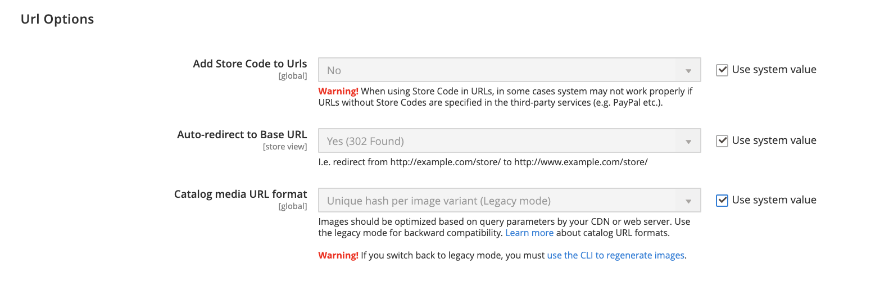

# URL de tienda

Cada sitio web de una instalación de Adobe Commerce o de Magento Open Source tiene una dirección URL base asignada a la tienda y otra dirección URL asignada al administrador. El Adobe de utiliza variables para definir vínculos internos en relación con la dirección URL base, lo que permite mover un almacén completo de una ubicación a otra sin actualizar los vínculos. Las direcciones URL base estándar comienzan por `http`, y las direcciones URL base seguras comienzan por `https`.

- **URL básica** — `http://www.yourdomain.com/magento/`
- **URL base segura** — `https://www.yourdomain.com/magento/`
- **URL con dirección IP** — `http://###.###.###.###/magento/` o `https://###.###.###.###/magento/`

>[!IMPORTANT]
>
>No cambie la URL de administración de la configuración de URL base predeterminada. Para cambiar la URL o la ruta de administración, consulte [Usar una URL de administrador personalizada](#use-a-custom-admin-url).

## Usar un protocolo seguro

Las direcciones URL base de su tienda se configuraron inicialmente durante la instalación de Adobe Commerce. Si había un certificado de seguridad disponible en ese momento, puede especificar para `HTTPS` Direcciones URL que se utilizarán para el almacén, el administrador o ambos. Si la instalación de Adobe Commerce incluye varias tiendas o si planea agregar más tiendas posteriormente, puede incluir el código de la tienda en la dirección URL. Todos los recursos y operaciones de Adobe se pueden utilizar con el protocolo seguro.

Si no había un certificado de seguridad disponible para el dominio en el momento de la instalación, asegúrese de actualizar la configuración antes de iniciar el almacén. Una vez establecido un certificado de seguridad para su dominio, puede configurar una o ambas direcciones URL base para que funcionen con Secure Sockets Layer (SSL) cifrada y [Seguridad de capa de transporte][1] Protocolo (TLS).

>[!IMPORTANT]
>
>El Adobe recomienda encarecidamente transmitir todas las páginas de un sitio de producción, incluidas las páginas de contenido y producto, mediante un protocolo seguro.

Adobe Commerce y Magento Open Source pueden configurarse para entregar todas las páginas `HTTPS` de forma predeterminada. Si su tienda se ha estado ejecutando con el protocolo estándar, puede mejorar la seguridad habilitando [HTTP Strict Transport Security][2] (HSTS) y actualizar cualquier solicitud de página no segura. HSTS es un protocolo de inclusión que evita que los exploradores procesen contenido estándar `HTTP` páginas que se transmiten con un protocolo no seguro para el dominio especificado. Debido a que es posible que los motores de búsqueda ya hayan indexado cada página de su tienda con `HTTP` URL, puede configurar Commerce para actualizar cualquier solicitud de página no segura a `HTTPS` automáticamente , para que no pierda ningún tráfico. Cuando Commerce está configurado para utilizar direcciones URL seguras tanto para la tienda como para el administrador, aparecen dos campos adicionales que le permiten habilitar `HSTS`.

## Configuración de la dirección URL base

1. En el _Administrador_ barra lateral, vaya a **[!UICONTROL Stores]** > _[!UICONTROL Settings]_>**[!UICONTROL Configuration]**.

1. En _General_ en el panel izquierdo, elija **[!UICONTROL Web]**.

1. Expandir  el **[!UICONTROL Base URL]** sección.

   - **[!UICONTROL Base URL]** — Introduzca la dirección URL base completa de su tienda. Asegúrese de finalizar la dirección URL con una barra diagonal para que se pueda ampliar con claves de URL adicionales de la tienda. Por ejemplo: `http://yourdomain.com/`

     >[!NOTE]
     >
     >No cambie el marcador de posición en _[!UICONTROL Base Link URL]_field. Es un marcador de posición que se utiliza para crear vínculos relativos a la dirección URL base.

   - **[!UICONTROL Base URL for Static View Files]** — (Opcional) Especifique una ubicación alternativa para la URL base de los archivos de vista estática introduciendo la ruta de acceso que comience por el siguiente marcador de posición:

     \{\{unsecure_base_url}}

   - **[!UICONTROL Base URL for User Media Files]** — (Opcional) Especifique una ubicación alternativa para la URL base de los archivos multimedia del usuario introduciendo la ruta de acceso que comience por el siguiente marcador de posición:

     \{\{unsecure_base_url}}

     En una instalación típica, no es necesario actualizar las rutas de los archivos de vista estática o archivos multimedia porque son relativas a la dirección URL base.

   {width="600" zoomable="yes"}

   >[!NOTE]
   >
   >Los marcadores de posición entre llaves dobles son etiquetas de marcado para variables.

1. Cuando termine, haga clic en **[!UICONTROL Save Config]**.

## Configuración de la URL base segura

Si su dominio tiene un certificado de seguridad válido, puede configurar las direcciones URL de la tienda y del administrador para transmitir datos a través de un canal seguro (https). Sin un certificado de seguridad válido, el almacén no puede funcionar con el protocolo seguro (SSL/TLS).

1. Expandir  el _[!UICONTROL Base URLs (Secure])_ y haga lo siguiente:

   {width="600" zoomable="yes"}

   - **[!UICONTROL Secure Base URL]** — introduzca la dirección URL base completa segura, seguida de una barra diagonal. Por ejemplo: `https://yourdomain.com/`

   - **[!UICONTROL Secure Base Link URL]** — No cambie el marcador de posición en el campo URL de vínculo base seguro. Se utiliza para crear vínculos relativos a la dirección URL base segura.

   - **[!UICONTROL Secure Base URL for Static View Files]** — (Opcional) Especifique una ubicación alternativa para la URL base segura para los archivos de vista estática introduciendo la ruta de acceso que comience por el siguiente marcador de posición:

     \{\{secure_base_url}}

   - **[!UICONTROL Secure Base URL for User Media Files]** — (Opcional) Especifique una ubicación alternativa para la URL base segura para los archivos multimedia del usuario introduciendo la ruta de acceso que comience por el siguiente marcador de posición:

     \{\{secure_base_url}}

1. Para mejorar la seguridad, establezca las dos opciones siguientes en `Yes`.

   - **[!UICONTROL Use Secure URLs on Storefront]**
   - **[!UICONTROL Use Secure URLs in Admin]**

1. Para _[!UICONTROL Enhanced Security Settings]_, haga lo siguiente:

   - **[!UICONTROL Enable HTTP Strict Transport Security (HSTS)]** — Si desea que la tienda muestre solo solicitudes de página HTTPS seguras, establezca en `Yes`.

   - **[!UICONTROL Upgrade Insecure Requests]** — Para actualizar cualquier solicitud de páginas HTTP estándar no seguras a HTTPS seguro, establezca en `Yes`.

1. Configure las variables **[!UICONTROL Offloader Header]** para su servidor.

   La mayoría de las instalaciones de Commerce utilizan el predeterminado `X-Forward-Proto` para identificar el protocolo como `HTTP` o `HTTPS`. Si la configuración del servidor utiliza un offloader_header diferente, ingréselo aquí.

1. Cuando termine, haga clic en **[!UICONTROL Save Config]**.

## Incluir el código de tienda en las direcciones URL

>[!NOTE]
>
>Si la variable _Añadir código de tienda a las direcciones URL_ se establece en `Yes`Además, debe incluir códigos de tienda en las direcciones URL de su explorador. Esta configuración garantiza que las reescrituras de URL se asignen correctamente y que todas las páginas se abran correctamente, sin _&quot;Página 404 no encontrada&quot;_ errores.

1. En el _Administrador_ barra lateral, vaya a **[!UICONTROL Stores]** > _[!UICONTROL Settings]_>**[!UICONTROL Configuration]**.

1. En _[!UICONTROL General]_en el panel izquierdo, elija **[!UICONTROL Web]**.

1. Expandir  el **[!UICONTROL URL Options]** sección.

1. Establecer **[!UICONTROL Add Store Code]** según sus preferencias:

   - **[!UICONTROL URL with Store Code]**: `http://www.yourdomain.com/magento/[store-code]/index.php/url-identifier`
   - **[!UICONTROL URL without Store Code]**: `http://www.yourdomain.com/magento/index.php/url-identifier`

   {width="600" zoomable="yes"}

1. Cuando termine, haga clic en **[!UICONTROL Save Config]**.

1. Haga clic en **[!UICONTROL Cache Management]** en el mensaje situado en la parte superior del espacio de trabajo. A continuación, siga las instrucciones para actualizar la caché.

   

## Solución de problemas de URL

Si después de seguir las instrucciones de configuración, algunas páginas se siguen usando con la dirección URL no segura (`http://`), haga lo siguiente:

- Cambie la dirección URL base (no segura) a la dirección URL HTTPS segura.
- En el servidor, edite el `.htaccess` (o equilibrador de carga), de modo que la URL no segura se redirija a la URL segura.

## Usar una URL de administrador personalizada

As a [prácticas recomendadas de seguridad](https://www.adobe.com/content/dam/cc/en/trust-center/ungated/whitepapers/experience-cloud/adobe-commerce-best-practices-guide.pdf), el Adobe recomienda utilizar una URL de administrador única en lugar de la predeterminada _administrador_ o un término común como _servidor_. Aunque no protege directamente el sitio de un actor incorrecto determinado, puede reducir la exposición a scripts que intentan obtener acceso no autorizado.

>[!NOTE]
>
>Consulte con su proveedor de alojamiento antes de implementar una URL de administrador personalizada. Algunos proveedores de alojamiento requieren una dirección URL estándar para cumplir las reglas de protección del cortafuegos.

En una instalación típica, la dirección URL de administración y la ruta siguen inmediatamente a la dirección URL base. La ruta del administrador es un directorio por debajo de la raíz.

- **URL base predeterminada**: `http://yourdomain.com/magento/`
- **Ruta de administración predeterminada**: `admin`
- **URL y ruta de administración predeterminadas**: `http://yourdomain.com/magento/admin`

Aunque es posible cambiar la URL y la ruta de administración a otra ubicación, cualquier error elimina el acceso al administrador y debe corregirse desde el servidor.

>[!NOTE]
>
>Como precaución, no intente cambiar la URL de administración a menos que sepa cómo editar los archivos de configuración en el servidor.

### Método 1: cambio desde el administrador

1. En el _Administrador_ barra lateral, vaya a **[!UICONTROL Stores]** > _[!UICONTROL Settings]_>**[!UICONTROL Configuration]**.

1. En el panel izquierdo, expanda **[!UICONTROL Advanced]** y elija **[!UICONTROL Admin]**.

1. Expandir  el **[!UICONTROL Admin Base URL]** sección.

1. Defina las opciones de configuración para la URL personalizada:

   {width="600" zoomable="yes"}

   Si es necesario, borre la **[!UICONTROL Use system value]** para cambiar la configuración.

   - Establecer **[!UICONTROL Use Custom Admin URL]** hasta `Yes`.

   - Introduzca el **[!UICONTROL Custom Admin URL]**: `http://yourdomain.com/magento/`

     >[!NOTE]
     >
     >La URL de administrador debe estar en la misma instalación de Commerce y tener la misma raíz de documento que la tienda.

   - Establecer **[!UICONTROL Custom Admin Path]** hasta `Yes`.

   - Para **[!UICONTROL Custom Admin Path]**, introduzca la ruta que se utilizará como nombre de la carpeta de administración personalizada.

     Ejemplo: `sample_custom_admin`

1. Cuando termine, haga clic en **[!UICONTROL Save Config]**.

1. Una vez guardados los cambios, cierre la sesión de Admin y vuelva a iniciarla con la nueva dirección URL y ruta de Admin.

### Método 2: cambiar la ruta de administración desde la línea de comandos del servidor

1. Abra el `app/etc/env.php` en un editor de texto y cambie el valor del `frontName` parámetro del `backend` sección. A continuación, guarde el archivo.

   Asegúrese de utilizar solo caracteres en minúsculas.

   >[!NOTE]
   >
   >   Este método permite cambiar la ruta de administración, pero no la dirección URL de administración.

   >[!TIP]
   >
   >Para Adobe Commerce en la infraestructura en la nube, puede configurar una ruta de administración personalizada mediante la variable `ADMIN_URL` en la IU de Cloud. Consulte la [Tema sobre variables de administración](https://experienceleague.adobe.com/docs/commerce-cloud-service/user-guide/configure/env/stage/variables-admin.html) en el _Guía de Commerce en la infraestructura de Cloud_.

   - **Ruta de administración predeterminada**

     ```php?start_inline=1
     'backend' => [
      'frontName' => 'admin'
     ],
     ```

   - **Nueva ruta de administración**

     ```php?start_inline=1
     'backend' => [
         'frontName' => 'backend'
     ],
     ```

1. Utilice uno de los siguientes métodos para borrar la caché:

   - En el _Administrador_ barra lateral, vaya a **[!UICONTROL System]** > _[!UICONTROL Tools]_>**[!UICONTROL Cache Management]**. A continuación, haga clic en **[!UICONTROL Flush Magento Cache]**.
   - En el servidor, ejecute lo siguiente:

     ```terminal
     php bin/magento cache:flush
     ```

   >[!NOTE]
   >
   >Los cambios realizados con el método 1 tienen prioridad sobre los cambios realizados en el `app/etc/env.php` archivo.

### Método 3: Cambiar la ruta de administración mediante la CLI de Commerce

Puede utilizar la CLI `setup:config:set` para cambiar la ruta de administración. El ejemplo siguiente utiliza el `--backend-frontname` para cambiar la ruta de la raíz de Commerce a una nueva ruta de administración:

```terminal
bin/magento setup:config:set --backend-frontname="backend_front_name"
```

Este comando actualiza el `backend` > `frontName` opción de configuración en la `app/etc/env.php` archivo.

## Restaure la URL de administración y la ruta de administración predeterminadas

Si ha establecido una URL de administración no válida o una Ruta de administración y ha perdido el acceso al servidor, existe una forma de solucionarlo desde la línea de comandos.

1. Para volver a la URL de administración predeterminada, ejecute este comando:

   ```terminal
   php bin/magento config:set admin/url/use_custom 0
   ```

1. Para volver a la ruta de administración predeterminada (establecida en la `app/etc/env.php` como se describe en el Método 2), ejecute este comando:

   ```terminal
   php bin/magento config:set admin/url/use_custom_path 0
   ```

1. Utilice uno de los siguientes métodos para borrar la caché:

   - En el _Administrador_ barra lateral, vaya a **[!UICONTROL System]** > _[!UICONTROL Tools]_>**[!UICONTROL Cache Management]**. A continuación, haga clic en **[!UICONTROL Flush Magento Cache]**.
   - En el servidor, ejecute lo siguiente:

     ```terminal
     php bin/magento cache:flush
     ```


[1]: https://en.wikipedia.org/wiki/Transport_Layer_Security
[2]: https://en.wikipedia.org/wiki/HTTP_Strict_Transport_Security
