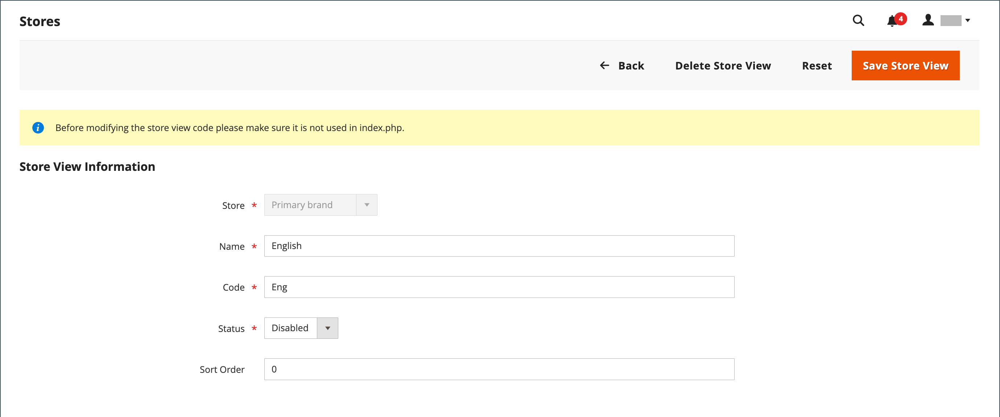

# Vistas de tienda

Las vistas de tienda se suelen utilizar para que la tienda esté disponible en diferentes configuraciones regionales. Los compradores pueden utilizar el selector de idioma en el encabezado de la tienda para cambiar la vista de la tienda.

{width="550"}

## Agregar una vista de tienda

1. En la barra lateral _Admin_, vaya a **[!UICONTROL Stores]** > _[!UICONTROL Settings]_>**[!UICONTROL All Stores]**.

   {width="700" zoomable="yes"}

1. Haga clic en **[!UICONTROL Create Store View]**.

   {width="600" zoomable="yes"}

1. Establezca **[!UICONTROL Store]** en el almacén principal de esta vista.

1. Escriba un **[!UICONTROL Name]** para esta vista de tienda.

   El nombre aparece en el selector de idioma del encabezado de la tienda. Por ejemplo: `Spanish`.

1. Para **[!UICONTROL Code]**, escriba el código que identifica la vista (en caracteres en minúsculas).

   Por ejemplo: `spanish`.

1. Para activar la vista, establezca **[!UICONTROL Status]** en `Enabled`.

1. (Opcional) Escriba un número **[!UICONTROL Sort Order]** para determinar la secuencia en la que esta vista se muestra con otras vistas.

1. Haga clic en **[!UICONTROL Save Store View]**.

## Editar una vista de tienda

Dado que el nombre de la vista aparece en el selector de idioma, puede que desee cambiar el nombre de la vista predeterminada por otro más descriptivo. El campo _Name_ es simplemente una etiqueta y se puede cambiar fácilmente.

Si la instalación de Adobe Commerce o Magento Open Source tiene una instalación de varios sitios o de varias tiendas, no cambie el campo Código de almacén sin comprobar que no se hace referencia al valor en el archivo `index.php`. Si no tiene acceso al servidor para examinar el archivo, pida ayuda a un desarrollador.

| Campo | Valor original | Valor actualizado |
| ----- | -------------- | ------------- |
| [!UICONTROL Name] | `Default Store View` | `English` |
| [!UICONTROL Code] | `default` | `english` |

{style="table-layout:auto"}

1. En la barra lateral _Admin_, vaya a **[!UICONTROL Stores]** > _[!UICONTROL Settings]_>**[!UICONTROL All Stores]**.

1. En la columna _[!UICONTROL Store View]_&#x200B;de la cuadrícula, haga clic en el nombre de la vista que desee editar.

   Al editar la vista predeterminada, los campos _[!UICONTROL Store]_&#x200B;y&#x200B;_[!UICONTROL Status]_ no están disponibles.

   {width="600" zoomable="yes"}

1. Actualice los campos siguientes según sea necesario:

   - **[!UICONTROL Store]** (solo vistas no predeterminadas)
   - **[!UICONTROL Name]**
   - **[!UICONTROL Code]** (solo si no se usa en `index.php`)
   - **[!UICONTROL Status]** (solo vistas no predeterminadas)
   - **[!UICONTROL Sort Order]**

1. Haga clic en **[!UICONTROL Save Store View]**.
