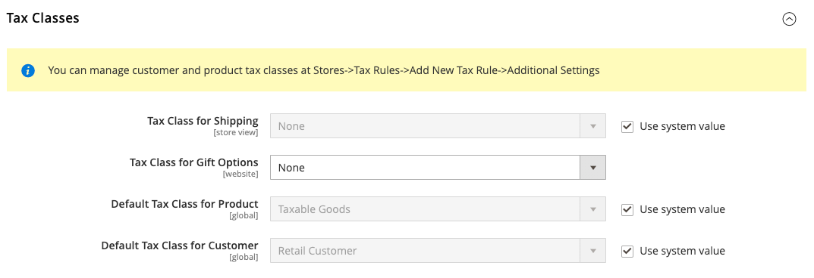

# Configuración de impuestos

Las siguientes instrucciones le guían a través de la configuración fiscal básica de la instancia de Commerce. Antes de configurar tus impuestos, asegúrate de estar familiarizado con los requisitos fiscales de tu [configuración regional](store-localize.md#step-3-change-the-locale-of-the-store-view). A continuación, complete la configuración de impuestos según sus necesidades.

Los [permisos](../systems/permissions.md) del administrador se pueden establecer para restringir el [acceso](../systems/permissions-user-roles.md) a los recursos de impuestos, en función de lo que _necesita saber_ de la empresa. Para crear un rol de administrador con acceso a la configuración de impuestos, seleccione los recursos de ventas/impuestos y de sistema/impuestos. Si configura un sitio web para una región que difiere de su punto de origen de envío predeterminado, también debe permitir el acceso a los recursos de sistema/envío para el rol. La configuración de envío determina la tasa de impuestos de la tienda que se utiliza para los precios del catálogo.

## Configuración general de impuestos

1. En la barra lateral _Admin_, vaya a **[!UICONTROL Stores]** > _[!UICONTROL Settings]_>**[!UICONTROL Configuration]**.

1. Para una configuración de varios sitios, establezca **[!UICONTROL Store View]** en el sitio web y el almacén que es el destino de la configuración.

1. En el panel izquierdo, expanda **[!UICONTROL Sales]** y elija **[!UICONTROL Tax]**.

1. Complete las siguientes opciones de configuración.

   Si es necesario, borre la casilla de verificación **[!UICONTROL Use system value]** de cualquier configuración que esté atenuada.

### [!UICONTROL Tax Classes]

1. Expanda  en la sección **[!UICONTROL Tax Classes]**.

   {width="600" zoomable="yes"}

   - **Clase de impuesto para el envío** — Se establece en la clase apropiada. Las clases predeterminadas son: `None` y `Taxable Goods`
   - **Clase de impuesto para opciones de regalo** —  (solo Adobe Commerce) Establezca en la clase apropiada. Las clases predeterminadas son: `None` y `Taxable Goods`
   - **Clase de impuesto predeterminada para el producto** — Se establece en la clase apropiada. Las clases predeterminadas son: `None` y `Taxable Goods`
   - **Clase de impuesto predeterminada para el cliente** — Se establece en la clase apropiada. La clase predeterminada es: `Retail Customer` y `Wholesale Customer`

1. Una vez finalizado, haga clic en **[!UICONTROL Save Config]**.

### [!UICONTROL Calculation Settings]

1. Expanda la sección **[!UICONTROL Calculation Settings]**.

   {width="600" zoomable="yes"}

1. Establezca **[!UICONTROL Tax Calculation Method Based On]** en una de las siguientes opciones:

   - `Unit Price`: el precio de cada producto
   - `Row Total`: el total del elemento de línea del pedido, menos los descuentos
   - `Total` - El total del pedido

1. Establezca **[!UICONTROL Tax Calculation Based On]** en una de las siguientes opciones:

   - `Shipping Address`: dirección a la que se enviará el pedido
   - `Billing Address` - La dirección de facturación del cliente o compañía
   - `Shipping Origin`: la dirección especificada como [punto de origen](shipping-settings.md#point-of-origin) de su tienda

1. Establezca **[!UICONTROL Catalog Prices]** en `Excluding Tax` o `Including Tax`.

1. Establezca **[!UICONTROL Shipping Prices]** en `Excluding Tax` o `Including Tax`.

1. Establezca **[!UICONTROL Apply Customer Tax]** en una de las siguientes opciones para determinar si el impuesto se aplica al precio original o con descuento: `After Discount` o `Before Discount`

1. Establezca **[!UICONTROL Apply Discount on Prices]** en una de las siguientes opciones para determinar si los descuentos incluyen o excluyen impuestos: `Excluding Tax` o `Including Tax`

1. Establezca **[!UICONTROL Apply Tax On]** en `Custom price if available` o `Original price only`.

1. Establezca **[!UICONTROL Enable Cross-Border Trade]** en una de las siguientes opciones:

   - `Yes`: utilice precios consistentes en diferentes tasas de impuestos. Si el precio del catálogo incluye impuestos, seleccione esta opción para fijar el precio independientemente del tipo impositivo del cliente.
   - `No` - Variar el precio por tasa de impuestos.

   >[!IMPORTANT]
   >
   >Si [comercio internacional](#cross-border-price-consistency) está habilitado, el margen de ganancia cambia según la tasa de impuestos. El beneficio está determinado por la fórmula (`Revenue - CustomerVAT - CostOfGoodsSold`). Para permitir el comercio transfronterizo, los precios deben fijarse para incluir impuestos.

### [!UICONTROL Default Tax Destination Calculation]

1. Expanda  en la sección **[!UICONTROL Default Tax Destination Calculation]**.

   {width="600" zoomable="yes"}

1. Especifique **[!UICONTROL Default Country]** para los cálculos de impuestos.

1. Si corresponde, especifique **[!UICONTROL Default State]** para los cálculos de impuestos.

1. Si corresponde, especifique **[!UICONTROL Default Post Code]** para los cálculos de impuestos.

1. Una vez finalizado, haga clic en **[!UICONTROL Save Config]**.

### [!UICONTROL Price Display Settings]

>[!IMPORTANT]
>
>Algunas combinaciones de configuraciones relacionadas con una visualización de precios que incluyen y excluyen impuestos pueden ser confusas para el cliente. Para evitar activar un mensaje de advertencia, consulte la [configuración recomendada](taxes.md#warning-messages).

1. Expanda  en la sección **[!UICONTROL Price Display Settings]**.

   {width="600" zoomable="yes"}

1. Establezca **[!UICONTROL Display Product Prices in Catalog]** en una de las siguientes opciones:

   - `Excluding Tax` - Los precios de catálogo que aparecen en la tienda no incluyen impuestos.
   - `Including Tax`: los precios de catálogo de la tienda incluyen impuestos únicamente si una regla fiscal coincide con el origen del impuesto o si la dirección del cliente coincide con la regla fiscal. Esto puede suceder después de que un cliente cree una cuenta, inicie sesión o utilice la herramienta Estimar impuestos y envíos del carro de compras.
   - `Including and Excluding Tax`: los precios de catálogo que aparecen en la tienda se muestran tanto con como sin impuestos.

1. Establezca **[!UICONTROL Display Shipping Prices]** en `Excluding Tax`, `Including Tax` o `Including and Excluding Tax`.

1. Una vez finalizado, haga clic en **[!UICONTROL Save Config]**.

### [!UICONTROL Shopping Cart Display Settings]

1. Expanda  en la sección **[!UICONTROL Shopping Cart Display Settings]**.

   {width="600" zoomable="yes"}

1. Para cada una de las siguientes configuraciones, elija cómo desea que aparezcan los impuestos y los precios en el carro de compras, según los requisitos de su tienda y configuración regional:

   - Establezca **[!UICONTROL Display Prices]** en `Excluding Tax`, `Including Tax` o `Including and Excluding Tax`.

   - Establezca **[!UICONTROL Display Subtotal]** en `Excluding Tax`, `Including Tax` o `Including and Excluding Tax`.

   - Establezca **[!UICONTROL Display Shipping Amount]** en `Excluding Tax`, `Including Tax` o `Including and Excluding Tax`.

   -  (solo Adobe Commerce) estableció **[!UICONTROL Display Gift Wrapping Prices]** en `Excluding Tax`, `Including Tax` o `Including and Excluding Tax`.

   -  (solo Adobe Commerce) estableció **[!UICONTROL Display Printed Card Prices]** en `Excluding Tax`, `Including Tax` o `Including and Excluding Tax`.

1. Establezca las siguientes opciones de visualización en `Yes` o `No`, según sus necesidades:

   - **[!UICONTROL Include Tax in Order Total]**
   - **[!UICONTROL Display Full Tax Summary]**
   - **[!UICONTROL Display Zero Tax Subtotal]**

1. Una vez finalizado, haga clic en **[!UICONTROL Save Config]**.

### [!UICONTROL Orders, Invoices, Credit Memos Display Settings]

1. Expandir  de la sección **[!UICONTROL Orders, Invoices, Credit Memos Display Settings]**.

   {width="600" zoomable="yes"}

1. Especifique cómo aparecen los precios y los impuestos en los pedidos, facturas y notas de abono:

   - Establezca **[!UICONTROL Display Prices]** en `Excluding Tax`, `Including Tax` o `Including and Excluding Tax`.

   - Establezca **[!UICONTROL Display Subtotal]** en `Excluding Tax`, `Including Tax` o `Including and Excluding Tax`.

   - Establezca **[!UICONTROL Display Shipping Amount]** en `Excluding Tax`, `Including Tax` o `Including and Excluding Tax`.

   -  (solo Adobe Commerce) estableció **[!UICONTROL Display Gift Wrapping Prices]** en `Excluding Tax`, `Including Tax` o `Including and Excluding Tax`.

   -  (solo Adobe Commerce) estableció **[!UICONTROL Display Printed Card Prices]** en `Excluding Tax`, `Including Tax` o `Including and Excluding Tax`.

1. Establezca las siguientes opciones de visualización en `Yes` o `No`, según sus necesidades:

   - **[!UICONTROL Include Tax in Order Total]**
   - **[!UICONTROL Display Full Tax Summary]**
   - **[!UICONTROL Display Zero Tax Subtotal]**

1. Una vez finalizado, haga clic en **[!UICONTROL Save Config]**.

### [!UICONTROL Fixed Product Taxes]

1. Expanda  en la sección **[!UICONTROL Fixed Product Taxes]**.

   {width="600" zoomable="yes"}

1. Establezca **[!UICONTROL Enable FPT]** en `Yes` o `No`, según sus necesidades.

1. Si FPT está habilitado, especifique las opciones de visualización de FPT:

   - **[!UICONTROL Display Prices in Product Lists]**
   - **[!UICONTROL Display Price On Product view Page]**
   - **[!UICONTROL Display Prices in Sales Modules]**
   - **[!UICONTROL Display Prices in Emails]**

   - `Including FPT Only` - Los precios mostrados incluyen impuestos fijos sobre el producto. El importe de FTP no se muestra por separado.
   - `Including FPT and FPT description` - Los precios mostrados incluyen impuestos fijos sobre el producto. El importe de FTP se muestra por separado.
   - `Excluding FPT. Including FPT description and final price` - Los precios mostrados no incluyen impuestos fijos sobre los productos. El importe de FTP se muestra por separado.
   - `Excluding FPT` - Los precios mostrados no incluyen impuestos fijos sobre los productos. El importe de FTP no se muestra por separado.

1. Establezca **[!UICONTROL Apply Discounts to FPT]** en `Yes` o `No`, según sus necesidades.

1. Establezca **[!UICONTROL FPT Tax Configuration]** para determinar cómo se calcula el valor de FTP.

   - `Not Taxed`: seleccione esta opción si su jurisdicción fiscal no grava el FTP. (Por ejemplo, California).
   - `Taxed`: seleccione esta opción si su jurisdicción fiscal no grava el FTP. (Por ejemplo, Canadá).
   - `Loaded and Displayed with Tax` - Haga clic en esta opción si FPT se agrega al total del pedido antes de aplicar impuestos. (Por ejemplo, los países de la UE).

1. Establezca **[!UICONTROL Include FPT in Subtotal]** en `Yes` o `No`, según sus necesidades.

1. Una vez finalizado, haga clic en **[!UICONTROL Save Config]**.

## Coherencia transfronteriza de los precios

El comercio transfronterizo (también conocido como coherencia de precios) apoya a la Unión Europea (UE) y a otros comerciantes que desean mantener precios consistentes para los clientes cuyos tipos impositivos son diferentes del tipo impositivo de la tienda.

Los comerciantes que operan en diferentes regiones y regiones geográficas pueden mostrar un único precio al incluir el impuesto en el precio del producto. Los precios son limpios y sin complicaciones, independientemente de las estructuras impositivas y las tasas que varían de un país a otro. Esta configuración requiere que se instale una extensión de cálculo de impuestos desde [Marketplace](../getting-started/commerce-marketplace.md), como _Vertex Cloud_.

>[!NOTE]
>
>Cuando se habilita el comercio transfronterizo, el margen de ganancia cambia según la tasa de impuestos. El beneficio está determinado por la fórmula: 
>`Revenue - CustomerVAT - CostOfGoodsSold`

**_Para habilitar la coherencia de precios internacionales:_**

1. En la barra lateral _Admin_, vaya a **[!UICONTROL Stores]** > _[!UICONTROL Settings]_>**[!UICONTROL Configuration]**.

1. Para una configuración de varios sitios, establezca **[!UICONTROL Store View]** en el sitio web y el almacén que es el destino de la configuración.

1. En el panel izquierdo, expanda **[!UICONTROL Sales]** y elija **[!UICONTROL Tax]**.

1. Expanda  en la sección **[!UICONTROL Calculation Settings]**.

1. Establezca **[!UICONTROL Catalog Prices]** en `Including Tax`.

1. Para habilitar la coherencia de precios internacionales, establezca **[!UICONTROL Enable Cross Border Trade]** en `Yes`.

   {width="600" zoomable="yes"}

1. Una vez finalizado, haga clic en **[!UICONTROL Save Config]**.
