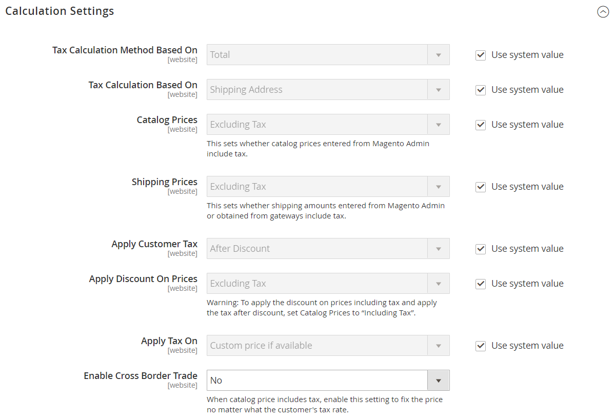

# Configuración de impuestos

Las siguientes instrucciones le guían a través de la configuración fiscal básica de su instancia de Commerce. Antes de configurar sus impuestos, asegúrese de estar familiarizado con los requisitos fiscales de su [locale](store-localize.md#step-3-change-the-locale-of-the-store-view). A continuación, complete la configuración de impuestos según sus necesidades.

Administrador [permissions](../systems/permissions.md) se puede configurar para restringir [access](../systems/permissions-user-roles.md) a los recursos fiscales, en función de la empresa _necesita saber_. Para crear un rol de administrador con acceso a la configuración de impuestos, seleccione los recursos de ventas/impuestos y de sistema/impuestos. Si configura un sitio web para una región que difiere de su punto de origen de envío predeterminado, también debe permitir el acceso a los recursos de sistema/envío para el rol. La configuración de envío determina la tasa de impuestos de la tienda que se utiliza para los precios del catálogo.

## Configuración general de impuestos

1. En el _Administrador_ barra lateral, vaya a **[!UICONTROL Stores]** > _[!UICONTROL Settings]_>**[!UICONTROL Configuration]**.

1. Para una configuración de varios sitios, establezca **[!UICONTROL Store View]** al sitio web y tienda que es el destino de la configuración.

1. En el panel izquierdo, expanda **[!UICONTROL Sales]** y elija **[!UICONTROL Tax]**.

1. Complete las siguientes opciones de configuración.

   Si es necesario, borre la **[!UICONTROL Use system value]** de cualquier configuración que esté atenuada.

### [!UICONTROL Tax Classes]

1. Expandir  el **[!UICONTROL Tax Classes]** sección.

   {width="600" zoomable="yes"}

   - **Clase de Impuesto para Envío** — Se establece en la clase adecuada. Las clases predeterminadas son: `None` y `Taxable Goods`
   - **Clase de Impuesto para Opciones de Regalo** —  (Solo Adobe Commerce) Establezca en la clase adecuada. Las clases predeterminadas son: `None` y `Taxable Goods`
   - **Clase de impuesto predeterminada para el producto** — Se establece en la clase adecuada. Las clases predeterminadas son: `None` y `Taxable Goods`
   - **Clase de Impuesto por Defecto para Cliente** — Se establece en la clase adecuada. La clase predeterminada es: `Retail Customer` y `Wholesale Customer`

1. Cuando termine, haga clic en **[!UICONTROL Save Config]**.

### [!UICONTROL Calculation Settings]

1. Expanda el **[!UICONTROL Calculation Settings]** sección.

   {width="600" zoomable="yes"}

1. Establecer **[!UICONTROL Tax Calculation Method Based On]** a uno de los siguientes:

   - `Unit Price` - El precio de cada producto
   - `Row Total` - El total del artículo de línea del pedido, menos los descuentos
   - `Total` - El total del pedido

1. Establecer **[!UICONTROL Tax Calculation Based On]** a uno de los siguientes:

   - `Shipping Address` - La dirección donde se enviará el pedido
   - `Billing Address` - La dirección de facturación del cliente o empresa
   - `Shipping Origin` - La dirección que se especifica como [punto de origen](shipping-settings.md#point-of-origin) para su tienda

1. Establecer **[!UICONTROL Catalog Prices]** hasta `Excluding Tax` o `Including Tax`.

1. Establecer **[!UICONTROL Shipping Prices]** hasta `Excluding Tax` o `Including Tax`.

1. Establecer **[!UICONTROL Apply Customer Tax]** a una de las siguientes opciones para determinar si el impuesto se aplica al precio original o al descuento: `After Discount` o `Before Discount`

1. Establecer **[!UICONTROL Apply Discount on Prices]** a una de las siguientes opciones para determinar si los descuentos incluyen o excluyen impuestos: `Excluding Tax` o `Including Tax`

1. Establecer **[!UICONTROL Apply Tax On]** hasta `Custom price if available` o `Original price only`.

1. Establecer **[!UICONTROL Enable Cross-Border Trade]** a uno de los siguientes:

   - `Yes` - Utilice precios consistentes en diferentes tipos impositivos. Si el precio del catálogo incluye impuestos, seleccione esta opción para fijar el precio independientemente del tipo impositivo del cliente.
   - `No` - Variar el precio por tipo impositivo.

   >[!IMPORTANT]
   >
   >If [comercio transfronterizo](#cross-border-price-consistency) está activada, el margen de beneficio cambia según la tasa de impuestos. El beneficio se determina mediante la fórmula (`Revenue - CustomerVAT - CostOfGoodsSold`). Para permitir el comercio transfronterizo, los precios deben fijarse para incluir impuestos.

### [!UICONTROL Default Tax Destination Calculation]

1. Expandir  el **[!UICONTROL Default Tax Destination Calculation]** sección.

   {width="600" zoomable="yes"}

1. Especifique el **[!UICONTROL Default Country]** para cálculos de impuestos.

1. Si procede, especifique la **[!UICONTROL Default State]** para cálculos de impuestos.

1. Si procede, especifique la **[!UICONTROL Default Post Code]** para cálculos de impuestos.

1. Cuando termine, haga clic en **[!UICONTROL Save Config]**.

### [!UICONTROL Price Display Settings]

>[!IMPORTANT]
>
>Algunas combinaciones de configuraciones relacionadas con una visualización de precios que incluyen y excluyen impuestos pueden ser confusas para el cliente. Para evitar activar un mensaje de advertencia, consulte las [configuración recomendada](taxes.md#warning-messages).

1. Expandir  el **[!UICONTROL Price Display Settings]** sección.

   {width="600" zoomable="yes"}

1. Establecer **[!UICONTROL Display Product Prices in Catalog]** a uno de los siguientes:

   - `Excluding Tax` - Los precios de catálogo que aparecen en la tienda no incluyen impuestos.
   - `Including Tax` - Los precios de catálogo de la tienda incluyen impuestos sólo si una regla fiscal coincide con el origen del impuesto o si la dirección del cliente coincide con la regla fiscal. Esto puede suceder después de que un cliente cree una cuenta, inicie sesión o utilice la herramienta Estimar impuestos y envíos del carro de compras.
   - `Including and Excluding Tax` - Los precios de catálogo que aparecen en la tienda se muestran tanto con como sin impuestos.

1. Establecer **[!UICONTROL Display Shipping Prices]** hasta `Excluding Tax`, `Including Tax`, o `Including and Excluding Tax`.

1. Cuando termine, haga clic en **[!UICONTROL Save Config]**.

### [!UICONTROL Shopping Cart Display Settings]

1. Expandir  el **[!UICONTROL Shopping Cart Display Settings]** sección.

   {width="600" zoomable="yes"}

1. Para cada una de las siguientes configuraciones, elija cómo desea que aparezcan los impuestos y los precios en el carro de compras, según los requisitos de su tienda y configuración regional:

   - Establecer **[!UICONTROL Display Prices]** hasta `Excluding Tax`, `Including Tax`, o `Including and Excluding Tax`.

   - Establecer **[!UICONTROL Display Subtotal]** hasta `Excluding Tax`, `Including Tax`, o `Including and Excluding Tax`.

   - Establecer **[!UICONTROL Display Shipping Amount]** hasta `Excluding Tax`, `Including Tax`, o `Including and Excluding Tax`.

   -  (Solo Adobe Commerce) Definir **[!UICONTROL Display Gift Wrapping Prices]** hasta `Excluding Tax`, `Including Tax`, o `Including and Excluding Tax`.

   -  (Solo Adobe Commerce) Definir **[!UICONTROL Display Printed Card Prices]** hasta `Excluding Tax`, `Including Tax`, o `Including and Excluding Tax`.

1. Defina las siguientes opciones de visualización en `Yes` o `No`, según sus necesidades:

   - **[!UICONTROL Include Tax in Order Total]**
   - **[!UICONTROL Display Full Tax Summary]**
   - **[!UICONTROL Display Zero Tax Subtotal]**

1. Cuando termine, haga clic en **[!UICONTROL Save Config]**.

### [!UICONTROL Orders, Invoices, Credit Memos Display Settings]

1. Expandir  el **[!UICONTROL Orders, Invoices, Credit Memos Display Settings]** sección.

   {width="600" zoomable="yes"}

1. Especifique cómo aparecen los precios y los impuestos en los pedidos, facturas y notas de abono:

   - Establecer **[!UICONTROL Display Prices]** hasta `Excluding Tax`, `Including Tax`, o `Including and Excluding Tax`.

   - Establecer **[!UICONTROL Display Subtotal]** hasta `Excluding Tax`, `Including Tax`, o `Including and Excluding Tax`.

   - Establecer **[!UICONTROL Display Shipping Amount]** hasta `Excluding Tax`, `Including Tax`, o `Including and Excluding Tax`.

   -  (Solo Adobe Commerce) Definir **[!UICONTROL Display Gift Wrapping Prices]** hasta `Excluding Tax`, `Including Tax`, o `Including and Excluding Tax`.

   -  (Solo Adobe Commerce) Definir **[!UICONTROL Display Printed Card Prices]** hasta `Excluding Tax`, `Including Tax`, o `Including and Excluding Tax`.

1. Defina las siguientes opciones de visualización en como `Yes` o `No`, según sus necesidades:

   - **[!UICONTROL Include Tax in Order Total]**
   - **[!UICONTROL Display Full Tax Summary]**
   - **[!UICONTROL Display Zero Tax Subtotal]**

1. Cuando termine, haga clic en **[!UICONTROL Save Config]**.

### [!UICONTROL Fixed Product Taxes]

1. Expandir  el **[!UICONTROL Fixed Product Taxes]** sección.

   {width="600" zoomable="yes"}

1. Establecer **[!UICONTROL Enable FPT]** a ya sea a `Yes` o `No`, según sus necesidades.

1. Si FPT está habilitado, especifique las opciones de visualización de FPT:

   - **[!UICONTROL Display Prices in Product Lists]**
   - **[!UICONTROL Display Price On Product view Page]**
   - **[!UICONTROL Display Prices in Sales Modules]**
   - **[!UICONTROL Display Prices in Emails]**

   - `Including FPT Only` - Los precios mostrados incluyen impuestos fijos sobre el producto. El importe de FTP no se muestra por separado.
   - `Including FPT and FPT description` - Los precios mostrados incluyen impuestos fijos sobre el producto. El importe de FTP se muestra por separado.
   - `Excluding FPT. Including FPT description and final price` - Los precios mostrados no incluyen impuestos fijos sobre el producto. El importe de FTP se muestra por separado.
   - `Excluding FPT` - Los precios mostrados no incluyen impuestos fijos sobre el producto. El importe de FTP no se muestra por separado.

1. Establecer **[!UICONTROL Apply Discounts to FPT]** hasta `Yes` o `No`, según sus necesidades.

1. Establecer **[!UICONTROL FPT Tax Configuration]** para determinar cómo se calcula el FTP.

   - `Not Taxed` - Seleccione esta opción si su jurisdicción fiscal no grava el FTP. (Por ejemplo, California).
   - `Taxed` - Seleccione esta opción si su jurisdicción fiscal no grava el FTP. (Por ejemplo, Canadá).
   - `Loaded and Displayed with Tax` - Haga clic en esta opción si FPT se añade al total del pedido antes de aplicar impuestos. (Por ejemplo, los países de la UE).

1. Establecer **[!UICONTROL Include FPT in Subtotal]** hasta `Yes` o `No`, según sus necesidades.

1. Cuando termine, haga clic en **[!UICONTROL Save Config]**.

## Coherencia transfronteriza de los precios

El comercio transfronterizo (también conocido como coherencia de precios) apoya a la Unión Europea (UE) y a otros comerciantes que desean mantener precios consistentes para los clientes cuyos tipos impositivos son diferentes del tipo impositivo de la tienda.

Los comerciantes que operan en diferentes regiones y regiones geográficas pueden mostrar un único precio al incluir el impuesto en el precio del producto. Los precios son limpios y sin complicaciones, independientemente de las estructuras impositivas y las tasas que varían de un país a otro. Esta configuración requiere que se instale una extensión de cálculo de impuestos desde el [Marketplace](../getting-started/commerce-marketplace.md), como _Vertex Cloud_.

>[!NOTE]
>
>Cuando se habilita el comercio transfronterizo, el margen de ganancia cambia según la tasa de impuestos. El beneficio se determina mediante la fórmula: 
>`Revenue - CustomerVAT - CostOfGoodsSold`

**_Para permitir la coherencia de los precios internacionales:_**

1. En el _Administrador_ barra lateral, vaya a **[!UICONTROL Stores]** > _[!UICONTROL Settings]_>**[!UICONTROL Configuration]**.

1. Para una configuración de varios sitios, establezca **[!UICONTROL Store View]** al sitio web y tienda que es el destino de la configuración.

1. En el panel izquierdo, expanda **[!UICONTROL Sales]** y elija **[!UICONTROL Tax]**.

1. Expandir  el **[!UICONTROL Calculation Settings]** sección.

1. Establecer **[!UICONTROL Catalog Prices]** hasta `Including Tax`.

1. Para permitir la coherencia de los precios internacionales, establezca **[!UICONTROL Enable Cross Border Trade]** hasta `Yes`.

   {width="600" zoomable="yes"}

1. Cuando termine, haga clic en **[!UICONTROL Save Config]**.
