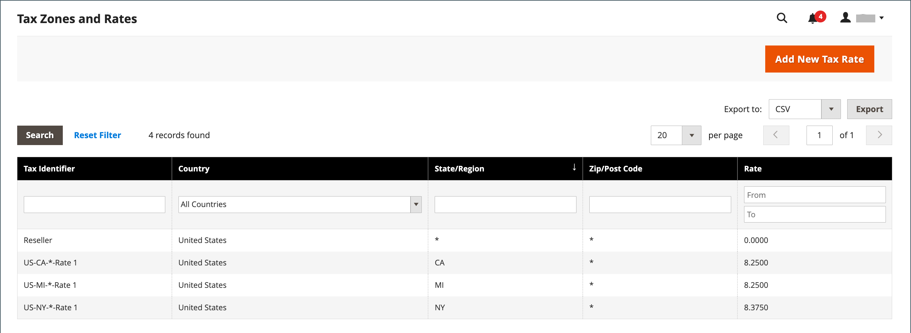

# Zonas fiscales y tasas

Por lo general, los tipos impositivos se aplican a las transacciones que tienen lugar dentro de una zona geográfica específica. Utilice la herramienta _Zonas y tasas de impuestos_ para especificar la tasa de impuestos de cada área geográfica desde la que recopile y envíe impuestos. Debido a que cada zona y tasa de impuestos tiene un identificador único, puede tener múltiples tasas de impuestos para un área geográfica determinada (como lugares que no gravan alimentos o medicinas, pero sí gravan otros artículos).

Los impuestos de la tienda se calculan según la dirección de la tienda. El impuesto real del cliente para un pedido se calcula después de que el cliente complete la información del pedido. A continuación, Commerce calcula el impuesto según la configuración de impuestos de la tienda.

{width="600" zoomable="yes"}

## Definir un tipo impositivo nuevo

1. En la barra lateral _Admin_, vaya a **[!UICONTROL Stores]** > _[!UICONTROL Taxes]_>**[!UICONTROL Tax Zones and Rates]**.

1. En la esquina superior derecha, haga clic en **[!UICONTROL Add New Tax Rate]**.

   {width="600" zoomable="yes"}

1. Escriba un **[!UICONTROL Tax Identifier]**.

1. Para aplicar la tasa de impuestos a un solo código postal, escriba el código de **[!UICONTROL Zip/Post Code]**.

   El comodín de asterisco (`*`) se puede usar para que coincida con un máximo de diez caracteres en el código. Por ejemplo, `90*` representa todos los códigos postales desde 90000 hasta 90999.

1. Para aplicar el tipo impositivo a un rango de códigos postales, haga lo siguiente:

   - Seleccione la casilla de verificación **[!UICONTROL Zip/Post is Range]** y defina el intervalo introduciendo el primer y último código postal de **[!UICONTROL Range From]** y **[!UICONTROL Range To]**.

     {width="600" zoomable="yes"}

   - Elija **[!UICONTROL State]** donde se aplica la tasa de impuestos.

   - Elija **[!UICONTROL Country]** donde se aplica la tasa de impuestos.

   - Escriba el(la) **[!UICONTROL Rate Percent]** que se usa para el cálculo de la tasa de impuestos.

1. Si tiene varias tiendas, puede establecer **[!UICONTROL Tax Titles]** para cada vista de tienda.

   >[!NOTE]
   >
   >Deje este campo vacío si desea utilizar el identificador de impuestos.

1. Una vez finalizado, haga clic en **[!UICONTROL Save Rate]**.

## Editar una tasa de impuestos existente

1. En la barra lateral _Admin_, vaya a **[!UICONTROL Stores]** > _[!UICONTROL Taxes]_>**[!UICONTROL Tax Zones and Rates]**.

1. Busque la tasa de impuestos en la cuadrícula _[!UICONTROL Tax Zones and Rates]_&#x200B;y abra el registro en modo de edición.

   Si hay muchas tarifas en la lista, usa los [controles de filtro](../getting-started/admin-grid-controls.md) para encontrar la tarifa que necesitas.

1. Realice los cambios necesarios en **[!UICONTROL Tax Rate Information]**.

1. Actualice **[!UICONTROL Tax Titles]** según sea necesario.

1. Una vez finalizado, haga clic en **[!UICONTROL Save Rate]**.

## Eliminar tipo impositivo

1. En la barra lateral _Admin_, vaya a **[!UICONTROL Stores]** > _[!UICONTROL Taxes]_>**[!UICONTROL Tax Zones and Rates]**.

1. Busque el tipo impositivo que desea eliminar y ábralo en modo de edición.

1. En la barra de menús, haga clic en **[!UICONTROL Delete Rate]**.

1. Para confirmar la acción, haga clic en **[!UICONTROL OK]**.
