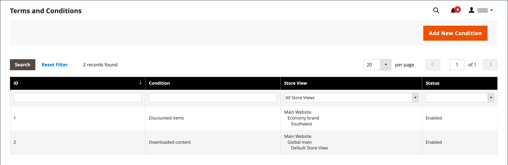

# Términos y condiciones del cierre de compra

Cuando se habilita la funcionalidad manual de _Términos y condiciones_, los clientes deben aceptar los términos y condiciones de la venta antes de que finalice la compra. Los Términos y condiciones de la venta generalmente incluyen información de divulgación que podría ser requerida por la ley para los sitios B2C o B2B, y describe los derechos del comprador y vendedor. El mensaje de Términos y condiciones aparece después de la información de pago, justo antes del botón _Realizar pedido_.

{width="700" zoomable="yes"}

## Paso 1: Habilitar los términos y condiciones de cierre de compra

1. En la barra lateral _Admin_, vaya a **[!UICONTROL Stores]** > _[!UICONTROL Settings]_>**[!UICONTROL Configuration]**.

1. En el panel izquierdo, expanda **[!UICONTROL Sales]** y elija **[!UICONTROL Checkout]**.

1. Expanda  en la sección **[!UICONTROL Checkout Options]**.

   {width="600" zoomable="yes"}

1. Compruebe que **[!UICONTROL Enable Onepage Checkout]** está establecido en `Yes`.

1. Establezca **[!UICONTROL Enable Terms and Conditions]** en `Yes`.

1. Haga clic en **[!UICONTROL Save Config]**.

## Paso 2: Agregar su propia información de términos y condiciones

1. En la barra lateral _Admin_, vaya a **[!UICONTROL Stores]** > _[!UICONTROL Settings]_>**[!UICONTROL Terms and Conditions]**.

   {width="600" zoomable="yes"}

1. En la esquina superior derecha, haga clic en **[!UICONTROL Add New Condition]**.

1. Escriba **[!UICONTROL Condition Name]** como referencia interna.

   {width="600" zoomable="yes"}

1. Establezca **[!UICONTROL Status]** en `Enabled`.

1. Establezca **[!UICONTROL Applied]** en una de las siguientes opciones:

   - `Automatically`: las condiciones se aceptan automáticamente al cerrar la compra.
   - `Manually`: los clientes deben aceptar manualmente las condiciones para realizar un pedido.

1. Establezca **[!UICONTROL Show Content as]** en una de las siguientes opciones:

   - `Text` - Muestra el contenido de los términos y condiciones como texto sin formato.
   - `HTML` - Muestra el contenido como HTML al que se puede dar formato.

1. Seleccione cada **[!UICONTROL Store View]** en que desee usar estos Términos y condiciones.

1. Desplácese hacia abajo y complete la información que desea mostrar:

   - Escriba **[!UICONTROL Checkbox Text]** para que se use como texto para el vínculo Términos y condiciones. Por ejemplo, `I understand and accept the terms and conditions of the sale`.

   - En el cuadro **[!UICONTROL Content]**, escriba el texto completo de los términos y condiciones de la venta.

1. (Opcional) Escriba **[!UICONTROL Content Height (css)]** en píxeles para determinar la altura del cuadro de texto donde aparece la instrucción de términos y condiciones durante el cierre de compra.

   Por ejemplo, para hacer que el cuadro de texto tenga una altura de 1 pulgada en una pantalla de 96 ppp, escriba `96`. Si el contenido se extiende más allá de la altura del cuadro, aparecerá una barra de desplazamiento.

1. Haga clic en **[!UICONTROL Save Condition]**.
