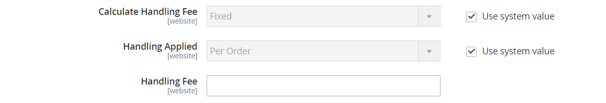
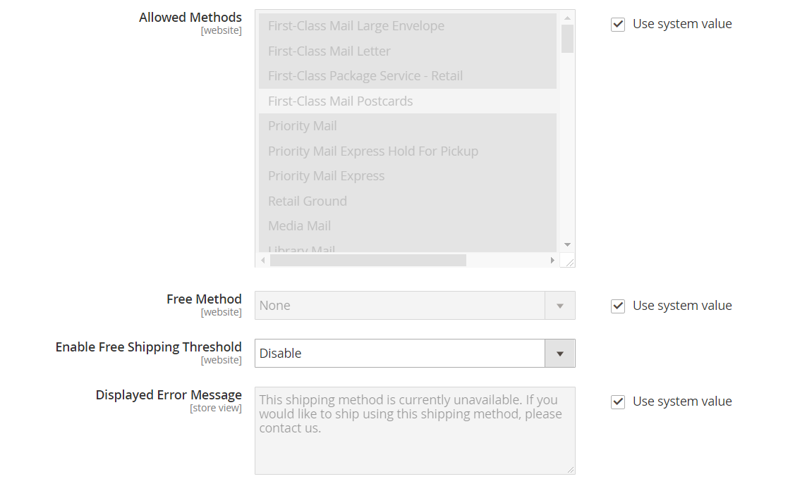
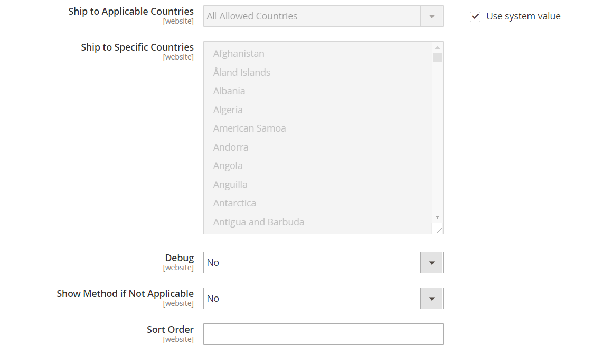

# Servicio postal de Estados Unidos (USPS)

El Servicio Postal de los Estados Unidos es el servicio postal independiente del Gobierno de los Estados Unidos, que ofrece servicios de envío nacionales e internacionales por tierra y aire.

## Paso 1: Abrir una cuenta de envío de USPS

Abra una cuenta de [USPS Developer Portal](https://developers.usps.com/). Una vez completado el proceso de registro, recibirá su ID de usuario y una URL al servidor de prueba de USPS. Para obtener más información acerca de las API de USPS, consulte su [documentación técnica](https://developers.usps.com/getting-started).

## Paso 2: Habilita USPS para tu tienda

{{$include /help/_includes/usps-api-type-configuration-note.md}}

1. En la barra lateral _Admin_, vaya a **[!UICONTROL Stores]** > _[!UICONTROL Settings]_>**[!UICONTROL Configuration]**.

1. En el panel izquierdo, expanda **[!UICONTROL Sales]** y elija **[!UICONTROL Delivery Methods]**.

1. Expanda  en la sección **[!UICONTROL USPS]**.

   >[!NOTE]
   >
   >Si es necesario, anule primero la selección de la casilla de verificación **[!UICONTROL Use system value]** para cambiar la siguiente configuración como se describe a continuación.

1. Establezca **[!UICONTROL Enabled for Checkout]** en `Yes`.

1. Establezca **[!UICONTROL USPS Type]** en `USPS REST API`.

   >[!NOTE]
   >
   >USPS ya no admite la API de herramientas web de USPS.

1. Si es necesario, ingrese **[!UICONTROL Gateway URL]** para acceder a las tarifas de envío de USPS.

   El campo está preestablecido de forma predeterminada y no es necesario cambiarlo.

1. Escriba un **[!UICONTROL Title]** para este método de envío que aparece durante el cierre de compra.

1. Utilice las credenciales proporcionadas por USPS para completar los siguientes campos:

   Si utiliza las API REST de USPS, proporcione las siguientes credenciales:

   - **[!UICONTROL Consumer Key]**
   - **[!UICONTROL Consumer Secret]**
   - **[!UICONTROL Pricing Options]**

   Si utiliza la API de herramientas web de USPS, proporcione las siguientes credenciales:

   - **[!UICONTROL User ID]**
   - **[!UICONTROL Password]**

1. Establezca **[!UICONTROL Mode]** en una de las siguientes opciones:

   - `Development`: ejecuta USPS en un entorno de prueba. Después de ejecutar USPS en un entorno de desarrollo, asegúrese de volver más tarde y establecer el modo en `Live`.
   - `Live`: ejecuta USPS en un entorno de producción activo.

## Paso 3: Completar la descripción del embalaje

1. Para determinar cómo se administra el pedido si se envía como varios paquetes, establezca **[!UICONTROL Packages Request Type]** en uno de los siguientes:

   - `Divide to Equal Weight` - (Una solicitud) El envío de varios paquetes se puede enviar como una solicitud si los paquetes se dividen por el mismo peso.
   - `Use Origin Weight` - (Varias solicitudes) Se deben enviar varios paquetes como solicitudes independientes si se usa el peso de origen como base para calcular el costo de envío.

1. Establezca **[!UICONTROL Container]** en el tipo de embalaje que se usa normalmente para enviar los productos pedidos para su tienda.

1. Establezca **[!UICONTROL Size]** del paquete típico enviado desde su tienda.

1. Establezca **[!UICONTROL Machinable]** en una de las siguientes opciones:

   - `Yes`: si un equipo puede procesar el paquete típico.
   - `No`: si el paquete habitual debe procesarse manualmente.

1. Escriba **[!UICONTROL Maximum Package Weight]** según los requisitos del operador.

   {width="600" zoomable="yes"}

## Paso 4: Configurar las tarifas de manipulación

La tarifa de manipulación es opcional y aparece como un cargo adicional que se añade al coste de envío de DHL. Si desea incluir una tarifa de manejo, haga lo siguiente:

1. Establezca **[!UICONTROL Calculate Handling Fee]** en uno de los siguientes métodos:

   - `Fixed`
   - `Percent`

1. Para determinar cómo se aplica la tarifa de administración, establezca **[!UICONTROL Handling Applied]** en una de las siguientes opciones:

   - `Per Order`
   - `Per Package`

1. Escriba el importe de **[!UICONTROL Handling Fee]** que se va a cargar.

   Para introducir un porcentaje, utilice el formato decimal. Por ejemplo, escriba `25` para 25%.

   {width="600" zoomable="yes"}

## Paso 5: Especifique los métodos permitidos y los países aplicables

1. Para **[!UICONTROL Allowed Methods]**, elija cada método de envío de USPS que estará disponible para sus clientes.

   Los métodos aparecen en USPS durante el cierre de compra. Para seleccionar varios métodos, mantenga presionada la tecla Ctrl (PC) o la tecla Comando (Mac) y haga clic en cada opción.

1. Si desea proporcionar una opción de [envío gratuito](shipping-free.md) a través de USPS, establezca las opciones de envío gratuito:

   - Establezca **[!UICONTROL Free Method]** en el método que desee utilizar para el envío gratuito. Si no desea ofrecer el envío gratuito a través de USPS, elija `None`.

   - Para requerir una cantidad mínima del pedido que permita un envío gratuito con USPS, establezca **[!UICONTROL Enable Free Shipping Threshold]** en `Enable`. A continuación, escriba el valor mínimo en **[!UICONTROL Free Shipping Amount Threshold]**.

1. Si es necesario, cambie **[!UICONTROL Displayed Error Message]**.

   Este cuadro de texto está preestablecido con un mensaje predeterminado, pero puede escribir un mensaje diferente que desee que aparezca si USPS deja de estar disponible.

   {width="600" zoomable="yes"}

1. Establezca **[!UICONTROL Ship to Applicable Countries]** en una de las siguientes opciones:

   - `All Allowed Countries`: los clientes de todos los [países](../getting-started/store-details.md#country-options) especificados en la configuración de su tienda pueden usar este método de entrega.
   - `Specific Countries` - Al elegir esta opción, aparece la lista _Enviar a países específicos_. Seleccione cada país de la lista donde se pueda utilizar este método de entrega.

   {width="600" zoomable="yes"}

1. Establezca **[!UICONTROL Show Method if Not Applicable]** en una de las siguientes opciones:

   - `Yes`: enumera todos los métodos de envío de USPS disponibles durante el cierre de compra, incluidos los métodos que no se aplican al envío.
   - `No`: enumera únicamente los métodos de envío de USPS aplicables al envío.

1. Para crear un archivo de registro con los detalles de los envíos de USPS realizados desde su tienda, establezca **[!UICONTROL Debug]** en `Yes`.

1. Para **[!UICONTROL Sort Order]**, escriba un número para determinar la secuencia en la que aparece USPS cuando se enumera con otros métodos de entrega durante la desprotección.

   `0` = primero, `1` = segundo, `2` = tercero, etc.

1. Haga clic en **[!UICONTROL Save Config]**.

<!-- Last updated from includes: 2026-05-12 15:47:19 -->
