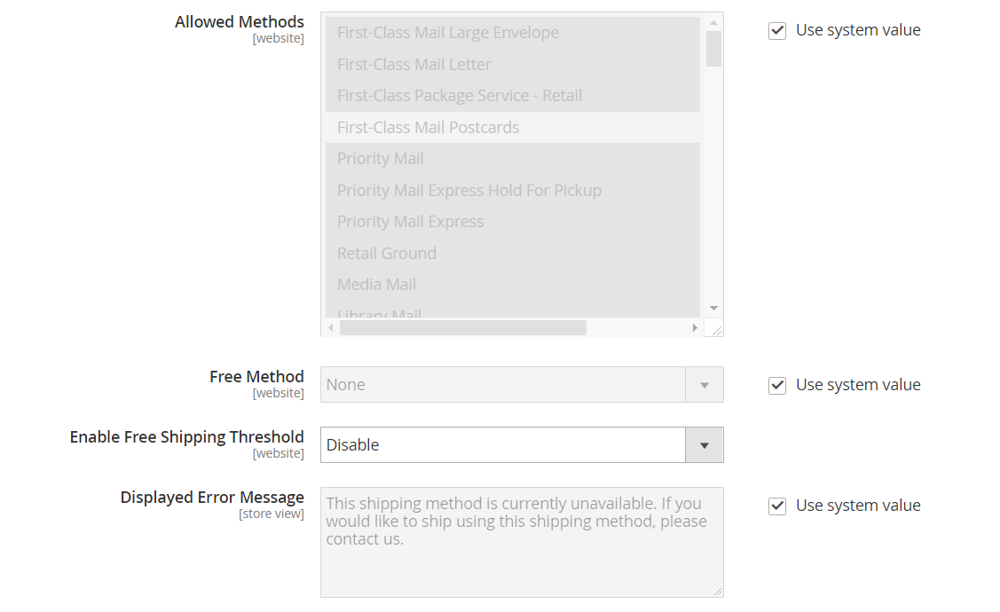

# Servicio postal de Estados Unidos (USPS)

El Servicio Postal de los Estados Unidos es el servicio postal independiente del Gobierno de los Estados Unidos, que ofrece servicios de envío nacionales e internacionales por tierra y aire.

## Paso 1: Abrir una cuenta de envío de USPS

Abra un [Herramientas web de USPS][1] cuenta. Una vez completado el proceso de registro, recibirá su ID de usuario y una URL al servidor de prueba de USPS.

También puede abrir un [Herramientas web de USPS][1] cuenta. Una vez completado el proceso de registro, recibirá su ID de usuario y una URL al servidor de prueba de USPS. Para obtener más información sobre las herramientas web de USPS, consulte su [Documentación técnica][2].

## Paso 2: Habilita USPS para tu tienda

{{beta2-updates}}

1. En el _Administrador_ barra lateral, vaya a **[!UICONTROL Stores]** > _[!UICONTROL Settings]_>**[!UICONTROL Configuration]**.

1. En el panel izquierdo, expanda **[!UICONTROL Sales]** y elija **[!UICONTROL Delivery Methods]**.

1. Expandir  el **[!UICONTROL USPS]** sección.

   >[!NOTE]
   >
   >Si es necesario, anule primero la selección del **[!UICONTROL Use system value]** para cambiar la siguiente configuración como se describe.

1. Establecer **[!UICONTROL Enabled for Checkout]** hasta `Yes`.

1. Si es necesario, introduzca el **[!UICONTROL Gateway URL]** para acceder a las tarifas de envío de USPS.

   >[!IMPORTANT]
   >
   >A partir del 24 de junio de 2021, las herramientas web de USPS eliminarán la compatibilidad con todos los extremos HTTP no seguros. Después de este cambio, todas las solicitudes de API de Web Tools que se dirijan a un extremo HTTP no seguro fallarán. Asegúrese de que su **[!UICONTROL Gateway URL]** utiliza el extremo HTTPS seguro.

   El campo está preestablecido de forma predeterminada y no es necesario cambiarlo.

1. Introduzca una **[!UICONTROL Title]** para este método de envío que aparece durante el cierre de compra.

1. Introduzca el **[!UICONTROL User ID]** y **[!UICONTROL Password]** para su cuenta de USPS.

1. Establecer **[!UICONTROL Mode]** a uno de los siguientes:

   - `Development` : ejecuta USPS en un entorno de prueba. Después de ejecutar USPS en un entorno de desarrollo, asegúrese de volver más tarde y establecer el modo en `Live`.
   - `Live` : ejecuta USPS en un entorno de producción en directo.

## Paso 3: Completar la descripción del embalaje

1. Para determinar cómo se administra el pedido si se envía como varios paquetes, establezca **[!UICONTROL Packages Request Type]** a uno de los siguientes:

   - `Divide to Equal Weight` - (Una solicitud) El envío de varios paquetes puede enviarse como una solicitud si los paquetes se dividen por el mismo peso.
   - `Use Origin Weight` - (Solicitudes Múltiples) Se deben enviar varios paquetes como solicitudes independientes si se utiliza el peso de origen como base para calcular el coste de envío.

1. Establecer **[!UICONTROL Container]** al tipo de embalaje utilizado normalmente para enviar los productos pedidos para su tienda.

1. Configure las variables **[!UICONTROL Size]** del paquete típico enviado desde su tienda.

1. Establecer **[!UICONTROL Machinable]** a uno de los siguientes:

   - `Yes` - Si su paquete típico puede ser procesado por una máquina.
   - `No` - Si su paquete típico debe ser procesado manualmente.

1. Introduzca el **[!UICONTROL Maximum Package Weight]** según los requisitos del transportista.

   {width="600" zoomable="yes"}

## Paso 4: Configurar las tarifas de manipulación

La tarifa de manipulación es opcional y aparece como un cargo adicional que se añade al coste de envío de DHL. Si desea incluir una tarifa de manejo, haga lo siguiente:

1. Establecer **[!UICONTROL Calculate Handling Fee]** a uno de los siguientes métodos:

   - `Fixed`
   - `Percent`

1. Para determinar cómo se aplica la tarifa de manipulación, establezca **[!UICONTROL Handling Applied]** a uno de los siguientes:

   - `Per Order`
   - `Per Package`

1. Introduzca el importe de la **[!UICONTROL Handling Fee]** que se cobran.

   Para introducir un porcentaje, utilice el formato decimal. Por ejemplo, introduzca `0.25` por 25%.

   {width="600" zoomable="yes"}

## Paso 5: Especifique los métodos permitidos y los países aplicables

1. Para **[!UICONTROL Allowed Methods]**, elija cada método de envío de USPS para que esté disponible para sus clientes.

   Los métodos aparecen en USPS durante el cierre de compra. Para seleccionar varios métodos, mantenga presionada la tecla Ctrl (PC) o la tecla Comando (Mac) y haga clic en cada opción.

1. Si desea proporcionar un [Envío gratuito](shipping-free.md) a través de USPS, establezca las opciones de envío gratuito:

   - Establecer **[!UICONTROL Free Method]** al método que desea utilizar para el envío gratuito. Si no quieres ofrecer el envío gratuito a través de USPS, elige `None`.

   - Para requerir una cantidad mínima de pedido que califique un pedido para el envío gratuito con USPS, establezca **[!UICONTROL Enable Free Shipping Threshold]** hasta `Enable`. A continuación, introduzca el valor mínimo en **[!UICONTROL Free Shipping Amount Threshold]**.

1. Si es necesario, cambie el **[!UICONTROL Displayed Error Message]**.

   Este cuadro de texto está preestablecido con un mensaje predeterminado, pero puede escribir un mensaje diferente que desee que aparezca si USPS deja de estar disponible.

   {width="600" zoomable="yes"}

1. Establecer **[!UICONTROL Ship to Applicable Countries]** a uno de los siguientes:

   - `All Allowed Countries` - Clientes de todos [países](../getting-started/store-details.md#country-options) especificado en la configuración de la tienda puede utilizar este método de envío.
   - `Specific Countries` - Al elegir esta opción, la variable _Enviar a países específicos_ aparece una lista. Seleccione cada país de la lista donde se pueda utilizar este método de entrega.

   {width="600" zoomable="yes"}

1. Establecer **[!UICONTROL Show Method if Not Applicable]** a uno de los siguientes:

   - `Yes` - Enumera todos los métodos de envío de USPS disponibles durante el pago, incluidos los métodos que no se aplican al envío.
   - `No` - Enumera sólo los métodos de envío de USPS aplicables al envío.

1. Para crear un archivo de registro con los detalles de los envíos de USPS realizados desde su tienda, establezca **[!UICONTROL Debug]** hasta `Yes`.

1. Para **[!UICONTROL Sort Order]**, introduzca un número para determinar la secuencia en la que aparece USPS cuando se enumera con otros métodos de envío durante la desprotección.

   `0` = primero, `1` = segundo, `2` = tercero, etc.

1. Haga clic **[!UICONTROL Save Config]**.

[1]: https://secure.shippingapis.com/registration/
[2]: https://www.usps.com/business/web-tools-apis/welcome.htm
