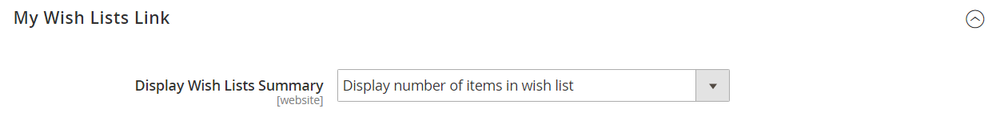

# Configuración de listas de deseos

La configuración de la lista de deseos habilita las listas de deseos y determina la plantilla de correo electrónico y el remitente de los mensajes de correo electrónico que se utilizan cuando se comparte una lista de deseos.

## Habilitar la funcionalidad de lista de deseos

1. En la barra lateral _Admin_, vaya a **[!UICONTROL Stores]** > _[!UICONTROL Settings]_>**[!UICONTROL Configuration]**.

1. En el panel izquierdo, expanda **[!UICONTROL Customers]** y elija **[!UICONTROL Wish List]**.

1. Expanda  en la sección **[!UICONTROL General Options]** y haga lo siguiente:

   {width="600" zoomable="yes"}

   - Cambie **[!UICONTROL Enabled]** a `Yes`, lo que activa el módulo de lista de artículos deseados para la tienda.

   -  (solo Adobe Commerce): cambia **[!UICONTROL Enable Multiple Wish Lists]** a `Yes`, lo que permite a los clientes crear y mantener varias listas de deseos.

   -  (solo Adobe Commerce) Para limitar el número de listas de deseos que los clientes pueden tener asociados a su cuenta, escriba un valor para **[!UICONTROL Number of Multiple Wish Lists]**.

   - Cambie **[!UICONTROL Show in Sidebar]** por `Yes`, para que se muestren las listas de deseos en la barra lateral.

1. Expanda  en la sección **[!UICONTROL Share Options]** y haga lo siguiente:

   {width="600" zoomable="yes"}

   - Establezca **[!UICONTROL Email Sender]** en el contacto de tienda que debe aparecer como remitente del mensaje. Opciones: Contacto general, Representante de ventas, Atención al cliente, Correo electrónico personalizado.

   - Configure **[!UICONTROL Email Template]** para que se use cuando un cliente comparta una lista de deseos.

   - Para limitar el número total de correos electrónicos que puede enviar un cliente, escriba un valor de **[!UICONTROL Max Emails Allowed to be Sent]**. El valor predeterminado es 10 y el máximo permitido es 10 000.

   - Para limitar el tamaño del mensaje, escriba un valor para **[!UICONTROL Email Text Length Limit]**. El valor predeterminado es 255.

1. Expanda  en la sección **[!UICONTROL My Wish List Link]** y establezca **[!UICONTROL Display Wish List Summary]** en uno de los siguientes:

   - `Display number of items in wish list`
   - `Display item quantities`

   {width="600" zoomable="yes"}

1. Una vez finalizado, haga clic en **[!UICONTROL Save Config]**.

## Añadir búsqueda en la lista de deseos

 (solo Adobe Commerce)

Cualquier lista de deseos pública se puede encontrar usando el widget de búsqueda de listas de deseos [Wish List](../content-design/widgets.md). El widget permite que un cliente busque por el nombre o la dirección de correo electrónico del propietario de la lista de deseos. Los clientes de tienda pueden encontrar listas de deseos que pertenecen a otros clientes, verlas y solicitar productos de ellos o agregar los productos a sus propias listas de deseos. Si otro cliente compra un artículo de una lista pública de artículos deseados, no se elimina de la lista original de artículos deseados. El widget _Búsqueda en la lista de deseos_ se puede agregar a cualquier página de la tienda para facilitar a los clientes la búsqueda de las listas de deseos de amigos y familiares.

{width="700" zoomable="yes"}

1. En la barra lateral _Admin_, vaya a **[!UICONTROL Content]** > _[!UICONTROL Elements]_>**[!UICONTROL Widgets]**.

1. En la esquina superior derecha, haga clic en **[!UICONTROL Add Widget]**.

1. En la ficha _[!UICONTROL Settings]_, haga lo siguiente:

   - Establezca **[!UICONTROL Type]** en `Wish List Search`.

   - Establezca **[!UICONTROL Design Theme]** en el tema de la tienda donde se agrega la lista de artículos deseados.

   - Haga clic en **[!UICONTROL Continue]**.

1. Completar _[!UICONTROL Storefront Properties]_:

   - Escriba **[!UICONTROL Widget Title]**.

   - Establezca **[!UICONTROL Assign to Store Views]** en la vista o sitio web donde se utilizará el widget.

   - Para **[!UICONTROL Sort Order]**, escriba un número para determinar la ubicación del widget dentro de su contenedor.

     `0` = primero (predeterminado), `1` = segundo, `2` = tercero, etc.

1. En la sección _[!UICONTROL Layout Updates]_, haga clic en **[!UICONTROL Add Layout Update]**y establezca **[!UICONTROL Display on]**en uno de los siguientes:

   - _[!UICONTROL Categories]_

      - `Anchor Categories`
      - `Non-Anchor Categories`

   - _[!UICONTROL Products]_

      - `All Product Type`
      - `Simple Product`
      - `Virtual Product`
      - `Bundle Product`
      - `Configurable Product`
      - `Downloadable Product`
      - `Gift Card`
      - `Grouped Product`

   - _[!UICONTROL Generic Page]_

      - `All Pages`
      - `Specified Page`
      - `Page Layouts`

1. En la lista **[!UICONTROL Container]**, elija el área del diseño de página donde se colocará.

   {width="700" zoomable="yes"}

1. En el panel izquierdo, elija **[!UICONTROL Widget Options]**.

1. Establezca **[!UICONTROL Quick Search Form Types]** en una de las siguientes opciones:

   - `All Forms`: los clientes pueden buscar según todos los parámetros disponibles.
   - `Owner Name`: los clientes pueden buscar listas de deseos por nombre de propietario.
   - `Owner Email`: los clientes pueden buscar listas de deseos por dirección de correo electrónico del propietario.

   >[!NOTE]
   >
   >Las direcciones de envío no se incluyen en las listas de deseos.

1. Configure las propiedades de los widgets restantes según sea necesario, siguiendo las [instrucciones](../content-design/widget-create.md) estándar.

1. Una vez finalizado, haga clic en **[!UICONTROL Save]**.

1. Cuando se le solicite, actualice todas las cachés no válidas.
