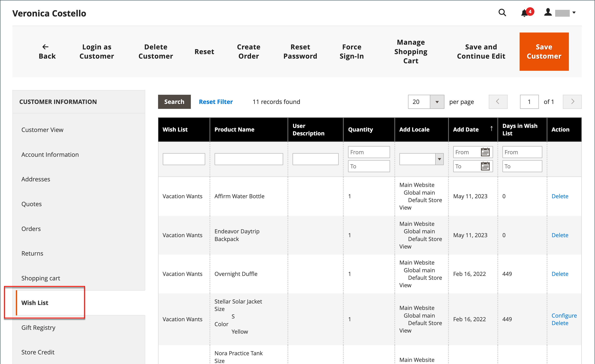

# Listas de deseos

Una lista de deseos es una lista de productos que un cliente registrado puede compartir con amigos o guardar para transferirlos al carro de compras más tarde. Cuando se activan las listas de deseos, el vínculo Añadir a la lista de deseos aparece en las páginas de categoría y producto de cada producto de la tienda. Según la temática, puede ser un vínculo de texto o una imagen gráfica.

 Adobe Commerce admite el uso de varias listas de deseos por cuenta de cliente.

 El Magento Open Source admite el uso de una sola lista de deseos por cuenta de cliente.

Las listas de deseos compartidas se envían desde una dirección de correo electrónico de la tienda, pero el cuerpo del mensaje contiene una nota personalizada del cliente. Puede personalizar la plantilla de correo electrónico que se utiliza cuando se comparten las listas de deseos y elegir el contacto de tienda que aparece como el remitente.

Las listas de deseos se pueden actualizar desde el panel del [cuenta de cliente](../customers/account-dashboard.md). El cliente o el administrador de la tienda pueden añadir o transferir artículos entre la lista de artículos deseados y el carro de compras.

{width="700" zoomable="yes"}

Cuando se añade un producto con varias opciones a una lista de artículos deseados, todas las opciones que haya seleccionado el cliente se incluyen en la descripción del artículo de la lista de artículos deseados. Por ejemplo, si el cliente agrega el mismo par de zapatos en tres colores diferentes, cada par aparece como un elemento de lista de deseos independiente. Sin embargo, si el cliente agrega el mismo producto a la lista de deseos varias veces, el producto aparece solo una vez, pero con una cantidad actualizada que refleja el número de veces que se agregó el producto.

## Asistencia para listas de deseos en el administrador

Los clientes pueden [administrar sus listas de deseos](wishlist-storefront.md) iniciando sesión en sus cuentas en la tienda. Como administrador de tienda, también puede administrar las listas de deseos de los clientes desde el Administrador.

**_Para actualizar los elementos de la lista de artículos deseados del administrador:_**

1. En el _Administrador_ barra lateral, vaya a **[!UICONTROL Customers]** > **[!UICONTROL All Customers]**.

1. Busque el cliente en la lista y haga clic en **[!UICONTROL Edit]** en el _[!UICONTROL Action]_columna.

1. En el panel izquierdo, elija **[!UICONTROL Wish List]** y busque el elemento que desea editar en la lista.

   Todas las opciones seleccionadas para el producto aparecen debajo del nombre del producto.

   {width="600" zoomable="yes"}

1. Para editar las opciones del producto, haga lo siguiente:

   - En el **[!UICONTROL Action]** , haga clic en **[!UICONTROL Configure]**.

   - En la página del producto, actualice las opciones y **[!UICONTROL Quantity]** según sea necesario.

   - Haga clic **[!UICONTROL OK]**.

1. Cuando termine, haga clic en **[!UICONTROL Save Customer]** o **[!UICONTROL Save and Continue Edit]**.
